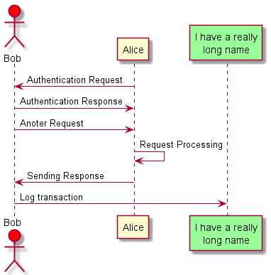

# Recep Tayyip Erdogan University

## Faculty of Engineering and Architecture

## Computer Engineering

### CE103-Algorithms and Programming I

#### Syllabus

#### Fall Semester, 2021-2022

<iframe frameborder="0" style="width:100%;height:1603px;" src="https://viewer.diagrams.net/?tags=%7B%7D&highlight=0000ff&edit=_blank&layers=1&nav=1&title=%C4%B0%C5%9F%20modeli%20canvas%C4%B1.drawio#R7R1bc%2BK2%2Btcws%2BcBxjb3xwSWbc%2FpbneSbTvnqSOMAE1sy5VkCP31%2FXTxDRtiwIQ4TWZ2AdmW9N0v%2BiS3uhP%2F%2BQtD4forXWCv5ViL51Z32nKcvj1y4EO27HSL3bMt3bJiZGHa0oZH8jc2jfFtEVlgnrtRUOoJEuYbXRoE2BW5NsQY3eZvW1IvP2qIVrjQ8Ogir9j6B1mItWm1B%2BP0wk%2BYrNZm6JEz1BfmyH1aMRoFZryABlhf8VHcjYGRr9GCbjNN3c%2Bt7oRRKvQ3%2F3mCPYnXGGP6udmBq8mUGQ5ElQcG45F%2BZIO8yMBtZiZ2MSIUKFg%2BYbW699s1EfgxRK68ugXaQ9ta%2BB78suFrApG810Nz7N0n6JhQjzK4pBACtwpGn3BpY4zwLrQsiefFN7WcLh7hxVJ2vqSBMFwziH9n7nNm%2FfvhBNqRR1YBtHl4CTi5L6LIYG2DmcDPmSaDsi%2BY%2BliwHdxirrYdZ2wIaJi7a7C2TRkFZMDcs84wid2PMY4Me66S7lM6wRdDqkNkG5eQbeBJ%2BBZkkyPf4K9IcpNCT5srfN3BDc4gfE4vwreV%2BfTim8%2FvZRJxAUAxuOEBe0gQGvC1FFvTO4CnB8gPCs1q8vnWkqY5O%2FnRP9ZIAiR2IYiiRZfwH8tMTeopCsrGsTBy1%2FEdNJIgpNBUHOsRr3xgLtXbcyhVk2NFXKkv2cQFmnuEy1EQqAipFUgg4J%2FiHyHbxRr7re7sBOiInnWgYFijjYRyi7PDSQGu3uNPIMNSjWI9G8n8MEm8YkjgRW6iCpNc5HE2jziBucjJ%2BMoynDy0S7nwdvk5nNDJWazyMr%2FbVh1Sc7yXedzw%2BRn5oYezYjMvgeZEUbotkN8x4zRAnlKAnABzBmBIGgrMFC%2BIawQiA9hd4wF7xN6y%2FYjZhjQXhrsItLYhjgHlAgN0W1gm1PejgAjSZBDaLsPK4J4Iwk280ayjmXdJ%2B62CS7pUf62cS2o7rcouqfQ8QZF4d6ZZUAkGB6hIsJJesJUg4jK%2FddzPu61JHJLxW3tOidvaix%2B8xGsdWtZBr7WMES5zQv%2BnnJbviIkAVPMLPFfqJlwyJ9s5auLZ5X1cNpM%2F1jTxrbTLtoev1Ne6ZLLFYZ7UMDwKQ4%2FUOY52gDUQD5jDYErfm7GVK4zcCDHCpEw51pJRX8tTnfBWYLMrdf0GVHwCZdzwlQqy0TGWxDhlGYTvxYONd2x%2FDQXxyd%2FGwJnIDrs0oP6uqTA94EXkGoB0yEz4UwJcBA4uk3GraCyAd%2B5fEeEkC6LkT%2BJGHmI6sE0ViQIaAT4213fErm49PpysqzlZaQb7VC9rbNXiZdmv7mXdVZWKKxrAaw1XTCIWYbYWNHFwfldoB0%2BK0ZBq3cKVKgFVA77ICTmsX1V%2FUwKiQeaRUVKTNQoC7PFTOjqYjz2hjwe8wYECDKaDkX%2FSw1l6VFGT1%2FRxyqaVIAoJvKKMvJhzOw4ukD4xnNUfmXtYeqSP1NsoF7Xqk0BQcK3g0dk3LLaUPb2I27qI9WE0ajMa9nB829DcOb6gVL%2FNyARpt14VKkaNN9LnVr2a%2BvH6mvoNOPEFLf5jFyoimlW%2BIps1Ptj8vt5xqZaaOv%2BfAwH6B7siUgsmn%2BZMR1ch2F%2B1cAoKy3JpuGNSz5nfCyTQf5oK8U%2BRj05NfL%2BZyc9IgAKXnMxvH%2F7B9fyDwfB1%2FYPuWy44KbfRt3YrNmZWyplQGegF9shGWXdVCqKrJ9zY5p9X8NHKFV4knX12WiOrNR5LQxjq4GIvHb7GXqhz4WoyHOKOk9wZA%2BUcBNJL7W2oY580Y8aTtdfs4HS5xCwzuim7yfg%2FpormHKy4aS8Bxou9oTm4VXy5UwL673KMwNdkyBWAeA5a6115RN%2FwVtcbNXP63zGTMXyTa0a06CYrIM0EIlabky9YCKOelJL%2BL53L2E3qW3PLtKkwTjGXzkpDZ3%2BvQ4XZo0Aiaq68swZXVk2oKvfMrA42E44HvZrZeDjuXHCvOJkTjzR3KXZCgw0OCFYWcPYbR7cG5yP9%2FZrhbXd42zXT3uulv4sxzi1j1ZmqytmuVTVUJkrSxZrKAzJIOSUO26%2F68rXJIH5ImUAKe3GQ9t7T01%2BR2gbxFbEnLJqqnb9BYI0bD4URN1kS3kwApjJ7xMmSNBeEr5EnCNy10LsmksXrj8TybSxvv3tbw9t%2FRcMbL7Xeztr%2BWAOfrdbK4upcZTqp7KLzcR%2Fh%2BBhbbV9VWnWut%2Bch94Ltf9ukjyQhIn2FQArReT0aGFPIM1sLz9%2F1qEtfAGRwNc7vRc%2FQ%2BCtyE2IbL5fEJSemogsIjEHM4dDsoszkq4E9hNw5%2Bc6domTKe7Ip1dka8fe1Wm934NLdVqrpBqeo4RP50ggFcx6q31ZJk%2Bb7dMWLIcLV3osUfAvNgckTNeBSP0TBbn%2FB6sAiUk4sGoU%2FR3LBZ2nnmp0hP4sN5FpjLuZzLKxRkdoDylYoiNcPstxQsrrbYD7oSj74HjFX6rmmAnEeFyDP03v7M2yg3JQwQYfFQ%2BxCgOO%2BUy3Qk9Sf6jKAxuZqz6N%2BWvyADgi14YYDmaFGoaivbP5SKHg58pq7cfs8YoPsbiDGl9%2BkD50R8IyzK3eBUiZuSuaPNP8N95%2B%2FdhHb4C0XsZll1UfBwOhF7ALf4OI0hSntSo7eaZVn8KFJR%2B9rrLhCfm3VcQTQS9u5zWTk6UoBJ6eWrWX7zu3iurzzs3B%2Bc%2F2eD8V%2FlqjYlRAxx5KNj8qNuE0ZkFhy7ScPowAnaR%2FVcSKJsv5c%2B66hrtxIijvDrP8ib%2FPRM%2FEjtZqmT6BJruBnYThKyohQTA0KtrE17bELl6KwJXf5g4FXuX3l0MVoSs9%2BmSikYZ8oHJWgsbH4OCr8zYQkbnhUJ5FJOr7fEtIZeVZ8OzFm7RO47UjvBZU8y9KdKZGQtSlwpbGs%2BjsAhuaaohrcZsLxWR2wQdLyc67Ob30%2F0NDwVGg%2BwpXrneRg2yWro7ZVdtBrt1tLxDJ8yxFLcafp7UKWuI4pt%2FMmu9yYTTrCZD11uOgWODOzCyVEJx0ymhtzYXb07NRYTPKdGuLEPksOXt3r7cSNK7rDLY28RdolOGDLdB%2FSWVP0IxVG5Y%2FN3ecIZV8Cvd8Zx8NREEGk%2BJzp24%2Btdn6os%2FqKLO3BrdXZqKDOfqjswn0aZ8YnyU9QsEG8TCPssQSAL%2FJ0Zxg0l3JvNOlDSqTvBnf371v9qSQBhGbckOpEivyQP6btXp7gR08gv5ItKtJuOCoh3bAWypUdOL5HiAwFYgz%2BIoXue7JoN51TAUr4sDRmxekAFbIyvUD6XOtpUVB7%2Bt5Qzs1%2FXsl3FHQI5cOOT7jbcdfYfSoT%2B4Rmh4QcelrIYpA9%2FXGm7Nci1r3986b6ToEzypKq9qAGxojHPsYY%2B3SQ%2B494RzC0wV4HTBFX0GcleA%2F7CfpKXxnwIrOVc1JMCleWhLLTzEVVctdCX8vao2%2B3X6Bv1y5Jmtch%2BHbZaWI3EfzCiyFKmeEg5xzWG2VagoDbwjtrjJi4rXT3x73OOPM3zLNCryjqvRJW6NYi6s6lwUjFbNN0FyDflAAQN38YVlmaqe5o%2FhteUUFUvlKmNOeIrRAJ9lK1dQ%2F6f4KVh%2F4VBWiF1db36w32AAFQWxAftwsV%2Fce87zfhatnXdrVGVr%2FTz%2FtazmhQdJTLbGot65T2xYdtVBS0OOV5GzH7hahllv29sHUPY07jg%2BtLjPRyjrXAIYY48qoylqnh5uYsi9cZ%2BHfqRX4lKP%2BV4j0e9SqJd1kYPKhFvF%2FYbFj3QWivKtR3nGOVUszn4ese5jcu394mRfqaozxGc%2B4yEprqtBnOobN2fQjCqrTw7AHYW3%2F7BSNe7TTQ87WwK1elrzrGvXTUWUKxayLxbqF0zjGA%2FpVaz7b3NnqVK71uWZ6glp1edtlOr2Ki4ECQls3qloV93l68mQT1ZyYH9oNCn7sId1yPRouOPIjwzyVyBQUUHI44q2cQXvnthXavt1eGNy6mEsusXz3ObVkRXtWEUcBV%2BZmkYUdW5zz9OWg1NnF0lOw81O80XSoXva5cwst0712N7mVLmQfoTnz1btb7ksRSnhR1pJvUYHcxvq0y5Jv5TNdCyLN47yTUzsxdBD2VKFoS8LJZx5VnKMykdoAPlUCCT7whXlv9aEccs7bcB8iWSJ1yMgBHcKYKytqgjTuhXO7JM1PVZamS96QmrFQhY%2F3aCghYL2%2BL7F6JBhqVcOKoDk4srkIVOPGg8dnTTGjLu3o1wYNo9k9VOXgyKa7wztzbEdexuvvhld21O8WU9WAYN%2BZWq%2Fp1ULjCatX5vsZRg1%2BjD0Ij4ZEARo%2Ffb12WraZydzJ4JjRwcSh4B554utQKWervSrI%2FGto57kjy1VnWKElhJ6%2F2voQxnAqrVRJjYXVQkxeQm4ChlX2Td0UJcXol4jG%2BkiF2KqzonCEcwDcz9XdjSZBWlqv%2Fr%2BWbHxKPvBp2SgUm5cDKItPNy0u7yCq9wbVYpWzF54NV3h6r1M8M8JNRmVlJrn2RqNPVOd3P%2FwA%3D"></iframe>

| Instructor                                          | Asst. Prof. Dr. Uğur CORUH                                                                                                                                                                                                                       |
| --------------------------------------------------- | ------------------------------------------------------------------------------------------------------------------------------------------------------------------------------------------------------------------------------------------------ |
| **Contact Information**                             | ugur.coruh@erdogan.edu.tr                                                                                                                                                                                                                        |
| **Office No**                                       | F-301                                                                                                                                                                                                                                            |
| **Google Classroom Code**                           | 3ipdtws                                                                                                                                                                                                                                          |
| **Lecture Hours and Days**                          | Monday 13:00-15:30 (Theory)  Wednesday 13:00-14:30 (Lab)                                                                                                                                                                                     |
| **Lecture Classroom**                               | İBBF 402 Level-4                                                                                                                                                                                                                                 |
| **Office Hours**                                    | Meetings will be scheduled over Google Meet with your university account and email and performed via demand emails. Please send emails with the subject starts with [CE103] tag for the fast response and write formal, clear, and short emails. |
| **Lecture and Communication Language**              | English                                                                                                                                                                                                                                          |
| **Theory/Laboratory Course Hour Per Week**          | 3/2 Hours                                                                                                                                                                                                                                        |
| Credit                                              | 4                                                                                                                                                                                                                                                |
| Prerequisite                                        | Not Exist                                                                                                                                                                                                                                        |
| Corequisite                                         | TBD                                                                                                                                                                                                                                              |
| Requirement                                         | CE100 Algorithms and Programming-II* (1-2)                                                                                                                                                                                                       |
|  CE205 Data Structures*  (2-3)                  |                                                                                                                                                                                                                                                  |
|  CE204 Object Oriented Programming* (2-4)       |                                                                                                                                                                                                                                                  |
|  CE208 Database Management Systems* (2-4)       |                                                                                                                                                                                                                                                  |
|  CE303 Web and Mobile Programming* (3-5)        |                                                                                                                                                                                                                                                  |
|  ELCE05                                         |                                                                                                                                                                                                                                                  |
|  CE307 Graph Theory*                            |                                                                                                                                                                                                                                                  |
|  CE309 Fuzzy Logic*                             |                                                                                                                                                                                                                                                  |
|  CE311 Robotics*                                |                                                                                                                                                                                                                                                  |
|  CE313 System and Software Analysis and Design* |                                                                                                                                                                                                                                                  |
|  SECCE05                                        |                                                                                                                                                                                                                                                  |
|  CE315 Matlab Programlama                       |                                                                                                                                                                                                                                                  |
|  CE317 Kriptografi                              |                                                                                                                                                                                                                                                  |
|  CE319 Biçimsel Diller ve Otomata Teorisi       |                                                                                                                                                                                                                                                  |
|  ELCE06                                         |                                                                                                                                                                                                                                                  |
|  CE306 Cyber Security*                          |                                                                                                                                                                                                                                                  |
|  CE308 Detection and Estimation*                |                                                                                                                                                                                                                                                  |
|  CE310 Formal Methods for Software Engineering* |                                                                                                                                                                                                                                                  |
|  CE312 Parallel Programming*                    |                                                                                                                                                                                                                                                  |
|  CE314 Image - Video Processing*                |                                                                                                                                                                                                                                                  |
|  SECCE06                                        |                                                                                                                                                                                                                                                  |
|  CE316 Yapay Zeka                               |                                                                                                                                                                                                                                                  |
|  CE318 Finansal Teknolojiler                    |                                                                                                                                                                                                                                                  |
|  ELCE07                                         |                                                                                                                                                                                                                                                  |
|  CE403 Network Security*                        |                                                                                                                                                                                                                                                  |
|  CE405 Data Mining*                             |                                                                                                                                                                                                                                                  |
|  SECCE07                                        |                                                                                                                                                                                                                                                  |
|  CE407 Güvenli Programlama                      |                                                                                                                                                                                                                                                  |
|  CE409 Derin Öğrenme                            |                                                                                                                                                                                                                                                  |
|  ELCE08                                         |                                                                                                                                                                                                                                                  |
|  CE402 Software Defined Networking*             |                                                                                                                                                                                                                                                  |
|  CE404 Fuzzy Systems*                           |                                                                                                                                                                                                                                                  |
|  CE406 PostQuantum Cryptography*                |                                                                                                                                                                                                                                                  |
|  SECCE08                                        |                                                                                                                                                                                                                                                  |
|  CE408 Dağıtık Sistemler ve Güvenlik            |                                                                                                                                                                                                                                                  |

*TBD: To Be Defined.

## A.    Course Description

This course goal is to develop algorithm and programming expertise from scratch in a powerful way to provide a high-quality career path for students. The lecture will be based on expertise sharing and guiding students to find learning methods and practice for algorithm and programming topics. By making programming applications and projects in the courses, the learning process will be strengthened by practicing rather than theory. This course provides functional programming for C, C++, C#, and Java with up-to-date development environments. 

## B.    Course Learning Outcomes

After completing this course satisfactorily, a student will be able to:
●    Understand a software developer's road map and qualifications.
●    Use different types of development environments to build applications.
●    Understand the relation between real-life problems and their programming practices.
●    Use language features in C, C++, C#, and Java for functional programming and evaluate their relative benefits.
●    Understand application generation flows and outputs in detail, such as binaries and executables. 
●    Use the source code, version management systems, and portals based on GIT
●    Work on the remote systems with remote connection tools.
●    Use common developer tools that help application developers
●    Create application libraries such as static, shared libraries for code reusability and functional packaging. 
●    Create unit tests for their applications to automate tests for their algorithms. 
●    Create console and GUI-based applications for their solutions.
●    Create documentation for their applications.

## C.    Course Topics

●    Developer Road Map
●    Algorithm Design and Basics
●    Basic Operating System Information for Development Requirement
●    Basic Remote Connection and Working Know-How
●    Source Code Version Management Systems (GIT)
●    Integrated Development Environments
●    Application Test Automation
●    Application Debugging and Bugfixing
●    Functional Programming (C,C++, C#, Java)
●    Continues Integration and Continues Development Processes
●    Software Development Principles
●    Application Documentation Automation
●    Shared and Static Library Development and Test in Cross-Environment

## D.    Textbooks and Required Hardware or Equipment

This course does not require a coursebook. If necessary, you can use the following books and open-source online resources. 
●    Paul Deitel and Harvey Deitel. 2012. C How to Program (7th. ed.). Prentice Hall Press, USA.
●    Intro to Java Programming, Comprehensive Version (10th Edition) 10th Edition by Y. Daniel Liang
●    Introduction to Algorithms, Third Edition By Thomas H. Cormen, Charles E. Leiserson, Ronald L. Rivest, and Clifford Stein
●    Problem Solving and Program Design in C, J.R. Hanly, and E.B. Koffman, 6th Edition.
●    Robert Sedgewick and Kevin Wayne. 2011. Algorithms (4th. ed.). Addison-Wesley Professional.
●    Harvey M. Deitel and Paul J. Deitel. 2001. Java How to Program (4th. ed.). Prentice Hall PTR, USA.
●    Paul Deitel and Harvey Deitel. 2016. Visual C# How to Program (6th. ed.). Pearson.
●    <mark>Additional Books TBD</mark>

<u>During this course, you should have a laptop for programming practices. You will have your development environment, and you will use this for examination and assignments also classroom practices. </u>

## E.    Grading System

[Mathematics in R Markdown](https://rpruim.github.io/s341/S19/from-class/MathinRmd.html)

$$
\operatorname{a_n}  = \text{Homework or Exam Points}
$$

$$
\operatorname{HW_n} = Homework or Project Points
$$

$$
\sum_{n=1}^{10} n^2
$$

#include <stdio.h>
int main() {
  int n, i, flag = 0;
  printf("Enter a positive integer: ");
  scanf("%d", &n);

  for (i = 2; i <= n / 2; ++i) {
    // condition for non-prime
    if (n % i == 0) {
      flag = 1;
      break;
    }
  }

  if (n == 1) {
    printf("1 is neither prime nor composite.");
  } 
  else {
    if (flag == 0)
      printf("%d is a prime number.", n);
    else
      printf("%d is not a prime number.", n);
  }

  return 0;
}

