<!-- _backgroundColor: aquq -->

<!-- _color: orange -->

<!-- paginate: false -->

## CE103 Algorithms and Programming I

## Week-15

#### Fall Semester, 2021-2022

Download [DOC](ce103-week-15-java-gui.md_doc.pdf), [SLIDE](ce103-week-15-java-gui.md_slide.pdf), [PPTX](ce103-week-15-java-gui.md_slide.pptx)

<iframe width=700, height=500 frameBorder=0 src="../ce103-week-15-java-gui.md_slide.html"></iframe>

---

<!-- paginate: true -->

## Java GUI Programming

## JavaFX GUI Programming

### 1-Install Gluon Scene Builder

Download and Install Gluon Scene Builder from URL

[Scene Builder - Gluon](https://gluonhq.com/products/scene-builder/)

We will use gluon scene builder as an external designer for NetBeans, Eclipse, and IntelliJ idea tools.

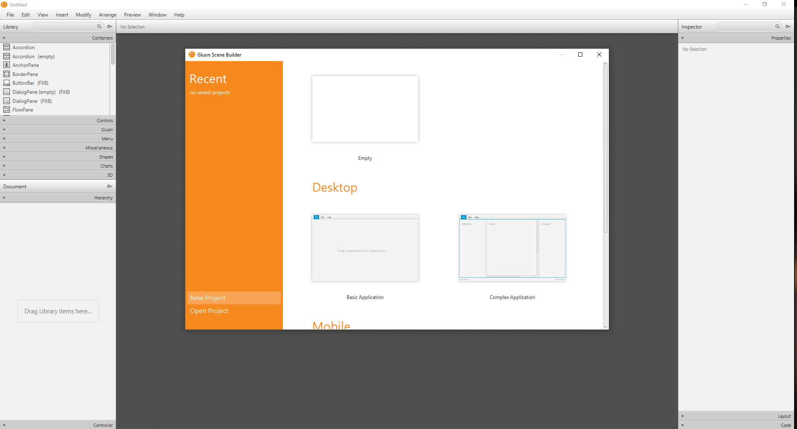

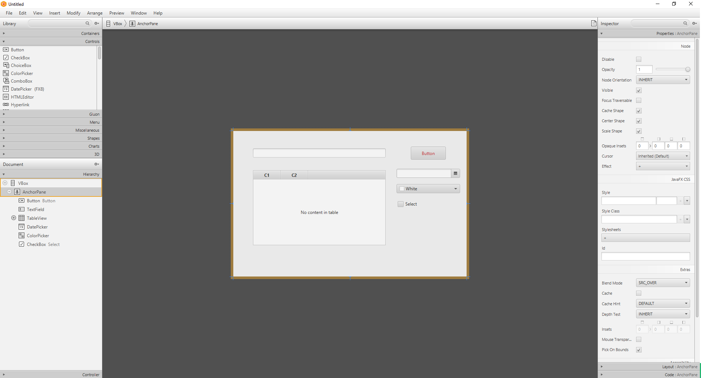

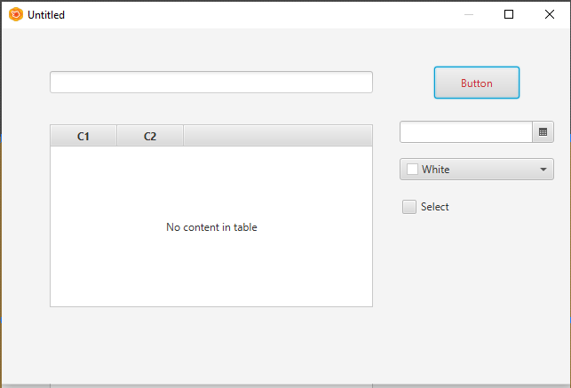

you can save this design as an FXML file from File->Save As

### 2-Install Apache Netbeans

Download and install apache Netbeans

https://netbeans.apache.org/

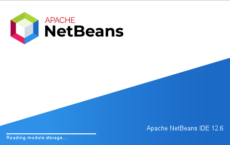

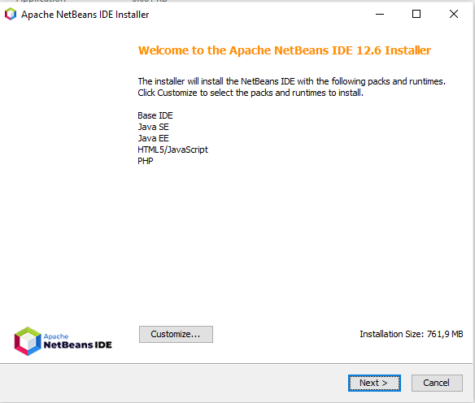

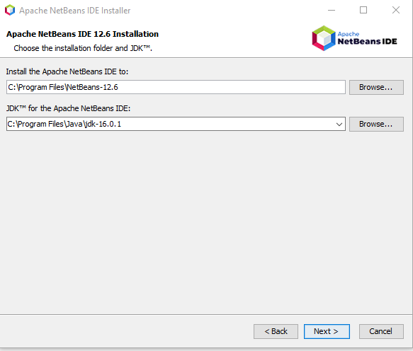

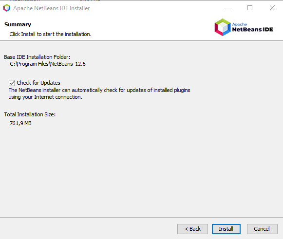

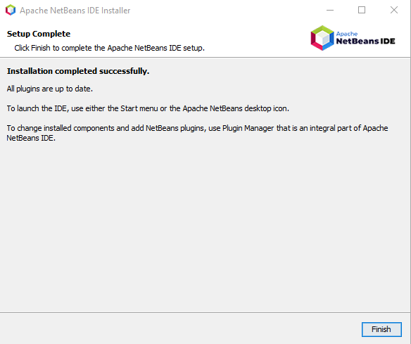

### 3- Configure JavaFX Scene Builder for Apache Netbeans

Open Tools->Options->Java->JavaFX

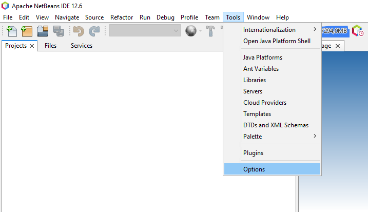

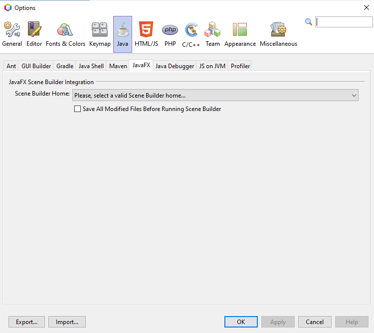

Select builder home

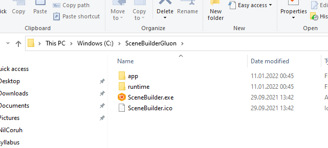

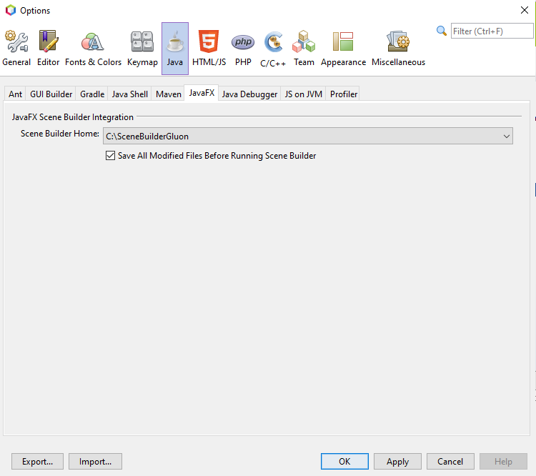

you can find old integration documentation here

[Using JavaFX Scene Builder with Java IDEs: Using Scene Builder with NetBeans IDE | JavaFX 2 Tutorials and Documentation](https://docs.oracle.com/javafx/scenebuilder/1/use_java_ides/sb-with-nb.htm) 

### 4-Create First Application

Select File->New Project

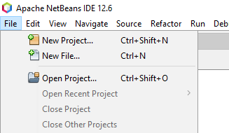

Select Java With Maven Types

FXML JavaFX Maven Archetype (Gluon)

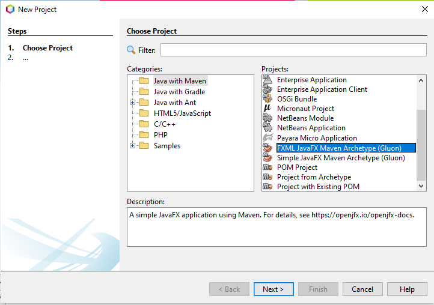

Set project properties

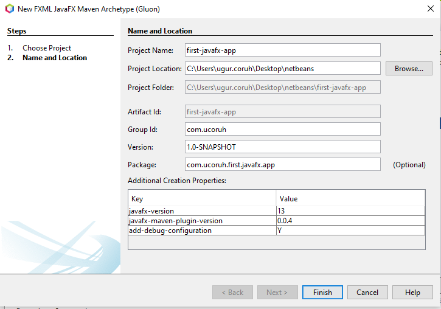

Open Project Resources and Click FXML files to run Scene Builder

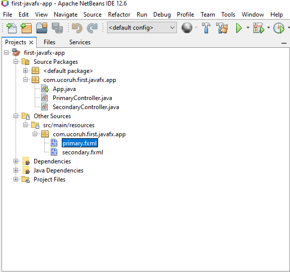

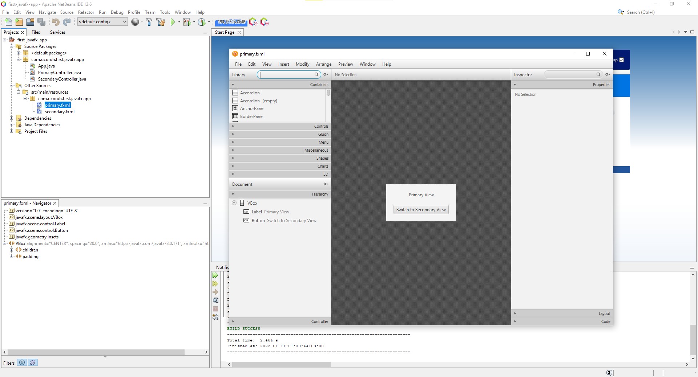

In designer properties tab will show control properties, code tab will show action bindings

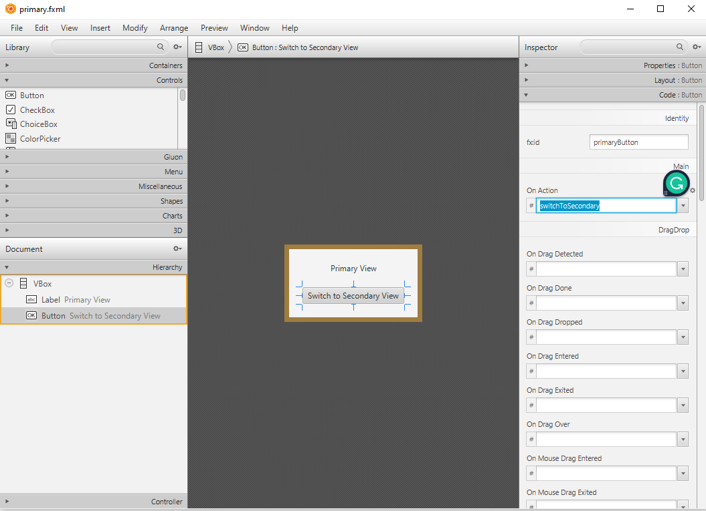

Then you can run applications from Netbeans.

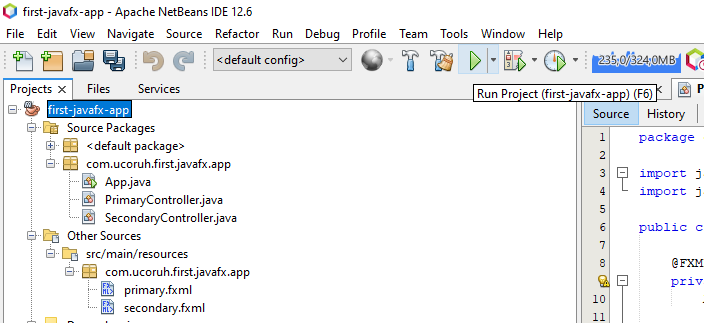

for introduction level information please check the following examples

[JavaFX Simple Calculator - Design and Code - YouTube](https://www.youtube.com/watch?v=oWk9fwRgV_k&ab_channel=qBit)

[JavaFX Library Management System Development #0: Introduction - YouTube](https://www.youtube.com/watch?v=9d3X8eBov1M&ab_channel=GenuineCoder)

for more information about JavaFX please check the following 

[JavaFX Tutorial - javatpoint](https://www.javatpoint.com/javafx-tutorial)

## Java Swing GUI Programming

Select File->New Project -> Java with Maven -> Java Application

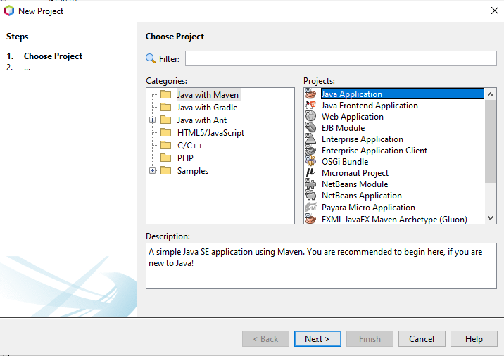

Configure Project

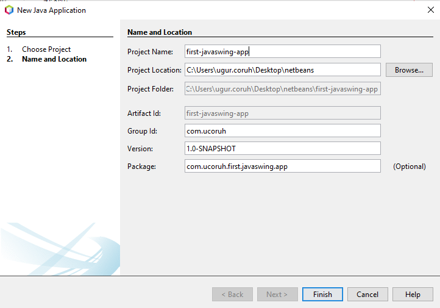

Open project and select package then select right-click -> New -> JFrame Form

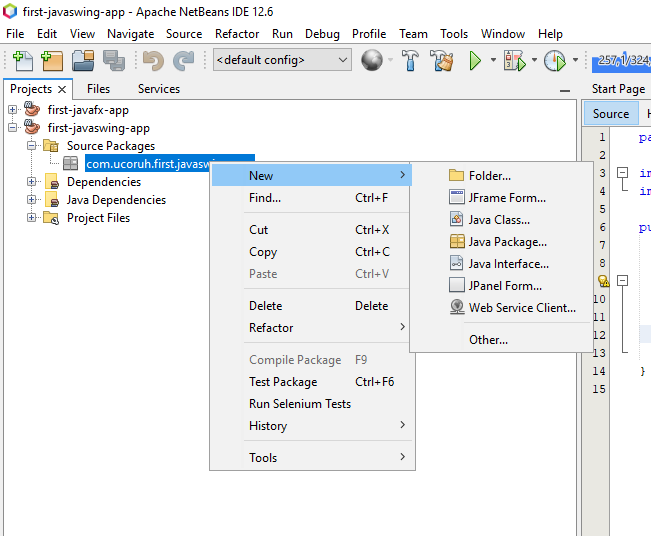

Give a name to your frame

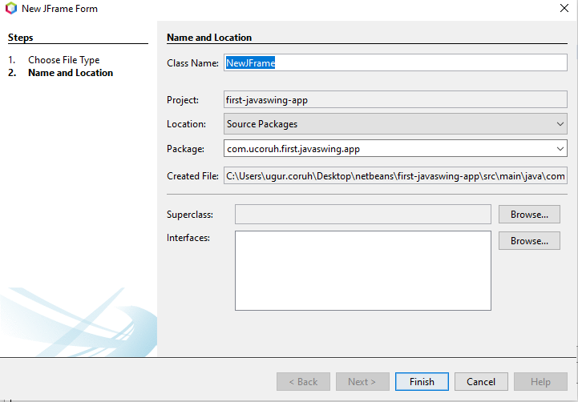

Swing GUI Builder is integrated with Netbeans

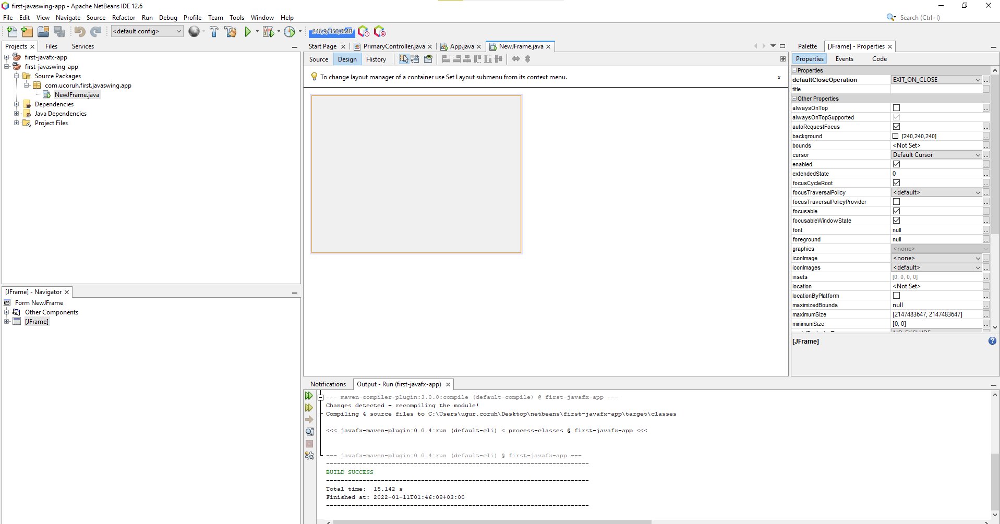

Drag-and-drop controls to panel from the palette 

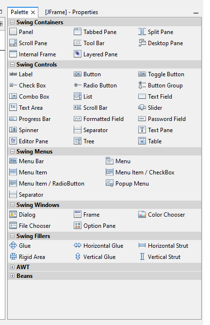

And from the events tab, add custom actions.

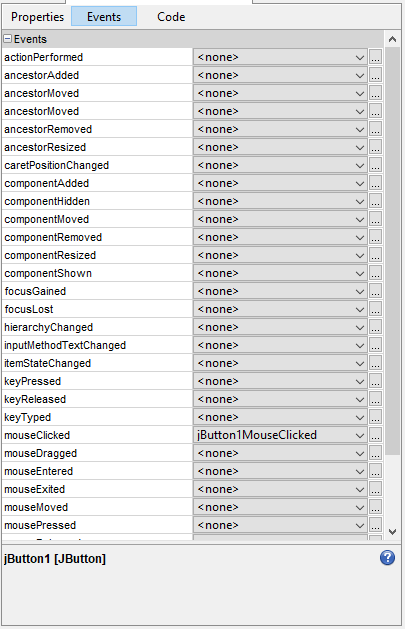

you can configure control properties from the properties screen

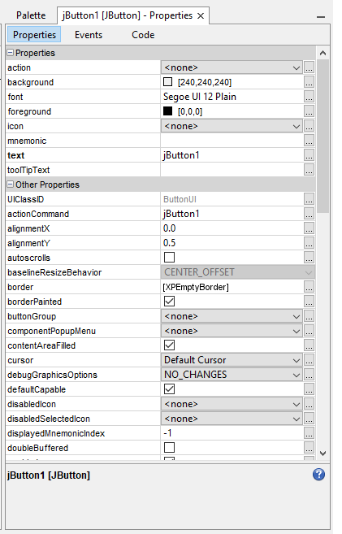

We can add simple events such as when the moclickscked to button write text on the text field

"Hello World"

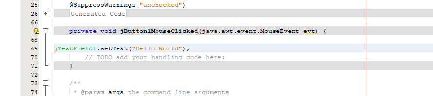

When you run application, you will see the following screen

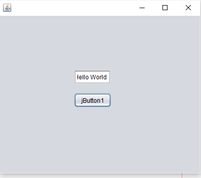

### References

...

..

---