<!-- _backgroundColor: aquq -->

<!-- _color: orange -->

<!-- paginate: false -->

# CE103 Algorithms and Programming I

# Week-4

---

<!-- paginate: true -->

## Introduction to Code Reusability and Automated Testing

During this course we will use entry level of shared library development and their tests and test automations. Also we will see TDD(Test Driven Development) approach.

---

During this course we will use **Windows OS, Eclipse and Visual Studio Commuity Edition** environments for examples.

---

Each example will include two function 

"Hello <name>" printing function with name sayHelloTo(name) and

sum of two variable function for basic, sum = sum(a,b). 

This sum function will add a to b and return result to sum variable. 

We will locate them in library and use them from a console application, also we will create unit tests for testing their functionalities and return variables

---

## Shared Library Development

### C Programming (Static Library)

#### Visual Studio Community Edition

In this sample we will create **c-lib-sample** project that contains library, executable, unit tests and unit test runners.

---

First of all you install Visual Studio Community Edition from website

[Visual Studio 2019 Community Edition - Son Ücretsiz Sürümü İndir](https://visualstudio.microsoft.com/tr/vs/community/)

---

Open visual studio community edition and select create a new project

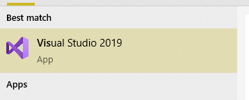

---


---

Select create a new project


---

Select C++ static library from project list


---

Name static library project


---

Default configuration come with C++ project types and setting


---

In the c-sample-lib.cpp you will sample function

```c
void fncsamplelib()
{

}
```

---

Delete pch.h and pch.c files. Also disable use precompiled header settings from configurations and change to "Not Using Precomplied Headers", also you can delete precomplied Header File. 


---

Customize library header name and update "framework.h" to "samplelib.h"

Insert your functions inside the c-sample-lib.c and update header files also.

```c
// c-sample-lib.cpp : Defines the functions for the static library.
//

#include "samplelib.h"
#include "stdio.h"

/// <summary>
/// 
/// </summary>
/// <param name="name"></param>
void sayHelloTo(char* name){

    if (name != NULL){
        printf("Hello %s \n",name);
    }
    else {
        printf("Hello There\n");
    }
}

/// <summary>
/// 
/// </summary>
/// <param name="a"></param>
/// <param name="b"></param>
/// <returns></returns>
int sum(int a, int b){

    int c = 0;
    c = a + b;
    return c;
}
```

---

also update samplelib.h

```c
#pragma once

#define WIN32_LEAN_AND_MEAN             // Exclude rarely-used stuff from Windows headers

void sayHelloTo(char* name);
int sum(int a, int b);
```

---

If you check configuration you will see that for C complier we are using Microsoft Environment and Toolkits


---

Now we can compile our library


---

You can follow operation from output window


---

in debug folder we will see our output

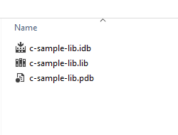

---

now we will add a console application c-sample-app and use our library


---

select C++ Windows Console Application from list


---

C++ Console Application Selection will generate a C++ console project we can change extension to C to compile our application as C application. 

we will convert c-sample-app.c to following code

```c
#include <stdio.h>

/// <summary>
/// 
/// </summary>
/// <returns></returns>
int main()
{
    printf("Hello World!\n");
}
```

---

after conversion set c-sample-app as startup project and build it

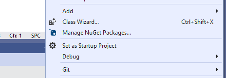

this will create c-sample-app.exe in the same folder with c-sample-lib.lib library


if we run application we will see only   "Hello World"

---

now we will see two options to add library as references in our application and use its functions.

---

First option 

right click references for c-sample-app and add current library as reference

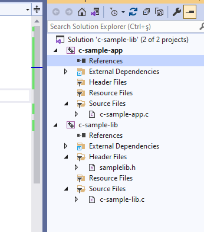

---

Select Add Reference


---

Browse for solution and select c-sample-lib


---

You can check added reference from references section


---

now we can include required headers from c-sample-lib folder and use it.

we can include required header with relative path as follow or with configuration

```c
#include <stdio.h>
#include "..\c-sample-lib\samplelib.h"
/// <summary>
/// 
/// </summary>
/// <returns></returns>
int main()
{
    printf("Hello World!\n");
}
```

---

we can build our c-sample-app


---

also we can only write header name 

```c
#include <samplelib.h>
```

---

for this we need to configure include directories

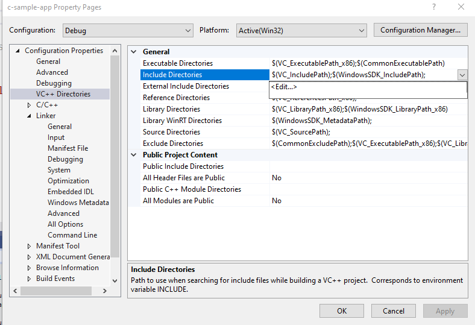

---

select c-sample-lib header file location


browse for folder


---

your full path will be added to your configuration

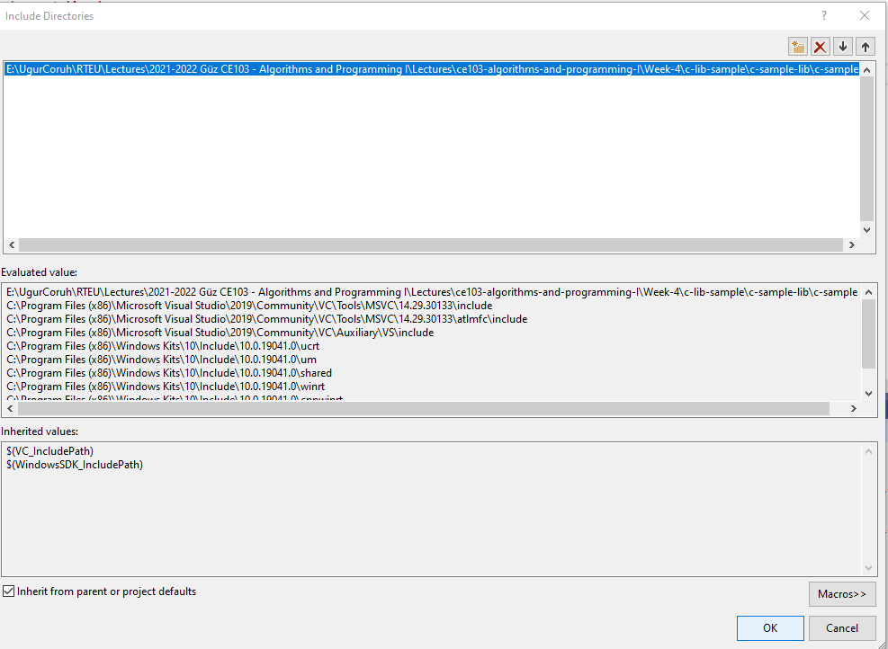

---

if you add header file paths to your configuration you can use header files by name in your source code

```c
#include <stdio.h>
#include <samplelib.h>
/// <summary>
/// 
/// </summary>
/// <returns></returns>
int main()
{
    printf("Hello World!\n");
}
```

---

we can compile the following we don't have problems but here we need to configure relative paths for configuration open include library settings and update with relative path

```batch
..\c-sample-lib
```


---

now we have portable source code configuration. we can call our functions and then we can update header and library folder configurations. 

```c
#include <stdio.h>
#include <samplelib.h>
/// <summary>
/// 
/// </summary>
/// <returns></returns>
int main()
{
    int result = 0;
    //printf("Hello World!\n");
    result = sum(5, 4);
    sayHelloTo("Computer");
    printf("Result is %d \n",result);
    printf("Press any key to continue...\n");
    getchar();
    return 0;
}
```

---

when you run you will see the following outputs, that mean we called library functions. 


---

static library is a code sharing approach if you want to share your source code with your customers then you can share static libraries and header files together. Another case you can use a precompiled static library with you or this library can be part of any installation then if there is a installed app and static libraries are placed on system folder or any different location then you can use configuration files to set library path and included header paths

---

Now we can remove project from c-sample-app references but we will set library file in configuration

Before this copy static library and header files to a folder like that 

```c
DebugStaticLibDeployment
```

- Set C/C++ -> General -> Additional Include Directories

There is a bug in configurations and relative path not finding headers so for this reason we will set full path but this is not a good practice for team working

---

**Not Working**

```c
..\c-sample-lib\DebugStaticLibDeployment
```

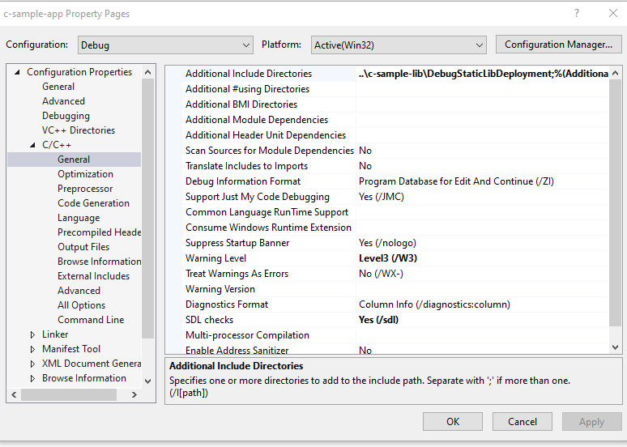

---

**Working**

```c
E:\...\c-lib-sample\c-sample-lib\DebugStaticLibDeployment
```


---

Now we will set library folder that our static library placed

we will set VC++ Directories -> Library Directories

Here is the same issue if we use relative path it doesn't work we need to set full path for library folder

---

**Working**

```c
E:\...\c-lib-sample\c-sample-lib\DebugStaticLibDeployment
```


---


---

**Not Working**

```c
..\c-sample-lib\DebugStaticLibDeployment
```


---


---

If we set full path for both libraries and headers then we need to set library name for project

**Linker->Input->Additional Dependencies**


In this case we will compile c-sample-app and we do not need to compile c-sample-lib because we copied output files to different location and they are ready to use.

---

current source code will be like that nothing changed

```c
#include <stdio.h>
#include <samplelib.h>

/// <summary>
/// 
/// </summary>
/// <returns></returns>
int main()
{
    int result = 0;
    //printf("Hello World!\n");
    result = sum(5, 4);
    sayHelloTo("Computer");
    printf("Result is %d \n",result);
    printf("Press any key to continue...\n");
    getchar();
    return 0;
}
```

---

and output 


---

There is a option about portability that we can set for team works

We will remove all library related settings from configurations and we will write them in source code

Clear linker->general->additional library directories


---

Clear C/C++ -> General -> Additional Include Directories


---

Clear Linker->Input->Additional Dependencies


---

Now we can set this configurations in source code as follow

```c
#pragma comment(lib, "..\\DebugStaticLibDeployment\\c-sample-lib.lib")
#include "..\DebugStaticLibDeployment\samplelib.h"

#include <stdio.h>

/// <summary>
/// 
/// </summary>
/// <returns></returns>
int main()
{
    int result = 0;
    //printf("Hello World!\n");
    result = sum(5, 4);
    sayHelloTo("Computer");
    printf("Result is %d \n",result);
    printf("Press any key to continue...\n");
    getchar();
    return 0;
}
```

with this configuration if your friends download this code then they can run them with their environment without setting a path.

---

### C++ Programming (Static Library)

---

#### Visual Studio Community Edition

All steps are similar with C programming above, but you do not need to delete pch.h 

You should take care about compiled source codes

for example if your code is compiled for x86 then your application also should use the x86 configuration else x64 then library should be x64 complied version.

---

Source will look like the following 

```cpp
// cpp-sample-app.cpp : This file contains the 'main' function. Program execution begins and ends there.
//

#pragma comment(lib, "..\\DebugStaticLibDeployment\\cpp-sample-lib.lib")

#include "..\DebugStaticLibDeployment\samplelib.h"

#include <iostream>

int main()
{
    std::cout << "Hello World!\n";

    int result = 0;
    //printf("Hello World!\n");
    result = sum(5, 4);
    sayHelloTo("Computer");
    printf("Result is %d \n", result);
    printf("Press any key to continue...\n");
    getchar();
    return 0;

}
```

---

### C/C++ WSL Option

---

Install WSL

[GitHub - ucoruh/ns3-wsl-win10-setup: ns3 windows 10 WSL2 setup and usage](https://github.com/ucoruh/ns3-wsl-win10-setup)

Create a Linux project


---

Configure Platform Toolset to WSL


---

Select GCC for Windows Subsystem for Linux


---

Put a breakpoint and run debugger


---

In the debugger for WSL you can use local WSL installation but if you want to run it on Release setting it require a SSH connection.


---

Configure SSH parameters


---

so you have to complete the following steps. 

### C/C++ Remote Linux Option over SSH

Enable SSH 

[SSH on Windows Subsystem for Linux (WSL) | Illuminia Studios](https://www.illuminiastudios.com/dev-diaries/ssh-on-windows-subsystem-for-linux/)

Connect to Remote WSL Environment

[Bağlan hedef Linux sisteminize Visual Studio | Microsoft Docs](https://docs.microsoft.com/tr-tr/cpp/linux/connect-to-your-remote-linux-computer?view=msvc-160)

---

### C# Programming (Dinamik Library)

---

#### Visual Studio Community Edition

In C# project we will create class library we have several options

for this sample we will select .NET core that we can build cross platform library


---

<mark>There is no static library option</mark>


---

We will select .Net Core 3.1


---

You will have default empty class library file


---

In the project you can see .NETcore reference


---

We can build empty class library that generate dll for our application


---

Now we will add Console Application but this will also use .NETCore

---

Select New Project 


---

Name the project


---

Select .NETCore framework


---

You will have the following sample main.cs file

```csharp
using System;

namespace csharp_sample_app
{
    class Program
    {
        static void Main(string[] args)
        {
            Console.WriteLine("Hello World!");
        }
    }
}
```

---

Now we can link projects with adding references open reference section


---

browse for class library project output folder and select output dll file for console application


---

now we can update our library code and use it in console application

copy following sample to sampleLibClass file in the library

```csharp
using System;

namespace csharp_sample_lib
{
    public class sampleLibClass
    {
        public static void sayHelloTo(string name)
        {
            if (!String.IsNullOrEmpty(name))
            {
                Console.WriteLine("Hello " + name);
            }
            else
            {
                Console.WriteLine("Hello There");
            }

        }

        public static int sum(int a, int b)
        {
            int c = 0;
            c = a + b;
            return c;
        }
    }
}
```

---

after this operation copy following sample to console application and build app then you can run

```csharp
using csharp_sample_lib;
using System;

namespace csharp_sample_app
{
    class Program
    {
        static void Main(string[] args)
        {
            Console.WriteLine("Hello World!");

            sampleLibClass.sayHelloTo("Computer");
            int result = sampleLibClass.sum(5, 4);
            Console.WriteLine("Results is" + result);
            Console.WriteLine("Results is {0}", result);
            Console.Read();
        }
    }
}
```

---

You will see following output that mean we called DLL functions


---

Also we can publish this console application with dll for linux environment or others 

for linux environment we should install .NETCore

---

follow the link below or commands that I shared with you as below for deployment

[How to Install Dotnet Core on Ubuntu 20.04 &ndash; TecAdmin](https://tecadmin.net/how-to-install-net-core-on-ubuntu-20-04/)

 Step 1 – Enable Microsoft PPA

```batch
 wget https://packages.microsoft.com/config/ubuntu/20.04/packages-microsoft-prod.deb 
sudo dpkg -i packages-microsoft-prod.deb
```

---

 Step 2 – Installing Dotnet Core SDK

```batch
sudo apt update 
sudo apt install apt-transport-https 
sudo apt install dotnet-sdk-3.1 
```

---

Step 3 – Install Dotnet Core Runtime Only

To install .NET Core Runtime on Ubuntu 20.04 LTS system, execute the commands:

```batch
sudo apt update 
```

---

To install the previous version of .Net core runtime 2.1, type:

```batch
sudo apt install dotnet-runtime-2.1
```

Press “y” for any input prompted by the installer.

---

Step 4 – (Optional) Check .NET Core Version

You can use dotnet command line utility to check installed version of .NET Core on your system. To check dotnet version, type:

```
dotnet --version
```


---

Now we will publish our application as single executable

Open publish menu


---

Select netcoreapp3.1 and Release for linux-x64


---

Select produce single file


---

After succesfull publish you will have linux binary that you can run with WSL


---

Open WSL and enter the path where this folder located

and run application as follow


---

check dotnet --version and then run application


you will see similar output


---

In this sample we created single application from settings lets try with shared library located option uncheck the "produce single file" option and publish again. 

Then you will have the following outputs


---

If you run csharp-sample-app

you will have the same output


---

### Java Programming

---

#### Eclipse IDE

You should download and install eclipse installer and then you should select Eclipse IDE for Java Developers

[Eclipse Installer 2021-09 R | Eclipse Packages](https://www.eclipse.org/downloads/packages/installer)


---


---


---


---

select create a project

<TODO>


---

select java project 

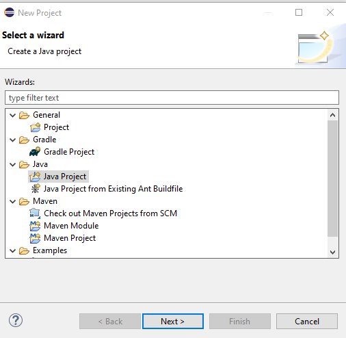

---

give project name


---

select finish


---

first we need to add a default package to keep everything organized


---

then we can create our class that includes our functions


---

give class a name


---

you will have following class with main


---

We will create sample java library with static functions as below.

```java
package ce103;

import java.io.IOException;

public class JavaSampleLib {

    public static void sayHelloTo(String name) {
        if(name.isBlank() || name.isEmpty())
        {
            System.out.println("Hello "+name);
        }else {
            System.out.println("Hello There");
        }
    }

    public static int sum(int a,int b)
    {
        int c = 0;
        c = a+b;
        return c;
    }

    public static void main(String[] args) {
        // TODO Auto-generated method stub
        System.out.println("Hello World!");

        JavaSampleLib.sayHelloTo("Computer");
        int result = JavaSampleLib.sum(5, 4);
        System.out.println("Results is" + result);
        System.out.printf("Results is %d \n", result);


        try {
            System.in.read();
        } catch (IOException e) {
            // TODO Auto-generated catch block
            e.printStackTrace();
        }

    }

}
```

---

also we can add main method to run our library functions. If we run this file its process main function


---

we can see output from console as below 

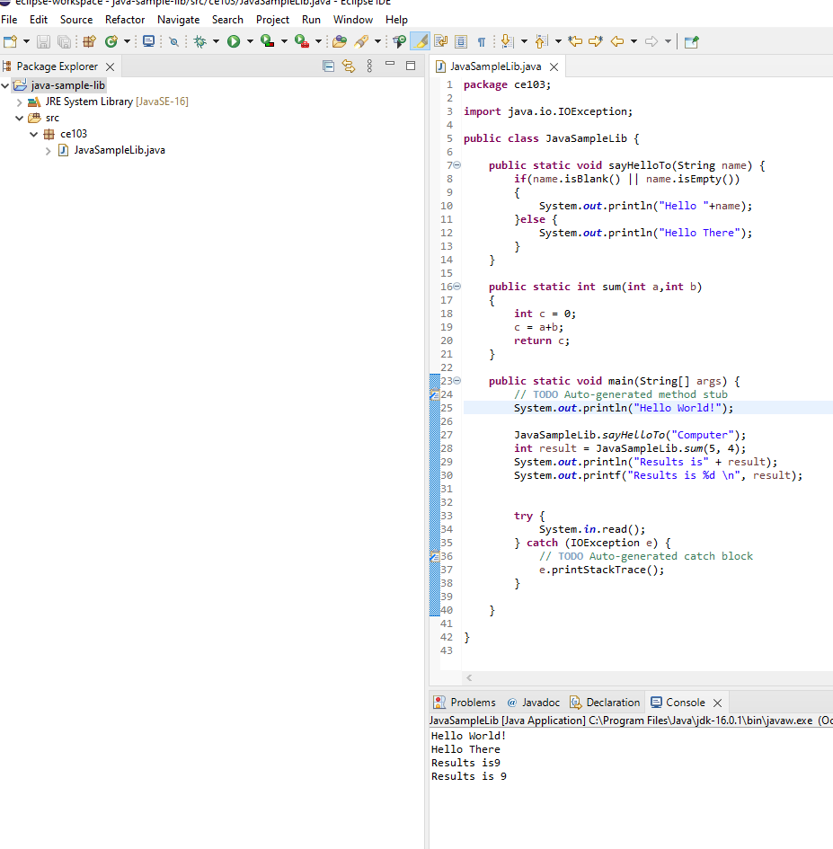

---

There is no exe files java runtime environment run class files but we can export this as an executable.


---

Select Java->Runnable JAR File


---

click next and set output path for jar file


---

If our project has several external dependecy then we can extract this required files (jar, so, dll) in seperated folder or we can combine them and generate a single executable jar

Lets pack everthing together, Select launch configuration that has main function


---

end of this operation we will have the following jar that we can by click 


---

When you click application if cannot run then try command line to see problem

enter jar folder and run the following command

```batch
java -jar JavaSampleLibExecutable.jar
```


In my case eclipse build JDK is newer than that I installed and set for my OS

If we check version we can see problem Java version 1.8.0_231


---

We can found installed and builded JDK for our application from Eclipse setting


---

select environments 

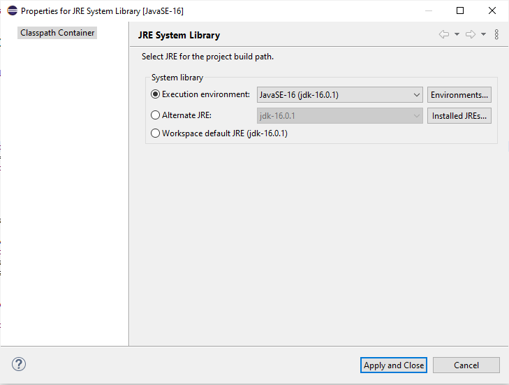

---

select installed JRE or JDK


---

you can see installed JRE or JDK home 

```batch
C:\Program Files\Java\jdk-16.0.1
```


---

Open system environment to fix this problem


---


---

Check user settings first


---

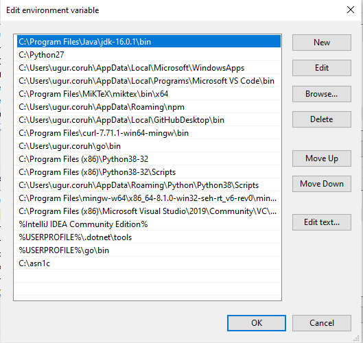

---

Check system settings

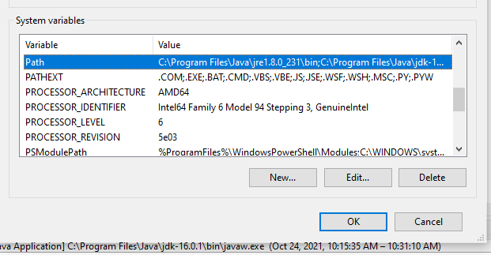

---


---

we will move up the JDK 16 configuration then command line will run first java 


---

Also in system setting check JAVA_HOME


---

After this settings close current command line and open new one

write 

```batch
java --version
```

if you see java version updated and 16.0.1 then settings are correct


---

and now if we enter and run application as follow we will see output

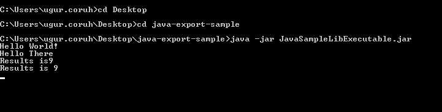

---

But when you click this jar its not running as you see so we have options to provide a clickable application there

Launch4j is an option here

[Launch4j - Cross-platform Java executable wrapper](http://launch4j.sourceforge.net/index.html)


---

you can watch this tutorial also

[How to convert jar to exe using Launch4J Full explanation - YouTube](https://www.youtube.com/watch?v=MyMPPuYGN-U&ab_channel=GoXR3PlusStudio)

---

Download and install launch4j and open application


---

configure your application settings similar to below select jar file and exe output path


---

we can customize main class if have multiple main class

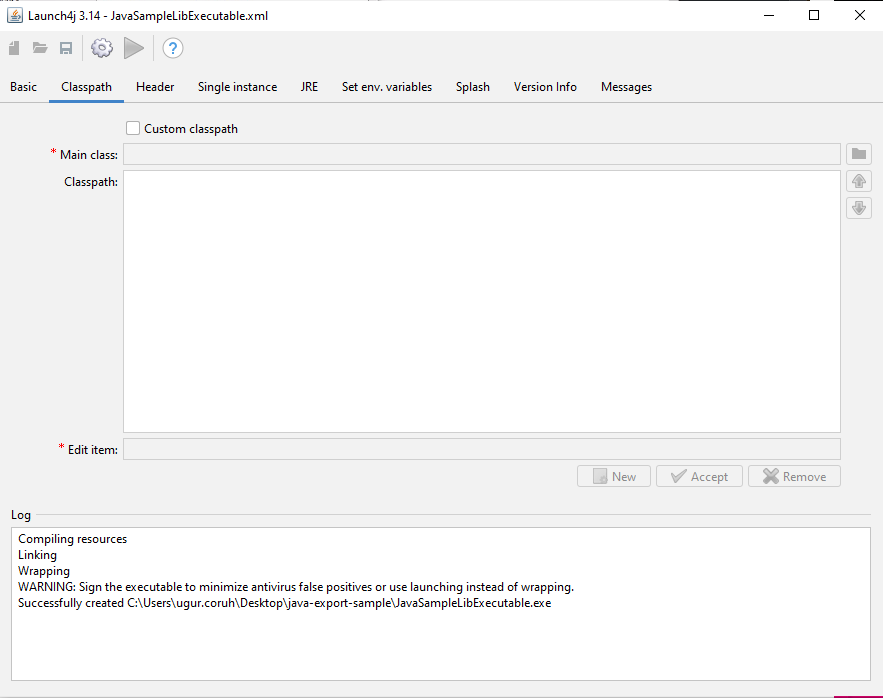

---

select console from setting for this application


---

we can provide a single running application, this setting avoid to run multiple instances


---

we need to set runtime environment versions 


---

you can set system parameters before running application


---

with splash screen you can show a splash screen image for your application


---

File attributes such as version product information is configured from version info tab


---

if your application runtime condition has an error then you can show this customized messages also


---

with this options save configuration file xml


---

and compile settings

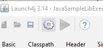

---

you will see generated output file in log screen

```batch
Compiling resources
Linking
Wrapping
WARNING: Sign the executable to minimize antivirus false positives or use launching instead of wrapping.
Successfully created C:\Users\ugur.coruh\Desktop\java-export-sample\JavaSampleLibExecutable.exe
```

---

now we can run exe by click

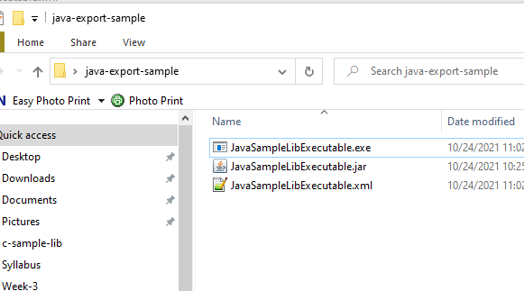


---

another option here adding a bat file to run current jar file

---

**JavaSampleLibExecutable.bat**

```batch
java -jar JavaSampleLibExecutable.jar
```


if we click bat file then we will automate command line task for current jar file

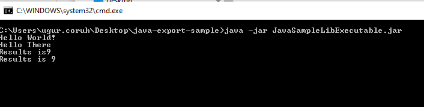

---

Now return back to our java library and create another console application that use library functions

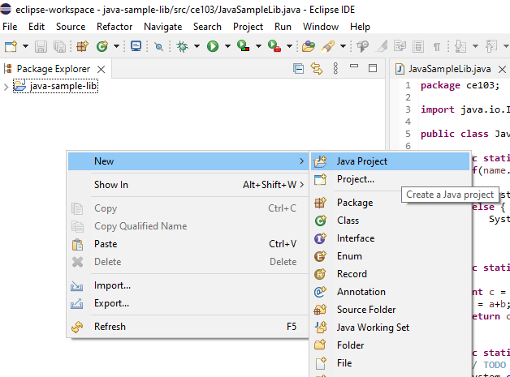

---

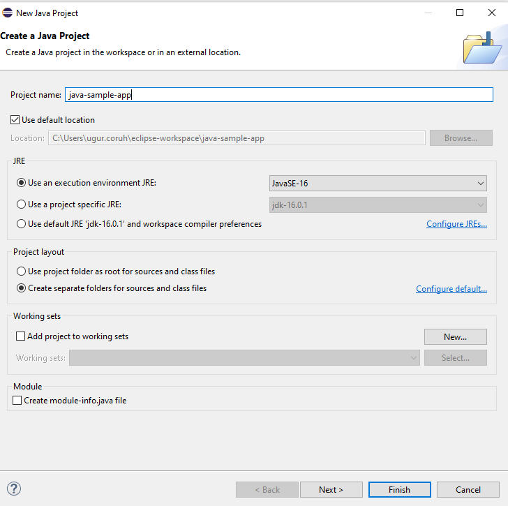

---


---

you can set libraries in this step from but our library should exported for our solution

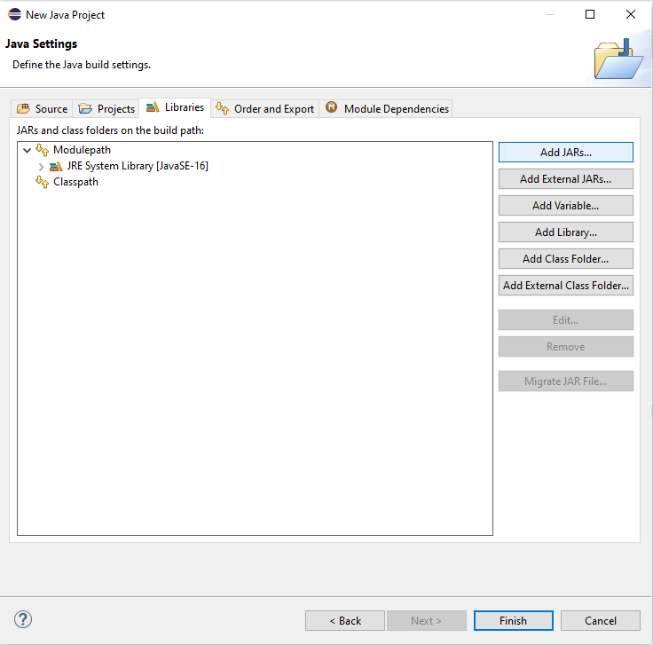

---

Select Add External JARs...


---

Open Exported jar folder and select


---

Or we can select by Add jar from current workspace


---

but in this step I won't add anything I'll add references later


---

we will have the following project


---

lets create a package


---

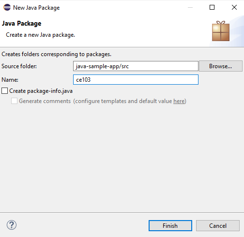

---

and lets create a main class for our application


---

check create main function


---


---

right click to project and add reference

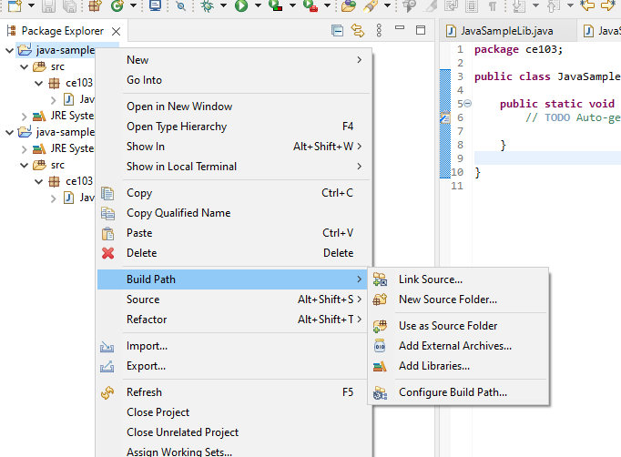

---

you can enter same configurations from project properties


---

Lets export our library as a JAR file and then add to our classpath


---

Select JAR file


---

we configured output as 

```batch
C:\Users\ugur.coruh\Desktop\java-export-sample\JavaSampleLib.jar
```


---


---

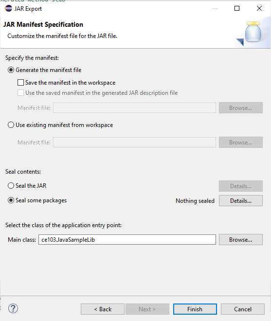

---

In the same export folder now we have JavaSampleLib.jar


---

return back to java-sample-app and then add this jar file to our project

Build Path->Add External Archives


---

you will see its added to reference libraries


---

in our JavaSampleApp.java we can use the following source codes

```java
package ce103;

import java.io.IOException;

public class JavaSampleApp {

    public static void main(String[] args) {
        // TODO Auto-generated method stub

        System.out.println("Hello World!");

        JavaSampleLib.sayHelloTo("Computer");
        int result = JavaSampleLib.sum(5, 4);
        System.out.println("Results is" + result);
        System.out.printf("Results is %d \n", result);


        try {
            System.in.read();
        } catch (IOException e) {
            // TODO Auto-generated catch block
            e.printStackTrace();
        }

    }

}
```

---

When we run application we will see similar output


---

Lets export this application with its dependent library


---

Select runnable jar


---

Set Launch configuration and Export destination

```batch
C:\Users\ugur.coruh\Desktop\java-export-sample\JavaSampleAppSingle.jar
```


---

In this option we will have single jar file

In the export folder we do not see reference libraries


and we can run with command line


---

only change copy required libraries setting and then give a new name for new jar file and export 

```batch
C:\Users\ugur.coruh\Desktop\java-export-sample\JavaSampleAppMultiple.jar
```


---

now we have a folder that contains our libraries referenced


---

in this file we can find our library


---

if we test our application we will see it will work


if we delete JavaSampleLib.jar and then try running application we will get error


---

## Program Testing

---

## Unit Test Development

---

### C Unit Tests

---

#### Visual Studio Community Edition

---

<TODO>

### C++ Unit Tests

---

#### Visual Studio Community Edition

[C/C++ için birim testleri yazma - Visual Studio (Windows) | Microsoft Docs](https://docs.microsoft.com/tr-tr/visualstudio/test/writing-unit-tests-for-c-cpp?view=vs-2019)

Use cpp-sample-lib project and add 


---

select Native Unit Test


---

set project path and name


---

you will have cpp-sample-test project


---

add library project from references


---

Add cpp-sample-lib to cpp-sample-test project

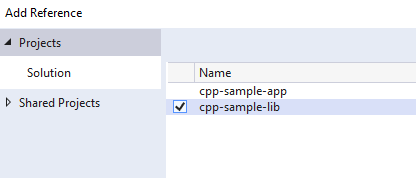

---

cpp-sample-test.cpp

```cpp
#include "pch.h"
#include "CppUnitTest.h"
#include "..\cpp-sample-lib\samplelib.h"

using namespace Microsoft::VisualStudio::CppUnitTestFramework;

namespace cppsampletest
{
    TEST_CLASS(cppsampletest)
    {
    public:

        TEST_METHOD(TestSumCorrect)
        {
            Assert::AreEqual(9, sum(4, 5));
        }

        TEST_METHOD(TestSumInCorrect)
        {
            Assert::AreEqual(10, sum(4, 5));
        }
    };
}
```

---


---

<TODO>

### C# Unit Tests

---

### Visual Studio Community Edition (MSTestV2+.Net)

Install extension fine code coverage

https://marketplace.visualstudio.com/items?itemName=FortuneNgwenya.FineCodeCoverage

Create a .Net Framework Library


---

set project framework and path


---

Create library functions


---

```csharp
using System;
using System.Collections.Generic;
using System.Text;

namespace cs_lib_sample
{
    public class SampleLibClass
    {
        public static string sayHelloTo(string name)
        {
            string result = String.Empty;

            if (!String.IsNullOrEmpty(name))
            {
                result = "Hello " + name;
            }
            else
            {
                result = "Hello There";
            }

            Console.WriteLine(result);

            return result;
        }

        public static int sum(int a, int b)
        {
            int c = 0;
            c = a + b;
            return c;
        }

        public int multiply(int a, int b)
        {
            return a * b;
        }
    }
}
```

---

right click and then create unit test project


---

press OK


---

enter test code

```csharp
using Microsoft.VisualStudio.TestTools.UnitTesting;
using cs_lib_sample;
using System;
using System.Collections.Generic;
using System.Linq;
using System.Text;
using System.Threading.Tasks;

namespace cs_lib_sample.Tests
{
    [TestClass()]
    public class SampleLibClassTests
    {

        [TestMethod()]
        public void testSayHelloTo()
        {


            Assert.AreEqual("Hello Computer", SampleLibClass.sayHelloTo("Computer"), "Regular say hello should work");
        }
        [TestMethod()]
        public void testSayHelloToWrong()
        {
            Assert.AreEqual("Hello All", SampleLibClass.sayHelloTo("Computer"), "Regular say hello won't work");
        }


        [TestMethod()]
        public void testSumCorrect()
        {
            Assert.AreEqual(9, SampleLibClass.sum(4, 5), "Regular sum should work");
        }

        [TestMethod()]
        public void testSumWrong()
        {
            Assert.AreEqual(10, SampleLibClass.sum(4, 5), "Regular sum shouldn't work");
        }

        [TestMethod()]
        public void testMultiply()
        {
            SampleLibClass sampleLib = new SampleLibClass();

            Assert.AreEqual(20, sampleLib.multiply(4, 5), "Regular multiplication should work");
        }


    }
}
```

---

Run tests


---

you will code coverage and entered or passed branches


---

#### Visual Studio Community Edition (NUnit+.NETCore)

use cshar-sample-lib for this example

create and add a unit test project to solution


---


---


---


---

Add project reference


---


---

SampleLibraryTestClasss in NUnit Project

```csharp
using csharp_sample_lib;
using NUnit.Framework;

namespace csharp_sample_lib_test
{
    public class SampleLibraryTestClass
    {
        sampleLibClass sampleLib;

        [SetUp]
        public void Setup()
        {
            sampleLib = new sampleLibClass();
        }

        [Test]
        public void testSayHelloTo()
        {
            Assert.AreEqual("Hello Computer", sampleLibClass.sayHelloTo("Computer"), "Regular say hello should work");
        }

        [Test]
        public void testSayHelloToWrong()
        {
            Assert.AreEqual("Hello All", sampleLibClass.sayHelloTo("Computer"), "Regular say hello won't work");
        }


        [Test]
        public void testSumCorrect()
        {
            Assert.AreEqual(9, sampleLibClass.sum(4, 5), "Regular sum should work");
        }

        [Test]
        public void testSumWrong()
        {
            Assert.AreEqual(10, sampleLibClass.sum(4, 5), "Regular sum shouldn't work");
        }

        [Test]
        public void testMultiply()
        {
            Assert.AreEqual(20, sampleLib.multiply(4, 5), "Regular multiplication should work");
        }
    }
}
```

---

sample class library 

```csharp
using System;

namespace csharp_sample_lib
{
    public class sampleLibClass
    {
        public static string sayHelloTo(string name)
        {
            string result = String.Empty;

            if (!String.IsNullOrEmpty(name))
            {
                result = "Hello " + name;
            }
            else
            {
                result = "Hello There";
            }

            Console.WriteLine(result);

            return result;
        }

        public static int sum(int a, int b)
        {
            int c = 0;
            c = a + b;
            return c;
        }

        public int multiply(int a, int b)
        {
            return a * b;
        }
    }
}
```

---

Open test explorer and run tests 


---

or you can run from project


---

Also we can create unit test from library class,

right click the sampleLibClass and select create unit tests but this option do not provide nunit tests.

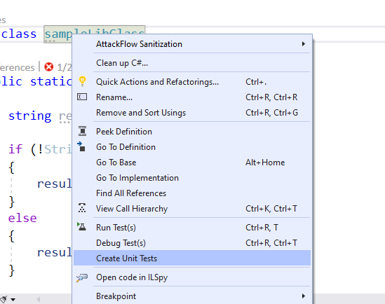

---


---


---


---

```csharp
using Microsoft.VisualStudio.TestTools.UnitTesting;
using csharp_sample_lib;
using System;
using System.Collections.Generic;
using System.Text;

namespace csharp_sample_lib.Tests
{
    [TestClass()]
    public class sampleLibClassTests
    {
        [TestMethod()]
        public void sayHelloToTest()
        {
            Assert.Fail();
        }

        [TestMethod()]
        public void sumTest()
        {
            Assert.Fail();
        }

        [TestMethod()]
        public void multiplyTest()
        {
            Assert.Fail();
        }
    }
}
```

---

we will not commit this changes and continue from nunit test project, the fine code 

coverage also work for nunit test but not provide inline highlighting

if we run tests we will have the following outputs


---


Inline code highlight is part of enterprise visual studio edition

[Analyzing code coverage in Visual Studio - DEV Community](https://dev.to/rruizdev/analizando-cobertura-del-codigo-en-visual-studio-1p27)

---

# TL;DR

Additional information you can use OpenCover + Nunit Runner + Report Generator together to setup a code coverage report but it has complex batch running process. After a few try I decided to use fine code coverage but here is the usage not tested well.

First unit test runner tool doesn't support .Net Core

[c# - The NUnit 3 driver encountered an error while executing reflected code (NUnit.Engine.NUnitEngineException) - Stack Overflow](https://stackoverflow.com/questions/64611083/the-nunit-3-driver-encountered-an-error-while-executing-reflected-code-nunit-en)

Follow the instructions on the link

[CMD OpenCover · sukhoi1/Useful-Notes Wiki · GitHub](https://github.com/sukhoi1/Useful-Notes/wiki/CMD-OpenCover)

Install OpenCover, ReportGenerator, Nunit,Runners packages then use the package installation folder to get tools that you need

---

Here is a sample for open cover, select package and copy path


---

Goto path and tools

```batch
C:\Users\ugur.coruh\.nuget\packages\opencover\4.7.1221
```

You need to setup some batch similar with following

run-test-coverage.bat

```batch
set pathA=C:\Users\ugur.coruh\.nuget\packages\opencover\4.7.1221\tools
set pathB=C:\Users\ugur.coruh\.nuget\packages\nunit.consolerunner\3.12.0\tools
set pathC=C:\Users\ugur.coruh\.nuget\packages\reportgenerator\4.8.13\tools\netcoreapp3.0
set dllpath=C:\Users\ugur.coruh\Desktop\csharp-sample-lib\csharp-sample-lib-test\bin\Debug\netcoreapp3.1

"%pathA%\OpenCover.Console.exe" ^
-targetargs:"%dllpath%\csharp-sample-lib-test.dll" ^
-filter:"+[csharp-sample-lib*]* -[*test]*" ^
-target:"%pathB%\nunit3-console.exe" ^
-output:"%dllpath%\coverReport.xml" ^
-skipautoprops -register:user && "%pathC%\ReportGenerator.exe" -reports:"%dllpath%\coverReport.xml" -targetdir:""%dllpath%\coverage"
pause
```

---

but nunit3-console.exe gives error 


---

for this compatibility issues I prefer to use fine code coverage extension. 

OpenCover related studies

[Code coverage of manual or automated tests with OpenCover for .NET applications – Automation Rhapsody](https://automationrhapsody.com/code-coverage-manual-automated-tests-opencover-net-applications/)

[Code coverage of .NET Core unit tests with OpenCover – Automation Rhapsody](https://automationrhapsody.com/code-coverage-net-core-unit-tests-opencover/)

Sample OpenCover report

[Summary - Coverage Report](https://automationrhapsody.com/examples/OpenCover-report/)

---

### Download and Setup OpenCover, NUnit Console, Report Generator without Package Manager

You can also download the tools from github project pages and install on your operating system, 

---

### OpenCover

[Releases · OpenCover/opencover · GitHub](https://github.com/OpenCover/opencover/releases)


---


---

Select advanced and then install for all users


---


---


---


---


---


---


---


---

### ReportGenerator

[Release ReportGenerator_4.8.13 · danielpalme/ReportGenerator · GitHub](https://github.com/danielpalme/ReportGenerator/releases/tag/v4.8.13)

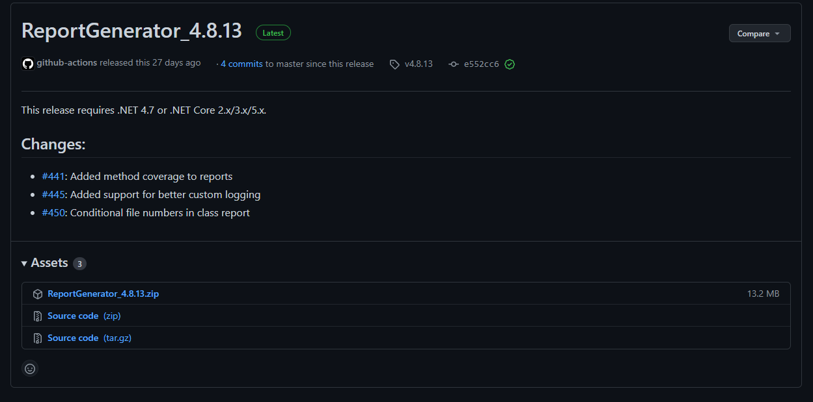

---


---

### NUnit Console

[Downloads](https://nunit.org/download/)


---


---


---


---


---

### NUnit + MSTest Batch Report Generation (Not Tested)

[OpenCover and ReportGenerator Unit Test Coverage in Visual Studio 2013 and 2015 &#8211; CodeHelper.Net](http://codehelper.net/unit-testing/opencover-and-reportgenerator-unit-test-coverage-in-visual-studio-2013-and-2015/)

[OpenCover and ReportGenerator Unit Test Coverage in Visual Studio 2013 and 2015 - CodeProject](https://www.codeproject.com/Articles/1276980/OpenCover-and-ReportGenerator-Unit-Test-Coverage-i)

---

### Java Unit Tests

---

#### Eclipse IDE (JUnit4 , JUnit5)

In this sample we will create two example for similar library

Please check the following links 

[JUnit 5 tutorial - Learn how to write unit tests](https://www.vogella.com/tutorials/JUnit/article.html)

[JUnit 5](https://junit.org/junit5/)

[JUnit 5 User Guide](https://junit.org/junit5/docs/current/user-guide/)

https://www.eclemma.org/

[JUnit Hello World Example - Examples Java Code Geeks - 2021](https://examples.javacodegeeks.com/core-java/junit/junit-hello-world-example/)

https://yasinmemic.medium.com/java-ile-unit-test-yazmak-birim-test-ca15cf0d024b

---

#### Java Application + JUnit

In normal java application we can right click the project java-sample-lib and add Junit case 

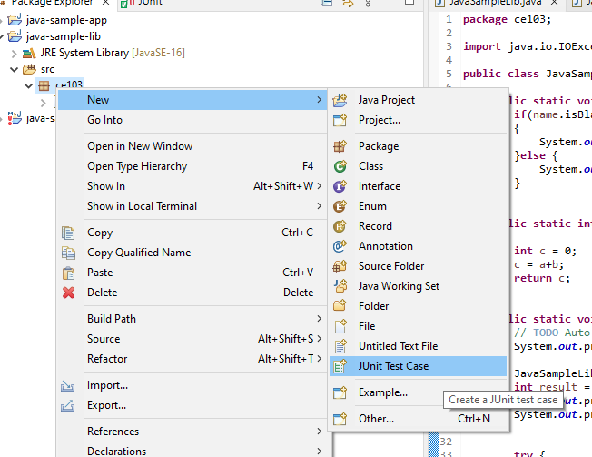

---


---


---


---


---

and you will have the following test class


---

Now we will create tests that check our function flowchart and return values

We need to cover all code branches that we coded

I have updated JavaSampleLib.java as follow to check outputs

JavaSampleLib.java

```java
package ce103;

public class JavaSampleLib {

    public static String sayHelloTo(String name) {

        String output = "";

        if(!name.isBlank() && !name.isEmpty()){
            output = "Hello "+name;
        }else {
            output = "Hello There";
        }

        System.out.println(output);

        return output;
    }

    public static int sum(int a,int b)
    {
        int c = 0;
        c = a+b;
        return c;
    }

    public int multiply(int a, int b) {
        return a * b;
    }

//    public static void main(String[] args) {
//        // TODO Auto-generated method stub
//        System.out.println("Hello World!");
//
//        JavaSampleLib.sayHelloTo("Computer");
//        int result = JavaSampleLib.sum(5, 4);
//        System.out.println("Results is" + result);
//        System.out.printf("Results is %d \n", result);
//        
//        
//        try {
//            System.in.read();
//        } catch (IOException e) {
//            // TODO Auto-generated catch block
//            e.printStackTrace();
//        }
//
//    }

}
```

---

and JavaSampleLibTest.java

```java
package ce103;

import static org.junit.jupiter.api.Assertions.*;

import org.junit.jupiter.api.AfterAll;
import org.junit.jupiter.api.AfterEach;
import org.junit.jupiter.api.BeforeAll;
import org.junit.jupiter.api.BeforeEach;
import org.junit.jupiter.api.DisplayName;
import org.junit.jupiter.api.RepeatedTest;
import org.junit.jupiter.api.Test;
import org.junit.jupiter.params.ParameterizedTest;
import org.junit.jupiter.params.provider.MethodSource;

class JavaSampleLibTest {

    JavaSampleLib sampleLib;

    @BeforeAll
    static void setUpBeforeClass() throws Exception {
    }

    @AfterAll
    static void tearDownAfterClass() throws Exception {
    }

    @BeforeEach
    void setUp() throws Exception {
        sampleLib = new JavaSampleLib();
    }

    @AfterEach
    void tearDown() throws Exception {
    }

    @Test
    @DisplayName("Simple Say Hello should work")
    void testSayHelloTo() {
        assertEquals("Hello Computer", JavaSampleLib.sayHelloTo("Computer"), "Regular say hello should work");
    }

    @Test
    @DisplayName("Simple Say Hello shouldn' work")
    void testSayHelloToWrong() {
        assertEquals("Hello All", JavaSampleLib.sayHelloTo("Computer"), "Regular say hello won't work");
    }


    @Test
    @DisplayName("Simple sum should work")
    void testSumCorrect() {
        assertEquals(9, JavaSampleLib.sum(4, 5), "Regular sum should work");
    }

    @Test
    @DisplayName("Simple sum shouldn't work")
    void testSumWrong() {
        assertEquals(10, JavaSampleLib.sum(4, 5), "Regular sum shouldn't work");
    }

    @Test
    @DisplayName("Simple multiplication should work")
    void testMultiply() {
        assertEquals(20, sampleLib.multiply(4, 5), "Regular multiplication should work");
    }

    @RepeatedTest(5)
    @DisplayName("Ensure correct handling of zero")
    void testMultiplyWithZero() {
        assertEquals(0, sampleLib.multiply(0, 5), "Multiple with zero should be zero");
        assertEquals(0, sampleLib.multiply(5, 0), "Multiple with zero should be zero");
    }

    public static int[][] data() {
        return new int[][] { { 1, 2, 2 }, { 5, 3, 15 }, { 121, 4, 484 },{ 2, 2, 2 } };
    }

    @ParameterizedTest
    @MethodSource(value = "data")
    void testWithStringParameter(int[] data) {
        JavaSampleLib tester = new JavaSampleLib();
        int m1 = data[0];
        int m2 = data[1];
        int expected = data[2];
        assertEquals(expected, tester.multiply(m1, m2));
    }

}
```

---

if we run tests


---

we will see all results there


---

also we can see the code coverage of tests


---

when we open our source code (just close and open again another case highlighting will not work) you will see tested part of your codes

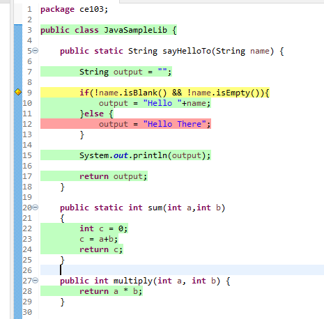

---

#### Maven Java Application + JUnit

Lets create Maven project with tests

Create a maven project

*File -> New -> Maven Project*


---


---

Lets convert our sample java-sample-lib directories to standard folder structure for test and app division

[Maven &#x2013; Introduction to the Standard Directory Layout](http://maven.apache.org/guides/introduction/introduction-to-the-standard-directory-layout.html)

Also for intro you can use this

[JUnit Hello World Example - Examples Java Code Geeks - 2021](https://examples.javacodegeeks.com/core-java/junit/junit-hello-world-example/)

Eclipse  
Maven  
Java  
JUnit 4.12 (pulled by Maven automatically)

---

Lets give new sample java-sample-lib-mvnbut in this time we will create a maven project


---


---

pom.xml file

```xml
<project xmlns="http://maven.apache.org/POM/4.0.0" xmlns:xsi="http://www.w3.org/2001/XMLSchema-instance" xsi:schemaLocation="http://maven.apache.org/POM/4.0.0 https://maven.apache.org/xsd/maven-4.0.0.xsd">
  <modelVersion>4.0.0</modelVersion>
  <groupId>com.ce103</groupId>
  <artifactId>java-sample-lib-ext</artifactId>
  <version>0.0.1-SNAPSHOT</version>
  <name>Java Sample Lib</name>
  <description>Java Sample with Unit Test</description>
</project>
```

---

we will add JUnit 5 for our project 

```xml
<project xmlns="http://maven.apache.org/POM/4.0.0"
    xmlns:xsi="http://www.w3.org/2001/XMLSchema-instance"
    xsi:schemaLocation="http://maven.apache.org/POM/4.0.0 https://maven.apache.org/xsd/maven-4.0.0.xsd">
    <modelVersion>4.0.0</modelVersion>
    <groupId>com.ce103</groupId>
    <artifactId>java-sample-lib-ext</artifactId>
    <version>0.0.1-SNAPSHOT</version>
    <name>Java Sample Lib</name>
    <description>Java Sample with Unit Test</description>

    <dependencies>
        <dependency>
            <groupId>org.junit.jupiter</groupId>
            <artifactId>junit-jupiter-params</artifactId>
            <version>5.7.1</version>
            <scope>test</scope>
        </dependency>
    </dependencies>

</project>
```

---

it will automatically download libraries 


---


---

Create java sample library in ce103 package, first create java package


---

In this package create library class


---


---

copy content from other library

```java
package ce103;

public class JavaSampleLib {

public static String sayHelloTo(String name) {

        String output = "";

        if(!name.isBlank() && !name.isEmpty()){
            output = "Hello "+name;
        }else {
            output = "Hello There";
        }

        System.out.println(output);

        return output;
    }

    public static int sum(int a,int b)
    {
        int c = 0;
        c = a+b;
        return c;
    }

    public int multiply(int a, int b) {
        return a * b;
    }


}
```

---

Now lets create tests inf src/test/java


---


---

create a JUnit Case 

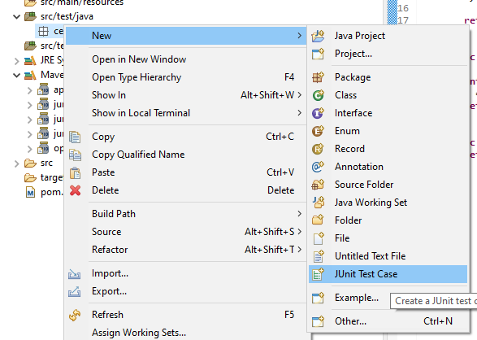

---


---


---

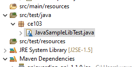

---

you will simple template

```java
package ce103;

import static org.junit.jupiter.api.Assertions.*;

import org.junit.jupiter.api.AfterAll;
import org.junit.jupiter.api.AfterEach;
import org.junit.jupiter.api.BeforeAll;
import org.junit.jupiter.api.BeforeEach;
import org.junit.jupiter.api.Test;

class JavaSampleLibTest {

    @BeforeAll
    static void setUpBeforeClass() throws Exception {
    }

    @AfterAll
    static void tearDownAfterClass() throws Exception {
    }

    @BeforeEach
    void setUp() throws Exception {
    }

    @AfterEach
    void tearDown() throws Exception {
    }

    @Test
    void testSayHelloTo() {
        fail("Not yet implemented");
    }

    @Test
    void testSum() {
        fail("Not yet implemented");
    }

    @Test
    void testMultiply() {
        fail("Not yet implemented");
    }

}
```

---

now lets copy tests from other projects

```java

```

---


---


---


---

That's a part of java unit testing...

---

## TDD (Test Driven Development)

---

## Test and Deployment Automation Management

---

#### Travis-CI + C

---

#### Travis-CI + Cpp

---

#### Travis-CI + C#

---

#### Travis-CI + Java

---

# References

[GitHub - MicrosoftDocs/cpp-docs: C++ Documentation](https://github.com/MicrosoftDocs/cpp-docs)
