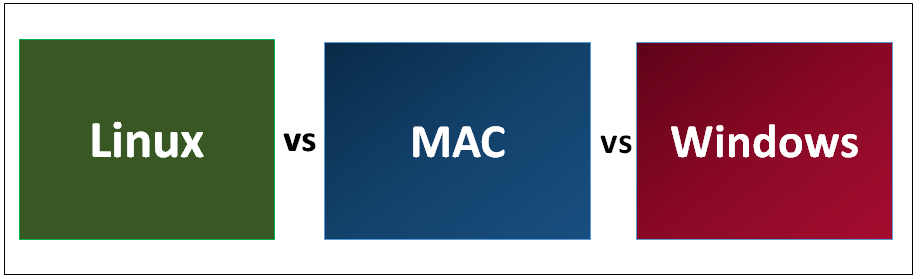
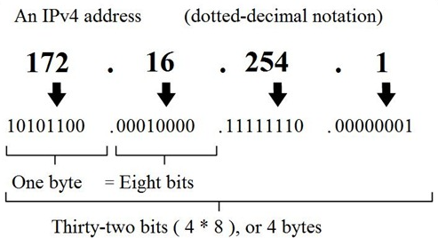
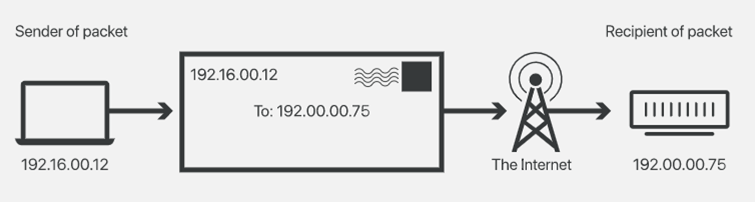
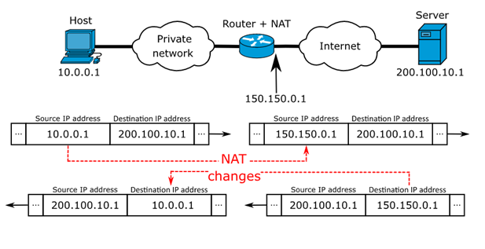
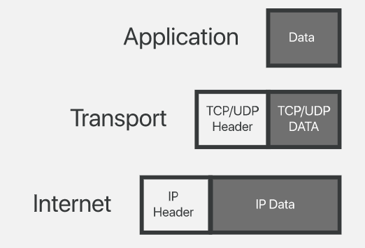
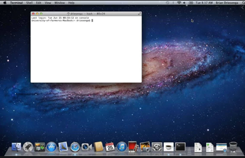

<!-- _backgroundColor: aquq -->

<!-- _color: orange -->

<!-- paginate: false -->

## CE103 Algorithms and Programming I

### Week-1

#### Introduction and Developer Roadmap

Download [DOC](ce103-week-1-intro.en.md_doc.pdf), [SLIDE](ce103-week-1-intro.en.md_slide.pdf), [PPTX](ce103-week-1-intro.en.md_slide.pptx)

<iframe width=700, height=500 frameBorder=0 src="../ce103-week-1-intro.en.md_slide.html"></iframe>

---

### Outline

- Computer Engineering Roles
- Developer Roadmaps
- Building a Social Profile and Resume
- Job Qualifications 
- Using Google
- Operating Systems 
- Introduction to Internet (IP, Port etc.)
- Windows Helper Utilities
- Shortcuts 
- Command-Line Interface and Usefull Commands

---

### Brief Description of Course and Rules

We will first talk about, 

1. Course Plan and Communication

2. Grading System, Homework,s and Exams

please read the syllabus carefully. 

---

### Computer Engineering Roles

- Software Development

- Hardware Development

- Network Organization and Management

- Database Organization and Management

- Hardware and Software Testing

- Audit (Cyber Security, Policy etc.)

- Etc.

---

<!-- paginate: true -->

### Computer Engineering Areas

- Computer Vision

- Social

- Analytics 

- Mobility

---

- IoT

- Security

- Web-Scale IT

- Cloud

---

- Smart Machines

- Pervasive

- Fintech

- Etc.

---

### Our focus is Software Development

for this reason, we will focus on software-based road-maps

we can use common developer road maps from

https://roadmap.sh/

---

### What will you see in the roadmap?

- [Frontend Developer Roadmap: Learn to become a modern frontend developer](https://roadmap.sh/frontend)

- [Backend Developer Roadmap: Learn to become a modern backend developer](https://roadmap.sh/backend)

- [DevOps Roadmap: Learn to become a DevOps Engineer or SRE](https://roadmap.sh/devops)

- [DBA Roadmap: Learn to become a database administrator with PostgreSQL](https://roadmap.sh/postgresql-dba)

and [more](https://roadmap.sh/)

---

### Open a formal e-mail account

name.surname@gmail.com

n.surname@gmail.com

surname.name@gmail.com

namesurname@gmail.com

etc. do not have numbers in your e-mail adress

---

### Social Media and Job Search Profiles

- Open the following accounts
  
  - Linkedin
  
  - Gitlab
  
  - Bitbucket
  
  - Docker
  
  - Github
  
  - ORCID
  
  - ARBİS
  
  - Hackerrank
  
  - Publons

---

### Social Media and Job Search Profiles

- Open the following accounts
  
  - [https://www.kariyer.net/](https://www.kariyer.net/)
  
  - [https://www.yenibiris.com/](https://www.yenibiris.com/)
  
  - [https://www.secretcv.com/](https://www.secretcv.com/)

and more...

---

### Also, you need soft skills

- Excellent written and oral communication skills, including public speaking and presenting
- Decisiveness under pressure and strong critical thinking skills
- Willingness to work off-core-hours, when necessary, to deploy software or upgrade hardware

---

### If you need more information about your profession

Visit Job Search Web Portals and Look at Requirements to Understand What is Real Life Need

- https://www.kariyer.net/

- https://www.yenibiris.com/

- https://www.secretcv.com/

- https://www.linkedin.com/

- Etc.

---

### Using Google

- Google Scholar

- Google Patents

- Google Images

---

### Operating System List


---

### Operating System Architecture


[reference](https://www.cs.uic.edu/~jbell/CourseNotes/OperatingSystems/2_Structures.html)

---

### Operating Systems Key Comparing Factor


[reference](https://www.slideshare.net/quanhan503/comparing-windows-vs-mac-vs-linux)

---

### Operating System Comparisons



[reference](https://www.educba.com/linux-vs-mac-vs-windows/)

---

#### Operating System Comparisons


---

#### Operating System Comparisons


---

#### Operating System Comparisons


---

#### Operating System Comparisons


---

#### Operating System Comparisons


---

### **Intro to the Internet**

---

#### What is IP Address?


---

#### What is IP Address?



---

#### What is IP Address?



---

#### What is Port?

In [computer networking](https://en.wikipedia.org/wiki/Computer_networking), a port is a communication endpoint. At the software level, within an [operating system](https://en.wikipedia.org/wiki/Operating_system), a port is a logical construct that identifies a specific [process](https://en.wikipedia.org/wiki/Process_(computing)) or a type of [network service](https://en.wikipedia.org/wiki/Network_service). A port is identified for each [transport protocol](https://en.wikipedia.org/wiki/Transport_protocol) and address combination by a 16-bit [unsigned number](https://en.wikipedia.org/wiki/Unsigned_number), known as the port number.
The most common transport protocols that use port numbers are the [Transmission
Control Protocol](https://en.wikipedia.org/wiki/Transmission_Control_Protocol) (TCP) and the [User Datagram Protocol](https://en.wikipedia.org/wiki/User_Datagram_Protocol) (UDP).

[reference](https://en.wikipedia.org/wiki/Port_(computer_networking))

---

#### What is Port?


---

#### What is Port Forwarding and NAT


---

#### What is Port Forwarding and NAT



https://www.networkantics.com/sonicwall-port-forwarding/

https://en.wikipedia.org/wiki/Network_address_translation

---

#### What is Internet Packet (IP)



---

#### What is Domain Name Server (DNS)?


---

#### The Submarine Cable Map


https://www.submarinecablemap.com/

---

### **Shortcuts**

$$
\text{Before starting to do anything, if there are shortcuts, try to learn them.}
$$

---

#### Microsoft Helper Toolkits

- Install Power Toys Utility
  - https://learn.microsoft.com/en-us/windows/powertoys/
- Download Sysinternals Suite (Toolkit)
  - https://learn.microsoft.com/en-us/sysinternals/downloads/sysinternals-suite

---

#### Windows Shortcuts

- **Copy**: `Ctrl+C`
- **Cut**: `Ctrl+X`
- **Paste**: `Ctrl+V`

---

#### Windows Shortcuts

- **Snipping Tool**: `Win+Shift+S`
- Depending on your hardware **take a screenshot**
  - `Win+PrtScn`
  - `Fn+Win+Space`. 

---

#### Windows Shortcuts (Power Toys)

- **Power Toys Run**: `Alt+Space`
- **Always-on-Top**: `Win+Ctrl+T` 
- **Color Picker** : `Win+Shift+C`
- **Screen Ruler** : `Win+Shift+T`
- **Video Conf. Mute** : `Win+Shift+Q`

---

#### Windows Shortcuts

- **Maximize Window**: `F11` or `Win+UpArrow` 
- **Open Task View**: `Win+Tab`
- **Display and hide the desktop**: `Win+D`
- **Switch between open apps**: `Alt+Tab`
- **Open the Quick Link menu**: `Win+X`
- **Lock your PC**: `Win+L`

---

### Introduction to the command line interface

- Reference Books
  - [Bash Notes For Professionals](files/BashNotesForProfessionals.pdf) 
  - [Linux Notes For Professionals](files/LinuxNotesForProfessionals.pdf)
  - [PowerShell Notes For Professionals](files/PowerShellNotesForProfessionals.pdf)

---

#### What is the command line?

The window, which is usually called the **command line** or **command-line interface**, is a text-based application for viewing, handling, and manipulating files on your computer. It's much like Windows Explorer or Finder on the Mac, but without the graphical interface. Other names for the command line are: 

`cmd, CLI, prompt, console or terminal `

While there are many commands you can use with CLI, they all fall into <u>two categories</u>:

- The commands that handle the processes

- The commands that handle the files

[reference]([Introduction to command line · HonKit](https://tutorial.djangogirls.org/en/intro_to_command_line/))

---

#### Why Would You Use CLI over GUI?

- **Less Resource**
  It is not a secret that the text-based program needs very little resources of your computer. This means that with CLI you can do similar tasks with minimum resources.

---

#### Why Would You Use CLI over GUI?

- **High Precision**
  You can use a specific command to target specific destinations with ease. As long as you don’t type the wrong command, it will work like a charm. Once you learn the basics, writing syntax is not as hard as you might think.

---

#### Why Would You Use CLI over GUI?

- **Repetitive Tasks Friendly**
  GUI has developed well over the years. But, the operating system may not give you all the menus and buttons to perform all tasks. One of the reasons is safety. This leaves you overwhelmed if you have to do repetitive tasks. For example, when you have to handle hundreds of files within a folder, CLI enables you to use a single command to do automate the repetition easily.

---

#### Why Would You Use CLI over GUI?

- **Powerful**
  Most operating systems today prevent you from messing up the system’s core process. Windows has system protection and MacOS has SIP (System Integrity Protection). You won’t be able to perform certain tasks which are system protected. However, with CLI, you will have full control over your system.

---

#### Open the command-line interface (Windows)

- Go to the Start menu or screen, and enter `Command Prompt` in the search field.

- Go to `Start menu → Windows System → Command Prompt`.

- Go to `Start Menu → All Programs → Accessories → Command Prompt`.

- Go to the Start screen, hover your mouse in the lower-left corner of the screen, and click the down arrow that appears (on a touch screen, instead flick up from the bottom of the screen). The Apps page should open. Click on Command Prompt in the Windows System section.

- Hold the special Windows key on your keyboard and press the "X" key. Choose "Command Prompt" from the pop-up menu.

- Hold the Windows key and press the "R" key to get a "Run" window. Type "cmd" in the box, and click the OK key.

---

#### Open the command-line interface (Windows)


---

#### Open the command-line interface (Windows)


---

#### Open the command-line interface (Windows)


---

#### Open the command-line interface (Windows)


---

#### Open the command-line interface (Windows)


---

#### Open the command-line interface (Linux)

 It's probably under 

- Applications → Accessories → Terminal,  
  or 
- Applications → System → Terminal, 
  but that may depend on your system. 
  If it's not there, you can try to Google it. :)

---

#### Open the command-line interface (Linux)


---

#### Open the command-line interface (MacOS)

- Go to Applications → Utilities → Terminal



---

### **Command Basics**

---

#### Command Basics (Computer Name,Current Directory Path)

```
> whoami (hit enter)
```
- Result: laptop-rqnns9ig\ugur.coruh
  - Computer will print username

---

#### Command Basics (Computer Name,Current Directory Path)

```
> pwd 
```
- Result: /Users/ugur.coruh
  - Current Working Directory for Linux and OS X

---

#### Command Basics (Computer Name,Current Directory Path)

```
>cd
```
- Result: C:\Users\ugur.coruh
  - Current Working Directory for Windows

---

#### Learn Command Details in Linux and OS X

```
>man <command_name>
```
Sample 

```
>man pwd
```
- OS X and Linux have a man command,which gives you help on commands
  
- Use the `space` bar to move to the next page, and `q` to quit looking at the help

---

#### Learn Command Details in Window

- Adding a `/?` suffix to most commands will print the help page
- Sample

```
>cd /? 
```

---

#### List files and directories in Linux and OS X

```
>ls
```

- Applications
- Desktop
- Downloads
- Music
- ...

---

#### List files and directories in Linux and OS X

```
>ls -R
```
- will list all the files in the sub-directories as well

---

#### List files and directories in Linux and OS X

```
>ls -a
```
- will show the hidden files

---

#### List files and directories in Linux and OS X

```
>ls -al
``` 
- will list the files and directories with detailed information like the permissions, size,owner, etc.

---

#### List files and directories in Windows

```
>dir
```
Result: 

```
Volume in drive C is Windows
Volume Serial Number is 8C3C-8F8C
Directory of C:\Users\ugur.coruh
10/14/2020  09:57 AM    <DIR>          .
10/14/2020  09:57 AM    <DIR>          ..
08/15/2020  11:00 PM    <DIR>          .android
06/28/2020  03:02 AM    <DIR>          AndroidStudio4.0

```

---

#### List files and directories in Linux, OS X

- you should install with `brew install tree`

---

#### List files and directories in Windows

```
> tree
```
Result:
```
C:\Users\ugur.coruh\Desktop\Samples>tree
Folder PATH listing for volume Windows
Volume serial number is 8C3C-8F8C
       C:.
       ├───C
       │   └───HelloWorld
       │       └───.vscode
       ├───Cpp
       ├───Csharp
       └───Java
```

---

#### Change Current Directory in Windows / Linux and OS X

```
>cd <path>
```

```
cd Desktop 
```

---

#### Change Current Directory in Windows / Linux and OS X

- print case-sensitive prefix of targer folder and use `tab` to complete or find
correct folder

```
> cd ..
```

- This command moves current working directory to parent directory.
- You can use `cd ..\..\..` to go 3 level up.

---

#### Change Current Directory in Windows / Linux and OS X

- Also you can change relative path such as 
  - `cd ..\..\target\child`
    - go 2 level up and then go to target and child folders.
- To directly go to folder write full path of file `cd C:\temp\build\target\child`

---

#### Change Current Directory in Windows / Linux and OS X

`>cd-` (with a hyphen) to move to your previous directory

- We will use this feature with CMAKE!


---

#### Create Directory in Windows, Linux, OS X

```
> mkdir folder_name
```
- To generate a new directory inside another directory, use this Linux basic command `mkdir Music/Newfile`

---

#### Create Directory in Windows, Linux, OS X

- use the `p` (parents) option to create a directory in between two existing directories.

- For example, `mkdir -p Music/2020/Newfile` will
create the new “2020” file.

---

#### Create Directory in Windows, Linux, OS X

- Check folder creation is succeed with list commands 
- Linux,OS X -> `ls`
- Windows -> `dir` or `tree`

```
> dir
```
- Use cd folder_name from current directory for going to created folder

```
> cd folder_name
```

---

#### Remove Directory in Windows Powershell, OS X and Linux

```
> rm –r  folder_path
```

```
>rmdir
```

- `-r` is used for recursive deletion
of folders.

- However, `rmdir` only allows you to delete empty directories

---

#### Remove Directory in Windows Powershell

```
> rmdir /S folder_path
```
```
folder_path, Are you sure
<Y/N>? Y
```
- Check deletion with folder listing commands.

---

#### Command Basics (Delete File) in Windows

```
>DEL /F untitled.txt*
```
- If you want to add the options like force deletion, you can add it before the file name


---

#### Copy Files in Linux

- Use the `cp` command to copy files from the current directory to a different directory.

- For instance, the command `cp scenery.jpg /home/username/Pictures` would create a copy of `scenery.jpg` (from your current directory) into the `Pictures` directory.

---

#### Copy Files in Windows

- `cd-` (with a hyphen) to move to your previous directoryCopy a file in the current folder

```
>COPY source_file.doc newfile.doc
```
- Copy from a different `folder/directory:`

```
>COPY "C:\my work\some file.doc" "D:\New docs\newfile.doc"
```
---

#### Copy Files in Windows

- Specify the source only, with a wildcard will copy all the files into the current directory:*

```
>COPY "C:\my work\*.doc"
```
- Specify the source with a wildcard and the destination as a single file, this is generally only useful with plain text files.

```
>COPY "C:\my work\*.txt" "D:\New docs\combined.txt"
```

---

#### Copy Files in Windows

- Quiet copy (no feedback on screen)*

```
COPY source_file.doc newfile.doc >nul
```
- Copy a file, but do not overwrite if the destination file already exists, this technique only works for a single file, no wildcards:

```
Echo n|COPY /-y c:\demo\source_file.txt c:\dir\dest.txt
```
---

#### Renaming File in Windows

```
>REN d:untitled.txt untitled1.txt*
```
- To rename a file within a specific folder, use 

```
REN [drive:][path] [source] [target]
```
- If you mention the location, that means the renamed file will be saved in the same folder

```
>REN d:untitled.txt ..\..\folder\untitled1.txt*
```
```
>REN d:untitled.txt C:\folder\untitled1.txt
```

---

#### Renaming File in  Linux and OS X

```
>mv [OPTIONS] source destination*
```
```
>mv file1.txt file2.txt*
```

- Optional `sudo apt install rename`

---

#### Move Files in Windows

- In the current folder

```
>MOVE oldfile.wp newfile.doc
```
- Full path specified

```
>MOVE g:\department\oldfile.wp "c:\Files to
Convert\newfile.doc"
```
- Specify the drive and filename (assumes the current folder on both drives is correct)

```
>MOVE a:oldfile.wp c:newfile.doc
```
---

#### Move Files in Windows

- Specify source only (will copy the file to current folder, keeping the same filename)

```
>MOVE g:\department\oldfile.wp
```
- Quiet move (no feedback on screen)

```
>MOVE oldfile.wp newfile.doc >nul
```
- Move a file, but do not overwrite if the destination file already exists, this technique only works for a single file, no wildcards
- ( /-y is required):

```
>Echo n|MOVE /-y c:\file1.txt c:\dir\file1.txt
```

---

#### Move Files in Linux and OS X

- Check `mv` command

- For example: `mv file.txt /home/username/Documents`

---

#### Command Basics (Renaming a Volume Disk) in Windows

```
D:\ > LABEL d:MyData
```

---

#### Measure Processing Time in Windows Powershell 

```
> Measure-Command {echo hi}
```
```
Days  : 0
Hours : 0
Minutes    : 0
Seconds    : 0
Milliseconds     : 0
Ticks  : 1318
TotalDays : 1.52546296296296E-09
TotalHours       : 3.66111111111111E-08
TotalMinutes   : 2.19666666666667E-06
TotalSeconds    : 0.0001318
TotalMilliseconds : 0.1318

```

---

#### Measure Processing Time in Windows Command Prompt

```
> powershell -Command "Measure-Command {echo hi}"
```
---

#### Command Basics (Measure Processing Time)

**timecmd.bat**

```
@echo off
@setlocal
set start=%time%
:: Runs your command
cmd /c %*
set end=%time%
set options="tokens=1-4 delims=:.,"
for /f %options% %%a in ("%start%") do set start_h=%%a&set /a start_m=100%%b %% 100&set /a start_s=100%%c %% 100&set /a start_ms=100%%d %% 100
for /f %options% %%a in ("%end%") do set end_h=%%a&set /a end_m=100%%b %% 100&set /a end_s=100%%c %% 100&set /a end_ms=100%%d %% 100
set /a hours=%end_h%-%start_h%
set /a mins=%end_m%-%start_m%
set /a secs=%end_s%-%start_s%
set /a ms=%end_ms%-%start_ms%
if %ms% lss 0 set /a secs = %secs% - 1 & set /a ms = 100%ms%
if %secs% lss 0 set /a mins = %mins% - 1 & set /a secs = 60%secs%
if %mins% lss 0 set /a hours = %hours% - 1 & set /a mins = 60%mins%
if %hours% lss 0 set /a hours = 24%hours%
if 1%ms% lss 100 set ms=0%ms%
:: Mission accomplished
set /a totalsecs = %hours%*3600 + %mins%*60 + %secs%
echo command took %hours%:%mins%:%secs%.%ms% (%totalsecs%.%ms%s total)

```
---

#### Command Basics (Measure Processing Time)

**Usage**

- If you put `timecmd.bat` in a directory in your path, you can call it from anywhere like this:

```
>timecmd [your command]
```
- E.g.

```
C:\>timecmd
pause
Press any key to continue .
. . command took 0:0:1.18
```

---

#### Command Basics (Measure Processing Time)

- If you want to do output redirection, you can quote the command like this:

```
timecmd "dir c:\windows /s > nul"
```

- This should handle commands that run from before- to after-midnight, but the output will be wrong if your command runs for 24 hours or more.

---

### Useful Linux Commands

- Use Online Sandbox to
- Try Commands Yourself
  - https://ubunlog.com/en/gnulinux-online-terminals-browser/
    - https://bellard.org/jslinux/vm.html?url=alpine-x86.cfg&mem=192

---

#### cat command

- `cat` (short for concatenate) is one of the most frequently used commands in Linux. It is used
to list the contents of a file on the standard output (sdout). To run this command, type `cat` followed by the file’s name and its extension. For instance: `cat file.txt`.

- Here are other ways to use the `cat` command:

- `cat > filename` creates a new file

- `cat filename1 filename2>filename3` joins two files (1 and 2) and stores the output of them in a new file (3)

- to convert a file to upper or lower case use, **cat
filename | tr a-z A-Z >output.txt**

---

#### touch command

- The `touch` command allows you to create a blank new file through the Linux command line. As an example, enter touch `/home/username Documents/Web.html` to create an HTML file entitled `Web` under the `Documents` directory.  

---

#### locate command

- You can use this command to `locate` a file, just like the search command in Windows. What’s more, using the `-i` argument along with this command will make it case-insensitive, so you can search for a file even if you don’t remember its exact name.

- To search for a file that contains two or more words, use an asterisk (`*`). For example, `locate -i school*note*` command will search for any file that contains the word “`school`” and “`note`”, whether it is uppercase or lowercase.

---

#### find command

- Similar to the `locate` command, using `find` also searches for files and directories. The difference is, you use the `find` command to locate files within a given directory.

- As an example, find `/home/ -name notes.txt` command will search for a file called `notes.txt` within the home directory and its subdirectories.

- Other variations when using the `find` are:

- To find files in the current directory use, `find -name notes.txt`

- To look for directories use, `/ -type d -name notes. txt`

---

#### grep command

- Another basic Linux command that is undoubtedly helpful for everyday use is `grep`. It lets you search through all the text in a given file.

- To illustrate, `grep blue notepad.txt` will
search for the word blue in the notepad file. Lines that contain the searched word will be displayed fully.

---

#### sudo command

- Short for "**SuperUser Do**", this command enables you  to perform tasks that require administrative or root permissions. However, it is not advisable to use this command for daily use because it might be easy for an error to occur if you did something wrong.  

---

#### df command

- Use `df` command to get a report on the system’s disk space usage, shown in percentage and KBs. If you want to see the report in megabytes, type `df -m`.  

---

#### du command

- If you want to check how much space a file or a directory takes, the `du` (Disk Usage) command is the answer. However, the disk usage summary will show disk block numbers instead of the
usual size format. If you want to see it in bytes, kilobytes, and megabytes, add the `-h` argument to the command line.

---

#### head command

• The `head` command is used to view the first
lines of any text file. By default, it will show the first ten lines, but you can change this number to your liking. For example, if you only want to show the first five lines, type `head -n 5 filename.ext`.  

---

#### tail command

- This one has a similar function to the head command, but instead of showing the first lines, the `tail` command will display the last ten lines of a text file. For example, `tail -n filename.ext.`  

---

#### diff command

- Short for difference, the `diff` command compares the contents of two files line by line. After analyzing the files, it will output the lines that do not match. Programmers often use this command when they need to make program alterations instead of rewriting the entire source code.

- The simplest form of this command is `diff file1.ext file2.ext`

---

#### tar command

- The `tar` command is the most used command to archive multiple files into a `tarball` — a common Linux file format that is similar to zip format, with compression being optional.

- [https://www.linuxtechi.com/17-tar-command-examples-in-linux/](https://www.linuxtechi.com/17-tar-command-examples-in-linux/)

---

#### chmod command

- `chmod` is another Linux command, used to change the read, write, and execute permissions of files
and directories.

- https://www.computerhope.com/unix/uchmod.htm  

---

#### chown command

- In Linux, all files are owned by a specific user. The `chown` command enables you to change or transfer the ownership of a file to the specified username. For instance, `chown linuxuser2 file.ext` will make `linuxuser2` as the owner of the `file.ext`.  

---

#### jobs command

- `jobs` command will display all current jobs along with their statuses. A job is basically a process that is started by the shell.
- The jobs command displays the status of jobs started in the current terminal window. Jobs are numbered starting from 1 for each session. The job ID numbers are used by some programs instead of PIDs (for example, by fg and bg commands).

---

#### kill command

- If you have an unresponsive program, you can terminate it manually by using the `kill` command. It will send a certain
signal to the misbehaving app and instructs the app to terminate itself.

- There is a total of [sixty-four-signals](https://linoxide.com/linux-how-to/linux-signals-part-1/) that you can use, but people usually only use two signals:

---

#### kill command

- `SIGTERM (15)`: requests a program to stop running and gives it some time to save all of its progress. If you don’t specify the signal when entering the kill command, this signal will be used.

---

#### kill command

- `SIGKILL (9)`: forces programs to stop immediately. Unsaved progress will be lost.

- Besides knowing the signals, you also need to know the process identification number (PID) of the program you want to `kill`. If you don’t know the PID, simply run the command `ps ux`.

- After knowing what signal you want to use and the PID of the program, enter the following syntax: `kill [signal option] PID`.

- [https://linoxide.com/linux-how-to/linux-signals-part-1/](https://linoxide.com/linux-how-to/linux-signals-part-1/)

---

#### ping command

- Use the `ping` command to check your connectivity
status to a server. For example, by simply entering `ping google.com`, the command will check whether you’re able to
connect to Google and also measure the response time.  

---

#### wget command

- The Linux command line is super useful — you can even download files from the internet with the help of the `wget` command. To do so, simply type `wget` followed by the download link.  

---

#### uname command

- The `uname` command, short for Unix Name, will print detailed information about your Linux system like the machine name, operating system, kernel, and so on.

---

#### top command

- As a terminal equivalent to Task Manager in Windows, the `top` command will display a list of running processes and how much CPU each process uses. It’s very useful to monitor system resource usage, especially knowing which process needs to be terminated because it consumes too many resources.

---

#### history command

- When you’ve been using Linux for a certain period of time, you’ll quickly notice that you can run hundreds of commands every day. As such, running `history` command is particularly useful if you want to review the commands you’ve entered before.  

---

#### echo command

- This command is used to move some data into a file. For example, if you want to add the text, “`Hello, my name is John`” into a file called `name.txt`, you would type `echo Hello, my name is John >> name.txt`  

---

#### zip, unzip command

- Use the `zip` command to compress your files into a zip archive, and use the `unzip` command to extract the zipped files from a zip archive.  

---

#### hostname command

- If you want to know the name of your host/network simply type `hostname`. Adding a `-I` to the end will display the IP address of your network.

- Hostnamectl
  - [https://www.cyberciti.biz/faq/find-my-linux-machine-name/](https://www.cyberciti.biz/faq/find-my-linux-machine-name/)

---

#### host command

- [host command](https://www.cyberciti.biz/faq/linux-unix-host-command-examples-usage-syntax/) is a simple utility for performing DNS lookups. It is normally used to convert names to IP addresses and vice versa. When no arguments or options are given, host command displays a short summary of its command line arguments and options. The syntax is as follows:

- `host example.com`
- `host -t TYPE example.com`
- `host -t a example.com`

- [https://www.cyberciti.biz/faq/unix-linux-dns-lookup-command/](https://www.cyberciti.biz/faq/unix-linux-dns-lookup-command/)

---

#### host command

- Installation of host command if not found

`root@user:~# apt-get update`
`root@user:~# apt-get install dnsutils –y`

- [https://www.crybit.com/install-dig-nslookup-host-commands/](https://www.crybit.com/install-dig-nslookup-host-commands/)

---

#### useradd, userdel command

- Since Linux is a multi-user system, this means more than one person can interact with the same system at the same time. `useradd` is used to create a new user, while `passwd` is adding a password to that user’s account. To add a new person named John type, `useradd John` and then to add
his password type, `passwd 123456789`. 

- To remove a user is very similar to adding a new user. To delete the users account type, `userdel UserName`

---

### Tips and Tricks for Linux CLI

- Try the `TAB` button to autofill what you are typing

- For example, if you need to type Documents, begin to type a command (let’s go with `cd Docu` then hit the TAB key) and the terminal will fill in the rest, showing you `cd Documents`

- `Ctrl+C` and `Ctrl+Z` are used to stop any command that is currently working. `Ctrl+C` will stop and terminate the command, while `Ctrl+Z` will simply pause the command.

---

#### Tips and Tricks for Linux CLI

- If you accidental freeze your terminal by using `Ctrl+S`, simply undo this with the unfreeze `Ctrl+Q`.

- `Ctrl+A` moves you to the beginning of the line while `Ctrl+E` moves you to the end

- You can run multiple commands in one single command by using the `;` to separate them. For example `Command1; Command2; Command3` Or use `&&` if you only want the next command to run when the first one is successful.

---

### Useful Windows Commands

---

#### ASSOC: Fix File Associations

- One of the most powerful tools in the CMD command library is the ASSOC command.

- Your computer associates certain file extensions with certain programs. This is how your computer knows to open Adobe when you double click a PDF file, or Microsoft Word when you double click a DOC file.

- You can view all the file associations your computer knows about by typing `ASSOC` in the command window. You’ll see
the file extension and the program it’s associated with.

- You can set the association by typing something like `assoc .doc=Word.Document.8`.

---

#### FC: File Compare

- Sometimes when files are changed over time, it’s hard to remember what the differences were between versions. You may not know that a CMD command offers the ability to compare files and see all differences, but it’s true. 
- The `FC` command performs either an ascii or a binary file comparison and will list all of the differences that it finds.

- `Fc /a File1.txt File2.txt` will compare two ascii files.
- `Fc /b Picture1.jpg Picture2.jpg` will do a binary compare on two images.

---

#### IPCONFIG

- Network troubleshooting is never simple, but one command that makes it much easier is `IPCONFIG`.
- Using this command in the CMD command prompt returns detailed information about your current network adapter
connection including:
- Current IP Address
- Subnet Mask
- Default Gateway IP
- Current domain

This information can help you troubleshoot router issues and other connection issues you could be having with your network adapter.

---

#### IPCONFIG

Examples:
```
> ipconfig                       ... Show information
> ipconfig /all                  ... Show detailed information
> ipconfig /renew            ... renew all adapters
> ipconfig /renew EL*      ... renew any connection that has its name starting with EL
> ipconfig /release *Con*        ... release all matching connections, eg.
```
---

#### IPCONFIG

"Wired Ethernet Connection 1" or "Wired Ethernet Connection 2"
`> ipconfig /all` compartments  ... Show information about all compartments
`> ipconfig /all` compartments /all ... Show detailed information about all compartments
`/?` Display this help message
`/all `Display full configuration information.
`/release` Release the IPv4 address for the specified adapter.
`/release6` Release the IPv6 address for the specified adapter.

---

#### IPCONFIG

`/renew`           Renew the IPv4 address for the specified adapter.
`/renew6`          Renew the IPv6 address for the specified adapter.
`/flushdns`  Purges the DNS Resolver cache.
`/registerdns `      Refreshes all DHCP leases and re-registers DNS names
`/displaydns`        Display the contents of the DNS Resolver Cache.
`/showclassid`    Displays all the dhcp class IDs allowed for adapter.
`/setclassid` Modifies the dhcp class id.
`/showclassid6`    Displays all the IPv6 DHCP class IDs allowed for adapter.
`/setclassid6`     Modifies the IPv6 DHCP class id.

---

#### NETSTAT: Network Statistics

- Concerned that you could have malware running on your computer that’s connecting to internet locations without you knowing about it?
- If you run a `NETSTAT` command in the
command prompt, you can get a list of all active TCP connections from your computer.

---

#### PING: Send Test Packets

- An IT Analyst’s best friend is the `PING` command.
Running this command sends test packets over the network to the target system.

- You can use the `PING` command to test whether your computer can access another computer, a server, or even a website. It can help with revealing network disconnections. It also provides transit time for the packets in milliseconds,
so it also reveals a bad network connection as well.   

---

#### PING: Send Test Packets

- https://ipstack.com/
  - ipstack offers one of the leading

---

#### TRACERT: Trace Route IP to geolocation

- APIs and global IP database services worldwide.

---

#### POWERCFG: Power Configuration

- Are you frustrated with how quickly your laptop seems to run out of power? It could be that your power settings are configured as efficiently as possible. There’s a
windows CMD command called `POWERCFG` (power configuration) that can help. 

---

#### POWERCFG: Power Configuration

Run the command prompt as an administrator and
type

- `powercfg – energy` to get a full power efficiency report.

- The process can take up to about a minute, but when it’s done, you’ll see whether there are any warnings or errors that might help you improve the power efficiency of your system.

---

#### SHUTDOWN: Turn Off Computer

- The `SHUTDOWN` command is a pretty versatile command that lets you shutdown the computer but control the behavior
of that shutdown. It’s commonly used as a scheduled task or part of an IT batch job after patches have been applied to a computer system.

- Typing `shutdown /i` from the command prompt will initiate a shutdown, but it’ll upon a GUI to give the user an option on
whether to restart or do a full shutdown. If you don’t want to have any GUI pop up, you can just issue a `shutdown /s` command.

- There is a long list of other parameters you can use to do a log off, hibernate, restart, and more. Just type `shutdown` without any arguments to see them all.

---

#### SYSTEMINFO: System Information

- If you need to know what brand of network card you have, processor details, or the exact version of your Windows OS, the `SYSTEMINFO` command can help.

- This command polls your system and pulls the most important information about your system. It lists the information in a clean format that’s easy to read.

---

#### SFC: System File Checker

- If you’re ever concerned that a virus or some other software might have corrupted your core system files, there’s a Windows command that can scan those files and
ensure their integrity.

- You need to launch CMD as administrator (right click and choose **Run as Administrator**). Typing `SFC /SCANNOW` will check the integrity of all protected system files. If a problem
is found, the files will be repaired with backed-up system files.

---

#### SFC: System File Checker

- The
SFC command also lets you:
- `/VERIFYONLY`: Check the integrity but don’t repair the files.
- `/SCANFILE`: Scan the integrity of specific files and fix if corrupted.
- `/VERIFYFILE`: Verify the integrity of specific files but don’t repair them.
- `/OFFBOOTDIR`: Use this to do repairs on an offline boot directory.
- `/OFFWINDIR`:
Use this to do repairs on an offline Windows directory.
- `/OFFLOGFILE`: Specify a path to save a log file with scan results.
- The scan can take up to 10 or 15 minutes, so give it time.    
---

#### NET USE: Map drives

- If you want to map a new drive, you could always open File Explorer, right click on This PC, and go through the Map Network Drive wizard. However, using the `NET USE` command, you can do the same thing with one command string.

- For example, if you have a share folder on a computer on your network called `\\OTHER-COMPUTER\SHARE\`, you can
map this as your own `Z:` drive by typing the command:

- `NET USE Z: “\\OTHER-COMPUTER\SHARE” /persistent:yes`

- The `persistent` switch tells your computer that you want this drive remapped every time you log back into your computer.

---

#### CHKDSK: Check Disk

- While the SFC command only checks the integrity of core system files, you can use the **CHKDSK** command to scan an entire drive.
- The command to check the C: drive and repair any problems, launch the command window as an administrator and type `CHKDSK /f C:`.
- This command checks for things like:
  - File fragmentation
  - Disk errors
  - Bad sectors
- The command can fix any disk errors (if possible). When the command is finished, you’ll see a status of the scan and what actions were taken.

---

#### SCHTASKS: Schedule Tasks

- Windows comes with a wizard for creating scheduled tasks. For example, maybe you have a BAT file stored on C:\temp that you want to run every day at noon.

- You’d have to click through the Scheduled Task wizard to configure this. Or you can type a single **SCHTASKS** command to set it up.

- `SCHTASKS /Create /SC HOURLY /MO 12 /TR Example /TN c:\temp\File1.bat`

- The scheduled switch accepts arguments like minute, hourly, daily, and monthly. Then you specify the frequency with the /MO command.
- If you typed the command correctly, you’ll see the response, **SUCCESS: The scheduled task “Example” has successfully been created**.

---

#### ATTRIB: Change File Attributes

- In Windows, you can change file attributes by right clicking on a file and finding the right property to change. However, instead of hunting around for the file attribute, you can use the **ATTRIB** command to set the file attributes.
- For example, if you type: `ATTRIB +R +H C:\temp\File1.bat`, it’ll set File1.bat as a hidden, read-only file.
- There is no response when it’s successful, so unless you see an error message, the command worked.

---

#### Other Windows CMD Commands

- `BITSADMIN`: Initiate upload or download jobs over the network or internet and monitor the
current state of those file transfers.
- `COLOR`: Change the background color of the command prompt window.
- `COMP`: Compare the contents of any two files to see the differences.
- `FIND/FINDSTR`: Search for strings inside of any ASCII files.
- `PROMPT`: Change the command prompt from C:\> to something else.
- `TITLE`: Change the title of the command prompt window.
- `REGEDIT`: Edit keys in the Windows registry (use with caution).
- `ROBOCOPY`: A powerful file copy utility built right into Windows.

---

###  References

- [GitHub - kamranahmedse/developer-roadmap: Roadmap to becoming a web developer in 2021](https://github.com/kamranahmedse/developer-roadmap)

- [GitHub - jwasham/coding-interview-university: A complete computer science study plan to become a software engineer.](https://github.com/jwasham/coding-interview-university)

- [GitHub - sindresorhus/awesome: 😎 Awesome lists about all kinds of interesting topics](https://github.com/sindresorhus/awesome)

---

###  References

- [https://www.hostinger.com/tutorials/what-is-cli](http://derekmolloy.ie/hello-world-introductions-to-cmake/)

- [https://www.hostinger.com/tutorials/linux-commands](http://derekmolloy.ie/hello-world-introductions-to-cmake/)

- [https://tutorial.djangogirls.org/en/intro_to_command_line/](http://derekmolloy.ie/hello-world-introductions-to-cmake/)

- [https://stackoverflow.com/questions/673523/how-do-i-measure-execution-time-of-a-command-on-the-windows-command-line](http://derekmolloy.ie/hello-world-introductions-to-cmake/)

---

###  References

- [https://helpdeskgeek.com/help-desk/21-cmd-commands-all-windows-users-should-know/](http://derekmolloy.ie/hello-world-introductions-to-cmake/)

- [Introduction to CMake by Example | derekmolloy.ie](http://derekmolloy.ie/hello-world-introductions-to-cmake/)

- [CMake - Cross Platform Make](https://cmake.org/cmake/help/v2.8.8/cmake.html)

- [Windows commands | Microsoft Learn](https://docs.microsoft.com/en-us/windows-server/administration/windows-commands/windows-commands)