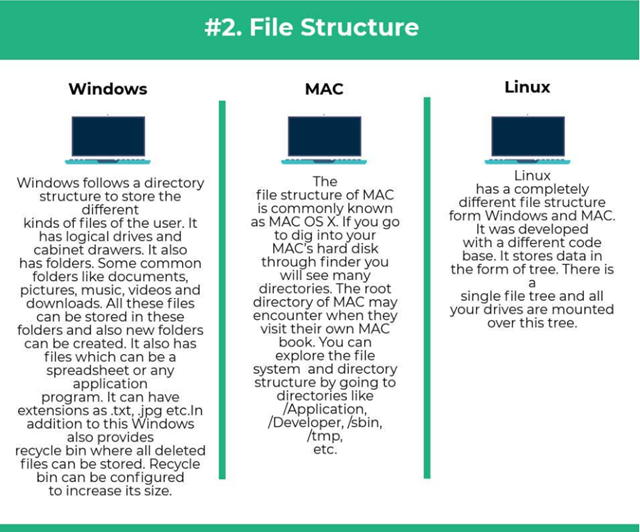
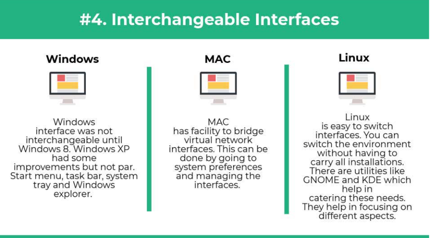
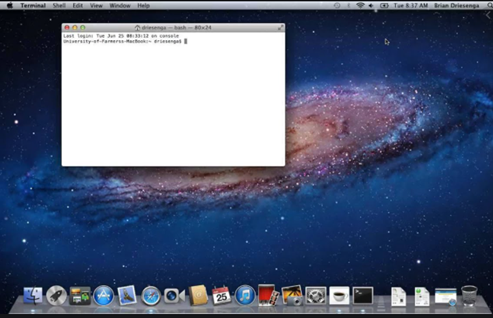

<!-- _backgroundColor: aquq -->

<!-- _color: orange -->

<!-- paginate: false -->

## CE103 Algorithms and Programming I

## Week-1 (Intro)

#### Fall Semester, 2021-2022

Download [DOC](ce103-week-1-intro.tr.md_doc.pdf), [SLIDE](ce103-week-1-intro.tr.md_slide.pdf), [PPTX](ce103-week-1-intro.tr.md_slide.pptx)

<iframe width=700, height=500 frameBorder=0 src="../ce103-week-1-intro.tr.md_slide.html"></iframe>

---

## Brief Description of Course and Rules

We will first talk about, 

1. Course Plan and Communication

2. Grading System, Homework,s and Exams

please read the syllabus carefully. 

---

## Computer Engineering Roles

- Software Development

- Hardware Development

- Network Organization and Management

- Database Organization and Management

- Hardware and Software Testing

- Audit (Cyber Security, Policy etc.)

- Etc.

---

<!-- paginate: true -->

## Computer Engineering Areas

- Computer Vision

- Social

- Analytics 

- Mobility

---

- IoT

- Security

- Web-Scale IT

- Cloud

---

- Smart Machines

- Pervasive

- Fintech

- Etc.

---

## Our focus is Software Development

for this reason, we will focus on software-based road-maps

we can use common developer road maps from

https://roadmap.sh/

---

## What will you see in the roadmap?

- [Frontend]([Frontend Developer Roadmap: Learn to become a modern frontend developer](https://roadmap.sh/frontend))

- [Backend]([Backend Developer Roadmap: Learn to become a modern backend developer](https://roadmap.sh/backend))

- [DevOps]([DevOps Roadmap: Learn to become a DevOps Engineer or SRE](https://roadmap.sh/devops))

- [DBA]([DBA Roadmap: Learn to become a database administrator with PostgreSQL](https://roadmap.sh/postgresql-dba))

and [more](https://roadmap.sh/)

---

## Also, you need soft skills

- Excellent written and oral communication skills, including public speaking and presenting
- Decisiveness under pressure and strong critical thinking skills
- Willingness to work off-core-hours, when necessary, to deploy software or upgrade hardware

---

## If you need more information about your profession

Visit Job Search Web Portals and Look at Requirements to Understand What is Real Life Need

- https://www.kariyer.net/

- https://www.yenibiris.com/

- https://www.secretcv.com/

- https://www.linkedin.com/

- Etc.

---

## Using Google

---

## Operating System List

---

## Operating System Architecture

[reference](https://www.cs.uic.edu/~jbell/CourseNotes/OperatingSystems/2_Structures.html)

---

## Operating Systems Key Comparing Factor

[reference](https://www.slideshare.net/quanhan503/comparing-windows-vs-mac-vs-linux)

---

## Operating System Comparisons

[reference](https://www.educba.com/linux-vs-mac-vs-windows/)

---

---

---

---

---

---

## Intro to the Internet

---

## What is IP Address?

---

---

---

## What is Port?

In [computer networking](https://en.wikipedia.org/wiki/Computer_networking), a port is a communication endpoint. At the software level, within an [operating system](https://en.wikipedia.org/wiki/Operating_system), a port is a logical construct that identifies a specific [process](https://en.wikipedia.org/wiki/Process_(computing)) or a type of [network service](https://en.wikipedia.org/wiki/Network_service). A port is identified for each [transport protocol](https://en.wikipedia.org/wiki/Transport_protocol) and address combination by a 16-bit [unsigned number](https://en.wikipedia.org/wiki/Unsigned_number), known as the port number.
The most common transport protocols that use port numbers are the [Transmission
Control Protocol](https://en.wikipedia.org/wiki/Transmission_Control_Protocol) (TCP) and the [User Datagram Protocol](https://en.wikipedia.org/wiki/User_Datagram_Protocol) (UDP).

[reference](https://en.wikipedia.org/wiki/Port_(computer_networking))

---

---

## What is Port Forwarding and NAT

---

https://www.networkantics.com/sonicwall-port-forwarding/

https://en.wikipedia.org/wiki/Network_address_translation

---

## What is Internet Packet (IP)

---

## What is Domain Name Server (DNS)?

---

## The Submarine Cable Map

https://www.submarinecablemap.com/

---

## Introduction to the command line interface

Reference Books

[Bash Notes For Professionals](files/BashNotesForProfessionals.pdf) 
[Linux Notes For Professionals](files/LinuxNotesForProfessionals.pdf)
[PowerShell Notes For Professionals](files/PowerShellNotesForProfessionals.pdf)

---

## What is the command line?

The window, which is usually called the **command line** or **command-line interface**, is a text-based application for viewing, handling, and manipulating files on your computer. It's much like Windows Explorer or Finder on the Mac, but without the graphical interface. Other names for the command line are: 

`cmd, CLI, prompt, console or terminal `

While there are many commands you can use with CLI, they all fall into <u>two categories</u>:

- The commands that handle the processes

- The commands that handle the files

[reference]([Introduction to command line · HonKit](https://tutorial.djangogirls.org/en/intro_to_command_line/))

---

## Why Would You Use CLI over GUI?

---

- Less Resource
  It is not a secret that the text-based program needs very little resources of your computer. This means that with CLI you can do similar tasks with minimum resources.

---

- High Precision
  You can use a specific command to target specific destinations with ease. As long as you don’t type the wrong command, it will work like a charm. Once you learn the basics, writing syntax is not as hard as you might think.

---

- Repetitive Tasks Friendly
  GUI has developed well over the years. But, the operating system may not give you all the menus and buttons to perform all tasks. One of the reasons is safety. This leaves you overwhelmed if you have to do repetitive tasks. For example, when you have to handle hundreds of files within a folder, CLI enables you to use a single command to do automate the repetition easily.

---

- Powerful
  Most operating systems today prevent you from messing up the system’s core process. Windows has system protection and MacOS has SIP (System Integrity Protection). You won’t be able to perform certain tasks which are system protected. However, with CLI, you will have full control over your system.

---

## Open the command-line interface (Windows)

- Go to the Start menu or screen, and enter "Command Prompt" in the search field.

- Go to Start menu → Windows System → Command Prompt.

- Go to Start menu → All Programs → Accessories → Command Prompt.

- Go to the Start screen, hover your mouse in the lower-left corner of the screen, and click the down arrow that appears (on a touch screen, instead flick up from the bottom of the screen). The Apps page should open. Click on Command Prompt in the Windows System section.

- Hold the special Windows key on your keyboard and press the "X" key. Choose "Command Prompt" from the pop-up menu.

- Hold the Windows key and press the "R" key to get a "Run" window. Type "cmd" in the box, and click the OK key.

---

---

---

---

---

---

## Open the command-line interface (Linux)

 It's probably under 

- Applications → Accessories → Terminal,  
  or 
- Applications → System → Terminal, 
  but that may depend on your system. 
  If it's not there, you can try to Google it. :)

---

---

## Open the command-line interface (MacOS)

- Go to Applications → Utilities → Terminal

---

## Reference

Network_address_translation

[GitHub - kamranahmedse/developer-roadmap: Roadmap to becoming a web developer in 2021](https://github.com/kamranahmedse/developer-roadmap)

[GitHub - jwasham/coding-interview-university: A complete computer science study plan to become a software engineer.](https://github.com/jwasham/coding-interview-university)

[GitHub - sindresorhus/awesome: 😎 Awesome lists about all kinds of interesting topics](https://github.com/sindresorhus/awesome)