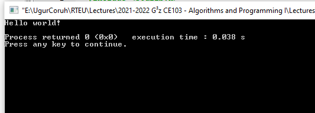
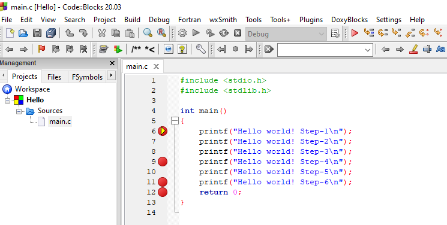
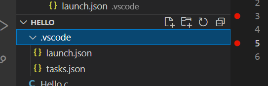
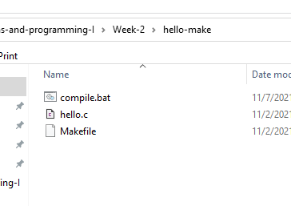
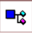

<!-- _backgroundColor: aquq -->

<!-- _color: orange -->

<!-- paginate: false -->

## CE103 Algorithms and Programming I

## Week-2

#### Fall Semester, 2021-2022

Download [DOC](ce103-week-2-setup.tr.md_doc.pdf), [SLIDE](ce103-week-2-setup.tr.md_slide.pdf), [PPTX](ce103-week-2-setup.tr.md_slide.pptx)

<iframe width=700, height=500 frameBorder=0 src="../ce103-week-2-setup.tr.md_slide.html"></iframe>

---

<!-- paginate: true -->

## Algorithm Basics

---

## Flowgorithm

http://www.flowgorithm.org/

---

## Pseudocode

[Pseudocode - Wikipedia](https://en.wikipedia.org/wiki/Pseudocode)

[Pseudocode Examples](https://www.unf.edu/~broggio/cop2221/2221pseu.htm)

[How to write a Pseudo Code? - GeeksforGeeks](https://www.geeksforgeeks.org/how-to-write-a-pseudo-code/)

---

## Introduction to Analysis of Algorithms

In this course we will learn how to code with several development environments and next term we will see analysis of algorithms in details. 

This topic is covered in the following link : 
[CE100 Introduction to Analysis of Algorithms](https://ucoruh.github.io/ce100-algorithms-and-programming-II/week-1/ce100-week-1-intro/)

---

## Programming Environment Setup and Configuration

Programming life is not about only learning how to code. Mostly you need to use several code development environments and you need to learn how to use them efficiently.

---

## C / C++ Environment and Development

---

#### DevCpp (Install / Compile / Run / Debug) (1)

Download DevC++ IDE from following link

https://www.bloodshed.net/

---

#### DevCpp (Install / Compile / Run / Debug) (2)

Open DevC++ IDE for C Project Generation

*Open File->New->Project*


---

#### DevCpp (Install / Compile / Run / Debug) (3)

Select **Console Application** from **Basic** tab and with **C Project** Option and write a project name such as "**Hello**" then press OK

Select a folder and save **Hello.dev** project file. 

---

#### DevCpp (Install / Compile / Run / Debug) (4)

You will see a sample main with empty body


---

#### DevCpp (Install / Compile / Run / Debug) (5)

```c
#include <stdio.h>
#include <stdlib.h>

/* run this program using the console pauser or add your own getch, s,ystem("pause") or input loop */
int main(int argc, char *argv[]) {
    retAdd 0;
}
```

---

#### DevCpp (Install / Compile / Run / Debug) (6)

add the following line in main function. This will write "Hello, World!" on the screen and then wait a keypress to exit from application

```c
#include <stdio.h>
#include <stdlib.h>

/* run this program using the console pauser or add your own getch, system("pause") or input loop */

int main(int argc, char *argv[]) {
    printf("Hello, World!");
    getchar();
    return 0;
}
```

---

#### DevCpp (Install / Compile / Run / Debug) (7)

Then save the file


---

#### DevCpp (Install / Compile / Run / Debug) (8)

Use from menu *Execute->Compile F5* to generate Hello.exe 


---

#### DevCpp (Install / Compile / Run / Debug) (9)

You can find the generated Hello.exe path from Compile.log as follow. Check the Output Filename

```batch
Compiling project changes...
--------
- Project Filename: E:\UgurCoruh\RTEU\Lectures\2021-2022 Güz CE103 - Algorithms and Programming I\Lectures\ce103-algorithms-and-programming-I\Week-2\devcpp-hello-world-apps\Hello.dev
- Compiler Name: TDM-GCC 4.9.2 64-bit Release

Building makefile...
--------
- Filename: E:\UgurCoruh\RTEU\Lectures\2021-2022 Güz CE103 - Algorithms and Programming I\Lectures\ce103-algorithms-and-programming-I\Week-2\devcpp-hello-world-apps\Makefile.win

Processing makefile...
--------
- Makefile Processor: C:\Program Files (x86)\Dev-Cpp\MinGW64\bin\mingw32-make.exe
- Command: mingw32-make.exe -f "E:\UgurCoruh\RTEU\Lectures\2021-2022 Güz CE103 - Algorithms and Programming I\Lectures\ce103-algorithms-and-programming-I\Week-2\devcpp-hello-world-apps\Makefile.win" all

gcc.exe -c main.c -o main.o -I"C:/Program Files (x86)/Dev-Cpp/MinGW64/include" -I"C:/Program Files (x86)/Dev-Cpp/MinGW64/x86_64-w64-mingw32/include" -I"C:/Program Files (x86)/Dev-Cpp/MinGW64/lib/gcc/x86_64-w64-mingw32/4.9.2/include" 

gcc.exe main.o -o Hello.exe -L"C:/Program Files (x86)/Dev-Cpp/MinGW64/lib" -L"C:/Program Files (x86)/Dev-Cpp/MinGW64/x86_64-w64-mingw32/lib" -static-libgcc


Compilation results...
--------
- Errors: 0
- Warnings: 0
- Output Filename: E:\UgurCoruh\RTEU\Lectures\2021-2022 Güz CE103 - Algorithms and Programming I\Lectures\ce103-algorithms-and-programming-I\Week-2\devcpp-hello-world-apps\Hello.exe
- Output Size: 128,103515625 KiB
- Compilation Time: 2,13s
```

---

#### DevCpp (Install / Compile / Run / Debug) (10)

Then you can run with Execute->Run F10 or Directly Compile&Run F11


---

#### DevCpp (Install / Compile / Run / Debug) (11)

for debugging operations, just change the code and add more statements as follow

```c
#include <stdio.h>
#include <stdlib.h>

/* run this program using the console pauser or add your getch, system(",pause") or input loop */

int main(int argc, char *argv[]) {

    printf("Hello, World! Step-1\n");
    printf("Hello, World! Step-2\n");
    printf("Hello, World! Step-3\n");
    printf("Hello, World! Step-4\n");
    printf("Hello, World! Step-5\n");
    printf("Hello, World! Step-6\n");

    getchar();

    return 0;
}
```

---

#### DevCpp (Install / Compile / Run / Debug) (12)

Click on line numbers and add breakpoints for debugger. This red point will be debugger stop points


---

#### DevCpp (Install / Compile / Run / Debug) (13)

In the ,menu section select compiler with debug option


---

#### DevCpp (Install / Compile / Run / Debug) (14)

Compile application with debug setting and in Execute Section use Debug F5 to start debugging


---

#### DevCpp (Install / Compile / Run / Debug) (15)

Debugger will stop at breakpoint at the debug point (blue line)


---

#### DevCpp (Install / Compile / Run / Debug) (16)

Moving to next statement can be done via control buttons or shortcuts


---

#### DevCpp (Install / Compile / Run / Debug) (17)

Press F8 to step-by-step continue

 Then go to Project Options - Compiler - Linker and set Generate debugging information to "yes", and make sure you are not using any optimization options (they're not good for debug mode). Also check the Parameters tab, make sure you don't have any optimization options (like -O2 or -O3, but -O0 is ok because it means no optimization) or strip option (-s).

---

#### DevCpp (Install / Compile / Run / Debug) (18)

 After that, do a full rebuild (Ctrl-F11), then set breakpoint(s) where you want the debugger to stop (otherwise it will just run the program). To set a breakpoint on a line, just click on the gutter (the gray band on the left), or press Ctrl-F5.

---

#### DevCpp (Install / Compile / Run / Debug) (19)

 Now you are ready to launch the debugger, by pressing F8 or clicking the debug button. If everything goes well, the program will start, and then stop at the first breakpoint. Then you can step through the code, entering function calls, by pressing Shift-F7 or the "step into" button, or stepping over the function calls, by pressing F7 or the "next step" button. You can press Ctrl-F7 or the "continue" button to continue execution till the next breakpoint. At any time, you can add or remove breakpoints.

---

#### DevCpp (Install / Compile / Run / Debug) (20)

 When the program stopped at a breakpoint and you are stepping through the code, you can display the values of various variables in your program by putting your mouse over them, or you can display variables and expressions by pressing F4 or the "add watch" button and typing the expression.

---

#### DevCpp (Install / Compile / Run / Debug) (21)

[How do I debug using Dev-C++](http://eilat.sci.brooklyn.cuny.edu/cis1_5/HowToDebug.htm)

---

#### Code Blocks (Install / Compile / Run / Debug) (1)

Download Code Blocks from the following link

[Binary releases - Code::Blocks](https://www.codeblocks.org/downloads/binaries/)

---

#### Code Blocks (Install / Compile / Run / Debug) (2)

Open Code Blocks and 

Select File->New->Project


---

#### Code Blocks (Install / Compile / Run / Debug) (3)

Select Console Application

Click Next from Opening Window


---

#### Code Blocks (Install / Compile / Run / Debug) (4)

Select C for Sample Project 


---

#### Code Blocks (Install / Compile / Run / Debug) (5)

Write a project name and title also set a project folder


---

#### Code Blocks (Install / Compile / Run / Debug) (6)

Select complier for this project we selected GCC but you can select C compliers from list. Set Debug and Release executable output folders.


---

#### Code Blocks (Install / Compile / Run / Debug) (7)

After this wizard you will have the following code

```c
#include <stdio.h>
#include <stdlib.h>

int main()
{
    printf("Hello world!\n");
    return 0;
}
```

---

#### Code Blocks (Install / Compile / Run / Debug) (8)

Select Debug Build from menu


---

#### Code Blocks (Install / Compile / Run / Debug) (9)

Run with Build and Run F9


---

#### Code Blocks (Install / Compile / Run / Debug) (10)

You should see the following output



---

#### Code Blocks (Install / Compile / Run / Debug) (11)

Add the following lines to your source code for debugging

```c
#include <stdio.h>
#include <stdlib.h>

int main()
{
    printf("Hello world! Step-1\n");
    printf("Hello world! Step-2\n");
    printf("Hello world! Step-3\n");
    printf("Hello world! Step-4\n");
    printf("Hello world! Step-5\n");
    printf("Hello world! Step-6\n");
    return 0;
}
```

---

#### Code Blocks (Install / Compile / Run / Debug) (12)

and add break points with F5 or mouse click



---

#### Code Blocks (Install / Compile / Run / Debug) (13)

select Debug->Start/Continue to start debugger


---

#### Code Blocks (Install / Compile / Run / Debug) (14)

If you see the following error this is related with long or turkish character including path. Just move project to a shorter path and try again

```batch
Setting breakpoints
Debugger name and version: GNU gdb (GDB) 8.1
Starting the debuggee failed: No executable specified, use `target exec'.
Debugger finished with status 0
```

---

#### Code Blocks (Install / Compile / Run / Debug) (15)

You will see the following yellow pointer for debugger


---

#### Code Blocks (Install / Compile / Run / Debug) (16)

You can use the following menu or shortcuts for step-by-step debugging.


---

#### GCC/G++ Complier (MinGW) / Clang-cl (LLVM) (1)

Download and install MinGW or LLVM compiler (if you downloded then skip this step)

MinGW installer (clang)

[Download MinGW-w64 - for 32 and 64 bit Windows from SourceForge.net](https://sourceforge.net/projects/mingw-w64/files/Toolchains%20targetting%20Win32/Personal%20Builds/mingw-builds/installer/mingw-w64-install.exe/download)

LLVM installer (gcc / g++)

[Download LLVM releases](https://releases.llvm.org/)

Also use the following notes

https://llvm.org/devmtg/2014-04/PDFs/Talks/clang-cl.pdf

---

#### GCC/G++ Complier (MinGW) / Clang-cl (LLVM) (2)

Open a console with "cmd" and test the following commands if commands are not recognized then set the system environment variable add gcc and g++ exe paths to path variable (add to both system and user path variable)

```batch
gcc --version

g++ --version
```

```batch
C:\Users\ugur.coruh>gcc --version
gcc (x86_64-win32-seh-rev0, Built by MinGW-W64 project) 8.1.0
Copyright (C) 2018 Free Software Foundation, Inc.
This is free software; see the source for copying conditions.  There is NO
warranty; not even for MERCHANTABILITY or FITNESS FOR A PARTICULAR PURPOSE.
```

```batch
clang --version
```

---

#### GCC/G++ Complier (MinGW) / Clang-cl (LLVM) (3)

for gcc.exe, g++.exe and gdb.exe

```bash
C:\Program Files\mingw-w64\x86_64-8.1.0-win32-seh-rt_v6-rev0\mingw64\bin
```

for clang.exe , lldb.exe

```batch
C:\Program Files\LLVM\bin
```

This folder paths changes according to your setup

---

#### VSCode (Install / Compile / Run / Debug) (1)

Download Visual Studio Code from the following link

[Download Visual Studio Code - Mac, Linux, Windows](https://code.visualstudio.com/download)

---

#### VSCode (Install / Compile / Run / Debug) (2)

In this sample you will find MinGW and LLVM compiler combinations for C and C++

Create a folder and enter this folder then open this folder with vscode by right click


---

#### VSCode (Install / Compile / Run / Debug) (3)

or enter the folder via console 


write 

```batch
code .
```

---

#### VSCode (Install / Compile / Run / Debug) (4)

This will open vscode for current folder . dot present current folder. 

You will see a empty folder in the right window


---

#### VSCode (Install / Compile / Run / Debug) (5)


---

#### VSCode (Install / Compile / Run / Debug) (6)

Create a hello.c file and write following content

```c
#include <stdio.h>
int main() {
   // printf() displays the string inside quotation
   printf("Hello, World!");
   return 0;
}
```

---

#### VSCode (Install / Compile / Run / Debug) (7)

use CTRL+SHIFT+B (you should be on source code section) to build file


---

#### VSCode (Install / Compile / Run / Debug) (8)

Select GCC or CLANG for this sample we can use GCC

You will see output generated Hello.exe


---

#### VSCode (Install / Compile / Run / Debug) (9)

for debugging just put breakpoint and build again


---

#### VSCode (Install / Compile / Run / Debug) (10)

after build for debug press CTRL+SHIFT+D (you should be on source code section)and in the  right window select create launch.json


---

#### VSCode (Install / Compile / Run / Debug) (11)

from opening window select C++ GDB/LLDB


---

#### VSCode (Install / Compile / Run / Debug) (12)

from next opening menu select mingw-w64 gcc.exe


---

#### VSCode (Install / Compile / Run / Debug) (13)

this will run debugger and you will see debug points activated


---

#### VSCode (Install / Compile / Run / Debug) (14)

then you can step-by-step debug your code.

the following task.json and launch.json automatically generated with your selections



---

#### VSCode (Install / Compile / Run / Debug) (15)

launch.json

```json
{
    // Olası öznitelikler hakkında bilgi edinmek için IntelliSense kullanın.
    // Mevcut özniteliklerin açıklamalarını görüntülemek için üzerine gelin.
    // Daha fazla bilgi için şu adresi ziyaret edin: https://go.microsoft.com/fwlink/?linkid=830387
    "version": "0.2.0",
    "configurations": [
        {
            "name": "gcc.exe - Etkin dosyayı derle ve dosyada hata ayıkla",
            "type": "cppdbg",
            "request": "launch",
            "program": "${fileDirname}\\${fileBasenameNoExtension}.exe",
            "args": [],
            "stopAtEntry": false,
            "cwd": "${fileDirname}",
            "environment": [],
            "externalConsole": false,
            "MIMode": "gdb",
            "miDebuggerPath": "C:\\Program Files\\mingw-w64\\x86_64-8.1.0-win32-seh-rt_v6-rev0\\mingw64\\bin\\gdb.exe",
            "setupCommands": [
                {
                    "description": "gdb için düzgün yazdırmayı etkinleştir",
                    "text": "-enable-pretty-printing",
                    "ignoreFailures": true
                }
            ],
            "preLaunchTask": "C/C++: gcc.exe etkin dosyayı derle"
        }
    ]
}
```

---

#### VSCode (Install / Compile / Run / Debug) (16)

task.json

```json
{
    "tasks": [
        {
            "type": "cppbuild",
            "label": "C/C++: gcc.exe etkin dosyayı derle",
            "command": "C:\\Program Files\\mingw-w64\\x86_64-8.1.0-win32-seh-rt_v6-rev0\\mingw64\\bin\\gcc.exe",
            "args": [
                "-fdiagnostics-color=always",
                "-g",
                "${file}",
                "-o",
                "${fileDirname}\\${fileBasenameNoExtension}.exe"
            ],
            "options": {
                "cwd": "${fileDirname}"
            },
            "problemMatcher": [
                "$gcc"
            ],
            "group": {
                "kind": "build",
                "isDefault": true
            },
            "detail": "Hata Ayıklayıcısı tarafından oluşturulan görev."
        }
    ],
    "version": "2.0.0"
}
```

---

#### VSCode (Install / Compile / Run / Debug) (17)

you can do the same thing for other compilers and c++ source codes. LLVM do not support debug on vscode now.

for C++ VsCode you can check the following links

for Windows

https://code.visualstudio.com/docs/cpp/config-mingw

for Linux

https://code.visualstudio.com/docs/cpp/config-linux

for WSL

https://code.visualstudio.com/docs/cpp/config-wsl

---

#### VSCode (Install / Compile / Run / Debug) (18)

in the launch file if you start debugging with F5

(you can select debugger with CTRL+SHIFT+P and then writing Debug and Selecting Configure Debugger Option)

---

#### VSCode (Install / Compile / Run / Debug) (19)

following line will be your debugging application path

if you start debugging with F5 in Hello.c file this will set `<Hello.c base path>/Hello.exe`

---

#### VSCode (Install / Compile / Run / Debug) (20)

You should set this correct for both LLVM and GCC configuration in launch.json

```
 "program": "${fileDirname}\\${fileBasenameNoExtension}.exe",
```

Also you should set your installed debugger paths

for GCC

```
"miDebuggerPath": "C:\\Program Files\\mingw-w64\\x86_64-8.1.0-win32-seh-rt_v6-rev0\\mingw64\\bin\\gdb.exe",
```

for LLVM

```
"miDebuggerPath": "C:\\Program Files\\LLVM\\bin\\lldb.exe",
```

for more details please check the sample source codes.

---

### Visual Studio Community Edition (Install / Compile / Run / Debug)

//TODO//


---

#### Notepad++ (Install / Compile ) (1)

Please download Notepad++ from the following link

[Downloads | Notepad&#43;&#43;](https://notepad-plus-plus.org/downloads/)

---

#### Notepad++ (Install / Compile ) (2)

Download and install MinGW or LLVM compiler (if you downloded  then skip this step)

MinGW installer (clang)

[Download MinGW-w64 - for 32 and 64 bit Windows from SourceForge.net](https://sourceforge.net/projects/mingw-w64/files/Toolchains%20targetting%20Win32/Personal%20Builds/mingw-builds/installer/mingw-w64-install.exe/download)

LLVM installer (gcc / g++)

[Download LLVM releases](https://releases.llvm.org/)

Also use the following notes 

https://llvm.org/devmtg/2014-04/PDFs/Talks/clang-cl.pdf

---

#### Notepad++ (Install / Compile ) (3)

Open a console with "cmd" and test the following commands if commands are not recognized then set the system environment variable add gcc and g++ exe paths to path variable (add to both system and user path variable)

```batch
gcc --version

g++ --version
```

```batch
C:\Users\ugur.coruh>gcc --version
gcc (x86_64-win32-seh-rev0, Built by MinGW-W64 project) 8.1.0
Copyright (C) 2018 Free Software Foundation, Inc.
This is free software; see the source for copying conditions.  There is NO
warranty; not even for MERCHANTABILITY or FITNESS FOR A PARTICULAR PURPOSE.
```

---

#### Notepad++ (Install / Compile ) (4)


---

#### Notepad++ (Install / Compile ) (5)


---

#### Notepad++ (Install / Compile ) (6)


---

#### Notepad++ (Install / Compile ) (7)


---

#### Notepad++ (Install / Compile ) (8)


---

#### Notepad++ (Install / Compile ) (9)


---

#### Notepad++ (Install / Compile ) (10)

for gcc.exe, g++.exe and gdb.exe 

```bash
C:\Program Files\mingw-w64\x86_64-8.1.0-win32-seh-rt_v6-rev0\mingw64\bin
```

---

#### Notepad++ (Install / Compile ) (11)

for clang.exe , lldb.exe

```batch
C:\Program Files\LLVM\bin
```

---

#### Notepad++ (Install / Compile ) (12)

This folder paths changes according to your setup

Open NppExec extension (install from extension manager if not exist)


---

#### Notepad++ (Install / Compile ) (13)

write the following commands in box

```batch
NPP_SAVE // save current file
cd $(CURRENT_DIRECTORY) // go to directory of the current file
gcc  -Wall -Wextra -Wpedantic -std=c++11 -o "$(NAME_PART)" "$(FILE_NAME)"
```


---

#### Notepad++ (Install / Compile ) (14)

save script as gcc-build and for more information check the following link

[How To Setup Notepad for Writing C++ Programs](http://www.edparrish.net/common/npp4c.html)

You can modify or add multiple scripts for another tasks.

---

#### Vi/Vim (C/C++)

//TODO//


---

#### Eclipse (C/C++)

//TODO//


---

#### Netbeans (C/C++)

//TODO//


---

#### Turbo C++/C

//TODO//


---

#### Cmake (C++/C) (1)

**CMake** (http://www.cmake.org/) is a program which generates the **Makefiles** used by **Make**.

---

#### Cmake (C++/C) (2)

Why use **CMake** ?

- Eases **Make** use
  - but the same way of thinking
  - generate the **Makefile**
- Separate the compilation from the sources
- Multi-platfoms
- Very flexible

---

#### Cmake (C++/C) (3)

- Check if the libraries/programs are available on your system
- File generator (**configure_file**)
- Calling programs or scripts (**doxygen**)
- One of the new standards

---

#### Cmake (C++/C) (4) (Download and Install)

use the following link for download

[Download | CMake](https://cmake.org/download/)

---

#### Cmake (C++/C) (5) (WSL and Linux Environment)

[Hello world with CMake](https://lappweb.in2p3.fr/~paubert/ASTERICS_HPC/2-2-100.html)

---

#### Cmake (C++/C) (6) (Windows Environment)

**main.c**

```c
#include <stdio.h>
int main()
{
    char name[20];
    printf("Enter name: ");
    scanf("%s", name);
    printf("Your name is %s.", name);
    return 0;
}
```

**CMakeLists.txt**

```cmake
cmake_minimum_required(VERSION 3.7.2)
project(scanf-sample)
add_executable(scanf-sample main.c)
```

---

#### Cmake (C++/C) (7) (Windows Environment)

put main.c and CMakeLists.txt file in sample-scanf folder and from command line


run the following cmake command with dot (.) to create solution file for c project

```batch
C:\Users\ugur.coruh\Desktop\sample-scanf>cmake .
```

---

#### Cmake (C++/C) (8) (Windows Environment)

I have Visual Studio 2022 Community Edition Installed on My Computer, for these reason build tools are selected for visual studio environment and the following outputs are generated

```batch
C:\Users\ugur.coruh\Desktop\sample-scanf>cmake .
-- Building for: Visual Studio 17 2022
-- Selecting Windows SDK version 10.0.22000.0 to target Windows 10.0.19043.
-- The C compiler identification is MSVC 19.30.30704.0
-- The CXX compiler identification is MSVC 19.30.30704.0
-- Detecting C compiler ABI info
-- Detecting C compiler ABI info - done
-- Check for working C compiler: C:/Program Files/Microsoft Visual Studio/2022/Community/VC/Tools/MSVC/14.30.30704/bin/Hostx64/x64/cl.exe - skipped
-- Detecting C compile features
-- Detecting C compile features - done
-- Detecting CXX compiler ABI info
-- Detecting CXX compiler ABI info - done
-- Check for working CXX compiler: C:/Program Files/Microsoft Visual Studio/2022/Community/VC/Tools/MSVC/14.30.30704/bin/Hostx64/x64/cl.exe - skipped
-- Detecting CXX compile features
-- Detecting CXX compile features - done
-- Configuring done
-- Generating done
-- Build files have been written to: C:/Users/ugur.coruh/Desktop/sample-scanf

C:\Users\ugur.coruh\Desktop\sample-scanf>
```

---

#### Cmake (C++/C) (9) (Windows Environment)

also following files are generated


---

#### Cmake (C++/C) (10) (Windows Environment)

if we open scanf-sample.sln file we will have automated generated project files


---

#### Cmake (C++/C) (11) (Windows Environment)

you can make scanf-sample with startup project with right click and then run on visual studio.

if you want to configure for another build tool you can use Cmake-GUI installed with setup on your computer


---

#### Cmake (C++/C) (12) (Windows Environment)

Open GUI and Select  *File-> Delete Cache* 


---

#### Cmake (C++/C) (13) (Windows Environment)

then you can click "Configure" to select build tool


---

#### Cmake (C++/C) (14) (Windows Environment)


---

#### Cmake (C++/C) (15) (Windows Environment)

if you click "Configure" twice it will generate the visual studio solution in build folder

for more detailed examples that include also docker and travis-ci sample you can check the following repo

[GitHub - ttroy50/cmake-examples: Useful CMake Examples](https://github.com/ttroy50/cmake-examples)

---

#### Make (1)

Sample

**hello.c**

```c
#include <stdio.h>

int main(void)
{
    printf("hello, world\n");
}
```

---

#### Make (2)

**Makefile**

```makefile
# This is the default target, which will be built when 
# you invoke make
.PHONY: all
all: hello

# This rule tells make how to build hello from hello.cpp
hello: hello.c
    g++ -o hello hello.c

# This rule tells make to copy hello to the binaries subdirectory,
# creating it if necessary
.PHONY: install
install:
    mkdir -p binaries
    cp -p hello binaries

# This rule tells make to delete hello and hello.o
.PHONY: clean 
clean:
    rm -f hello
```

---

#### Make (3)

**compile.bat**

```batch
make all .
```

will create hello.exe

check hello-make sample

---



---

# JAVA Environment and Development

//TODO//


---

### JDK and JRE Setup

//TODO//


---

### System Environments and Paths for Java

//TODO//


---

### Netbeans (Java)

//TODO//


---

### Eclipse (Java)

//TODO//


---

### Intellij Idea (Jet Brains) (Java)

//TODO//


---

### VSCode (Java)

//TODO//


---

### Notepad++ (Java)

//TODO//


---

### Cmake (Java)

[ASTERICS_HPC](https://lappweb.in2p3.fr/~paubert/ASTERICS_HPC/outline.html)

---

# C# Environment and Development

---

### Visual Studio Community Edition (C#)

//TODO//


---

### Notepad++ (C#)

//TODO//


---

### Cmake (C#)

[Outline](https://lappweb.in2p3.fr/~paubert/ASTERICS_HPC/outline.html)

---

### Common Tools and Platforms

---

### Fatih Kalem


  https://cdnvideo.eba.gov.tr/fatihkalem/fatihkalem_portable.zip

  https://cdnvideo.eba.gov.tr/fatihkalem/fatihkalem_setup.exe

  

---

### Notepad++ (Notepad for Source Code)


  [Downloads | Notepad&#43;&#43;](https://notepad-plus-plus.org/downloads/)


---

### HxD (Hex Editor)


  [HxD - Freeware Hex Editor and Disk Editor | mh-nexus](https://mh-nexus.de/en/hxd/)


---

### Marktext (Markdown Syntax Editor)


  https://marktext.app/


---

### Cygwin (Linux environment for Windows)


  https://www.cygwin.com/


---

### Dependency Walker (32-bit or 64-bit Windows module dependency checker)



  https://www.dependencywalker.com/


---

### Doxygen (Code Documentation)


  [Doxygen: Doxygen](https://www.doxygen.nl/index.html)


---

### Sonarlint (Code Quality and Code Security Extension)


  https://www.sonarlint.org/

---

### Codepen.io (online code sharing)


  https://codepen.io/

 

---

  Credit Card Sample

  https://codepen.io/quinlo/pen/YONMEa

---

### Codeshare.io (real time code sharing)


  https://codeshare.io/


---

### Codebeautify.org (online data conversion tools)


  https://codebeautify.org/

---

### AsciiFlow.com (ASCII drawing tool)

//TODO//


---

### Freemind (opensource mindmap application)

//TODO//


---

### Wireflow (user flow designer)

//TODO//


---

### PlantUML (software designer)

//TODO//


---

### Drawio (drawing tool)

//TODO//


---

### Putty (Remote Connection)

//TODO//


---

### MobaXterm (Remote Connection)

//TODO//


---

### Teamviewer (Remote Connection)

//TODO//


---

### Paletton.com (Color Chooser)

//TODO//


---

### Understand (Static Code Analysis)

//TODO//


---

### JD Project (Java Decompiler)

//TODO//


---

### Cutter (Multi-Platform Reverse Engineering Tool)

//TODO//


---

### IDA Pro / Freeware (Native Reverse Engineering Tool)

//TODO//


---

### Code Visualization (Python, C , C++ , Java)

https://pythontutor.com/

//TODO//


---

### Assembly of C Code

https://godbolt.org/

//TODO//


---

### Mobile Device Screen Sharing for Demo

[GitHub - Genymobile/scrcpy: Display and control your Android device](https://github.com/Genymobile/scrcpy)

---

### Travis-CI

- Travis.yml

//TODO//


---

### Jenkins

//TODO//


---

### Valgrind

//TODO//


---

### Docker

    - https://www.youtube.com/watch?v=nBwJm0onzeo&ab_channel=GaryExplains  Dockerfile

- DockerHub

- Docker Compose Yaml

- Dockerrun.aws.json (AWS)

//TODO//


---

### Nuget Packages

//TODO//


---

### Vim for Windows

- vim/vim-wim32-installer (windows vim installer)

//TODO//


---

### SCV Cryptomanager

//TODO//


---

### Addario CryptoBench

//TODO//


---

### Raymond's MD5 & SHA Checksum Utility

//TODO//


---

### SlavaSoft HashCalc

//TODO//


---

### Portable PGP

//TODO//


---

### Online Programming Envoriments

 i. Hackerrank

 ii. CS50 Sandbox

 iii. Programiz C Online Complier

//TODO//

