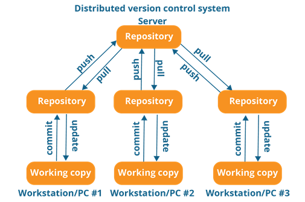
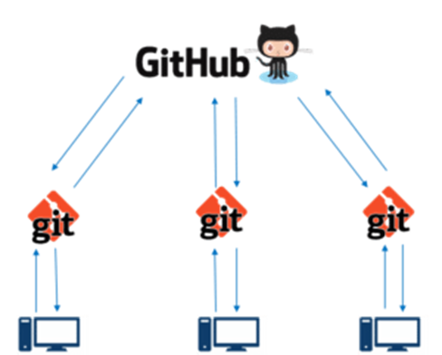
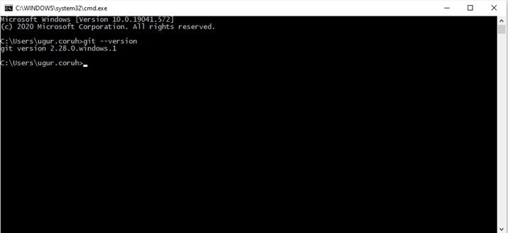
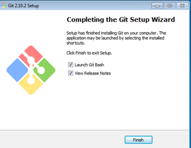
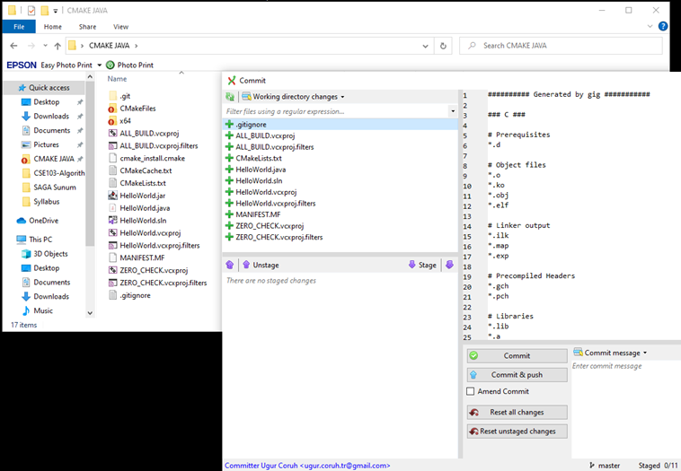
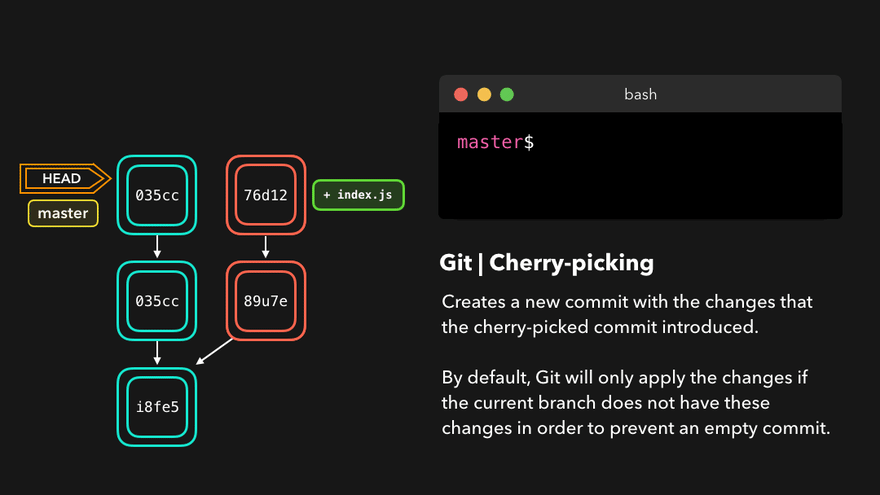
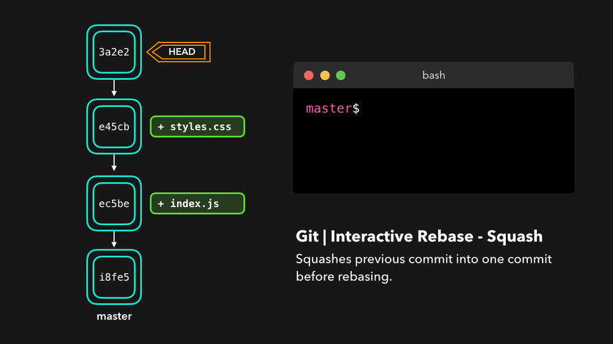
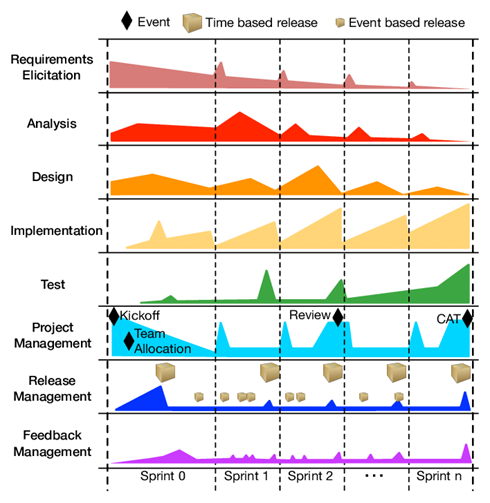

<!-- _backgroundColor: aquq -->

<!-- _color: orange -->

<!-- paginate: false -->

## CE103 Algorithms and Programming I

### Week-3

#### Introduction to Source Code Version Management Systems

Download [DOC](ce103-week-3-git.en.md_doc.pdf), [SLIDE](ce103-week-3-git.en.md_slide.pdf), [PPTX](ce103-week-3-git.en.md_slide.pptx)

<iframe width=700, height=500 frameBorder=0 src="../ce103-week-3-git.en.md_slide.html"></iframe>

---

<style scoped>section{ font-size: 25px; }</style>

<!-- paginate: true -->

#### Outline

- Introduction to Source Code Version Management Systems
- Features of Source Code Management Systems
- Why Do We Need Source Code Management Systems
- Centralized/Distrubuted Version Control Systems
- Introduction to Git
- Git Installation and Configuration

---

<style scoped>section{ font-size: 25px; }</style>

#### Outline

- Git Init Repository
- Git Add Files 
- Git Commit Changes
- Git Pull/Fetch Changes from Remote Repo
- Git Push Local Changes to Remote Repo
- Git Branching 
- Git Merging and Conflict Solving
- Git Rebasing
- Git Reset
- Git Logs and Monitoring 
- Git Decision Tree
- Git Visualize Logs

---

### Introduction to Source Code Version Management Systems

#### Git, Github, Gitlab, Bitbucket, Maven, SVN, TFS

Source code management (SCM) is used to track modifications to a source code repository. SCM tracks a running history of changes to a code base and helps resolve conflicts when merging updates from multiple contributors. SCM is also synonymous with Version control. 
As software projects grow in lines of code and contributor head count, the costs of communication overhead and management complexity also grow. SCM is a critical tool to alleviate the organizational strain of growing development costs.

---

<style scoped>section{ font-size: 25px; }</style>

### Features of Source Code Management Systems

- Authenticated access for commits

- Revision history on files

- Atomic commits of multiple files

- Versioning/Tagging

---

<style scoped>section{ font-size: 25px; }</style>

### Why Do We Need Source Code Management Systems? (1)

We can save the file with a different name if it’s our school project or one-time papers but for a well-equipped software development? Not a chance.

---

<style scoped>section{ font-size: 25px; }</style>

#### Why Do We Need Source Code Management Systems? (2)

Big projects need a version control system to track the changes and avoid misunderstanding. A good SCM does the following:

- Backup and Restore
- Synchronization
- Short-Term Undo
- Long-Term Undo
- Track Changes
- Ownership
- Branching and Merging

---

<style scoped>section{ font-size: 25px; }</style>

#### Why Do We Need Source Code Management Systems? (3)

**Backup and Restore** – Files can be saved at any moment and can be restored from the last saved.

---

<style scoped>section{ font-size: 25px; }</style>

#### Why Do We Need Source Code Management Systems? (4)

**Synchronization** – Programmers can get the latest code and fetch the up-to-date codes from the repository.

---

<style scoped>section{ font-size: 25px; }</style>

#### Why Do We Need Source Code Management Systems? (5)

**Short-Term Undo** – Working with a file and messed it up. We can do a short-term undo to the last known version.

---

<style scoped>section{ font-size: 25px; }</style>

#### Why Do We Need Source Code Management Systems? (6)

**Long-Term Undo** – It helps when we have to make a release version rollback. Something like going to the last version which was created a year

---

<style scoped>section{ font-size: 25px; }</style>

#### Why Do We Need Source Code Management Systems? (7)

**Track Changes**– We can track the changes as when anyone is making any change, he can leave a commit message as for why the change was done.

---

<style scoped>section{ font-size: 25px; }</style>

#### Why Do We Need Source Code Management Systems? (8)

**Ownership**– With every commit made to the master branch, it will ask the owner permission to merge it.

---

<style scoped>section{ font-size: 25px; }</style>

#### Why Do We Need Source Code Management Systems? (9)

**Branching and Merging** – You can create a branch of your source code and create the changes. Once the changes are approved, you can merge it with the master branch.

---

<style scoped>section{ font-size: 25px; }</style>

#### Why Do We Need Source Code Management Systems? (10)

## Types of Version Control Systems

- Centralized Version Control (TFS, Subversion)
- Distributed Version Control (Git and Mercurial)

---

<style scoped>section{ font-size: 25px; }</style>

### Centralized Version Control (TFS, Subversion) (1)

The main concept of Centralized Version Control is that it works in a client and server relationship. The repository is located in one place and allows access to multiple clients.

---

<style scoped>section{ font-size: 25px; }</style>

#### Centralized Version Control (TFS, Subversion) (2)


---

<style scoped>section{ font-size: 25px; }</style>

#### Centralized Version Control (TFS, Subversion) (3)


---

<style scoped>section{ font-size: 25px; }</style>

#### Centralized Version Control (TFS, Subversion) (4)

It’s very similar to FTP where you have FTP clients which connect to FTP server. Here all the user changes and commits have to pass through the central server. For Ex: Subversion.

---

<style scoped>section{ font-size: 25px; }</style>

#### Centralized Version Control (TFS, Subversion) (5)

**The benefits of centralized version control are:**

- It’s easy to understand.

- There are more GUI and IDE clients.

- You have more control over the users and access.

---

<style scoped>section{ font-size: 25px; }</style>

#### Centralized Version Control (TFS, Subversion) (6)

**We do have drawbacks also:**

- It is dependent on the access to the server.

- It can be slower because every command from the client has to pass the server.

- Branching and merging strategies are difficult to use.

---

<style scoped>section{ font-size: 25px; }</style>

### Distributed Version Control (Git and Mercurial) (1)

These systems are newer to use. In Distributed Version Control, each user has their own copy of the entire repository as well as the files and history. For Ex: Git and Mercurial

---

<style scoped>section{ font-size: 25px; }</style>

#### Distributed Version Control (Git and Mercurial) (2)



---

<style scoped>section{ font-size: 25px; }</style>

#### Distributed Version Control (Git and Mercurial) (3)


---

<style scoped>section{ font-size: 25px; }</style>

#### Distributed Version Control (Git and Mercurial) (4)

The benefits of distributed version control are:

- More powerful and easy change tracking.

- No need of a centralized server. Most of the functionalities work in offline mode also apart from sharing the repositories.

- Branching and Merging strategies are more easy and reliable.

- It’s faster than the other one.

---

<style scoped>section{ font-size: 25px; }</style>

### List of Source Code Version Management Tools (1)


---

<style scoped>section{ font-size: 25px; }</style>

#### List of Source Code Version Management Tools (2)

- Github

- GitLab

- BitBucket

- SourceForge

- Beanstalk

---

<style scoped>section{ font-size: 25px; }</style>

#### List of Source Code Version Management Tools (3)

- Apache Allura

- AWS CodeCommit

- Launchpad

- Phabricator

- GitBucket

---

<style scoped>section{ font-size: 25px; }</style>

### GIT (Distributed Source Code Management) (1)


---

<style scoped>section{ font-size: 25px; }</style>

#### GIT (Distributed Source Code Management) (2)


---

<style scoped>section{ font-size: 25px; }</style>

#### GIT (Distributed Source Code Management) (3)



---

<style scoped>section{ font-size: 25px; }</style>

#### GIT (Distributed Source Code Management) (4)


---

<style scoped>section{ font-size: 25px; }</style>

#### GIT (Distributed Source Code Management) (5)

##### A Basic Overview of How Git Works (1)

- Create a “repository” (project) with a git hosting tool (like Bitbucket)

- Copy (or clone) the repository to your local machine

- Add a file to your local repo and “commit” (save) the changes

- “Push” your changes to your master branch

---

<style scoped>section{ font-size: 25px; }</style>

#### GIT (Distributed Source Code Management) (6)

##### A Basic Overview of How Git Works (2)

- Make a change to your file with a git hosting tool and commit

- “Pull” the changes to your local machine

- Create a “branch” (version), make a change, commit the change

- Open a “pull request”.

- “Merge” your branch to the master branch

---

<style scoped>section{ font-size: 25px; }</style>

#### GIT (Distributed Source Code Management) (7)

##### Some of The Basic Operations in GIT are

- Initialize

- Add

- Commit

- Pull

- Push

---

<style scoped>section{ font-size: 25px; }</style>

#### GIT (Distributed Source Code Management) (8)

##### Some of The Basic Operations in GIT are


---

<style scoped>section{ font-size: 25px; }</style>

#### GIT (Distributed Source Code Management) (9)

##### Some of The Basic Operations in GIT are

- Branching

- Merging

- Rebasing

---

<style scoped>section{ font-size: 25px; }</style>

#### GIT (Distributed Source Code Management) (10)

##### Some of The Basic Operations in GIT are


---

<style scoped>section{ font-size: 25px; }</style>

#### GIT (Distributed Source Code Management) (8)

##### A brief idea about how these operations work with the Git repositories (1)


---

<style scoped>section{ font-size: 25px; }</style>

#### GIT (Distributed Source Code Management) (9)

##### A brief idea about how these operations work with the Git repositories (2)


---

<style scoped>section{ font-size: 25px; }</style>

#### GIT (Distributed Source Code Management) (10)

##### A brief idea about how these operations work with the Git repositories (3)

For more detailed cheetsheat please check the following interactive map

[NDP Software :: Git Cheatsheet](https://www.ndpsoftware.com/git-cheatsheet.html)


---

<style scoped>section{ font-size: 25px; }</style>

##### Installation of GIT (1)

Check Installation Already Completed

```git
git --version
```



---

<style scoped>section{ font-size: 25px; }</style>

##### Installation of GIT (2)

If your console gives error about git command follow the steps in the link

[Install Git | Atlassian Git Tutorial](https://www.atlassian.com/git/tutorials/install-git#windows)

In this link you will should download following setup according to your operating system

---

<style scoped>section{ font-size: 25px; }</style>

##### Installation of GIT (3)

##### GIT Setup Files

- [Download git for OSX](http://git-scm.com/download/mac)
- [Download git for Windows](http://msysgit.github.io/)
- [Download git for Linux](http://git-scm.com/book/en/Getting-Started-Installing-Git)

---

<style scoped>section{ font-size: 25px; }</style>

##### Installation of GIT (4)

- Download and install GIT from the following links (both have same github release path)

[Git - Downloads](https://git-scm.com/downloads)

---

<style scoped>section{ font-size: 25px; }</style>

##### Installation of GIT (5)

- After running setup follow the steps below


---

<style scoped>section{ font-size: 25px; }</style>

##### Installation of GIT (6)

- Select the following configurations


---

<style scoped>section{ font-size: 25px; }</style>

##### Installation of GIT (7)

- You can select to use git from Git Bash Only, Also you can use it from command-line by selecting second option. Third option override some Windows executable so your operating system can be affected from this selection. 


---

<style scoped>section{ font-size: 25px; }</style>

##### Installation of GIT (8)

- Git Credential Manager will be use to configure your remote connection.


---

<style scoped>section{ font-size: 25px; }</style>

##### Installation of GIT (9)


---

<style scoped>section{ font-size: 25px; }</style>

##### Installation of GIT (10)

- MSYS2 MinTTY provide better visual and colorful console outputs



---

<style scoped>section{ font-size: 25px; }</style>

#### Installation of GIT Extension (Windows) (1)

- Git user interface can be installed by the following applications
  
  - You can install Git GUI from https://git-scm.com/downloads/guis
  - I prefer to use git extension https://gitextensions.github.io/ 
  - and https://tortoisegit.org/ together

- Also Download KDiff3 [KDiff3 - Browse Files at SourceForge.net](https://sourceforge.net/projects/kdiff3/files/)

- These extensions provide GUI for git operations to make process easier.

---

#### Enter GIT Extension Configurations

<style scoped>section{ font-size: 25px; }</style>

Right click to any where on right click menu you will see git extension settings as follow


---

<style scoped>section{ font-size: 25px; }</style>

#### Configuration of GIT Extension (Windows) (1)

- Git extension provides you missing setups or wrong configurations. If everyting is green that mean everything should work perfectly.


---

<style scoped>section{ font-size: 25px; }</style>

##### Configuration of GIT Extension (Windows) (2)

- If you install git everything should be green and this configuration is stored on .gitconfig on your home `C:/Windows/Users/<user>/.gitconfig`

---

<style scoped>section{ font-size: 25px; }</style>

##### Configuration of GIT Extension (Windows) (3)

- You can use the following template and fix your settings. Git GUI edit this settings. But you can also edit them manually. 

---

<style scoped>section{ font-size: 25px; }</style>

##### Configuration of GIT Extension (Windows) (3)

**C:/Windows/Users/<user>/.gitconfig**

```bash
[core]
    editor = \"C:/Program Files (x86)/GitExtensions/GitExtensions.exe\" fileeditor
    autocrlf = true
    quotePath = false
    commitGraph = true
    longpaths = true
[user]
    email = xxxxxxx@gmail.com
    name = xxxx xxxxxx
[filter "lfs"]
    clean = git-lfs clean -- %f
    smudge = git-lfs smudge -- %f
    process = git-lfs filter-process
    required = true
[pull]
    rebase = false
[fetch]
    prune = false
[rebase]
    autoStash = false
[credential]
    helper = manager
[diff]
    guitool = kdiff3
[difftool "kdiff3"]
    path = C:/Program Files/KDiff3/kdiff3.exe
    cmd = \"C:/Program Files/KDiff3/kdiff3.exe\" \"$LOCAL\" \"$REMOTE\"
[merge]
    guitool = tortoisemerge
[mergetool "tortoisemerge"]
    path = C:/Program Files/TortoiseGit/bin/TortoiseGitMerge.exe
    cmd = \"C:/Program Files/TortoiseGit/bin/TortoiseGitMerge.exe\" -base:\"$BASE\" -mine:\"$LOCAL\" -theirs:\"$REMOTE\" -merged:\"$MERGED\"
[receive]
    advertisePushOptions = true
[gc]
    writeCommitGraph = true
```

---

<style scoped>section{ font-size: 25px; }</style>

##### Configuration of GIT Extension (Windows) (4)

- Also in extension you can see similar settings


---

<style scoped>section{ font-size: 25px; }</style>

##### Configuration of GIT Extension (Windows) (5)

Samples

MergeTool

```textile
tortoisemerge
```

Path to mergetool

```textile
C:/Program Files/TortoiseGit/bin/TortoiseGitMerge.exe
```

Mergetool command

```textile
"C:/Program Files/TortoiseGit/bin/TortoiseGitMerge.exe" -base:"$BASE" -mine:"$LOCAL" -theirs:"$REMOTE" -merged:"$MERGED"
```

---

<style scoped>section{ font-size: 25px; }</style>

##### Configuration of GIT Extension (Windows) (6)

Difftool

```textile
kdiff3
```

Path to difftool

```textile
C:/Program Files/KDiff3/kdiff3.exe
```

Difftool command

```textile
"C:/Program Files/KDiff3/kdiff3.exe" "$LOCAL" "$REMOTE"
```

---

<style scoped>section{ font-size: 25px; }</style>

##### Configuration of GIT Extension (Windows) (7)

- If you see something as merge and diff tool is not configured, follow the similar settings above on your computer. If you installed kdiff3, tortoisegit and extension you will have same diff and merge tools

- This topic also help you
  
  - [Git: How can I configure KDiff3 as a merge tool and diff tool? - Stack Overflow](https://stackoverflow.com/questions/33308482/git-how-can-i-configure-kdiff3-as-a-merge-tool-and-diff-tool)

---

<style scoped>section{ font-size: 25px; }</style>

##### Configuration of GIT Extension (Windows) (8)

- Merge, Diff and Shell Tool Configuration Missing.


---

<style scoped>section{ font-size: 25px; }</style>

##### Configuration of GIT Extension (Windows) (9)

- Open Git->Config, in your settings you will see path to mergetool and difftool will be empty fill settings like that below find executables in your computer and copy paths to here.

---

<style scoped>section{ font-size: 25px; }</style>

##### Configuration of GIT Extension (Windows) (10)


---

<style scoped>section{ font-size: 25px; }</style>

##### Configuration of GIT Extension (Windows) (11)

- Also if we want to change and use different diff and merge tool then we can do this with gitbash console as below

```bash
C:\Program Files\TortoiseGit\bin
```

- Find TortoiseGitIDiff.exe and TortoiseGitMerge.exe


---

<style scoped>section{ font-size: 25px; }</style>

##### Configuration of GIT Extension (Windows) (12)

- Copy path of this applications

```bash
C:\Program Files\TortoiseGit\bin\TortoiseGitMerge.exe
C:\Program Files\TortoiseGit\bin\TortoiseGitIDiff.exe
```

---

<style scoped>section{ font-size: 25px; }</style>

##### Configuration of GIT Extension (Windows) (13)

- Open a gitbash console and run following commands

```bash
git config --global merge.tool TortoiseGitMerge
git config --global mergetool.TortoiseGitMerge.path "C:/Program Files/TortoiseGit/bin/TortoiseGitMerge.exe"
git config --global mergetool.TortoiseGitMerge.trustExitCode false

git config --global diff.guitool TortoiseGitIDiff
git config --global difftool.TortoiseGitIDiff.path "C:/Program Files/TortoiseGit/bin/TortoiseGitIDiff.exe"
git config --global difftool.TortoiseGitIDiff.trustExitCode false
```

This updates will be stored on .gitconfig

---

<style scoped>section{ font-size: 25px; }</style>

#### Using the GIT Extension (1)

right click in the git folder and use Git Extension menu for operations.

for sample commit click "Commit"


---

<style scoped>section{ font-size: 25px; }</style>

#### Using the GIT Extension (1)

from opening window first stage related files and then write a good commit message

finally click commit to local. You can also commit&push it to remote repository.


---

<style scoped>section{ font-size: 25px; }</style>

### GIT Installation Completed..


---

<style scoped>section{ font-size: 25px; }</style>

### Installation of gig (git ignore creator) (1)

Requirements

- Python >= 3.6

- Internet connection

https://github.com/sloria/gig

```bash
pip install -U gig
```

---

<style scoped>section{ font-size: 25px; }</style>

#### Installation of gig (git ignore creator) (2)


---

<style scoped>section{ font-size: 25px; }</style>

#### Installation of gig (git ignore creator) (3)

```bash
gig --version
```

---

<style scoped>section{ font-size: 25px; }</style>

### Usage of gig (1)

List all gitignore templates

```bash
gig list
gig list -global
```

---

<style scoped>section{ font-size: 25px; }</style>

#### Usage of gig (2)

Sample gitignore for C Java and Visual Studio

```bat
gig C Java VisualStudio > .gitignore
```

---

<style scoped>section{ font-size: 25px; }</style>

#### Usage of gig (3)

There is a portal for this also by Toptal

•[gitignore.io - Create Useful .gitignore Files For Your Project](https://www.toptal.com/developers/gitignore)


---

<style scoped>section{ font-size: 25px; }</style>

#### Usage of gig (4)

for samples you can check the following links.

https://github.com/github/gitignore

https://dev.to/shihanng/gig-a-gitignore-generator-opc

---

<style scoped>section{ font-size: 25px; }</style>

### Configuration of GIT (1)

It is important to configure your Git because any commits that you
make are associated with your configuration details.

configuring Git with your username and email. In order to do that, type the following commands in your Git Bash:

```git
git config - - global user.name "<your name>"

git config - - global user.email "<your email>"
```

---

<style scoped>section{ font-size: 25px; }</style>

#### Configuration of GIT (2)


---

<style scoped>section{ font-size: 25px; }</style>

#### Configuration of GIT (3)

git configuration files are located on the user folder


---

<style scoped>section{ font-size: 25px; }</style>

#### Configuration of GIT (4)

If you want to view all your configuration details, use the command below

```git
git config --list
```


---

<style scoped>section{ font-size: 25px; }</style>

### Using .gitignore files with git-extension (1)

with gitignore file



---

<style scoped>section{ font-size: 25px; }</style>

### Using .gitignore files with git-extension (2)

without gitignore file (just move to another location)


---

<style scoped>section{ font-size: 25px; }</style>

### Github Create Repo


---

<style scoped>section{ font-size: 25px; }</style>

### Initilization of Repo (not existing in github)

#### git init

- In order to do that, we use the command **git init**.

- **git init** creates an empty Git repository or re-initializes an existing one. It basically creates a **.git** directory with sub directories and template files. Running a **git init** in an existing repository will not overwrite things that are already there. It rather picks up the newly added templates.

```bash
git init
```

---

<style scoped>section{ font-size: 25px; }</style>

#### git init


---

<style scoped>section{ font-size: 25px; }</style>

### Adding Initiated Repo Remote Upstream Repo (Link with Github Repo) (1)

- If you enter following command in the git folder you will see nothing

```bash
git remote -v
```

- That mean this repository do not have a remote upstream repository such as a github or bitbucket repo.

---

<style scoped>section{ font-size: 25px; }</style>

#### Adding Initiated Repo Remote Upstream Repo (Link with Github Repo) (2)

Open the github and bitbucket repository and copy project path from


---

<style scoped>section{ font-size: 25px; }</style>

#### Adding Initiated Repo Remote Upstream Repo (Link with Github Repo) (3)

you will see the following sample from github code button

```bash
https://github.com/ucoruh/ce103-sample-text.git
```

---

<style scoped>section{ font-size: 25px; }</style>

#### Adding Initiated Repo Remote Upstream Repo (Link with Github Repo) (4)

copy link and use with following command

```bash
git remote add origin https://github.com/ucoruh/ce103-sample-text.git
```

---

<style scoped>section{ font-size: 25px; }</style>

#### Adding Initiated Repo Remote Upstream Repo (Link with Github Repo) (5)

then you can check your remote setting with

```bash
git remote -v
origin  https://github.com/ucoruh/ce103-sample-text.git (fetch)
origin  https://github.com/ucoruh/ce103-sample-text.git (push)
```

---

<style scoped>section{ font-size: 25px; }</style>

#### Adding Initiated Repo Remote Upstream Repo (Link with Github Repo) (6)

you can check the following sample

[How to Add a New Remote to your Git Repo | Assembla Help Center](https://articles.assembla.com/en/articles/1136998-how-to-add-a-new-remote-to-your-git-repo)

---

<style scoped>section{ font-size: 25px; }</style>

### _Now you can push your local changes to remote repository_

### _If you see a repository on Github then you can download with following operation_

---

<style scoped>section{ font-size: 25px; }</style>

### Checkout a Repository (1)

create a working copy of a local repository by running the command

```bash
git clone /path/to/repository
```

---

<style scoped>section{ font-size: 25px; }</style>

### Checkout a Repository (2)

Sample clone command

```bash
git clone https://github.com/ucoruh/ce103-sample-text.git
```

---

<style scoped>section{ font-size: 25px; }</style>

### Checkout a Repository (3)

when using a remote server, your command will be

```bash
git clone username@host:/path/to/repository
```

### Checking Repository Status (1)

#### git status

The git status command lists all the modified files which are ready to be added to the local repository.

```bash
git status
```

---

<style scoped>section{ font-size: 25px; }</style>

### Checking Repository Status (2)

#### git status


---

<style scoped>section{ font-size: 25px; }</style>

### Adding Files to Index (1)

#### git add

This command updates the index using the current content found in the working tree
and then prepares the content in the staging area for the next commit.

```bash
git add <directory>
git add <file>
git add *
```

---

<style scoped>section{ font-size: 25px; }</style>

### Adding Files to Index (1)

#### git add

Created two more files edureka3.txt and edureka4.txt. Let us add the files using the command git add -A. This command will add all the files to the index which are in the directory but not updated in the index yet.


---

<style scoped>section{ font-size: 25px; }</style>

### Commit Changes (1)

#### git commit

- It refers to recording snapshots of the repository at a given time. Committed
  snapshots will never change unless done explicitly.

---

<style scoped>section{ font-size: 25px; }</style>

### Commit Changes (2)

#### git commit

- Let me explain how commit works with the diagram below


- Here, C1 is the initial commit, i.e. the snapshot of the first change from which
  another snapshot is created with changes named C2. Note that the master points
  to the latest commit. Now, when I commit again, another snapshot C3 is created and now the master points to C3 instead of C2.

---

<style scoped>section{ font-size: 25px; }</style>

### Commit Changes (3)

#### git commit

- Commands:

```bash
git commit -m "<message>"
```


- Now, if you want to commit a snapshot of all the changes in the working directory at
  once, you can use the command below

---

<style scoped>section{ font-size: 25px; }</style>

### Commit Changes (4)

#### git commit

- Please check writing good commit messages article below
  - [How to write a good commit message - DEV Community](https://dev.to/chrissiemhrk/git-commit-message-5e21)

---

<style scoped>section{ font-size: 25px; }</style>

### Writing Good Commit Messages (1)

```
type: subject

body (optional)

footer (optional)
```

---

<style scoped>section{ font-size: 25px; }</style>

#### Writing Good Commit Messages (2)

##### 1. Type

- **feat** - a new feature
- **fix** - a bug fix
- **docs** - changes in documentation
- **style** - everything related to styling
- **refactor** - code changes that neither fixes a bug or adds a feature
- **test** - everything related to testing
- **chore** - updating build tasks, package manager configs, etc

---

<style scoped>section{ font-size: 25px; }</style>

#### Writing Good Commit Messages (3)

##### 2. Subject

This contains a short description of the changes made. It shouldn't be greater than 50 characters, should begin with a capital letter and written in the imperative eg. Add instead of Added or Adds.

---

<style scoped>section{ font-size: 25px; }</style>

#### Writing Good Commit Messages (4)

##### 3. Body

The body is used to explain what changes you made and why you made them. Not all commits are complex enough that they need a body, especially if you are working on a personal project alone, and as such writing a body is optional.

A blank line between the body and the subject is required and each line should have no more than 72 characters.

---

<style scoped>section{ font-size: 25px; }</style>

#### Writing Good Commit Messages (5)

##### 4.Footer

The footer is also optional and mainly used when you are using an issue tracker to reference the issue ID.

---

<style scoped>section{ font-size: 20px; }</style>

#### Writing Good Commit Messages (6)

##### Example Commit Message

```git
feat: Summarize changes in around 50 characters or less

More detailed explanatory text, if necessary. Wrap it to about 72
characters or so. In some contexts, the first line is treated as the
subject of the commit and the rest of the text as the body. The
blank line separating the summary from the body is critical (unless
you omit the body entirely); various tools like `log`, `shortlog`
and `rebase` can get confused if you run the two together.

Explain the problem that this commit is solving. Focus on why you
are making this change as opposed to how (the code explains that).
Are there side effects or other unintuitive consequences of this
change? Here's the place to explain them.

Further paragraphs come after blank lines.

 - Bullet points are okay, too

 - Typically a hyphen or asterisk is used for the bullet, preceded
   by a single space, with blank lines in between, but conventions
   vary here

If you use an issue tracker, put references to them at the bottom,
like this:

Resolves: #123
See also: #456, #789
```

---

<style scoped>section{ font-size: 25px; }</style>

#### Writing Good Commit Messages (7)

- You can edit last commit with the following command 

```bash
git commit -a -m "New commit message"
```

```bash
git commit --amend -m "New commit message"
```

---

<style scoped>section{ font-size: 25px; }</style>

#### Writing Good Commit Messages (7)

- Edit last commit output

<style scoped>section{ font-size: 25px; }</style>


---

<style scoped>section{ font-size: 25px; }</style>

### Add Files to Index (1)

I have created two more text files in my working directory viz. edureka5.txt and edureka6.txt but they are not added to the index yet.

I am adding edureka5.txt using the command

```bash
git add edureka5.txt
```

---

<style scoped>section{ font-size: 25px; }</style>

### Add Files to Index (2)


---

<style scoped>section{ font-size: 25px; }</style>

### Add Files to Index (3)

I have added edureka5.txt to the index explicitly but not edureka6.txt and made changes in the previous files. I want to commit all changes in the directory at once.

---

<style scoped>section{ font-size: 25px; }</style>

### Add Files to Index (4)

> This command will commit a snapshot of all changes in the working directory but only includes modifications to tracked files i.e. the files that have been added with git add at some point in their history. Hence, edureka6.txt was not committed because it was not added to the index yet. But changes in all previous files present in the repository were committed, i.e. edureka1.txt, edureka2.txt, edureka3.txt, edureka4.txt and edureka5.txt. Now I have made my desired commits in my local repository

---

<style scoped>section{ font-size: 25px; }</style>

### Add Files to Index (5)

your local repository consists of three "trees" maintained by git. the first one is your Working Directory which holds the actual files. the second one is the Index which acts as a staging area and finally the HEAD which points to the last commit you've made

---

<style scoped>section{ font-size: 25px; }</style>

### Add Files to Index (6)


---

<style scoped>section{ font-size: 25px; }</style>

### Update local repo before sending (1)

#### Fetching

If we have a remote Git branch, for example a branch on Github, it can happen that the remote branch has commits that the current branch doesn't have! Maybe another branch got merged, your colleague pushed a quick fix, and so on.

---

<style scoped>section{ font-size: 25px; }</style>

### Update local repo before sending (2)

#### Fetching

We can get these changes locally, by performing a `git fetch` on the remote branch! It doesn't affect your local branch in any way: a `fetch` simply downloads new data.

---

<style scoped>section{ font-size: 25px; }</style>

### Update local repo before sending (3)

#### Fetching

<!--  -->


---

<style scoped>section{ font-size: 25px; }</style>

### Update local repo before sending (4)

#### Fetching

We can now see all the changes that have been made since we last pushed! We can decide what we want to do with the new data now that we have it locally.

---

<style scoped>section{ font-size: 25px; }</style>

### Update local repo before sending (5)

#### Pulling

Although a `git fetch` is very useful in order to get the remote information of a branch, we can also perform a `git pull`. A `git pull` is actually two commands in one: a `git fetch`, and a `git merge`. When we're pulling changes from the origin, we're first fetching all the data like we did with a `git fetch`, after which the latest changes are automatically merged into the local branch

---

<style scoped>section{ font-size: 25px; }</style>

### Update local repo before sending (6)

#### Pulling

<!--  -->


---

<style scoped>section{ font-size: 25px; }</style>

### Update local repo before sending (7)

#### Pulling

Awesome, we're now perfectly in sync with the remote branch and have all the latest changes!

---

<style scoped>section{ font-size: 25px; }</style>

### Update local repo before sending (8)

#### Pulling

#### git pull

Note that before you affect changes to the central repository you should always pull
changes from the central repository to your local repository to get updated with the work of all the collaborators that have been contributing in the central repository. For that we will use the pull command.

---

<style scoped>section{ font-size: 25px; }</style>

### Update local repo before sending (9)

#### Pulling

#### git pull

But first, you need to set your central repository as origin using the command

```bash
git remote add origin <link of your central repository>
```

---

<style scoped>section{ font-size: 25px; }</style>

### Update local repo before sending (10)

#### Pulling / `git pull`


> Now that my origin is set

---

<style scoped>section{ font-size: 25px; }</style>

### Update local repo before sending (11)

#### Pulling / `git pull`

let us extract files from the origin using pull. For that use the command

```bash
git pull origin master
```

---

<style scoped>section{ font-size: 25px; }</style>

### Update local repo before sending (12)

#### Pulling / `git pull`


This command will copy all the files from the master branch of remote repository to your local repository.

---

<style scoped>section{ font-size: 25px; }</style>

### Update local repo before sending (13)

#### Pulling / `git pull`

> Since my local repository was already updated with files from master branch, hence the message is Already up-to-date. Refer to the screen shot above

---

<style scoped>section{ font-size: 25px; }</style>

### Update local repo before sending (14)

#### Pulling / `git pull`

One can also try pulling files from a different branch using the following command:

```bash
git pull origin <branch-name>
```

---

<style scoped>section{ font-size: 25px; }</style>

### Update local repo before sending (15)

#### Pulling / `git pull`

> Your local Git repository is now updated with all the recent changes. It is time you make changes in the central repository by using the push command.

---

<style scoped>section{ font-size: 25px; }</style>

### Send Changes to Remote Repo (1)

#### git push

- This command transfers commits from your local repository to your remote repository. It is the opposite of pull operation.

---

<style scoped>section{ font-size: 25px; }</style>

### Send Changes to Remote Repo (2)

#### git push

- Pulling imports commits to local repositories whereas pushing exports commits to the remote repositories

---

<style scoped>section{ font-size: 25px; }</style>

### Send Changes to Remote Repo (3)

#### git push

- The use of git push is to publish your local changes to a central repository. After you’ve accumulated several local commits and are ready to share them with the rest of the team,

---

<style scoped>section{ font-size: 25px; }</style>

### Send Changes to Remote Repo (4)

#### git push

you can then push them to the central repository by using the following command

```bash
git push <remote>
```

---

<style scoped>section{ font-size: 25px; }</style>

### Send Changes to Remote Repo (5)

#### git push

> This remote refers to the remote repository which had been set before using the pull command.

---

<style scoped>section{ font-size: 25px; }</style>

### Send Changes to Remote Repo (6)

#### git push

- This pushes the changes from the local repository to the remote repository along with all the necessary commits and internal objects. This creates a local branch in the destination repository

---

<style scoped>section{ font-size: 25px; }</style>

### Send Changes to Remote Repo (7)

#### git push

The below files are the files which we have already committed previously in the commit section and they are all “push-ready“.

---

<style scoped>section{ font-size: 25px; }</style>

### Send Changes to Remote Repo (8)

#### git push

I will use the command `git push origin master` to reflect these files in the master branch of my central repository.

---

<style scoped>section{ font-size: 25px; }</style>

### Send Changes to Remote Repo (9)

#### git push


---

<style scoped>section{ font-size: 25px; }</style>

### Send Changes to Remote Repo (10)

#### git push


---

<style scoped>section{ font-size: 25px; }</style>

### Send Changes to Remote Repo (11)

#### git push


---

<style scoped>section{ font-size: 25px; }</style>

### Send Changes to Remote Repo (12)

#### git push

> To prevent overwriting, Git does not allow push when it results in a non-fast forward merge in the
> destination repository.

---

<style scoped>section{ font-size: 25px; }</style>

### Send Changes to Remote Repo (13)

#### git push

> A non-fast forward merge means an upstream merge i.e. merging with ancestor or parent branches from a child branch
> To enable such merge, use the command below
> 
> ```bash
> git push <remote> -force
> ```

The above command forces the push operation even if it results in a non-fast
forward merge

---

<style scoped>section{ font-size: 25px; }</style>

### Branching (1)

#### git branch

Branches in Git are nothing but pointers to a specific commit. Git generally prefers to keep its branches as lightweight as possible.

---

<style scoped>section{ font-size: 25px; }</style>

### Branching (2)

#### git branch

There are basically two types of branches viz.

- local branches

- remote tracking branches.

---

<style scoped>section{ font-size: 25px; }</style>

### Branching (3)

#### git branch

A local branch is just another path of your working tree. On the other hand, remote tracking branches have special purposes. Some of them are:

They link your work from the local repository to the work on central repository.

---

<style scoped>section{ font-size: 25px; }</style>

### Branching (4)

#### git branch

They automatically detect which remote branches to get changes from, when you use git pull.


---

<style scoped>section{ font-size: 25px; }</style>

### Branching (5)

#### Learn current branch

You can check what your current branch is by using the command

```bash
git branch
```

The one mantra that you should always be chanting while branching is “branch early, and branch often”

---

<style scoped>section{ font-size: 25px; }</style>

### Branching (6)

#### List Local Branches

```bash
git branch -l
```

---

<style scoped>section{ font-size: 25px; }</style>

### Branching (7)

## List Remote Branches

```bash
git branch -r
```

---

<style scoped>section{ font-size: 25px; }</style>

### Branching (8)

## List All Local and Remote Branches

```bash
git branch -a
```

---

<style scoped>section{ font-size: 25px; }</style>

### Branching (9)

[Removing merged git branches](https://splice.com/blog/cleaning-git-branches/)

(after pull-request action in github)

If you merged your branch to base branch in github and delete it on github your local branch list will not be updated by it self. You have to use the following command to update local and remote branch lists. Use the following command to syncronize your repository with remote upstream repo.

```bash
git remote update --prune
```

---

<style scoped>section{ font-size: 25px; }</style>

### Branching (10)

#### Create Branch

To create a new branch we use the following command

```bash
git branch <branch-name>
```

The diagram below shows the workflow when a new branch is created. When we create a new branch it originates from the master branch itself.

---

<style scoped>section{ font-size: 25px; }</style>

### Branching (11)

#### Create Branch


---

<style scoped>section{ font-size: 25px; }</style>

### Branching (12)

#### Create Branch

Since there is no storage/memory overhead with making many branches, it is easier to
logically divide up your work rather than have big chunky branches

You can create and change branch with following command, create a new branch named "feature_x" and switch to it using

```bash
git checkout -b feature_x
```

---

<style scoped>section{ font-size: 25px; }</style>

### Branching (13)

#### Change Branch

```bash
git checkout <branch-name>
```
Example:
```bash
git checkout master
```

---

<style scoped>section{ font-size: 25px; }</style>

### Branching (14)

#### Change Branch


> Branching includes the work of a particular commit along with all parent commits. As you can see in the diagram above, the newBranch has detached itself from the master and hence will create a different path

---

<style scoped>section{ font-size: 25px; }</style>

### Branching (15)

#### Delete Local Branch

and delete the branch again, before doing this switch to main or master branches.

```bash
git branch -d feature_x
```

---

<style scoped>section{ font-size: 25px; }</style>

### Branching (16)

#### Delete Remote Branch

and delete the branch again, before doing this switch to main or master branches.

```bash
git push origin --delete feature_x
```

[How to delete remote branches in Git](https://www.educative.io/edpresso/how-to-delete-remote-branches-in-git)

---

<style scoped>section{ font-size: 25px; }</style>

### Branching (17)

#### Push Specific Branch to Remote

A branch is not available to others unless you push the branch to your remote
repository

```bash
git push origin <branch>
```

---

<style scoped>section{ font-size: 25px; }</style>

### Branching (18)

#### Update & Merge (Conflicts)

to update your local repository to the newest commit, execute

```
git pull
```

in your working directory to fetch and merge remote changes.

to merge another branch into your active branch (e.g. master), use

```
git merge <branch>
```

---

<style scoped>section{ font-size: 25px; }</style>

### Branching (19)

#### Update & Merge (Conflicts)

in both cases git tries to auto-merge changes. Unfortunately, this is not always possible and results in conflicts. You are responsible to merge those conflicts manually by editing the files shown by git. After changing, you need to mark them as merged with

```
git add <filename>
```

before merging changes, you can also preview them by using

```
git diff <source_branch> <target_branch>
```

[Git merge conflicts | Atlassian Git Tutorial](https://www.atlassian.com/git/tutorials/using-branches/merge-conflicts)

---

<style scoped>section{ font-size: 25px; }</style>

### Branching (20)

#### Update & Merge (Conflicts)

There are two types of merges Git can perform: a **fast-forward**, or a **no-fast-forward**

---

<style scoped>section{ font-size: 25px; }</style>

### Branching (21)

#### Update & Merge (Conflicts)

##### Fast-forward (`--ff`)

A **fast-forward merge** can happen when the current branch has no extra commits compared to the branch we’re merging. Git is... _lazy_ and will first try to perform the easiest option: the fast-forward! This type of merge doesn’t create a new commit, but rather merges the commit(s) on the branch we’re merging right in the current branch

---

<style scoped>section{ font-size: 25px; }</style>

### Branching (22)

#### Update & Merge (Conflicts)

##### Fast-forward (`--ff`)

<!--  -->


---

<style scoped>section{ font-size: 25px; }</style>

### Branching (23)

#### Update & Merge (Conflicts)

Perfect! We now have all the changes that were made on the `dev` branch available on the `master` branch. So, what's the **no-fast-forward** all about?

---

<style scoped>section{ font-size: 25px; }</style>

### Branching (24)

#### Update & Merge (Conflicts)

##### No-fast-foward (`--no-ff`)

It's great if your current branch doesn't have any extra commits compared to the branch that you want to merge, but unfortunately that's rarely the case! If we committed changes on the current branch that the branch we want to merge doesn't have, git will perform a _no-fast-forward_ merge.

---

<style scoped>section{ font-size: 25px; }</style>

### Branching (25)

#### Update & Merge (Conflicts)

##### No-fast-foward (`--no-ff`)

With a no-fast-forward merge, Git creates a new _merging commit_ on the active branch. The commit's parent commits point to both the active branch and the branch that we want to merge!

---

<style scoped>section{ font-size: 25px; }</style>

### Branching (26)

#### Update & Merge (Conflicts)

##### No-fast-foward (`--no-ff`)

<!--  -->


---

<style scoped>section{ font-size: 25px; }</style>

### Branching (27)

#### Update & Merge (Conflicts)

##### No-fast-foward (`--no-ff`)

No big deal, a perfect merge! The `master` branch now contains all the changes that we've made on the `dev` branch.

---

<style scoped>section{ font-size: 25px; }</style>

### Branching (28)

### Merge Conflicts

Although Git is good at deciding how to merge branches and add changes to files, it cannot always make this decision all by itself This can happen when the two branches we're trying to merge have changes on the same line in the same file, or if one branch deleted a file that another branch modified, and so on.

---

<style scoped>section{ font-size: 25px; }</style>

### Branching (29)

### Merge Conflicts

In that case, Git will ask you to help decide which of the two options we want to keep! Let's say that on both branches, we edited the first line in the `README.md`.

---

<style scoped>section{ font-size: 25px; }</style>

### Branching (30)

### Merge Conflicts

<!--  -->


If we want to merge `dev` into `master`, this will end up in a merge conflict: would you like the title to be `Hello!` or `Hey!`?

---

<style scoped>section{ font-size: 25px; }</style>

### Branching (31)

### Merge Conflicts

When trying to merge the branches, Git will show you where the conflict happens. We can manually remove the changes we don't want to keep, save the changes, add the changed file again, and commit the changes

<!--  -->


---

<style scoped>section{ font-size: 25px; }</style>

### Branching (32)

### Merge Conflicts

Although merge conflicts are often quite annoying, it makes total sense: Git shouldn't just _assume_ which change we want to keep

---

<style scoped>section{ font-size: 25px; }</style>

### Branching (33)

#### Sample Conflict -1

participants.txt

(**I added a hyphen before each name**)

```textile
Finance team
 Charles
 Lisa
 John
 Stacy
 Alexander
```

```bash
git init
```
```bash
git add .
```
```bash
git commit –m 'Initial list for finance team'
```

---

<style scoped>section{ font-size: 25px; }</style>

### Branching (34)

#### Sample Conflict -1

Create a new branch called marketing using the following syntax

```bash
git checkout –b marketing
```

---

<style scoped>section{ font-size: 25px; }</style>

### Branching (35)

#### Sample Conflict -1

Now open the `participants.txt` file and start entering the names for the marketing department below the finance team list, as follows: (**I added a hyphen before each name**)

```textile
Marketing team
 Collins
 Linda
 Patricia
 Morgan
```

```bash
git add .
```

```bash
git commit –m 'Unfinished list of marketing team'
```

```bash
git checkout master
```

---

<style scoped>section{ font-size: 25px; }</style>

### Branching (36)

#### Sample Conflict -1

Open the file and delete the names **Alexander** and **Stacy**, save, close, add the changes, and commit with the commit message Final list from Finance team

```bash
git add .
```

```bash
git commit –m "Final list from Finance team"
```

```bash
git checkout marketing
```

---

<style scoped>section{ font-size: 25px; }</style>

### Branching (37)

#### Sample Conflict -1

Open the file and add the fifth name, **Amanda**, for the marketing team, save, add, and commit

```bash
git add .
```

```bash
git commit –m "Initial list of marketing team"
```

names entered for marketing have been confirmed; now we need to merge these two lists, which can be done by the following command

```bash
git merge master
```

---

<style scoped>section{ font-size: 25px; }</style>

### Branching (38)

#### Sample Conflict -1

```bash
Auto-merging participants.txt
CONFLICT (content): Merge conflict in participants.txt
Automatic merge failed; fix conflicts and then commit the result.
```

---

<style scoped>section{ font-size: 25px; }</style>

### Branching (39)

#### Sample Conflict -1

```bash
Finance team
-Charles
-Lisa
-John
<<<<<<< HEAD
-Stacy
-Alexander

Marketing team
- Collins
- Linda
- Patricia
- Morgan
- Amanda
=======
>>>>>>> master
```

---

<style scoped>section{ font-size: 25px; }</style>

### Branching (40)

#### Sample Conflict -1

```bash
<<<<<<<
Changes made on the branch that is being merged into. In most cases,
this is the branch that I have currently checked out (i.e. HEAD).
|||||||
The common ancestor version.
=======
Changes made on the branch that is being merged in. This is often a
feature/topic branch.
>>>>>>>
```

---

<style scoped>section{ font-size: 25px; }</style>

### Branching (41)

#### Sample Conflict -1

- remove them
- keep the lines you want to see in the final version of the file
- add and commit

---

<style scoped>section{ font-size: 25px; }</style>

### Branching (42)

#### Sample Conflict -1

If we want to save all to our version

```bash
git checkout --ours .  # checkout our local version of all files
```

```bash
git add -u             # mark all conflicted files as merged
```

```bash
git commit             # commit the merge
```

---

<style scoped>section{ font-size: 25px; }</style>

### Branching (43)

#### Sample Conflict -1

If we want to discard all our revision

```bash
git checkout --theirs .  # checkout remote version of all files
```

```bash
git add -u             # mark all conflicted files as merged
```

```bash
git commit             # commit the merge
```

---

<style scoped>section{ font-size: 25px; }</style>

### Branching (44)

#### Sample Conflict -2

You're going to pull some changes, but oops, you're not up to date:

```bash
git fetch origin
```

```bash
git pull origin master
```
Output
```bash
From ssh://gitosis@example.com:22/projectname
 * branch            master     -> FETCH_HEAD
Updating a030c3a..ee25213
error: Entry 'filename.c' not uptodate. Cannot merge.
```

---

<style scoped>section{ font-size: 25px; }</style>

### Branching (45)

#### Sample Conflict -2

So you get up-to-date and try again, but have a conflict:

```bash
git add filename.c
```

```bash
git commit -m "made some wild and crazy changes"
```

```bash
git pull origin master
```
Output
```bash
From ssh://gitosis@example.com:22/projectname
 * branch            master     -> FETCH_HEAD
Auto-merging filename.c
CONFLICT (content): Merge conflict in filename.c
Automatic merge failed; fix conflicts and then commit the result.
```

---

<style scoped>section{ font-size: 25px; }</style>

### Branching (46)

#### Sample Conflict -2

So you decide to take a look at the changes:

```bash
git mergetool
```

Oh my, oh my, upstream changed some things, but just to use my changes...no...their changes...

```bash
git checkout --ours filename.c
```

```bash
git checkout --theirs filename.c
```

```bash
git add filename.c
```

```bash
git commit -m "using theirs"
```

---

<style scoped>section{ font-size: 25px; }</style>

### Branching (47)

#### Sample Conflict -2

And then we try a final time

```bash
git pull origin master
```
Output
```bash
From ssh://gitosis@example.com:22/projectname
 * branch            master     -> FETCH_HEAD
Already up-to-date.
```

---

<style scoped>section{ font-size: 25px; }</style>

### Tagging

it's recommended to create tags for software releases. this is a known concept,
which also exists in SVN. You can create a new tag named 1.0.0 by executing

```bash
git tag 1.0.0 1b2e1d63ff
```

the 1b2e1d63ff stands for the first 10 characters of the commit id you want to
reference with your tag. You can get the commit id by looking at the...

---

<style scoped>section{ font-size: 25px; }</style>

### Log (1)

in its simplest form, you can study repository history using.. git log

You can add a lot of parameters to make the log look like what you want. To see
only the commits of a certain author:

```bash
git log --author=bob
```

---

<style scoped>section{ font-size: 25px; }</style>

### Log (2)

To see a very compressed log where each commit is one line:

```bash
git log --pretty=oneline
```

---

<style scoped>section{ font-size: 25px; }</style>

### Log (3)

Or maybe you want to see an ASCII art tree of all the branches, decorated with the names of tags and branches:

```bash
git log --graph --oneline --decorate --all
```

---

<style scoped>section{ font-size: 25px; }</style>

### Log (4)

See only which files have changed:

```bash
git log --name-status
```

---

<style scoped>section{ font-size: 25px; }</style>

### Log (5)

These are just a few of the possible parameters you can use. For more, see

```bash
git log --help
```

---

<style scoped>section{ font-size: 25px; }</style>

### Replace Local Changes (1)

In case you did something wrong, which for sure never happens ;), you can replace
local changes using the command

```bash
git checkout -- <filename>
```

this replaces the changes in your working tree with the last content in HEAD.
Changes already added to the index, as well as new files, will be kept.

---

<style scoped>section{ font-size: 25px; }</style>

### Replace Local Changes (2)

if you use dot (.) then all local changes will be rollbacked.

```bash
 git checkout -- .
```

---

<style scoped>section{ font-size: 25px; }</style>

### Replace Local Changes (3)

If you instead want to drop all your local changes and commits, fetch the latest
history from the server and point your local master branch at it like this

```bash
git fetch origin
```

```bash
git reset --hard origin/master
```

---

<style scoped>section{ font-size: 25px; }</style>

### Reflog (1)

Everyone makes mistakes, and that's totally okay! Sometimes it may feel like you've corrupt your git repo so badly that you just want to delete it entirely.

---

<style scoped>section{ font-size: 25px; }</style>

### Reflog (2)

`git reflog` is a very useful command in order to show a log of all the actions that have been taken! This includes merges, resets, reverts: basically any alteration to your branch.

---

<style scoped>section{ font-size: 25px; }</style>

### Reflog (3)

<!--  -->


---

<style scoped>section{ font-size: 25px; }</style>

### Reflog (4)

If you made a mistake, you can easily redo this by resetting `HEAD` based on the information that `reflog` gives us!

Say that we actually didn't want to merge the origin branch. When we execute the `git reflog` command, we see that the state of the repo before the merge is at `HEAD@{1}`. Let's perform a `git reset` to point HEAD back to where it was on `HEAD@{1}`!

---

<style scoped>section{ font-size: 25px; }</style>

### Reflog (5)

<!--  -->


We can see that the latest action has been pushed to the `reflog`

---

<style scoped>section{ font-size: 25px; }</style>

### Resetting (1)

It can happen that we committed changes that we didn't want later on. Maybe it's a `WIP` commit, or maybe a commit that introduced bugs! In that case, we can perform a `git reset`.

---

<style scoped>section{ font-size: 25px; }</style>

### Resetting (2)

A `git reset` gets rid of all the current staged files and gives us control over where `HEAD` should point to.

---

<style scoped>section{ font-size: 25px; }</style>

### Soft Reset (1)

A _soft reset_ moves `HEAD` to the specified commit (or the index of the commit compared to `HEAD`), without getting rid of the changes that were introduced on the commits afterward!

---

<style scoped>section{ font-size: 25px; }</style>

### Soft Reset (2)

Let's say that we don't want to keep the commit `9e78i` which added a `style.css` file, and we also don't want to keep the commit `035cc` which added an `index.js` file. However, we do want to keep the newly added `style.css` and `index.js` file! A perfect use case for a soft reset.

---

<style scoped>section{ font-size: 25px; }</style>

### Soft Reset (3)

<style scoped>section{ font-size: 25px; }</style>

<!--  -->


---

<style scoped>section{ font-size: 25px; }</style>

### Soft Reset (2)

When typing `git status`, you'll see that we still have access to all the changes that were made on the previous commits. This is great, as this means that we can fix the contents of these files and commit them again later on!

---

<style scoped>section{ font-size: 25px; }</style>

### Hard reset (1)

Sometimes, we don't want to keep the changes that were introduced by certain commits. Unlike a soft reset, we shouldn't need to have access to them any more. Git should simply reset its state back to where it was on the specified commit: this even includes the changes in your working directory and staged files!

---

<style scoped>section{ font-size: 25px; }</style>

### Hard reset (2)

Git has discarded the changes that were introduced on `9e78i` and `035cc`, and reset its state to where it was on commit `ec5be`.

<!--  -->


---

<style scoped>section{ font-size: 25px; }</style>

### Reverting (1)

Another way of undoing changes is by performing a `git revert`. By reverting a certain commit, we create a _new commit_ that contains the reverted changes!

---

<style scoped>section{ font-size: 25px; }</style>

### Reverting (2)

Let's say that `ec5be` added an `index.js` file. Later on, we actually realize we didn't want this change introduced by this commit anymore! Let's revert the `ec5be` commit.

Perfect! Commit `9e78i` reverted the changes that were introduced by the `ec5be` commit.

<!--  -->


---

<style scoped>section{ font-size: 25px; }</style>

### Reverting (3)

Performing a `git revert` is very useful in order to undo a certain commit, without modifying the history of the branch.

---

<style scoped>section{ font-size: 25px; }</style>

### Cherry-picking (1)

When a certain branch contains a commit that introduced changes we need on our active branch, we can `cherry-pick` that command! By `cherry-pick`ing a commit, we create a new commit on our active branch that contains the changes that were introduced by the `cherry-pick`ed commit.

---

<style scoped>section{ font-size: 25px; }</style>

### Cherry-picking (1)

Say that commit `76d12` on the `dev` branch added a change to the `index.js` file that we want in our `master` branch. We don't want the _entire_ we just care about this one single commit!

<!--  -->



Cool, the master branch now contains the changes that `76d12` introduced

---

<style scoped>section{ font-size: 25px; }</style>

### Rebasing (1)

We just saw how we could apply changes from one branch to another by performing a `git merge`. Another way of adding changes from one branch to another is by performing a `git rebase`.

---

<style scoped>section{ font-size: 25px; }</style>

### Rebasing (2)

A `git rebase` _copies_ the commits from the current branch, and puts these copied commits on top of the specified branch.

<!--  -->


Perfect, we now have all the changes that were made on the `master` branch available on the `dev` branch!

---

<style scoped>section{ font-size: 25px; }</style>

### Rebasing (3)

A big difference compared to merging, is that Git won't try to find out which files to keep and not keep. The branch that we're rebasing always has the latest changes that we want to keep! You won't run into any merging conflicts this way, and keeps a nice linear Git history.

---

<style scoped>section{ font-size: 25px; }</style>

### Rebasing (4)

This example shows rebasing on the `master` branch. In bigger projects, however, you usually don't want to do that. A `git rebase` **changes the history of the project** as new hashes are created for the copied commits!

---

<style scoped>section{ font-size: 25px; }</style>

### Rebasing (5)

Rebasing is great whenever you're working on a feature branch, and the master branch has been updated. You can get all the updates on your branch, which would prevent future merging conflicts!

---

<style scoped>section{ font-size: 25px; }</style>

### Interactive Rebase (1)

Before rebasing the commits, we can modify them! We can do so with an _interactive rebase_. An interactive rebase can also be useful on the branch you're currently working on, and want to modify some commits.

---

<style scoped>section{ font-size: 25px; }</style>

### Interactive Rebase (2)

There are 6 actions we can perform on the commits we're rebasing:

- `reword`: Change the commit message
- `edit`: Amend this commit
- `squash`: Meld commit into the previous commit
- `fixup`: Meld commit into the previous commit, without keeping the commit's log message
- `exec`: Run a command on each commit we want to rebase
- `drop`: Remove the commit

---

<style scoped>section{ font-size: 25px; }</style>

### Interactive Rebase (3)

Awesome! This way, we can have full control over our commits. If we want to remove a commit, we can just `drop` it.

<!--  -->


---

<style scoped>section{ font-size: 25px; }</style>

### Interactive Rebase (4)

- Or if we want to squash multiple commits together to get a cleaner history, no problem!
- Interactive rebasing gives you a lot of control over the commits you're trying to rebase, even on the current active branch

<!--  -->



---

<style scoped>section{ font-size: 25px; }</style>

### Useful Hints (1)

built-in git GUI

```bash
gitk
```

---

<style scoped>section{ font-size: 25px; }</style>

### Useful Hints (2)

use colorful git output

```bash
git config color.ui true
```

---

<style scoped>section{ font-size: 25px; }</style>

### Useful Hints (3)

show log on just one line per commit

```bash
git config format.pretty oneline
```

---

<style scoped>section{ font-size: 25px; }</style>

### Useful Hints (4)

use interactive adding

```bash
git add -i
```

```bash
HEAD~2          // previous two commits fro head
HEAD~~         // previous two commits from head
HEAD@{2}     // reflog order
18fe5              // previous commit hash
```

---

<style scoped>section{ font-size: 25px; }</style>

### GIT Flow


[A successful Git branching model &raquo; nvie.com](https://nvie.com/posts/a-successful-git-branching-model/)

---

<style scoped>section{ font-size: 25px; }</style>

### Hotfix


Reference:
 -[OneFlow – a Git branching model and workflow | End of Line Blog](https://www.endoflineblog.com/oneflow-a-git-branching-model-and-workflow)
- [a simple git branching model · GitHub](https://gist.github.com/jbenet/ee6c9ac48068889b0912)

---

<style scoped>section{ font-size: 25px; }</style>

### GIT Decision Tree


[reference url](http://justinhileman.info/article/git-pretty/git-pretty.png)

---

<style scoped>section{ font-size: 25px; }</style>

### GIT in action (1)


---

<style scoped>section{ font-size: 25px; }</style>

### GIT in action (2)


---

<style scoped>section{ font-size: 25px; }</style>

### GIT in action (3)


---

<style scoped>section{ font-size: 25px; }</style>

### GIT in action (4)


---

<style scoped>section{ font-size: 25px; }</style>

### GIT in action (5)


---

<style scoped>section{ font-size: 25px; }</style>

### GIT in action (6)


---

<style scoped>section{ font-size: 25px; }</style>

### GIT in action (7)



---

<style scoped>section{ font-size: 25px; }</style>

### Gource

https://gource.io/


---

#### Review GIT with GitMagic Standford Notes

Visit : https://crypto.stanford.edu/~blynn/gitmagic/book.html

---

<style scoped>section{ font-size: 25px; }</style>

## Basic Tricks

Rather than diving into a sea of Git commands, use these elementary examples to get your feet wet. Despite their simplicity, each of them are useful. Indeed, in my first months with Git I never ventured beyond the material in this chapter.

---

<style scoped>section{ font-size: 25px; }</style>

<style scoped>section{ font-size: 25px; }</style>

### Saving State

About to attempt something drastic? Before you do, take a snapshot of all files in the current directory with:

```bash
git init
```

```bash
git add .
```

```bash
git commit -m "My first backup"
```

---

<style scoped>section{ font-size: 25px; }</style>

Now if your new edits go awry, restore the pristine version:

```bash
git reset --hard
```

---

<style scoped>section{ font-size: 25px; }</style>

To save the state again:

```bash
git commit -a -m "Another backup"
```

---

<style scoped>section{ font-size: 25px; }</style>

### Add, Delete, Rename

The above only keeps track of the files that were present when you first ran **git add**. If you add new files or subdirectories, you’ll have to tell Git:

```bash
git add readme.txt Documentation
```

---

<style scoped>section{ font-size: 25px; }</style>

Similarly, if you want Git to forget about certain files:

```bash
git rm kludge.h obsolete.c
```

```bash
git rm -r incriminating/evidence/
```

Git deletes these files for you if you haven’t already.

---

<style scoped>section{ font-size: 25px; }</style>

Renaming a file is the same as removing the old name and adding the new name. There’s also the shortcut **git mv** which has the same syntax as the **mv** command. For example:

```bash
git mv bug.c feature.c
```

 ---

<style scoped>section{ font-size: 25px; }</style>

### Advanced Undo/Redo

Sometimes you just want to go back and forget about every change past a certain point because they’re all wrong. Then:

```bash
git log
```

shows you a list of recent commits, and their SHA1 hashes:

```bash
commit 766f9881690d240ba334153047649b8b8f11c664
Author: Bob <bob@example.com>
Date:   Tue Mar 14 01:59:26 2000 -0800

    Replace printf() with write().

commit 82f5ea346a2e651544956a8653c0f58dc151275c
Author: Alice <alice@example.com>
Date:   Thu Jan 1 00:00:00 1970 +0000

    Initial commit.
```

The first few characters of the hash are enough to specify the commit; alternatively, copy and paste the entire hash. Type:

```bash
git reset --hard 766f
```

to restore the state to a given commit and erase all newer commits from the record permanently.

---

<style scoped>section{ font-size: 25px; }</style>

Other times you want to hop to an old state briefly. In this case, type:

```bash
git checkout 82f5
```

This takes you back in time, while preserving newer commits. However, like time travel in a science-fiction movie, if you now edit and commit, you will be in an alternate reality, because your actions are different to what they were the first time around.

---

<style scoped>section{ font-size: 25px; }</style>

This alternate reality is called a *branch*, For now, just remember that

```bash
git checkout master
```

will take you back to the present. Also, to stop Git complaining, always commit or reset your changes before running checkout.

---

<style scoped>section{ font-size: 25px; }</style>

To take the computer game analogy again:

- **`git reset --hard`**: load an old save and delete all saved games newer than the one just loaded.

- **`git checkout`**: load an old game, but if you play on, the game state will deviate from the newer saves you made the first time around. Any saved games you make now will end up in a separate branch representing the alternate reality you have entered. 

---

<style scoped>section{ font-size: 25px; }</style>

You can choose only to restore particular files and subdirectories by appending them after the command:

```bash
git checkout 82f5 some.file another.file
```

Take care, as this form of **checkout** can silently overwrite files. To prevent accidents, commit before running any checkout command, especially when first learning Git. 

---

<style scoped>section{ font-size: 25px; }</style>

In general, whenever you feel unsure about any operation, Git command or not, first run **git commit -a**.

Don’t like cutting and pasting hashes? Then use:

```bash
git checkout :/"My first b"
```

to jump to the commit that starts with a given message. 

You can also ask for the 5th-last saved state:

```bash
git checkout master~5
```

---

<style scoped>section{ font-size: 25px; }</style>

### Reverting

In a court of law, events can be stricken from the record. Likewise, you can pick specific commits to undo.

```bash
git commit -a
```

```bash
git revert 1b6d
```

will undo just the commit with the given hash. The revert is recorded as a new commit, which you can confirm by running **git log**.

---

<style scoped>section{ font-size: 25px; }</style>

### Changelog Generation

Some projects require a [changelog](http://en.wikipedia.org/wiki/Changelog). Generate one by typing:

```bash
git log > ChangeLog
```

---

<style scoped>section{ font-size: 25px; }</style>

### Downloading Files

Get a copy of a project managed with Git by typing:

```bash
git clone git://server/path/to/files
```

For example, to get all the files I used to create this site:

```bash
git clone git://git.or.cz/gitmagic.git
```

We’ll have much to say about the **clone** command soon.

---

<style scoped>section{ font-size: 25px; }</style>

## The Bleeding Edge

If you’ve already downloaded a copy of a project using **git clone**, you can upgrade to the latest version with:

```bash
git pull
```

---

<style scoped>section{ font-size: 25px; }</style>

## Instant Publishing

Suppose you’ve written a script you’d like to share with others. You could just tell them to download from your computer, but if they do so while you’re improving the script or making experimental changes, they could wind up in trouble. Of course, this is why release cycles exist. Developers may work on a project frequently, but they only make the code available when they feel it is presentable.

---

<style scoped>section{ font-size: 25px; }</style>

To do this with Git, in the directory where your script resides:

```bash
git init
```

```bash
git add .
```

```bash
git commit -m "First release"
```

---

<style scoped>section{ font-size: 25px; }</style>

Then tell your users to run:

```bash
git clone your.computer:/path/to/script
```

to download your script. 

This assumes they have ssh access. If not, run **git daemon** and tell your users to instead run:

```bash
git clone git://your.computer/path/to/script
```

---

<style scoped>section{ font-size: 25px; }</style>

From now on, every time your script is ready for release, execute:

```bash
git commit -a -m "Next release"
```

and your users can upgrade their version by changing to the directory containing your script and typing:

```bash
git pull
```

Your users will never end up with a version of your script you don’t want them to see.

---

<style scoped>section{ font-size: 25px; }</style>

## What Have I Done?

Find out what changes you’ve made since the last commit with:

```bash
git diff
```

---

<style scoped>section{ font-size: 25px; }</style>

Or since yesterday:

```bash
git diff "@{yesterday}"
```

---

<style scoped>section{ font-size: 25px; }</style>

Or between a particular version and 2 versions ago:

```bash
git diff 1b6d "master~2"
```

---

<style scoped>section{ font-size: 25px; }</style>

In each case the output is a patch that can be applied with **git apply**. Try also:

```bash
git whatchanged --since="2 weeks ago"
```

---

<style scoped>section{ font-size: 25px; }</style>

Often I’ll browse history with [qgit](http://sourceforge.net/projects/qgit) instead, due to its slick photogenic interface, or [tig](http://jonas.nitro.dk/tig/), a text-mode interface that works well over slow connections. Alternatively, install a web server, run **git instaweb** and fire up any web browser.

---

<style scoped>section{ font-size: 25px; }</style>

## Exercise

Let A, B, C, D be four successive commits where B is the same as A except some files have been removed. We want to add the files back at D. How can we do this?

There are at least three solutions. Assuming we are at D:

1. The difference between A and B are the removed files. We can create a patch representing this difference and apply it:
   
   ```bash
   git diff B A | git apply
   ```

2. Since we saved the files back at A, we can retrieve them:
   
   ```bash
   git checkout A foo.c bar.h
   ```

3. We can view going from A to B as a change we want to undo:
   
   ```bash
   git revert B
   ```

Which choice is best? Whichever you prefer most. It is easy to get what you want with Git, and often there are many ways to get it.

---

<style scoped>section{ font-size: 25px; }</style>

## Cloning Around

In older version control systems, checkout is the standard operation to get files. You retrieve a bunch of files in a particular saved state.

In Git and other distributed version control systems, cloning is the standard operation. To get files, you create a *clone* of the entire repository. In other words, you practically mirror the central server. Anything the main repository can do, you can do.

---

<style scoped>section{ font-size: 25px; }</style>

### Sync Computers

I can tolerate making tarballs or using **rsync** for backups and basic syncing. But sometimes I edit on my laptop, other times on my desktop, and the two may not have talked to each other in between.

Initialize a Git repository and commit your files on one machine. Then on the other:

```bash
git clone other.computer:/path/to/files
```

to create a second copy of the files and Git repository. From now on,

```bash
git commit -a
```

```bash
git pull other.computer:/path/to/files HEAD
```

will *pull* in the state of the files on the other computer into the one you’re working on. If you’ve recently made conflicting edits in the same file, Git will let you know and you should commit again after resolving them.

---

<style scoped>section{ font-size: 25px; }</style>

## Classic Source Control

Initialize a Git repository for your files:

```bash
git init
```

```bash
git add .
```

```bash
git commit -m "Initial commit"
```

---

<style scoped>section{ font-size: 25px; }</style>

On the central server, initialize a *bare repository* in some directory:

```bash
mkdir proj.git
```

```bash
cd proj.git
```

```bash
git --bare init
```

```bash
touch proj.git/git-daemon-export-ok
```

---

<style scoped>section{ font-size: 25px; }</style>

Start the Git daemon if necessary:

```bash
git daemon --detach  # it may already be running
```

---

<style scoped>section{ font-size: 25px; }</style>

For Git hosting services, follow the instructions to setup the initially empty Git repository. Typically one fills in a form on a webpage.

*Push* your project to the central server with:

```bash
git push central.server/path/to/proj.git HEAD
```

---

<style scoped>section{ font-size: 25px; }</style>

To check out the source, a developer types:

```bash
git clone central.server/path/to/proj.git
```

---

<style scoped>section{ font-size: 25px; }</style>

After making changes, the developer saves changes locally:

```bash
git commit -a
```

---

<style scoped>section{ font-size: 25px; }</style>

To update to the latest version:

```
git pull
```

---

<style scoped>section{ font-size: 25px; }</style>

Any merge conflicts should be resolved then committed:

```bash
git commit -a
```

---

<style scoped>section{ font-size: 25px; }</style>

To check in local changes into the central repository:

```bash
git push
```

---

<style scoped>section{ font-size: 25px; }</style>

If the main server has new changes due to activity by other developers, the push fails, and the developer should pull the latest version, resolve any merge conflicts, then try again.

---

<style scoped>section{ font-size: 25px; }</style>

Developers must have SSH access for the above pull and push commands. However, anyone can see the source by typing:

```bash
git clone git://central.server/path/to/proj.git
```

The native git protocol is like HTTP: there is no authentication, so anyone can retrieve the project. Accordingly, by default, pushing is forbidden via the git protocol.

---

<style scoped>section{ font-size: 25px; }</style>

## Secret Source

For a closed-source project, omit the touch command, and ensure you never create a file named `git-daemon-export-ok`. The repository can no longer be retrieved via the git protocol; only those with SSH access can see it. If all your repos are closed, running the git daemon is unnecessary because all communication occurs via SSH.

---

<style scoped>section{ font-size: 25px; }</style>

## Bare repositories

A bare repository is so named because it has no working directory; it only contains files that are normally hidden away in the `.git` subdirectory. In other words, it maintains the history of a project, and never holds a snapshot of any given version.

---

<style scoped>section{ font-size: 25px; }</style>

A bare repository plays a role similar to that of the main server in a centralized version control system: the home of your project. Developers clone your project from it, and push the latest official changes to it. Typically it resides on a server that does little else but disseminate data. Development occurs in the clones, so the home repository can do without a working directory.

---

<style scoped>section{ font-size: 25px; }</style>

Many Git commands fail on bare repositories unless the `GIT_DIR` environment variable is set to the repository path, or the `--bare` option is supplied.

---

<style scoped>section{ font-size: 25px; }</style>

### Push versus Pull

Why did we introduce the push command, rather than rely on the familiar pull command? Firstly, pulling fails on bare repositories: instead you must *fetch*, a command we later discuss. 

---

<style scoped>section{ font-size: 25px; }</style>

But even if we kept a normal repository on the central server, pulling into it would still be cumbersome. We would have to login to the server first, and give the pull command the network address of the machine we’re pulling from. Firewalls may interfere, and what if we have no shell access to the server in the first place?

---

<style scoped>section{ font-size: 25px; }</style>

However, apart from this case, we discourage pushing into a repository, because confusion can ensue when the destination has a working directory.

In short, while learning Git, only push when the target is a bare repository; otherwise pull.

---

<style scoped>section{ font-size: 25px; }</style>

### Forking a Project

Sick of the way a project is being run? Think you could do a better job? Then on your server:

```bash
git clone git://main.server/path/to/files
```

---

<style scoped>section{ font-size: 25px; }</style>

Next, tell everyone about your fork of the project at your server.

At any later time, you can merge in the changes from the original project with:

```bash
git pull
```

---

<style scoped>section{ font-size: 25px; }</style>

## Ultimate Backups

Want numerous tamper-proof geographically diverse redundant archives? If your project has many developers, don’t do anything! Every clone of your code is effectively a backup. Not just of the current state, but of your project’s entire history. Thanks to cryptographic hashing, if anyone’s clone becomes corrupted, it will be spotted as soon as they try to communicate with others.

---

<style scoped>section{ font-size: 25px; }</style>

If your project is not so popular, find as many servers as you can to host clones.

The truly paranoid should always write down the latest 20-byte SHA1 hash of the HEAD somewhere safe. It has to be safe, not private. For example, publishing it in a newspaper would work well, because it’s hard for an attacker to alter every copy of a newspaper.

---

<style scoped>section{ font-size: 25px; }</style>

## Light-Speed Multitask

Say you want to work on several features in parallel. Then commit your project and run:

```bash
git clone . /some/new/directory
```

Thanks to [hardlinking](http://en.wikipedia.org/wiki/Hard_link), local clones require less time and space than a plain backup.

You can now work on two independent features simultaneously. 

---

<style scoped>section{ font-size: 25px; }</style>

For example, you can edit one clone while the other is compiling. At any time, you can commit and pull changes from the other clone:

```bash
git pull /the/other/clone HEAD
```

---

<style scoped>section{ font-size: 25px; }</style>

### Guerilla Version Control

Are you working on a project that uses some other version control system, and you sorely miss Git? Then initialize a Git repository in your working directory:

```bash
git init
```

```bash
git add .
```

```bash
git commit -m "Initial commit"
```

---

<style scoped>section{ font-size: 25px; }</style>

then clone it:

```
git clone . /some/new/directory
```

---

<style scoped>section{ font-size: 25px; }</style>

Now go to the new directory and work here instead, using Git to your heart’s content. Once in a while, you’ll want to sync with everyone else, in which case go to the original directory, sync using the other version control system, and type:

```bash
git add .
```

```bash
git commit -m "Sync with everyone else"
```

---

<style scoped>section{ font-size: 25px; }</style>

Then go to the new directory and run:

```bash
git commit -a -m "Description of my changes"
```

```bash
git pull
```

---

<style scoped>section{ font-size: 25px; }</style>

The procedure for giving your changes to everyone else depends on the other version control system. The new directory contains the files with your changes. Run whatever commands of the other version control system are needed to upload them to the central repository.

---

<style scoped>section{ font-size: 25px; }</style>

Subversion, perhaps the best centralized version control system, is used by countless projects. The **git svn** command automates the above for Subversion repositories, and can also be used to [export a Git project to a Subversion repository](http://google-opensource.blogspot.com/2008/05/export-git-project-to-google-code.html).

---

<style scoped>section{ font-size: 25px; }</style>

### Mercurial

Mercurial is a similar version control system that can almost seamlessly work in tandem with Git. With the `hg-git` plugin, a Mercurial user can losslessly push to and pull from a Git repository.

---

<style scoped>section{ font-size: 25px; }</style>

Obtain the `hg-git` plugin with Git:

```bash
git clone git://github.com/schacon/hg-git.git
```

or Mercurial:

```bash
hg clone http://bitbucket.org/durin42/hg-git/
```

---

<style scoped>section{ font-size: 25px; }</style>

Sadly, I am unaware of an analogous plugin for Git. For this reason, I advocate Git over Mercurial for the main repository, even if you prefer Mercurial. 

With a Mercurial project, usually a volunteer maintains a parallel Git repository to accommodate Git users, whereas thanks to the `hg-git` plugin, a Git project automatically accommodates Mercurial users.

---

<style scoped>section{ font-size: 25px; }</style>

Although the plugin can convert a Mercurial repository to a Git repository by pushing to an empty repository, this job is easier with the `hg-fast-export.sh` script, available from:

```bash
git clone git://repo.or.cz/fast-export.git
```

To convert, in an empty directory:

```bash
git init
```

```bash
hg-fast-export.sh -r /hg/repo
```

after adding the script to your `$PATH`.

---

<style scoped>section{ font-size: 25px; }</style>

## Bazaar

We briefly mention Bazaar because it is the most popular free distributed version control system after Git and Mercurial.

---

<style scoped>section{ font-size: 25px; }</style>

Bazaar has the advantage of hindsight, as it is relatively young; its designers could learn from mistakes of the past, and sidestep minor historical warts. 

Additionally, its developers are mindful of portability and interoperation with other version control systems.

---

<style scoped>section{ font-size: 25px; }</style>

A `bzr-git` plugin lets Bazaar users work with Git repositories to some extent. 

The `tailor` program converts Bazaar repositories to Git repositories, and can do so incrementally, while `bzr-fast-export` is well-suited for one-shot conversions.


---

<style scoped>section{ font-size: 25px; }</style>

### Branch Wizardry

Instant branching and merging are the most lethal of Git’s killer features.

**Problem**: External factors inevitably necessitate context switching. A severe bug manifests in the released version without warning. The deadline for a certain feature is moved closer. A developer whose help you need for a key section of the project is about to leave. In all cases, you must abruptly drop what you are doing and focus on a completely different task.

---

<style scoped>section{ font-size: 25px; }</style>

Interrupting your train of thought can be detrimental to your productivity, and the more cumbersome it is to switch contexts, the greater the loss. With centralized version control we must download a fresh working copy from the central server. Distributed systems fare better, as we can clone the desired version locally.

---

<style scoped>section{ font-size: 25px; }</style>

But cloning still entails copying the whole working directory as well as the entire history up to the given point. Even though Git reduces the cost of this with file sharing and hard links, the project files themselves must be recreated in their entirety in the new working directory.

---

<style scoped>section{ font-size: 25px; }</style>

**Solution**: Git has a better tool for these situations that is much faster and more space-efficient than cloning: **git branch**.

With this magic word, the files in your directory suddenly shapeshift from one version to another. This transformation can do more than merely go back or forward in history. Your files can morph from the last release to the experimental version to the current development version to your friend’s version and so on.

---

<style scoped>section{ font-size: 25px; }</style>

### The Boss Key

Ever played one of those games where at the push of a button (“the boss key”), the screen would instantly display a spreadsheet or something? So if the boss walked in the office while you were playing the game you could quickly hide it away?

---

<style scoped>section{ font-size: 25px; }</style>

In some directory:

```bash
echo "I'm smarter than my boss" > myfile.txt
```

```bash
git init
```

```bash
git add .
```

```bash
git commit -m "Initial commit"
```

---

<style scoped>section{ font-size: 25px; }</style>

We have created a Git repository that tracks one text file containing a certain message. Now type:

```bash
git checkout -b boss  # nothing seems to change after this
```

```bash
echo "My boss is smarter than me" > myfile.txt
```

```bash
git commit -a -m "Another commit"
```

---

<style scoped>section{ font-size: 25px; }</style>

It looks like we’ve just overwritten our file and committed it. But it’s an illusion. Type:

```bash
git checkout master  # switch to original version of the file
```

and hey presto! The text file is restored. And if the boss decides to snoop around this directory, type:

```bash
git checkout boss  # switch to version suitable for boss' eyes
```

You can switch between the two versions of the file as much as you like, and commit to each independently.

---

<style scoped>section{ font-size: 25px; }</style>

## Dirty Work

Say you’re working on some feature, and for some reason, you need to go back three versions and temporarily put in a few print statements to see how something works. Then:

```bash
git commit -a
```

```bash
git checkout HEAD~3
```

---

<style scoped>section{ font-size: 25px; }</style>

Now you can add ugly temporary code all over the place. You can even commit these changes. When you’re done,

```bash
git checkout master
```

to return to your original work. Observe that any uncommitted changes are carried over.

---

<style scoped>section{ font-size: 25px; }</style>

What if you wanted to save the temporary changes after all? Easy:

```bash
git checkout -b dirty
```

and commit before switching back to the master branch. Whenever you want to return to the dirty changes, simply type:

```bash
git checkout dirty
```

---

<style scoped>section{ font-size: 25px; }</style>

We touched upon this command in an earlier chapter, when discussing loading old states. At last we can tell the whole story: the files change to the requested state, but we must leave the master branch. Any commits made from now on take your files down a different road, which can be named later.

In other words, after checking out an old state, Git automatically puts you in a new, unnamed branch, which can be named and saved with **git checkout -b**.

---

<style scoped>section{ font-size: 25px; }</style>

### Quick Fixes

You’re in the middle of something when you are told to drop everything and fix a newly discovered bug in commit `1b6d...`:

```bash
git commit -a
```

```bash
git checkout -b fixes 1b6d
```

Then once you’ve fixed the bug:

```bash
git commit -a -m "Bug fixed"
```

```bash
git checkout master
```

and resume work on your original task. You can even *merge* in the freshly baked bugfix:

```bash
git merge fixes
```

---

<style scoped>section{ font-size: 25px; }</style>

### Merging

With some version control systems, creating branches is easy but merging them back together is tough. With Git, merging is so trivial that you might be unaware of it happening.

---

<style scoped>section{ font-size: 25px; }</style>

We actually encountered merging long ago. The **pull** command in fact *fetches* commits and then merges them into your current branch. If you have no local changes, then the merge is a *fast forward*, a degenerate case akin to fetching the latest version in a centralized version control system. But if you do have local changes, Git will automatically merge, and report any conflicts.

---

<style scoped>section{ font-size: 25px; }</style>

Ordinarily, a commit has exactly one *parent commit*, namely, the previous commit. Merging branches together produces a commit with at least two parents. This begs the question: what commit does `HEAD~10` really refer to? A commit could have multiple parents, so which one do we follow?

---

<style scoped>section{ font-size: 25px; }</style>

It turns out this notation chooses the first parent every time. This is desirable because the current branch becomes the first parent during a merge; frequently you’re only concerned with the changes you made in the current branch, as opposed to changes merged in from other branches.

---

<style scoped>section{ font-size: 25px; }</style>

You can refer to a specific parent with a caret. For example, to show the logs from the second parent:

```bash
git log HEAD^2
```

---

<style scoped>section{ font-size: 25px; }</style>

You may omit the number for the first parent. For example, to show the differences with the first parent:

```bash
git diff HEAD^
```

---

<style scoped>section{ font-size: 25px; }</style>

You can combine this notation with other types. For example:

```bash
git checkout 1b6d^^2~10 -b ancient
```

starts a new branch “ancient” representing the state 10 commits back from the second parent of the first parent of the commit starting with 1b6d.

---

<style scoped>section{ font-size: 25px; }</style>

### Uninterrupted Workflow

Often in hardware projects, the second step of a plan must await the completion of the first step. A car undergoing repairs might sit idly in a garage until a particular part arrives from the factory. A prototype might wait for a chip to be fabricated before construction can continue.

---

<style scoped>section{ font-size: 25px; }</style>

Software projects can be similar. The second part of a new feature may have to wait until the first part has been released and tested. Some projects require your code to be reviewed before accepting it, so you might wait until the first part is approved before starting the second part.

---

<style scoped>section{ font-size: 25px; }</style>

Thanks to painless branching and merging, we can bend the rules and work on Part II before Part I is officially ready. Suppose you have committed Part I and sent it for review. Let’s say you’re in the `master` branch. Then branch off:

```bash
git checkout -b part2
```

---

<style scoped>section{ font-size: 25px; }</style>

Next, work on Part II, committing your changes along the way. To err is human, and often you’ll want to go back and fix something in Part I. If you’re lucky, or very good, you can skip these lines.

```bash
git checkout master  # Go back to Part I.
```

```bash
fix_problem
```

```bash
git commit -a        # Commit the fixes.
```

```bash
git checkout part2   # Go back to Part II.
```

```bash
git merge master     # Merge in those fixes.
```

---

<style scoped>section{ font-size: 25px; }</style>

Eventually, Part I is approved:

```bash
git checkout master  # Go back to Part I.
```

```bash
submit files         # Release to the world!
```

```bash
git merge part2      # Merge in Part II.
```

```bash
git branch -d part2  # Delete "part2" branch.
```

---

<style scoped>section{ font-size: 25px; }</style>

Now you’re in the `master` branch again, with Part II in the working directory.

---

<style scoped>section{ font-size: 25px; }</style>

It’s easy to extend this trick for any number of parts. It’s also easy to branch off retroactively: suppose you belatedly realize you should have created a branch 7 commits ago. Then type:

```bash
git branch -m master part2  # Rename "master" branch to "part2".
```

```bash
git branch master HEAD~7    # Create new "master", 7 commits upstream.
```

---

<style scoped>section{ font-size: 25px; }</style>

The `master` branch now contains just Part I, and the `part2` branch contains the rest. We are in the latter branch; we created `master` without switching to it, because we want to continue work on `part2`. This is unusual. Until now, we’ve been switching to branches immediately after creation, as in:

```bash
git checkout HEAD~7 -b master  # Create a branch, and switch to it.
```

---

<style scoped>section{ font-size: 25px; }</style>

### Reorganizing a Medley

Perhaps you like to work on all aspects of a project in the same branch. You want to keep works-in-progress to yourself and want others to see your commits only when they have been neatly organized. Start a couple of branches:

```bash
git branch sanitized    # Create a branch for sanitized commits.
```

```bash
git checkout -b medley  # Create and switch to a branch to work in.
```

---

<style scoped>section{ font-size: 25px; }</style>

Next, work on anything: fix bugs, add features, add temporary code, and so forth, committing often along the way. Then:

```bash
git checkout sanitized
```

```bash
git cherry-pick medley^^
```

applies the grandparent of the head commit of the “medley” branch to the “sanitized” branch. With appropriate cherry-picks you can construct a branch that contains only permanent code, and has related commits grouped together.

---

<style scoped>section{ font-size: 25px; }</style>

### Managing Branches

List all branches by typing:

```bash
git branch
```

By default, you start in a branch named “master”. Some advocate leaving the “master” branch untouched and creating new branches for your own edits.

---

<style scoped>section{ font-size: 25px; }</style>

The **-d** and **-m** options allow you to delete and move (rename) branches. See **git help branch**.

---

<style scoped>section{ font-size: 25px; }</style>

The “master” branch is a useful custom. Others may assume that your repository has a branch with this name, and that it contains the official version of your project. Although you can rename or obliterate the “master” branch, you might as well respect this convention.

---

<style scoped>section{ font-size: 25px; }</style>

## Temporary Branches

After a while you may realize you are creating short-lived branches frequently for similar reasons: every other branch merely serves to save the current state so you can briefly hop back to an older state to fix a high-priority bug or something.

---

<style scoped>section{ font-size: 25px; }</style>

It’s analogous to changing the TV channel temporarily to see what else is on. 

But instead of pushing a couple of buttons, you have to create, check out, merge, and delete temporary branches. Luckily, Git has a shortcut that is as convenient as a TV remote control:

```bash
git stash
```

This saves the current state in a temporary location (a *stash*) and restores the previous state. 

---

<style scoped>section{ font-size: 25px; }</style>

Your working directory appears exactly as it was before you started editing, and you can fix bugs, pull in upstream changes, and so on. When you want to go back to the stashed state, type:

```bash
git stash apply  # You may need to resolve some conflicts.
```

---

<style scoped>section{ font-size: 25px; }</style>

You can have multiple stashes, and manipulate them in various ways. See **git help stash**. As you may have guessed, Git maintains branches behind the scenes to perform this magic trick.

---

<style scoped>section{ font-size: 25px; }</style>

## Work How You Want

You might wonder if branches are worth the bother. After all, clones are almost as fast, and you can switch between them with **cd** instead of esoteric Git commands.

---

<style scoped>section{ font-size: 25px; }</style>

Consider web browsers. Why support multiple tabs as well as multiple windows? Because allowing both accommodates a wide variety of styles. Some users like to keep only one browser window open, and use tabs for multiple webpages. Others might insist on the other extreme: multiple windows with no tabs anywhere. Others still prefer something in between.

---

<style scoped>section{ font-size: 25px; }</style>

Branching is like tabs for your working directory, and cloning is like opening a new browser window. These operations are fast and local, so why not experiment to find the combination that best suits you? Git lets you work exactly how you want.

---

<style scoped>section{ font-size: 25px; }</style>

# Lessons of History

A consequence of Git’s distributed nature is that history can be edited easily. But if you tamper with the past, take care: only rewrite that part of history which you alone possess. Just as nations forever argue over who committed what atrocity, if someone else has a clone whose version of history differs to yours, you will have trouble reconciling when your trees interact.

Some developers strongly feel history should be immutable, warts and all. Others feel trees should be made presentable before they are unleashed in public. Git accommodates both viewpoints. Like cloning, branching, and merging, rewriting history is simply another power Git gives you. It is up to you to use it wisely.

---

<style scoped>section{ font-size: 25px; }</style>

### I Stand Corrected

Did you just commit, but wish you had typed a different message? Then run:

```bash
git commit --amend
```

to change the last message. Realized you forgot to add a file? Run **git add** to add it, and then run the above command.

--

Want to include a few more edits in that last commit? Then make those edits and run:

```bash
git commit --amend -a
```

---

<style scoped>section{ font-size: 25px; }</style>

### … And Then Some

Suppose the previous problem is ten times worse. After a lengthy session you’ve made a bunch of commits. But you’re not quite happy with the way they’re organized, and some of those commit messages could use rewording. Then type:

```bash
git rebase -i HEAD~10
```

and the last 10 commits will appear in your favourite $EDITOR. A sample excerpt:

```bash
pick 5c6eb73 Added repo.or.cz link
```

```bash
pick a311a64 Reordered analogies in "Work How You Want"
```

```bash
pick 100834f Added push target to Makefile
```

---

<style scoped>section{ font-size: 25px; }</style>

Older commits precede newer commits in this list, unlike the `log` command. Here, 5c6eb73 is the oldest commit, and 100834f is the newest. Then:

- Remove commits by deleting lines. Like the revert command, but off the record: it will be as if the commit never existed.

- Reorder commits by reordering lines.

- Replace `pick` with:
  
  - `edit` to mark a commit for amending.
  
  - `reword` to change the log message.
  
  - `squash` to merge a commit with the previous one.
  
  - `fixup` to merge a commit with the previous one and discard the log message.


---

<style scoped>section{ font-size: 25px; }</style>

For example, we might replace the second `pick` with `squash`:

```bash
pick 5c6eb73 Added repo.or.cz link
```

```bash
squash a311a64 Reordered analogies in "Work How You Want"
```

```bash
pick 100834f Added push target to Makefile
```

After we save and quit, Git merges a311a64 into 5c6eb73. Thus **squash** merges into the next commit up: think “squash up”.

---

<style scoped>section{ font-size: 25px; }</style>

Git then combines their log messages and presents them for editing. The command **fixup** skips this step; the squashed log message is simply discarded.

---

<style scoped>section{ font-size: 25px; }</style>

If you marked a commit with **edit**, Git returns you to the past, to the oldest such commit. You can amend the old commit as described in the previous section, and even create new commits that belong here. Once you’re pleased with the “retcon”, go forward in time by running:

```bash
git rebase --continue
```

Git replays commits until the next **edit**, or to the present if none remain.

---

<style scoped>section{ font-size: 25px; }</style>

You can also abandon the rebase with:

```bash
git rebase --abort
```

---

<style scoped>section{ font-size: 25px; }</style>

So commit early and commit often: you can tidy up later with rebase.

---

<style scoped>section{ font-size: 25px; }</style>

### Local Changes Last

You’re working on an active project. You make some local commits over time, and then you sync with the official tree with a merge. This cycle repeats itself a few times before you’re ready to push to the central tree.

---

<style scoped>section{ font-size: 25px; }</style>

But now the history in your local Git clone is a messy jumble of your changes and the official changes. You’d prefer to see all your changes in one contiguous section, and after all the official changes.

---

<style scoped>section{ font-size: 25px; }</style>

This is a job for **git rebase** as described above. In many cases you can use the **--onto** flag and avoid interaction.

Also see **git help rebase** for detailed examples of this amazing command. You can split commits. You can even rearrange branches of a tree.

Take care: rebase is a powerful command. For complicated rebases, first make a backup with **git clone**.

---

<style scoped>section{ font-size: 25px; }</style>

### Rewriting History

Occasionally, you need the source control equivalent of airbrushing people out of official photos, erasing them from history in a Stalinesque fashion. For example, suppose we intend to release a project, but it involves a file that should be kept private for some reason. Perhaps I left my credit card number in a text file and accidentally added it to the project. Deleting the file is insufficient, for the file can be accessed from older commits. 

We must remove the file from all commits:

```bash
git filter-branch --tree-filter 'rm top/secret/file' HEAD
```

---

<style scoped>section{ font-size: 25px; }</style>

See **git help filter-branch**, which discusses this example and gives a faster method. In general, **filter-branch** lets you alter large sections of history with a single command.

Afterwards, the `.git/refs/original` directory describes the state of affairs before the operation. Check the filter-branch command did what you wanted, then delete this directory if you wish to run more filter-branch commands.

Lastly, replace clones of your project with your revised version if you want to interact with them later.

---

<style scoped>section{ font-size: 25px; }</style>

### Making History

Want to migrate a project to Git? If it’s managed with one of the more well-known systems, then chances are someone has already written a script to export the whole history to Git.

---

<style scoped>section{ font-size: 25px; }</style>

Otherwise, look up **git fast-import**, which reads text input in a specific format to create Git history from scratch. Typically a script using this command is hastily cobbled together and run once, migrating the project in a single shot.

---

<style scoped>section{ font-size: 25px; }</style>

As an example, paste the following listing into temporary file, such as `/tmp/history`:

```bash
commit refs/heads/master
committer Alice <alice@example.com> Thu, 01 Jan 1970 00:00:00 +0000
data <<EOT
Initial commit.
EOT

M 100644 inline hello.c
data <<EOT
#include <stdio.h>

int main() {
  printf("Hello, world!\n");
  return 0;
}
EOT


commit refs/heads/master
committer Bob <bob@example.com> Tue, 14 Mar 2000 01:59:26 -0800
data <<EOT
Replace printf() with write().
EOT

M 100644 inline hello.c
data <<EOT
#include <unistd.h>

int main() {
  write(1, "Hello, world!\n", 14);
  return 0;
}
EOT
```

---

<style scoped>section{ font-size: 25px; }</style>

Then create a Git repository from this temporary file by typing:

```bash
mkdir project; cd project; git init
```

```bash
git fast-import --date-format=rfc2822 < /tmp/history
```

---

<style scoped>section{ font-size: 25px; }</style>

You can checkout the latest version of the project with:

```bash
git checkout master .
```

The **git fast-export** command converts any repository to the **git fast-import** format, whose output you can study for writing exporters, and also to transport repositories in a human-readable format. Indeed, these commands can send repositories of text files over text-only channels.

---

<style scoped>section{ font-size: 25px; }</style>

### Where Did It All Go Wrong?

You’ve just discovered a broken feature in your program which you know for sure was working a few months ago. Argh! Where did this bug come from? If only you had been testing the feature as you developed.

It’s too late for that now. However, provided you’ve been committing often, Git can pinpoint the problem:

```bash
git bisect start
```

```bash
git bisect bad HEAD
```

```bash
git bisect good 1b6d
```

---

<style scoped>section{ font-size: 25px; }</style>

Git checks out a state halfway in between. Test the feature, and if it’s still broken:

```bash
git bisect bad
```

If not, replace "bad" with "good". Git again transports you to a state halfway between the known good and bad versions, narrowing down the possibilities. 

---

<style scoped>section{ font-size: 25px; }</style>

After a few iterations, this binary search will lead you to the commit that caused the trouble. Once you’ve finished your investigation, return to your original state by typing:

```bash
git bisect reset
```

---

<style scoped>section{ font-size: 25px; }</style>

Instead of testing every change by hand, automate the search by running:

```bash
git bisect run my_script
```

Git uses the return value of the given command, typically a one-off script, to decide whether a change is good or bad: the command should exit with code 0 when good, 125 when the change should be skipped, and anything else between 1 and 127 if it is bad. A negative return value aborts the bisect.

---

<style scoped>section{ font-size: 25px; }</style>

You can do much more: the help page explains how to visualize bisects, examine or replay the bisect log, and eliminate known innocent changes for a speedier search.

---

<style scoped>section{ font-size: 25px; }</style>

## Who Made It All Go Wrong?

Like many other version control systems, Git has a blame command:

```
git blame bug.c
```

which annotates every line in the given file showing who last changed it, and when. Unlike many other version control systems, this operation works offline, reading only from local disk.

---

<style scoped>section{ font-size: 25px; }</style>

### Multiplayer Git

Initially I used Git on a private project where I was the sole developer. Amongst the commands related to Git’s distributed nature, I needed only **pull** and **clone** so could I keep the same project in different places.

Later I wanted to publish my code with Git, and include changes from contributors. I had to learn how to manage projects with multiple developers from all over the world. Fortunately, this is Git’s forte, and arguably its raison d’être.

---

<style scoped>section{ font-size: 25px; }</style>

## Who Am I?

Every commit has an author name and email, which is shown by **git log**. By default, Git uses system settings to populate these fields. To set them explicitly, type:

```bash
git config --global user.name "John Doe"
```

```bash
git config --global user.email johndoe@example.com
```

Omit the global flag to set these options only for the current repository.

---

<style scoped>section{ font-size: 25px; }</style>

## Git Over SSH, HTTP

Suppose you have SSH access to a web server, but Git is not installed. Though less efficient than its native protocol, Git can communicate over HTTP.

Download, compile and install Git in your account, and create a repository in your web directory:

```bash
GIT_DIR=proj.git git init
```

```bash
cd proj.git
```

```bash
git --bare update-server-info
```

```bash
cp hooks/post-update.sample hooks/post-update
```

---

<style scoped>section{ font-size: 25px; }</style>

For older versions of Git, the copy command fails and you should run:

```bash
chmod a+x hooks/post-update
```

---

<style scoped>section{ font-size: 25px; }</style>

Now you can publish your latest edits via SSH from any clone:

```bash
git push web.server:/path/to/proj.git master
```

---

<style scoped>section{ font-size: 25px; }</style>

and anybody can get your project with:

```bash
git clone http://web.server/proj.git
```

---

<style scoped>section{ font-size: 25px; }</style>

### Git Over Anything

Want to synchronize repositories without servers, or even a network connection? Need to improvise during an emergency? We’ve seen [**git fast-export** and **git fast-import** can convert repositories to a single file and back](https://crypto.stanford.edu/~blynn/gitmagic/book.html#makinghistory). We could shuttle such files back and forth to transport git repositories over any medium, but a more efficient tool is **git bundle**.

The sender creates a *bundle*:

```bash
git bundle create somefile HEAD
```

then transports the bundle, `somefile`, to the other party somehow: email, thumb drive, an **xxd** printout and an OCR scanner, reading bits over the phone, smoke signals, etc. 

---

<style scoped>section{ font-size: 25px; }</style>

The receiver retrieves commits from the bundle by typing:

```bash
git pull somefile
```

The receiver can even do this from an empty repository. Despite its size, `somefile` contains the entire original git repository.

---

<style scoped>section{ font-size: 25px; }</style>

In larger projects, eliminate waste by bundling only changes the other repository lacks. For example, suppose the commit “1b6d…” is the most recent commit shared by both parties:

```bash
git bundle create somefile HEAD ^1b6d
```

---

<style scoped>section{ font-size: 25px; }</style>

If done frequently, one could easily forget which commit was last sent. The help page suggests using tags to solve this. Namely, after you send a bundle, type:

```bash
git tag -f lastbundle HEAD
```

and create new refresher bundles with:

```bash
git bundle create newbundle HEAD ^lastbundle
```

---

<style scoped>section{ font-size: 25px; }</style>

### Patches: The Global Currency

Patches are text representations of your changes that can be easily understood by computers and humans alike. This gives them universal appeal. You can email a patch to developers no matter what version control system they’re using. As long as your audience can read their email, they can see your edits. Similarly, on your side, all you require is an email account: there’s no need to setup an online Git repository.

---

<style scoped>section{ font-size: 25px; }</style>

Recall from the first chapter:

```bash
git diff 1b6d > my.patch
```

---

<style scoped>section{ font-size: 25px; }</style>

outputs a patch which can be pasted into an email for discussion. In a Git repository, type:

```bash
git apply < my.patch
```

---

<style scoped>section{ font-size: 25px; }</style>

to apply the patch.

In more formal settings, when author names and perhaps signatures should be recorded, generate the corresponding patches past a certain point by typing:

```bash
git format-patch 1b6d
```

---

<style scoped>section{ font-size: 25px; }</style>

The resulting files can be given to **git-send-email**, or sent by hand. You can also specify a range of commits:

```bash
git format-patch 1b6d..HEAD^^
```

---

<style scoped>section{ font-size: 25px; }</style>

On the receiving end, save an email to a file, then type:

```bash
git am < email.txt
```

This applies the incoming patch and also creates a commit, including information such as the author.

---

<style scoped>section{ font-size: 25px; }</style>

With a browser email client, you may need to click a button to see the email in its raw original form before saving the patch to a file.

There are slight differences for mbox-based email clients, but if you use one of these, you’re probably the sort of person who can figure them out easily without reading tutorials!

---

<style scoped>section{ font-size: 25px; }</style>

### Sorry, We’ve Moved

After cloning a repository, running **git push** or **git pull** will automatically push to or pull from the original URL. How does Git do this? The secret lies in config options created with the clone. Let’s take a peek:

```bash
git config --list
```

The `remote.origin.url` option controls the source URL; “origin” is a nickname given to the source repository. As with the “master” branch convention, we may change or delete this nickname but there is usually no reason for doing so.

---

<style scoped>section{ font-size: 25px; }</style>

If the original repository moves, we can update the URL via:

```bash
git config remote.origin.url git://new.url/proj.git
```

The `branch.master.merge` option specifies the default remote branch in a **git pull**. During the initial clone, it is set to the current branch of the source repository, so even if the HEAD of the source repository subsequently moves to a different branch, a later pull will faithfully follow the original branch.

---

<style scoped>section{ font-size: 25px; }</style>

This option only applies to the repository we first cloned from, which is recorded in the option `branch.master.remote`. If we pull in from other repositories we must explicitly state which branch we want:

```bash
git pull git://example.com/other.git master
```

The above explains why some of our earlier push and pull examples had no arguments.

---

<style scoped>section{ font-size: 25px; }</style>

## Remote Branches

When you clone a repository, you also clone all its branches. You may not have noticed this because Git hides them away: you must ask for them specifically. This prevents branches in the remote repository from interfering with your branches, and also makes Git easier for beginners.

---

<style scoped>section{ font-size: 25px; }</style>

List the remote branches with:

```bash
git branch -r
```

You should see something like:

```bash
origin/HEAD
origin/master
origin/experimental
```

These represent branches and the HEAD of the remote repository, and can be used in regular Git commands. For example, suppose you have made many commits, and wish to compare against the last fetched version. 

---

<style scoped>section{ font-size: 25px; }</style>

You could search through the logs for the appropriate SHA1 hash, but it’s much easier to type:

```bash
git diff origin/HEAD
```

Or you can see what the “experimental” branch has been up to:

```bash
git log origin/experimental
```

---

<style scoped>section{ font-size: 25px; }</style>

### Multiple Remotes

Suppose two other developers are working on our project, and we want to keep tabs on both. We can follow more than one repository at a time with:

```bash
git remote add other git://example.com/some_repo.git
```

```bash
git pull other some_branch
```

---

<style scoped>section{ font-size: 25px; }</style>

Now we have merged in a branch from the second repository, and we have easy access to all branches of all repositories:

```bash
git diff origin/experimental^ other/some_branch~5
```

But what if we just want to compare their changes without affecting our own work? 

---

<style scoped>section{ font-size: 25px; }</style>

In other words, we want to examine their branches without having their changes invade our working directory. Then rather than pull, run:

```bash
git fetch        # Fetch from origin, the default.
```

```bash
git fetch other  # Fetch from the second programmer.
```

This just fetches histories. Although the working directory remains untouched, we can refer to any branch of any repository in a Git command because we now possess a local copy.

---

<style scoped>section{ font-size: 25px; }</style>

Recall that behind the scenes, a pull is simply a **fetch** then **merge**. Usually we **pull** because we want to merge the latest commit after a fetch; this situation is a notable exception.

---

<style scoped>section{ font-size: 25px; }</style>

See **git help remote** for how to remove remote repositories, ignore certain branches, and more.

---

<style scoped>section{ font-size: 25px; }</style>

### Preferences

For my projects, I like contributors to prepare repositories from which I can pull. Some Git hosting services let you host your own fork of a project with the click of a button.

After I fetch a tree, I run Git commands to navigate and examine the changes, which ideally are well-organized and well-described. I merge my own changes, and perhaps make further edits. Once satisfied, I push to the main repository.

Though I infrequently receive contributions, I believe this approach scales well. See [this blog post by Linus Torvalds](http://torvalds-family.blogspot.com/2009/06/happiness-is-warm-scm.html).

Staying in the Git world is slightly more convenient than patch files, as it saves me from converting them to Git commits. Furthermore, Git handles details such as recording the author’s name and email address, as well as the time and date, and asks the author to describe their own change.

---

<style scoped>section{ font-size: 25px; }</style>

## Git Grandmastery

By now, you should be able to navigate the **git help** pages and understand almost everything. However, pinpointing the exact command required to solve a given problem can be tedious. Perhaps I can save you some time: below are some recipes I have needed in the past.

---

<style scoped>section{ font-size: 25px; }</style>

### Source Releases

For my projects, Git tracks exactly the files I’d like to archive and release to users. To create a tarball of the source code, I run:

```bash
git archive --format=tar --prefix=proj-1.2.3/ HEAD
```

---

<style scoped>section{ font-size: 25px; }</style>

### Commit What Changed

Telling Git when you’ve added, deleted and renamed files is troublesome for certain projects. Instead, you can type:

```bash
git add .
git add -u
```

Git will look at the files in the current directory and work out the details by itself. Instead of the second add command, run `git commit -a` if you also intend to commit at this time. See **git help ignore** for how to specify files that should be ignored.

---

<style scoped>section{ font-size: 25px; }</style>

You can perform the above in a single pass with:

```bash
git ls-files -d -m -o -z | xargs -0 git update-index --add --remove
```

The **-z** and **-0** options prevent ill side-effects from filenames containing strange characters. As this command adds ignored files, you may want to use the `-x` or `-X` option.

---

<style scoped>section{ font-size: 25px; }</style>

## My Commit Is Too Big!

Have you neglected to commit for too long? Been coding furiously and forgotten about source control until now? Made a series of unrelated changes, because that’s your style?

---

<style scoped>section{ font-size: 25px; }</style>

No worries. Run:

```bash
git add -p
```

For each edit you made, Git will show you the hunk of code that was changed, and ask if it should be part of the next commit. Answer with "y" or "n". You have other options, such as postponing the decision; type "?" to learn more.

---

<style scoped>section{ font-size: 25px; }</style>

Once you’re satisfied, type

```bash
git commit
```

to commit precisely the changes you selected (the *staged* changes). Make sure you omit the **-a** option, otherwise Git will commit all the edits.

---

<style scoped>section{ font-size: 25px; }</style>

What if you’ve edited many files in many places? Reviewing each change one by one becomes frustratingly mind-numbing. In this case, use **git add -i**, whose interface is less straightforward, but more flexible. With a few keystrokes, you can stage or unstage several files at a time, or review and select changes in particular files only. Alternatively, run **git commit --interactive** which automatically commits after you’re done.

---

<style scoped>section{ font-size: 25px; }</style>

### The Index: Git’s Staging Area

So far we have avoided Git’s famous *index*, but we must now confront it to explain the above. The index is a temporary staging area. Git seldom shuttles data directly between your project and its history. Rather, Git first writes data to the index, and then copies the data in the index to its final destination.

---

<style scoped>section{ font-size: 25px; }</style>

For example, **commit -a** is really a two-step process. The first step places a snapshot of the current state of every tracked file into the index. The second step permanently records the snapshot now in the index. Committing without the **-a** option only performs the second step, and only makes sense after running commands that somehow change the index, such as **git add**.

---

<style scoped>section{ font-size: 25px; }</style>

Usually we can ignore the index and pretend we are reading straight from and writing straight to the history. On this occasion, we want finer control, so we manipulate the index. We place a snapshot of some, but not all, of our changes into the index, and then permanently record this carefully rigged snapshot.

---

<style scoped>section{ font-size: 25px; }</style>

### Don’t Lose Your HEAD

The HEAD tag is like a cursor that normally points at the latest commit, advancing with each new commit. Some Git commands let you move it. For example:

```bash
git reset HEAD~3
```

will move the HEAD three commits back. Thus all Git commands now act as if you hadn’t made those last three commits, while your files remain in the present. See the help page for some applications.

---

<style scoped>section{ font-size: 25px; }</style>

But how can you go back to the future? The past commits know nothing of the future.

If you have the SHA1 of the original HEAD then:

```bash
git reset 1b6d
```

--

But suppose you never took it down? Don’t worry: for commands like these, Git saves the original HEAD as a tag called ORIG_HEAD, and you can return safe and sound with:

```bash
git reset ORIG_HEAD
```

---

<style scoped>section{ font-size: 25px; }</style>

### HEAD-hunting

Perhaps ORIG_HEAD isn’t enough. Perhaps you’ve just realized you made a monumental mistake and you need to go back to an ancient commit in a long-forgotten branch.

---

<style scoped>section{ font-size: 25px; }</style>

By default, Git keeps a commit for at least two weeks, even if you ordered Git to destroy the branch containing it. The trouble is finding the appropriate hash. You could look at all the hash values in `.git/objects` and use trial and error to find the one you want. But there’s a much easier way.

---

<style scoped>section{ font-size: 25px; }</style>

Git records every hash of a commit it computes in `.git/logs`. The subdirectory `refs` contains the history of all activity on all branches, while the file `HEAD` shows every hash value it has ever taken. The latter can be used to find hashes of commits on branches that have been accidentally lopped off.

The reflog command provides a friendly interface to these log files. Try

```bash
git reflog
```

---

<style scoped>section{ font-size: 25px; }</style>

Instead of cutting and pasting hashes from the reflog, try:

```bash
git checkout "@{10 minutes ago}"
```

---

<style scoped>section{ font-size: 25px; }</style>

Or checkout the 5th-last visited commit via:

```bash
git checkout "@{5}"
```

---

<style scoped>section{ font-size: 25px; }</style>

See the “Specifying Revisions” section of **git help rev-parse** for more.

You may wish to configure a longer grace period for doomed commits. For example:

```bash
git config gc.pruneexpire "30 days"
```

means a deleted commit will only be permanently lost once 30 days have passed and **git gc** is run.

--

You may also wish to disable automatic invocations of **git gc**:

```bash
git config gc.auto 0
```

in which case commits will only be deleted when you run **git gc** manually.

---

<style scoped>section{ font-size: 25px; }</style>

### Building On Git

In true UNIX fashion, Git’s design allows it to be easily used as a low-level component of other programs, such as GUI and web interfaces, alternative command-line interfaces, patch managements tools, importing and conversion tools and so on. In fact, some Git commands are themselves scripts standing on the shoulders of giants. With a little tinkering, you can customize Git to suit your preferences.

---

<style scoped>section{ font-size: 25px; }</style>

One easy trick is to use built-in Git aliases to shorten your most frequently used commands:

```bash
git config --global alias.co checkout
```

```bash
git config --global --get-regexp alias  # display current aliases
```

```bash
alias.co checkout
```

```bash
git co foo                              # same as 'git checkout foo'
```

---

<style scoped>section{ font-size: 25px; }</style>

Another is to print the current branch in the prompt, or window title. Invoking

```bash
git symbolic-ref HEAD
```

---

<style scoped>section{ font-size: 25px; }</style>

shows the current branch name. In practice, you most likely want to remove the "refs/heads/" and ignore errors:

```bash
git symbolic-ref HEAD 2> /dev/null | cut -b 12-
```

The `contrib` subdirectory is a treasure trove of tools built on Git. In time, some of them may be promoted to official commands. On Debian and Ubuntu, this directory lives at `/usr/share/doc/git-core/contrib`.

---

<style scoped>section{ font-size: 25px; }</style>

One popular resident is `workdir/git-new-workdir`. Via clever symlinking, this script creates a new working directory whose history is shared with the original repository:

```bash
git-new-workdir an/existing/repo new/directory
```

The new directory and the files within can be thought of as a clone, except since the history is shared, the two trees automatically stay in sync. There’s no need to merge, push, or pull.

---

<style scoped>section{ font-size: 25px; }</style>

## Daring Stunts

These days, Git makes it difficult for the user to accidentally destroy data. But if you know what you are doing, you can override safeguards for common commands.

---

<style scoped>section{ font-size: 25px; }</style>

**Checkout**: Uncommitted changes cause checkout to fail. To destroy your changes, and checkout a given commit anyway, use the force flag:

```bash
git checkout -f HEAD^
```

---

<style scoped>section{ font-size: 25px; }</style>

On the other hand, if you specify particular paths for checkout, then there are no safety checks. The supplied paths are quietly overwritten. Take care if you use checkout in this manner.

---

<style scoped>section{ font-size: 25px; }</style>

**Reset**: Reset also fails in the presence of uncommitted changes. To force it through, run:

```bash
git reset --hard 1b6d
```

---

<style scoped>section{ font-size: 25px; }</style>

**Branch**: Deleting branches fails if this causes changes to be lost. To force a deletion, type:

```bash
git branch -D dead_branch  # instead of -d
```

---

<style scoped>section{ font-size: 25px; }</style>

Similarly, attempting to overwrite a branch via a move fails if data loss would ensue. To force a branch move, type:

```bash
git branch -M source target  # instead of -m
```

Unlike checkout and reset, these two commands defer data destruction. The changes are still stored in the .git subdirectory, and can be retrieved by recovering the appropriate hash from `.git/logs` (see "HEAD-hunting" above). By default, they will be kept for at least two weeks.

---

<style scoped>section{ font-size: 25px; }</style>

**Clean**: Some git commands refuse to proceed because they’re worried about clobbering untracked files. If you’re certain that all untracked files and directories are expendable, then delete them mercilessly with:

```bash
git clean -f -d
```

Next time, that pesky command will work!

---

<style scoped>section{ font-size: 25px; }</style>

## Preventing Bad Commits

Stupid mistakes pollute my repositories. Most frightening are missing files due to a forgotten **git add**. 

Lesser transgressions are trailing whitespace and unresolved merge conflicts: though harmless, I wish these never appeared on the public record.

If only I had bought idiot insurance by using a *hook* to alert me about these problems:

```bash
cd .git/hooks
```

```bash
cp pre-commit.sample pre-commit  # Older Git versions: chmod +x pre-commit
```

---

<style scoped>section{ font-size: 25px; }</style>

Now Git aborts a commit if useless whitespace or unresolved merge conflicts are detected.

---

<style scoped>section{ font-size: 25px; }</style>

For this guide, I eventually added the following to the beginning of the **pre-commit** hook to guard against absent-mindedness:

```bash
if git ls-files -o | grep '\.txt$'; then
  echo FAIL! Untracked .txt files.
  exit 1
fi
```

---

<style scoped>section{ font-size: 25px; }</style>

Several git operations support hooks; see **git help hooks**. We activated the sample **post-update** hook earlier when discussing Git over HTTP. This runs whenever the head moves. The sample post-update script updates files Git needs for communication over Git-agnostic transports such as HTTP.

---

<style scoped>section{ font-size: 25px; }</style>

## Secrets Revealed

We take a peek under the hood and explain how Git performs its miracles. I will skimp over details. For in-depth descriptions refer to [the user manual](http://schacon.github.com/git/user-manual.html).

---

<style scoped>section{ font-size: 25px; }</style>

### Invisibility

How can Git be so unobtrusive? Aside from occasional commits and merges, you can work as if you were unaware that version control exists. That is, until you need it, and that’s when you’re glad Git was watching over you the whole time.

---

<style scoped>section{ font-size: 25px; }</style>

Other version control systems force you to constantly struggle with red tape and bureaucracy. Permissions of files may be read-only unless you explicitly tell a central server which files you intend to edit. The most basic commands may slow to a crawl as the number of users increases. Work grinds to a halt when the network or the central server goes down.

---

<style scoped>section{ font-size: 25px; }</style>

In contrast, Git simply keeps the history of your project in the `.git` directory in your working directory. This is your own copy of the history, so you can stay offline until you want to communicate with others. You have total control over the fate of your files because Git can easily recreate a saved state from `.git` at any time.

---

<style scoped>section{ font-size: 25px; }</style>

## Integrity

Most people associate cryptography with keeping information secret, but another equally important goal is keeping information safe. Proper use of cryptographic hash functions can prevent accidental or malicious data corruption.

---

<style scoped>section{ font-size: 25px; }</style>

A SHA1 hash can be thought of as a unique 160-bit ID number for every string of bytes you’ll encounter in your life. Actually more than that: every string of bytes that any human will ever use over many lifetimes.

---

<style scoped>section{ font-size: 25px; }</style>

As a SHA1 hash is itself a string of bytes, we can hash strings of bytes containing other hashes. This simple observation is surprisingly useful: look up *hash chains*. We’ll later see how Git uses it to efficiently guarantee data integrity.

---

<style scoped>section{ font-size: 25px; }</style>

Briefly, Git keeps your data in the `.git/objects` subdirectory, where instead of normal filenames, you’ll find only IDs. By using IDs as filenames, as well as a few lockfiles and timestamping tricks, Git transforms any humble filesystem into an efficient and robust database.

---

<style scoped>section{ font-size: 25px; }</style>

## Intelligence

How does Git know you renamed a file, even though you never mentioned the fact explicitly? Sure, you may have run **git mv**, but that is exactly the same as a **git rm** followed by a **git add**.

---

<style scoped>section{ font-size: 25px; }</style>

Git heuristically ferrets out renames and copies between successive versions. In fact, it can detect chunks of code being moved or copied around between files! Though it cannot cover all cases, it does a decent job, and this feature is always improving. If it fails to work for you, try options enabling more expensive copy detection, and consider upgrading.

---

<style scoped>section{ font-size: 25px; }</style>

## Indexing

For every tracked file, Git records information such as its size, creation time and last modification time in a file known as the *index*. To determine whether a file has changed, Git compares its current stats with those cached in the index. If they match, then Git can skip reading the file again.

---

<style scoped>section{ font-size: 25px; }</style>

Since stat calls are considerably faster than file reads, if you only edit a few files, Git can update its state in almost no time.

---

<style scoped>section{ font-size: 25px; }</style>

We stated earlier that the index is a staging area. Why is a bunch of file stats a staging area? Because the add command puts files into Git’s database and updates these stats, while the commit command, without options, creates a commit based only on these stats and the files already in the database.

---

<style scoped>section{ font-size: 25px; }</style>

### Git’s Origins

This [Linux Kernel Mailing List post](http://lkml.org/lkml/2005/4/6/121) describes the chain of events that led to Git. The entire thread is a fascinating archaeological site for Git historians.

---

<style scoped>section{ font-size: 25px; }</style>

### The Object Database

Every version of your data is kept in the *object database*, which lives in the subdirectory `.git/objects`; the other residents of `.git/` hold lesser data: the index, branch names, tags, configuration options, logs, the current location of the head commit, and so on. The object database is elementary yet elegant, and the source of Git’s power.

Each file within `.git/objects` is an *object*. There are 3 kinds of objects that concern us: *blob* objects, *tree* objects, and *commit* objects.

---

<style scoped>section{ font-size: 25px; }</style>

### Blobs

First, a magic trick. Pick a filename, any filename. In an empty directory:

```bash
echo sweet > YOUR_FILENAME
```

```bash
git init
```

```bash
git add .
```

```bash
find .git/objects -type f
```

You’ll see `.git/objects/aa/823728ea7d592acc69b36875a482cdf3fd5c8d`.

---

<style scoped>section{ font-size: 25px; }</style>

How do I know this without knowing the filename? It’s because the SHA1 hash of:

```bash
"blob" SP "6" NUL "sweet" LF
```

is `aa823728ea7d592acc69b36875a482cdf3fd5c8d`, where SP is a space, NUL is a zero byte and LF is a linefeed. You can verify this by typing:

```bash
printf "blob 6\000sweet\n" | sha1sum
```

---

<style scoped>section{ font-size: 25px; }</style>

Git is *content-addressable*: files are not stored according to their filename, but rather by the hash of the data they contain, in a file we call a *blob object*. We can think of the hash as a unique ID for a file’s contents, so in a sense we are addressing files by their content. The initial `blob 6` is merely a header consisting of the object type and its length in bytes; it simplifies internal bookkeeping.

---

<style scoped>section{ font-size: 25px; }</style>

Thus I could easily predict what you would see. The file’s name is irrelevant: only the data inside is used to construct the blob object.

---

<style scoped>section{ font-size: 25px; }</style>

You may be wondering what happens to identical files. Try adding copies of your file, with any filenames whatsoever. The contents of `.git/objects` stay the same no matter how many you add. Git only stores the data once.

---

<style scoped>section{ font-size: 25px; }</style>

By the way, the files within `.git/objects` are compressed with zlib so you should not stare at them directly. Filter them through [zpipe -d](http://www.zlib.net/zpipe.c), or type:

```bash
git cat-file -p aa823728ea7d592acc69b36875a482cdf3fd5c8d
```

which pretty-prints the given object.

---

<style scoped>section{ font-size: 25px; }</style>

### Trees

But where are the filenames? They must be stored somewhere at some stage. Git gets around to the filenames during a commit:

```bash
git commit  # Type some message.
```

```bash
find .git/objects -type f
```

---

<style scoped>section{ font-size: 25px; }</style>

You should now see 3 objects. This time I cannot tell you what the 2 new files are, as it partly depends on the filename you picked. We’ll proceed assuming you chose “rose”. If you didn’t, you can rewrite history to make it look like you did:

```bash
git filter-branch --tree-filter 'mv YOUR_FILENAME rose'
```

```bash
find .git/objects -type f
```

---

<style scoped>section{ font-size: 25px; }</style>

Now you should see the file `.git/objects/05/b217bb859794d08bb9e4f7f04cbda4b207fbe9`, because this is the SHA1 hash of its contents:

```bash
"tree" SP "32" NUL "100644 rose" NUL 0xaa823728ea7d592acc69b36875a482cdf3fd5c8d
```

---

<style scoped>section{ font-size: 25px; }</style>

Check this file does indeed contain the above by typing:

```bash
echo 05b217bb859794d08bb9e4f7f04cbda4b207fbe9 | git cat-file --batch
```

With zpipe, it’s easy to verify the hash:

```bash
zpipe -d < .git/objects/05/b217bb859794d08bb9e4f7f04cbda4b207fbe9 | sha1sum
```

Hash verification is trickier via cat-file because its output contains more than the raw uncompressed object file.

---

<style scoped>section{ font-size: 25px; }</style>

This file is a *tree* object: a list of tuples consisting of a file type, a filename, and a hash. In our example, the file type is 100644, which means ‘rose` is a normal file, and the hash is the blob object that contains the contents of `rose’. Other possible file types are executables, symlinks or directories. In the last case, the hash points to a tree object.

---

<style scoped>section{ font-size: 25px; }</style>

If you ran filter-branch, you’ll have old objects you no longer need. Although they will be jettisoned automatically once the grace period expires, we’ll delete them now to make our toy example easier to follow:

```bash
rm -r .git/refs/original
```

```bash
git reflog expire --expire=now --all
```

```bash
git prune
```

---

<style scoped>section{ font-size: 25px; }</style>

For real projects you should typically avoid commands like this, as you are destroying backups. If you want a clean repository, it is usually best to make a fresh clone. Also, take care when directly manipulating `.git`: what if a Git command is running at the same time, or a sudden power outage occurs? In general, refs should be deleted with **git update-ref -d**, though usually it’s safe to remove `refs/original` by hand.

---

<style scoped>section{ font-size: 25px; }</style>

## Commits

We’ve explained 2 of the 3 objects. The third is a *commit* object. Its contents depend on the commit message as well as the date and time it was created. To match what we have here, we’ll have to tweak it a little:

```bash
git commit --amend -m Shakespeare  # Change the commit message.
```

```bash
git filter-branch --env-filter 'export
    GIT_AUTHOR_DATE="Fri 13 Feb 2009 15:31:30 -0800"
    GIT_AUTHOR_NAME="Alice"
    GIT_AUTHOR_EMAIL="alice@example.com"
    GIT_COMMITTER_DATE="Fri, 13 Feb 2009 15:31:30 -0800"
    GIT_COMMITTER_NAME="Bob"
    GIT_COMMITTER_EMAIL="bob@example.com"'  # Rig timestamps and authors.
find .git/objects -type f
```

---

<style scoped>section{ font-size: 25px; }</style>

You should now see `.git/objects/49/993fe130c4b3bf24857a15d7969c396b7bc187` which is the SHA1 hash of its contents:

```bash
"commit 158" NUL
"tree 05b217bb859794d08bb9e4f7f04cbda4b207fbe9" LF
"author Alice <alice@example.com> 1234567890 -0800" LF
"committer Bob <bob@example.com> 1234567890 -0800" LF
LF
"Shakespeare" LF
```

---

<style scoped>section{ font-size: 25px; }</style>

As before, you can run zpipe or cat-file to see for yourself.

This is the first commit, so there are no parent commits, but later commits will always contain at least one line identifying a parent commit.

---

<style scoped>section{ font-size: 25px; }</style>

## Indistinguishable From Magic

Git’s secrets seem too simple. It looks like you could mix together a few shell scripts and add a dash of C code to cook it up in a matter of hours: a melange of basic filesystem operations and SHA1 hashing, garnished with lock files and fsyncs for robustness. In fact, this accurately describes the earliest versions of Git. Nonetheless, apart from ingenious packing tricks to save space, and ingenious indexing tricks to save time, we now know how Git deftly changes a filesystem into a database perfect for version control.

---

<style scoped>section{ font-size: 25px; }</style>

For example, if any file within the object database is corrupted by a disk error, then its hash will no longer match, alerting us to the problem. By hashing hashes of other objects, we maintain integrity at all levels. Commits are atomic, that is, a commit can never only partially record changes: we can only compute the hash of a commit and store it in the database after we already have stored all relevant trees, blobs and parent commits. The object database is immune to unexpected interruptions such as power outages.

---

<style scoped>section{ font-size: 25px; }</style>

We defeat even the most devious adversaries. Suppose somebody attempts to stealthily modify the contents of a file in an ancient version of a project. To keep the object database looking healthy, they must also change the hash of the corresponding blob object since it’s now a different string of bytes. 

---

<style scoped>section{ font-size: 25px; }</style>

This means they’ll have to change the hash of any tree object referencing the file, and in turn change the hash of all commit objects involving such a tree, in addition to the hashes of all the descendants of these commits. This implies the hash of the official head differs to that of the bad repository. 

---

<style scoped>section{ font-size: 25px; }</style>

By following the trail of mismatching hashes we can pinpoint the mutilated file, as well as the commit where it was first corrupted.

---

<style scoped>section{ font-size: 25px; }</style>

In short, so long as the 20 bytes representing the last commit are safe, it’s impossible to tamper with a Git repository.

---

<style scoped>section{ font-size: 25px; }</style>

What about Git’s famous features? Branching? Merging? Tags? Mere details. 

The current head is kept in the file `.git/HEAD`, which contains a hash of a commit object. The hash gets updated during a commit as well as many other commands. 

Branches are almost the same: they are files in `.git/refs/heads`. Tags too: they live in `.git/refs/tags` but they are updated by a different set of commands.

---

<style scoped>section{ font-size: 25px; }</style>

### Git Shortcomings

There are some Git issues I’ve swept under the carpet. Some can be handled easily with scripts and hooks, some require reorganizing or redefining the project, and for the few remaining annoyances, one will just have to wait. Or better yet, pitch in and help!

---

<style scoped>section{ font-size: 25px; }</style>

### SHA1 Weaknesses

As time passes, cryptographers discover more and more SHA1 weaknesses. Already, finding hash collisions is feasible for well-funded organizations. Within years, perhaps even a typical PC will have enough computing power to silently corrupt a Git repository.

Hopefully Git will migrate to a better hash function before further research destroys SHA1.

---

<style scoped>section{ font-size: 25px; }</style>

## Unrelated Files

If your project is very large and contains many unrelated files that are constantly being changed, Git may be disadvantaged more than other systems because single files are not tracked. Git tracks changes to the whole project, which is usually beneficial.

A solution is to break up your project into pieces, each consisting of related files. Use **git submodule** if you still want to keep everything in a single repository.

---

<style scoped>section{ font-size: 25px; }</style>

## Who’s Editing What?

Some version control systems force you to explicitly mark a file in some way before editing. While this is especially annoying when this involves talking to a central server, it does have two benefits:

1. Diffs are quick because only the marked files need be examined.

2. One can discover who else is working on the file by asking the central server who has marked it for editing.

With appropriate scripting, you can achieve the same with Git. This requires cooperation from the programmer, who should execute particular scripts when editing a file.

---

<style scoped>section{ font-size: 25px; }</style>

### File History

Since Git records project-wide changes, reconstructing the history of a single file requires more work than in version control systems that track individual files.

The penalty is typically slight, and well worth having as other operations are incredibly efficient. For example, `git checkout` is faster than `cp -a`, and project-wide deltas compress better than collections of file-based deltas.

---

<style scoped>section{ font-size: 25px; }</style>

### Initial Clone

Creating a clone is more expensive than checking out code in other version control systems when there is a lengthy history.

The initial cost is worth paying in the long run, as most future operations will then be fast and offline. However, in some situations, it may be preferable to create a shallow clone with the `--depth` option. This is much faster, but the resulting clone has reduced functionality.

---

<style scoped>section{ font-size: 25px; }</style>

### Volatile Projects

Git was written to be fast with respect to the size of the changes. Humans make small edits from version to version. A one-liner bugfix here, a new feature there, emended comments, and so forth. But if your files are radically different in successive revisions, then on each commit, your history necessarily grows by the size of your whole project.

---

<style scoped>section{ font-size: 25px; }</style>

There is nothing any version control system can do about this, but standard Git users will suffer more since normally histories are cloned.

---

<style scoped>section{ font-size: 25px; }</style>

The reasons why the changes are so great should be examined. Perhaps file formats should be changed. Minor edits should only cause minor changes to at most a few files.

---

<style scoped>section{ font-size: 25px; }</style>

Or perhaps a database or backup/archival solution is what is actually being sought, not a version control system. For example, version control may be ill-suited for managing photos periodically taken from a webcam.

---

<style scoped>section{ font-size: 25px; }</style>

If the files really must be constantly morphing and they really must be versioned, a possibility is to use Git in a centralized fashion. One can create shallow clones, which checks out little or no history of the project. Of course, many Git tools will be unavailable, and fixes must be submitted as patches. This is probably fine as it’s unclear why anyone would want the history of wildly unstable files.

---

<style scoped>section{ font-size: 25px; }</style>

Another example is a project depending on firmware, which takes the form of a huge binary file. The history of the firmware is uninteresting to users, and updates compress poorly, so firmware revisions would unnecessarily blow up the size of the repository.

---

<style scoped>section{ font-size: 25px; }</style>

In this case, the source code should be stored in a Git repository, and the binary file should be kept separately. To make life easier, one could distribute a script that uses Git to clone the code, and rsync or a Git shallow clone for the firmware.

---

<style scoped>section{ font-size: 25px; }</style>

### Global Counter

Some centralized version control systems maintain a positive integer that increases when a new commit is accepted. Git refers to changes by their hash, which is better in many circumstances.

---

<style scoped>section{ font-size: 25px; }</style>

But some people like having this integer around. Luckily, it’s easy to write scripts so that with every update, the central Git repository increments an integer, perhaps in a tag, and associates it with the hash of the latest commit.

---

<style scoped>section{ font-size: 25px; }</style>

Every clone could maintain such a counter, but this would probably be useless, since only the central repository and its counter matters to everyone.

---

<style scoped>section{ font-size: 25px; }</style>

### Empty Subdirectories

Empty subdirectories cannot be tracked. Create dummy files to work around this problem.

---

<style scoped>section{ font-size: 25px; }</style>

The current implementation of Git, rather than its design, is to blame for this drawback. With luck, once Git gains more traction, more users will clamour for this feature and it will be implemented.

---

<style scoped>section{ font-size: 25px; }</style>

### Initial Commit

A stereotypical computer scientist counts from 0, rather than 1. Unfortunately, with respect to commits, git does not adhere to this convention. Many commands are unfriendly before the initial commit. Additionally, some corner cases must be handled specially, such as rebasing a branch with a different initial commit.

---

<style scoped>section{ font-size: 25px; }</style>

Git would benefit from defining the zero commit: as soon as a repository is constructed, HEAD would be set to the string consisting of 20 zero bytes. This special commit represents an empty tree, with no parent, at some time predating all Git repositories.

---

<style scoped>section{ font-size: 25px; }</style>

Then running git log, for example, would inform the user that no commits have been made yet, instead of exiting with a fatal error. Similarly for other tools.

---

<style scoped>section{ font-size: 25px; }</style>

Every initial commit is implicitly a descendant of this zero commit.

---

<style scoped>section{ font-size: 25px; }</style>

However there are some problem cases unfortunately. If several branches with different initial commits are merged together, then rebasing the result requires substantial manual intervention.

---

<style scoped>section{ font-size: 25px; }</style>

### Interface Quirks

For commits A and B, the meaning of the expressions "A..B" and "A…B" depends on whether the command expects two endpoints or a range. See **git help diff** and **git help rev-parse**.

---

<style scoped>section{ font-size: 25px; }</style>

### References (1)

[Source Code Management | Atlassian Git Tutorial](<https://www.atlassian.com/git/tutorials/source-code-management#:~:text=Source%20code%20management%20(SCM)%20is,also%20synonymous%20with%20Version%20control>).

[What is Source Code Management or Version Control ? - The Linux Juggernaut](https://www.linuxnix.com/what-is-source-code-management-or-version-control/)

https://www.edureka.co/blog/how-to-use-github/

https://www.edureka.co/blog/git-tutorial/

https://www.edureka.co/blog/install-git/

---

<style scoped>section{ font-size: 25px; }</style>

### References (2)

[git - the simple guide - no deep shit!](https://rogerdudler.github.io/git-guide/index.html)

[GitHub - rogerdudler/git-guide: git - the simple guide](https://github.com/rogerdudler/git-guide)

[https://dev.to/lydiahallie/cs-visualized-useful-git-commands-37p1#merge](https://dev.to/lydiahallie/cs-visualized-useful-git-commands-37p1)

[How to write a good commit message - DEV Community](https://dev.to/chrissiemhrk/git-commit-message-5e21)

https://blog.xebialabs.com/2016/06/14/periodic-table-devops-tools-v-2/

---

<style scoped>section{ font-size: 25px; }</style>

### References (3)

https://harness.io/2018/01/devops-tools-lifecycle-mesh-2018/

https://medium.com/swlh/how-to-become-an-devops-engineer-in-2020-80b8740d5a52

https://www.lucidchart.com/blog/devops-process-flow

https://www.researchgate.net/publication/262450962_Rugby_An_Agile_Process_Model_Based_on_Continuous_Delivery

---

<style scoped>section{ font-size: 25px; }</style>

### References (4)

[git - the simple guide - no deep shit!](https://rogerdudler.github.io/git-guide/index.html)

[Git Tutorial | Commands And Operations In Git | Edureka](https://www.edureka.co/blog/git-tutorial/)

[How to write a good commit message - DEV Community](https://dev.to/chrissiemhrk/git-commit-message-5e21)

[An Introduction to Git and GitHub by Brian Yu - YouTube](https://www.youtube.com/watch?v=MJUJ4wbFm_A&ab_channel=CS50)

---

<style scoped>section{ font-size: 25px; }</style>

### References (5)

https://education.github.com/git-cheat-sheet-education.pdf

[NDP Software :: Git Cheatsheet](http://www.ndpsoftware.com/git-cheatsheet.html#loc=remote_repo);

[Learn Git Branching](https://learngitbranching.js.org/)

https://guides.github.com/introduction/git-handbook/

---

<style scoped>section{ font-size: 25px; }</style>

$$
End-Of-Week-3
$$
