<!-- _backgroundColor: aquq -->

<!-- _color: orange -->

<!-- paginate: false -->

## CE103 Algorithms and Programming I

## Week-3

#### Fall Semester, 2021-2022

Download [DOC](ce103-week-3-git.md_doc.pdf), [SLIDE](ce103-week-3-git.md_slide.pdf), [PPTX](ce103-week-3-git.md_slide.pptx)

<iframe width=700, height=500 frameBorder=0 src="../ce103-week-3-git.md_slide.html"></iframe>

---

<!-- paginate: true -->

### Introduction to Source Code Management Systems

#### Git, Github, Gitlab, Bitbucket, Maven, SVN, TFS

Source code management (SCM) is used to track modifications to a source code repository. SCM tracks a running history of changes to a code base and helps resolve conflicts when merging updates from multiple contributors. SCM is also synonymous with Version control. 
As software projects grow in lines of code and contributor head count, the costs of communication overhead and management complexity also grow. SCM is a critical tool to alleviate the organizational strain of growing development costs.

---

### Features of Source Code Management Systems

- Authenticated access for commits

- Revision history on files

- Atomic commits of multiple files

- Versioning/Tagging

---

### Why Do We Need Source Code Management Systems? (1)

We can save the file with a different name if it’s our school project or one-time papers but for a well-equipped software development? Not a chance.

---

#### Why Do We Need Source Code Management Systems? (2)

Big projects need a version control system to track the changes and avoid misunderstanding. A good SCM does the following:

- Backup and Restore
- Synchronization
- Short-Term Undo
- Long-Term Undo
- Track Changes
- Ownership
- Branching and Merging

---

#### Why Do We Need Source Code Management Systems? (3)

**Backup and Restore** – Files can be saved at any moment and can be restored from the last saved.

---

#### Why Do We Need Source Code Management Systems? (4)

**Synchronization** – Programmers can get the latest code and fetch the up-to-date codes from the repository.

---

#### Why Do We Need Source Code Management Systems? (5)

**Short-Term Undo** – Working with a file and messed it up. We can do a short-term undo to the last known version.

---

#### Why Do We Need Source Code Management Systems? (6)

**Long-Term Undo** – It helps when we have to make a release version rollback. Something like going to the last version which was created a year

---

#### Why Do We Need Source Code Management Systems? (7)

**Track Changes**– We can track the changes as when anyone is making any change, he can leave a commit message as for why the change was done.

---

#### Why Do We Need Source Code Management Systems? (8)

**Ownership**– With every commit made to the master branch, it will ask the owner permission to merge it.

---

#### Why Do We Need Source Code Management Systems? (9)

**Branching and Merging** – You can create a branch of your source code and create the changes. Once the changes are approved, you can merge it with the master branch.

---

#### Why Do We Need Source Code Management Systems? (10)

## Types of Version Control Systems
- Centralized Version Control (TFS, Subversion)
- Distributed Version Control (Git and Mercurial)

---

### Centralized Version Control (TFS, Subversion) (1)

The main concept of Centralized Version Control is that it works in a client and server relationship. The repository is located in one place and allows access to multiple clients.

---

#### Centralized Version Control (TFS, Subversion) (2)


---

#### Centralized Version Control (TFS, Subversion) (3)


---

#### Centralized Version Control (TFS, Subversion) (4)

It’s very similar to FTP where you have FTP clients which connect to FTP server. Here all the user changes and commits have to pass through the central server. For Ex: Subversion.

---

#### Centralized Version Control (TFS, Subversion) (5)

**The benefits of centralized version control are:**

- It’s easy to understand.

- There are more GUI and IDE clients.

- You have more control over the users and access.

---

#### Centralized Version Control (TFS, Subversion) (6)

**We do have drawbacks also:**

- It is dependent on the access to the server. 

- It can be slower because every command from the client has to pass the server.

- Branching and merging strategies are difficult to use.

---

### Distributed Version Control (Git and Mercurial) (1)

These systems are newer to use. In Distributed Version Control, each user has their own copy of the entire repository as well as the files and history. For Ex: Git and Mercurial

---

#### Distributed Version Control (Git and Mercurial) (2)


---

#### Distributed Version Control (Git and Mercurial) (3)


---

#### Distributed Version Control (Git and Mercurial) (4)

The benefits of distributed version control are:

- More powerful and easy change tracking.

- No need of a centralized server. Most of the functionalities work in offline mode also apart from sharing the repositories.

- Branching and Merging strategies are more easy and reliable.

- It’s faster than the other one.

---

### List of Source Code Version Management Tools (1)


---

#### List of Source Code Version Management Tools (2)

- Github

- GitLab

- BitBucket

- SourceForge

- Beanstalk

---

#### List of Source Code Version Management Tools (3)

- Apache Allura

- AWS CodeCommit

- Launchpad

- Phabricator

- GitBucket

---

### GIT (Distributed Source Code Management) (1)


---

#### GIT (Distributed Source Code Management) (2)


---

#### GIT (Distributed Source Code Management) (3)


---

#### GIT (Distributed Source Code Management) (4)


---

#### GIT (Distributed Source Code Management) (5)

##### A Basic Overview of How Git Works (1)

- Create a “repository” (project) with a git hosting tool (like Bitbucket)

- Copy (or clone) the repository to your local machine

- Add a file to your local repo and “commit” (save) the changes

- “Push” your changes to your master branch

---

#### GIT (Distributed Source Code Management) (6)

##### A Basic Overview of How Git Works (2)

- Make a change to your file with a git hosting tool and commit

- “Pull” the changes to your local machine

- Create a “branch” (version), make a change, commit the change

- Open a “pull request”.

- “Merge” your branch to the master branch

---

#### GIT (Distributed Source Code Management) (7)

##### Some of The Basic Operations in GIT are

- Initialize

- Add

- Commit

- Pull

- Push

---

#### GIT (Distributed Source Code Management) (8)

##### Some of The Basic Operations in GIT are

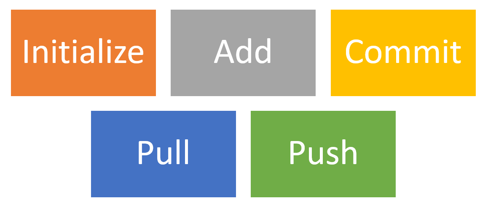

---

#### GIT (Distributed Source Code Management) (9)

##### Some of The Basic Operations in GIT are

- Branching

- Merging

- Rebasing

---

#### GIT (Distributed Source Code Management) (10)

##### Some of The Basic Operations in GIT are


---

#### GIT (Distributed Source Code Management) (8)

##### A brief idea about how these operations work with the Git repositories (1)


---

#### GIT (Distributed Source Code Management) (9)

##### A brief idea about how these operations work with the Git repositories (2)

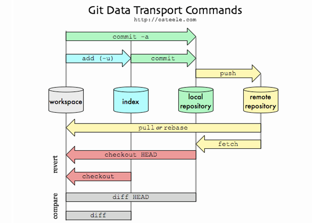

---

---

#### GIT (Distributed Source Code Management) (10)

##### A brief idea about how these operations work with the Git repositories (3)

For more detailed cheetsheat please check the following interactive map

[NDP Software :: Git Cheatsheet](https://www.ndpsoftware.com/git-cheatsheet.html)


---

##### Installation of GIT (1)

Check Installation Already Completed

```git
git --version
```


---

##### Installation of GIT (2)

If your console gives error about git command follow the steps in the link

[Install Git | Atlassian Git Tutorial](https://www.atlassian.com/git/tutorials/install-git#windows)

In this link you will should download following setup according to your operating system

---

##### Installation of GIT (3)

##### GIT Setup Files 

- [Download](http://git-scm.com/download/mac) [git](http://git-scm.com/download/mac) [for](http://git-scm.com/download/mac) [OSX](http://git-scm.com/download/mac)

- [Download](http://msysgit.github.io/) [git](http://msysgit.github.io/) [for](http://msysgit.github.io/) [Windows](http://msysgit.github.io/)

- [Download](http://git-scm.com/book/en/Getting-Started-Installing-Git) [git](http://git-scm.com/book/en/Getting-Started-Installing-Git) [for](http://git-scm.com/book/en/Getting-Started-Installing-Git) [Linux](http://git-scm.com/book/en/Getting-Started-Installing-Git)

---

##### Installation of GIT (4)

Download and install GIT from the following links (both have same github release path)

[Git - Downloads](https://git-scm.com/downloads)

---

##### Installation of GIT (5)

After running setup follow the steps below


---

##### Installation of GIT (6)


---

##### Installation of GIT (7)


---

##### Installation of GIT (8)

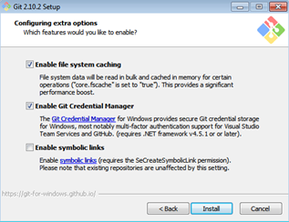

---

##### Installation of GIT (9)


---

##### Installation of GIT (10)


---

#### Installation of GIT Extension (Windows) (1)

You can install Git GUI from https://git-scm.com/downloads/guis
I prefer to use git extension https://gitextensions.github.io/ and https://tortoisegit.org/

Also Download KDiff3 [KDiff3 - Browse Files at SourceForge.net](https://sourceforge.net/projects/kdiff3/files/)

These extensions provide GUI for git operations to make process easier.

---

#### Configuration of GIT Extension (Windows) (1)


---

##### Configuration of GIT Extension (Windows) (2)

If you install git everything should be green and this configuration is stored on  .gitconfig on your home `C:/Windows/Users/<user>/.gitconfig`

---

##### Configuration of GIT Extension (Windows) (3)

```batch
[core]
    editor = \"C:/Program Files (x86)/GitExtensions/GitExtensions.exe\" fileeditor
    autocrlf = true
    quotePath = false
    commitGraph = true
    longpaths = true
[user]
    email = xxxxxxx@gmail.com
    name = xxxx xxxxxx
[filter "lfs"]
    clean = git-lfs clean -- %f
    smudge = git-lfs smudge -- %f
    process = git-lfs filter-process
    required = true
[pull]
    rebase = false
[fetch]
    prune = false
[rebase]
    autoStash = false
[credential]
    helper = manager
[diff]
    guitool = kdiff3
[difftool "kdiff3"]
    path = C:/Program Files/KDiff3/kdiff3.exe
    cmd = \"C:/Program Files/KDiff3/kdiff3.exe\" \"$LOCAL\" \"$REMOTE\"
[merge]
    guitool = tortoisemerge
[mergetool "tortoisemerge"]
    path = C:/Program Files/TortoiseGit/bin/TortoiseGitMerge.exe
    cmd = \"C:/Program Files/TortoiseGit/bin/TortoiseGitMerge.exe\" -base:\"$BASE\" -mine:\"$LOCAL\" -theirs:\"$REMOTE\" -merged:\"$MERGED\"
[receive]
    advertisePushOptions = true
[gc]
    writeCommitGraph = true
```

---

##### Configuration of GIT Extension (Windows) (4)

Also in extension you can see similar settings


---

##### Configuration of GIT Extension (Windows) (5)

Samples

MergeTool 

```textile
tortoisemerge
```

Path to mergetool

```textile
C:/Program Files/TortoiseGit/bin/TortoiseGitMerge.exe
```

Mergetool command

```textile
"C:/Program Files/TortoiseGit/bin/TortoiseGitMerge.exe" -base:"$BASE" -mine:"$LOCAL" -theirs:"$REMOTE" -merged:"$MERGED"
```
---

##### Configuration of GIT Extension (Windows) (6)

Difftool

```textile
kdiff3
```

Path to difftool

```textile
C:/Program Files/KDiff3/kdiff3.exe
```

Difftool command

```textile
"C:/Program Files/KDiff3/kdiff3.exe" "$LOCAL" "$REMOTE"
```
---

##### Configuration of GIT Extension (Windows) (7)

If you see something as merge and diff tool is not configured, follow the similar settings above on your computer. If you installed kdiff3, tortoisegit and extension you will have same diff and merge tools

This topic also help you 

[Git: How can I configure KDiff3 as a merge tool and diff tool? - Stack Overflow](https://stackoverflow.com/questions/33308482/git-how-can-i-configure-kdiff3-as-a-merge-tool-and-diff-tool)

---

##### Configuration of GIT Extension (Windows) (8)


---

##### Configuration of GIT Extension (Windows) (9)

Open Git->Config, in your settings you will see path to mergetool and difftool will be empty fill settings like that below find executables in your computer and copy paths to here.

---

##### Configuration of GIT Extension (Windows) (10)


---

##### Configuration of GIT Extension (Windows) (11)

Also if we want to change and use different diff and merge tool then we can do this with gitbash console as below

```batch
C:\Program Files\TortoiseGit\bin
```

Find TortoiseGitIDiff.exe and TortoiseGitMerge.exe


---

##### Configuration of GIT Extension (Windows) (12)

Copy path of this applications

```batch
C:\Program Files\TortoiseGit\bin\TortoiseGitMerge.exe
C:\Program Files\TortoiseGit\bin\TortoiseGitIDiff.exe
```

---

##### Configuration of GIT Extension (Windows) (13)

open a gitbash console and run following commands 

```batch
git config --global merge.tool TortoiseGitMerge
git config --global mergetool.TortoiseGitMerge.path "C:/Program Files/TortoiseGit/bin/TortoiseGitMerge.exe"
git config --global mergetool.TortoiseGitMerge.trustExitCode false

git config --global diff.guitool TortoiseGitIDiff
git config --global difftool.TortoiseGitIDiff.path "C:/Program Files/TortoiseGit/bin/TortoiseGitIDiff.exe"
git config --global difftool.TortoiseGitIDiff.trustExitCode false
```

This updates will be stored on .gitconfig

---

#### Using the GIT Extension (1)

right click in the git folder and use Git Extension menu for operations.

for sample commit click "Commit"


---

#### Using the GIT Extension (1)

from opening window first stage related files and then write a good commit message

finally click commit to local. You can also commit&push it to remote repository.


---

### GIT Installation Completed..


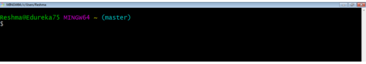

---

### Installation of gig (git ignore creator) (1)

Requirements

- Python >= 3.6

- Internet connection

https://github.com/sloria/gig 

```batch
pip install -U gig
```
---

#### Installation of gig (git ignore creator) (2)


---

#### Installation of gig (git ignore creator) (3)

```batch
gig --version
```
---

### Usage of gig (1)

List all gitignore templates

```batch
gig list
gig list -global
```
---

#### Usage of gig (2)

Sample gitignore for C Java and Visual Studio 

```bat
gig C Java VisualStudio > .gitignore
```
---

#### Usage of gig (3)

There is a portal for this also by Toptal

•[gitignore.io - Create Useful .gitignore Files For Your Project](https://www.toptal.com/developers/gitignore)

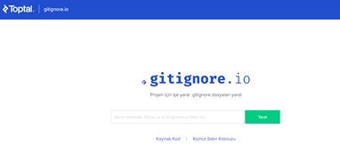


---

#### Usage of gig (4)

for samples you can check the following links.

https://github.com/github/gitignore

https://dev.to/shihanng/gig-a-gitignore-generator-opc

---

### Configuration of GIT (1)

It is important to configure your Git because any commits that you
make are associated with your configuration details.

configuring Git with your username and email. In order to do that, type the following commands in your Git Bash:

```git
git config - - global user.name "<your name>"

git config - - global user.email "<your email>"
```
---

#### Configuration of GIT (2)

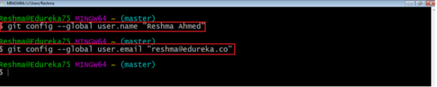

---

#### Configuration of GIT (3)

git configuration files are located on the user folder


---

#### Configuration of GIT (4)

If you want to view all your configuration details, use the command below

```git
git config --list
```


---

### Using .gitignore files with git-extension (1)

with gitignore file


---

### Using .gitignore files with git-extension (2)

without gitignore file (just move to another location)

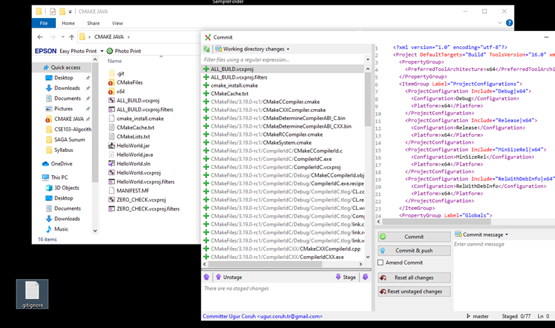

---

### Github Create Repo


---

### Initilization of Repo (not existing in github)

#### git init

- In order to do that, we use the command **git init**.

- **git init** creates an empty Git repository or re-initializes an existing one. It basically creates a **.git** directory with sub directories and template files. Running a **git init** in an existing repository will not overwrite things that are already there. It rather picks up the newly added templates.

```batch
git init
```
---

#### git init


---

### Adding Initiated Repo Remote Upstream Repo (Link with Github Repo) (1)

If you enter following command in the git folder you will see nothing

```batch
git remote -v
```
That mean this repository do not have a remote upstream repository such as a github or bitbucket repo. 

---

#### Adding Initiated Repo Remote Upstream Repo (Link with Github Repo) (2)

Open the github and bitbucket repository and copy project path from 


---

#### Adding Initiated Repo Remote Upstream Repo (Link with Github Repo) (3)

you will see the following sample from github code button

```batch
https://github.com/ucoruh/ce103-sample-text.git
```

---

#### Adding Initiated Repo Remote Upstream Repo (Link with Github Repo) (4)

copy link and use with following command

```batch
git remote add origin https://github.com/ucoruh/ce103-sample-text.git
```

---

#### Adding Initiated Repo Remote Upstream Repo (Link with Github Repo) (5)

then you can check your remote setting with

```batch
$ git remote -v
origin  https://github.com/ucoruh/ce103-sample-text.git (fetch)
origin  https://github.com/ucoruh/ce103-sample-text.git (push)
```

---

#### Adding Initiated Repo Remote Upstream Repo (Link with Github Repo) (6)

you can check the following sample 

[How to Add a New Remote to your Git Repo | Assembla Help Center](https://articles.assembla.com/en/articles/1136998-how-to-add-a-new-remote-to-your-git-repo)

---

### *Now you can push your local changes to remote repository*

### *If you see a repository on Github then you can download with following operation*

---

### Checkout a Repository (1)

create a working copy of a local repository by running the command

```batch
git clone /path/to/repository
```

---

### Checkout a Repository (2)

Sample clone command

```batch
git clone https://github.com/ucoruh/ce103-sample-text.git
```

---

### Checkout a Repository (3)

when using a remote server, your command will be

```batch
git clone username@host:/path/to/repository
```

### Checking Repository Status (1)

#### git status

The git status command lists all the modified files which are ready to be added to the local repository.

```batch
git status
```
---

### Checking Repository Status (2)

#### git status


---

### Adding Files to Index (1)

#### git add

This command updates the index using the current content found in the working tree
and then prepares the content in the staging area for the next commit.

```batch
git add <directory>
git add <file>
git add *
```
---
### Adding Files to Index (1)

#### git add

Created two more files edureka3.txt and edureka4.txt. Let us add the files using the command git add -A. This command will add all the files to the index which are in the directory but not updated in the index yet.


---

### Commit Changes (1)

#### git commit

•It refers to recording snapshots of the repository at a given time. Committed
snapshots will never change unless done explicitly. 

---

### Commit Changes (2)

#### git commit

Let me explain how commit
works with the diagram below


Here, C1 is the initial commit, i.e. the snapshot of the first change from which
another snapshot is created with changes named C2. Note that the master points
to the latest commit. Now, when I commit again, another snapshot C3 is created and now the master points to C3 instead of C2.

---

### Commit Changes (3)

#### git commit

Commands:

```batch
git commit -m "<message>"
```

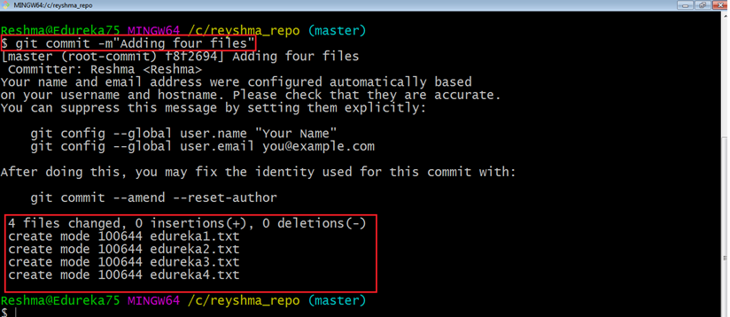


Now, if you want to commit a snapshot of all the changes in the working directory at
once, you can use the command below

---

### Commit Changes (4)

#### git commit

Please check writing good commit messages article below

[How to write a good commit message - DEV Community](https://dev.to/chrissiemhrk/git-commit-message-5e21)

---

### Writing Good Commit Messages (1)

```
type: subject

body (optional)

footer (optional)
```
---

#### Writing Good Commit Messages (2)

##### 1. Type

- **feat** - a new feature
- **fix** - a bug fix
- **docs** - changes in documentation
- **style** - everything related to styling
- **refactor** - code changes that neither fixes a bug or adds a feature
- **test** - everything related to testing
- **chore** - updating build tasks, package manager configs, etc

---

#### Writing Good Commit Messages (3)

##### 2. Subject

This contains a short description of the changes made. It shouldn't be greater than 50 characters, should begin with a capital letter and written in the imperative eg. Add instead of Added or Adds.

---

#### Writing Good Commit Messages (4)

##### 3. Body

The body is used to explain what changes you made and why you made them. Not all commits are complex enough that they need a body, especially if you are working on a personal project alone, and as such writing a body is optional.

A blank line between the body and the subject is required and each line should have no more than 72 characters.

---

#### Writing Good Commit Messages (5)

##### 4.Footer

The footer is also optional and mainly used when you are using an issue tracker to reference the issue ID.

----

#### Writing Good Commit Messages (6)

##### Example Commit Message

```git
feat: Summarize changes in around 50 characters or less

More detailed explanatory text, if necessary. Wrap it to about 72
characters or so. In some contexts, the first line is treated as the
subject of the commit and the rest of the text as the body. The
blank line separating the summary from the body is critical (unless
you omit the body entirely); various tools like `log`, `shortlog`
and `rebase` can get confused if you run the two together.

Explain the problem that this commit is solving. Focus on why you
are making this change as opposed to how (the code explains that).
Are there side effects or other unintuitive consequences of this
change? Here's the place to explain them.

Further paragraphs come after blank lines.

 - Bullet points are okay, too

 - Typically a hyphen or asterisk is used for the bullet, preceded
   by a single space, with blank lines in between, but conventions
   vary here

If you use an issue tracker, put references to them at the bottom,
like this:

Resolves: #123
See also: #456, #789
```

---

#### Writing Good Commit Messages (7)

```batch
git commit -a
```
---

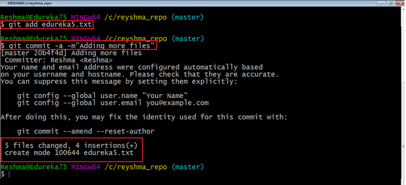

---

### Add Files to Index (1)

I have created two more text files in my working directory viz. edureka5.txt and edureka6.txt but they are not added to the index yet.

I am adding edureka5.txt using the command

```batch
git add edureka5.txt
```

---

### Add Files to Index (2)

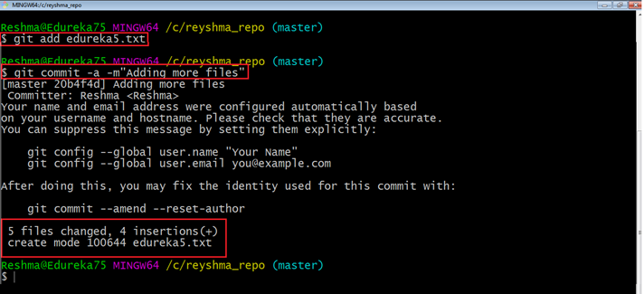

---

### Add Files to Index (3)

I have added edureka5.txt to the index explicitly but not edureka6.txt and made changes in the previous files. I want to commit all changes in the directory at once.

---

### Add Files to Index (4)

> This command will commit a snapshot of all changes in the working directory but only includes modifications to tracked files i.e. the files that have been added with git add at some point in their history. Hence, edureka6.txt was not committed because it was not added to the index yet. But changes in all previous files present in the repository were committed, i.e. edureka1.txt, edureka2.txt, edureka3.txt, edureka4.txt and edureka5.txt.   Now I have made my desired commits in my local repository

---

### Add Files to Index (5)

your local repository consists of three "trees" maintained by git. the first one is your Working Directory which holds the actual files. the second one is the Index which acts as a staging area and finally the HEAD which points to the last commit you've made

---

### Add Files to Index (6)


---

### Update local repo before sending (1)

#### Fetching

If we have a remote Git branch, for example a branch on Github, it can happen that the remote branch has commits that the current branch doesn't have! Maybe another branch got merged, your colleague pushed a quick fix, and so on.

---

### Update local repo before sending (2)

#### Fetching

We can get these changes locally, by performing a `git fetch` on the remote branch! It doesn't affect your local branch in any way: a `fetch` simply downloads new data.

---

### Update local repo before sending (3)

#### Fetching


---

### Update local repo before sending (4)

#### Fetching

We can now see all the changes that have been made since we last pushed! We can decide what we want to do with the new data now that we have it locally.

---

### Update local repo before sending (5)

#### Pulling

Although a `git fetch` is very useful in order to get the remote information of a branch, we can also perform a `git pull`. A `git pull` is actually two commands in one: a `git fetch`, and a `git merge`. When we're pulling changes from the origin, we're first fetching all the data like we did with a `git fetch`, after which the latest changes are automatically merged into the local branch

---

### Update local repo before sending (6)

#### Pulling


---

### Update local repo before sending (7)

#### Pulling

Awesome, we're now perfectly in sync with the remote branch and have all the latest changes!

---

### Update local repo before sending (8)

#### Pulling

#### git pull

Note that before you affect changes to the central repository you should always pull
changes from the central repository to your local repository to get updated with the work of all the collaborators that have been contributing in the central repository. For that we will use the pull command.

---

### Update local repo before sending (9)

#### Pulling

#### git pull

But first, you need to set your central repository as origin using the command

```batch
git remote add origin <link of your central repository>
```

---

### Update local repo before sending (10)

#### Pulling / `git pull`


> Now that my origin is set

---

### Update local repo before sending (11)

#### Pulling / `git pull`

let us extract files from the origin using pull. For that use the command

```batch
git pull origin master
```

---

### Update local repo before sending (12)

#### Pulling / `git pull`


This command will copy all the files from the master branch of remote repository to your local repository.

---

### Update local repo before sending (13)

#### Pulling / `git pull`

> Since my local repository was already updated with files from master branch, hence the message is Already up-to-date. Refer to the screen shot above

---

### Update local repo before sending (14)

#### Pulling / `git pull`

One can also try pulling files from a different branch using the following command:

```batch
git pull origin <branch-name>
```

---

### Update local repo before sending (15)

#### Pulling / `git pull`

> Your local Git repository is now updated with all the recent changes. It is time you make changes in the central repository by using the push command.

---

### Send Changes to Remote Repo (1)

#### git push

- This command transfers commits from your local repository to your remote repository. It is the opposite of pull operation.

---

### Send Changes to Remote Repo (2)

#### git push

- Pulling imports commits to local repositories whereas pushing exports commits to the remote repositories

---

### Send Changes to Remote Repo (3)

#### git push

- The use of git push is to publish your local changes to a central repository. After you’ve accumulated several local commits and are ready to share them with the rest of the team, 

---

### Send Changes to Remote Repo (4)

#### git push

you can then push them to the central repository by using the following command

```batch
git push <remote> 
```
---

### Send Changes to Remote Repo (5)

#### git push

> This remote refers to the remote repository which had been set before using the pull command.

---

### Send Changes to Remote Repo (6)

#### git push

- This pushes the changes from the local repository to the remote repository along with all the necessary commits and internal objects. This creates a local branch in the destination repository

---

### Send Changes to Remote Repo (7)

#### git push

The below files are the files which we have already committed previously in the commit section and they are all “push-ready“.

---

### Send Changes to Remote Repo (8)

#### git push

I will use the command `git push origin master` to reflect these files in the master branch of my central repository.

---

### Send Changes to Remote Repo (9)

#### git push


---

### Send Changes to Remote Repo (10)

#### git push

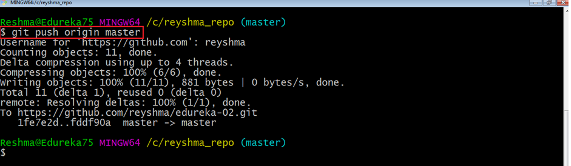

---

### Send Changes to Remote Repo (11)

#### git push


---

### Send Changes to Remote Repo (12)

#### git push

> To prevent overwriting, Git does not allow push when it results in a non-fast forward merge in the 
destination repository.

---

### Send Changes to Remote Repo (13)

#### git push

> A non-fast forward merge means an upstream merge i.e. merging with ancestor or parent branches from a child branch
> To enable such merge, use the command below
> 
> ```batch
> git push <remote> -force
> ```

The above command forces the push operation even if it results in a non-fast
forward merge

---

### Branching (1)
#### git branch

Branches in Git are nothing but pointers to a specific commit. Git generally prefers to keep its branches as lightweight as possible.

---

### Branching (2)
#### git branch

There are basically two types of branches viz. 

- local branches

- remote tracking branches.

---

### Branching (3)
#### git branch

A local branch is just another path of your working tree. On the other hand, remote tracking branches have special purposes. Some of them are:

They link your work from the local repository to the work on central repository.

---

### Branching (4)
#### git branch

They automatically detect which remote branches to get changes from, when you use git pull.


---

### Branching (5)
#### Learn current branch

You can check what your current branch is by using the command

```batch
git branch
```

The one mantra that you should always be chanting while branching is “branch early, and branch often”

---

### Branching (6)
#### List Local Branches

```batch
git branch -l
```

---

### Branching (7)
## List Remote Branches

```batch
git branch -r
```

---

### Branching (8)
## List All Local and Remote Branches

```batch
git branch -a
```

---

### Branching (9)

[Removing merged git branches](https://splice.com/blog/cleaning-git-branches/)

(after pull-request action in github)

If you merged your branch to base branch in github and delete it on github your local branch list will not be updated by it self. You have to use the following command to update local and remote branch lists. Use the following command to syncronize your repository with remote upstream repo.

```batch
git remote update --prune
```
---

### Branching (10)
#### Create Branch

To create a new branch we use the following command

```batch
git branch <branch-name>
```

The diagram below shows the workflow when a new branch is created. When we create a new branch it originates from the master branch itself.

---

### Branching (11)
#### Create Branch


---

### Branching (12)
#### Create Branch

Since there is no storage/memory overhead with making many branches, it is easier to
logically divide up your work rather than have big chunky branches

You can create and change branch with following command, create a new branch named "feature_x" and switch to it using

```batch
git checkout -b feature_x
```

---

### Branching (13)
#### Change Branch

```batch
git checkout <branch-name>

git checkout master
```

---

### Branching (14)
#### Change Branch

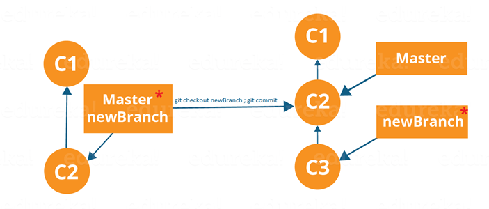


> Branching includes the work of a particular commit along with all parent commits. As you can see in the diagram above, the newBranch has detached itself from the master and hence will create a different path

---

### Branching (15)
#### Delete Local Branch

and delete the branch again, before doing this switch to main or master branches.

```batch
git branch -d feature_x
```

---

### Branching (16)
#### Delete Remote Branch

and delete the branch again, before doing this switch to main or master branches.

```batch
git push origin --delete feature_x
```

[How to delete remote branches in Git](https://www.educative.io/edpresso/how-to-delete-remote-branches-in-git)


---

### Branching (17)
#### Push Specific Branch to Remote

A branch is not available to others unless you push the branch to your remote
repository

```batch
git push origin <branch>
```

---

### Branching (18)
#### Update & Merge (Conflicts)

to update your local repository to the newest commit, execute

```
git pull
```

in your working directory to fetch and merge remote changes.

to merge another branch into your active branch (e.g. master), use

```
git merge <branch>
```

---

### Branching (19)
#### Update & Merge (Conflicts)

in both cases git tries to auto-merge changes. Unfortunately, this is not always possible and results in conflicts. You are responsible to merge those conflicts manually by editing the files shown by git. After changing, you need to mark them as merged with

```
git add <filename>
```

before merging changes, you can also preview them by using

```
git diff <source_branch> <target_branch>
```

[Git merge conflicts | Atlassian Git Tutorial](https://www.atlassian.com/git/tutorials/using-branches/merge-conflicts)


---

### Branching (20)
#### Update & Merge (Conflicts)

There are two types of merges Git can perform: a **fast-forward**, or a **no-fast-forward**

---
### Branching (21)
#### Update & Merge (Conflicts)
##### Fast-forward (`--ff`)

A **fast-forward merge** can happen when the current branch has no extra commits compared to the branch we’re merging. Git is... *lazy* and will first try to perform the easiest option: the fast-forward! This type of merge doesn’t create a new commit, but rather merges the commit(s) on the branch we’re merging right in the current branch

---
### Branching (22)
#### Update & Merge (Conflicts)
##### Fast-forward (`--ff`)


---

### Branching (23)
#### Update & Merge (Conflicts)

Perfect! We now have all the changes that were made on the `dev` branch available on the `master` branch. So, what's the **no-fast-forward** all about?

---

### Branching (24)
#### Update & Merge (Conflicts)
##### No-fast-foward (`--no-ff`)

It's great if your current branch doesn't have any extra commits compared to the branch that you want to merge, but unfortunately that's rarely the case! If we committed changes on the current branch that the branch we want to merge doesn't have, git will perform a *no-fast-forward* merge.

---

### Branching (25)
#### Update & Merge (Conflicts)
##### No-fast-foward (`--no-ff`)

With a no-fast-forward merge, Git creates a new *merging commit* on the active branch. The commit's parent commits point to both the active branch and the branch that we want to merge!

---

### Branching (26)
#### Update & Merge (Conflicts)
##### No-fast-foward (`--no-ff`)


---

### Branching (27)
#### Update & Merge (Conflicts)
##### No-fast-foward (`--no-ff`)

No big deal, a perfect merge!  The `master` branch now contains all the changes that we've made on the `dev` branch.

---

### Branching (28)
### Merge Conflicts

Although Git is good at deciding how to merge branches and add changes to files, it cannot always make this decision all by itself  This can happen when the two branches we're trying to merge have changes on the same line in the same file, or if one branch deleted a file that another branch modified, and so on.

---

### Branching (29)
### Merge Conflicts

In that case, Git will ask you to help decide which of the two options we want to keep! Let's say that on both branches, we edited the first line in the `README.md`.

---

### Branching (30)
### Merge Conflicts


If we want to merge `dev` into `master`, this will end up in a merge conflict: would you like the title to be `Hello!` or `Hey!`?

---

### Branching (31)
### Merge Conflicts

When trying to merge the branches, Git will show you where the conflict happens. We can manually remove the changes we don't want to keep, save the changes, add the changed file again, and commit the changes


---

### Branching (32)
### Merge Conflicts

Although merge conflicts are often quite annoying, it makes total sense: Git shouldn't just *assume* which change we want to keep

---

### Branching (33)
#### Sample Conflict -1

participants.txt

(**I added a hyphen before each name**)

```textile
Finance team
 Charles
 Lisa
 John
 Stacy
 Alexander
```

```batch
git init
git add .
git commit –m 'Initial list for finance team'
```

---

### Branching (34)
#### Sample Conflict -1

Create a new branch called marketing using the following syntax

```git
git checkout –b marketing
```

---

### Branching (35)
#### Sample Conflict -1

Now open the `participants.txt` file and start entering the names for the marketing department below the finance team list, as follows: (**I added a hyphen before each name**)

```textile
Marketing team
 Collins
 Linda
 Patricia
 Morgan
```

```git
git add .
git commit –m 'Unfinished list of marketing team'
git checkout master
```
---

### Branching (36)
#### Sample Conflict -1

Open the file and delete the names **Alexander** and **Stacy**, save, close, add the changes, and commit with the commit message Final list from Finance team

```git
git add .
git commit –m "Final list from Finance team"
git checkout marketing
```

---

### Branching (37)
#### Sample Conflict -1

Open the file and add the fifth name, **Amanda**, for the marketing team, save, add, and commit

```git
git add .
git commit –m "Initial list of marketing team"
```

names entered for marketing have been confirmed; now we need to merge these two lists, which can be done by the following command

```batch
git merge master
```

---

### Branching (38)
#### Sample Conflict -1

```batch
Auto-merging participants.txt
CONFLICT (content): Merge conflict in participants.txt
Automatic merge failed; fix conflicts and then commit the result.
```

---

### Branching (39)
#### Sample Conflict -1

```textile
Finance team
-Charles
-Lisa
-John
<<<<<<< HEAD
-Stacy
-Alexander

Marketing team
- Collins
- Linda
- Patricia
- Morgan
- Amanda
=======
>>>>>>> master
```

---

### Branching (40)
#### Sample Conflict -1

```textile
<<<<<<<
Changes made on the branch that is being merged into. In most cases,
this is the branch that I have currently checked out (i.e. HEAD).
|||||||
The common ancestor version.
=======
Changes made on the branch that is being merged in. This is often a 
feature/topic branch.
>>>>>>>
```

---

### Branching (41)
#### Sample Conflict -1

- remove them
- keep the lines you want to see in the final version of the file
- add and commit


---

### Branching (42)
#### Sample Conflict -1


If we want to save all to our version

```batch
git checkout --ours .  # checkout our local version of all files
git add -u             # mark all conflicted files as merged
git commit             # commit the merge
```

---

### Branching (43)
#### Sample Conflict -1

If we want to discard all our revision

```batch
git checkout --theirs .  # checkout remote version of all files
git add -u             # mark all conflicted files as merged
git commit             # commit the merge
```

---

### Branching (44)
#### Sample Conflict -2

You're going to pull some changes, but oops, you're not up to date:

```batch
git fetch origin
git pull origin master

From ssh://gitosis@example.com:22/projectname
 * branch            master     -> FETCH_HEAD
Updating a030c3a..ee25213
error: Entry 'filename.c' not uptodate. Cannot merge.
```

---

### Branching (45)
#### Sample Conflict -2

So you get up-to-date and try again, but have a conflict:

```batch
git add filename.c
git commit -m "made some wild and crazy changes"
git pull origin master

From ssh://gitosis@example.com:22/projectname
 * branch            master     -> FETCH_HEAD
Auto-merging filename.c
CONFLICT (content): Merge conflict in filename.c
Automatic merge failed; fix conflicts and then commit the result.
```

---

### Branching (46)
#### Sample Conflict -2

So you decide to take a look at the changes:

```batch
git mergetool
```

Oh my, oh my, upstream changed some things, but just to use my changes...no...their changes...

```batch
git checkout --ours filename.c
git checkout --theirs filename.c
git add filename.c
git commit -m "using theirs"
```

---

### Branching (47)
#### Sample Conflict -2

And then we try a final time

```batch
git pull origin master

From ssh://gitosis@example.com:22/projectname
 * branch            master     -> FETCH_HEAD
Already up-to-date.
```

---

### Tagging

it's recommended to create tags for software releases. this is a known concept,
which also exists in SVN. You can create a new tag named 1.0.0 by executing

```batch
git tag 1.0.0 1b2e1d63ff
```

the 1b2e1d63ff stands for the first 10 characters of the commit id you want to
reference with your tag. You can get the commit id by looking at the...

---

### Log (1)

in its simplest form, you can study repository history using.. git log

You can add a lot of parameters to make the log look like what you want. To see
only the commits of a certain author:

```batch
git log --author=bob
```

---

### Log (2)

To see a very compressed log where each commit is one line:

```batch
git log --pretty=oneline
```

---

### Log (3)

Or maybe you want to see an ASCII art tree of all the branches, decorated with the names of tags and branches:

```batch
git log --graph --oneline --decorate --all
```

---

### Log (4)

See only which files have changed: 

```batch
git log --name-status
```

---

### Log (5)
These are just a few of the possible parameters you can use. For more, see 

```batch
git log --help
```

---

### Replace Local Changes (1)

In case you did something wrong, which for sure never happens ;), you can replace
local changes using the command

```batch
git checkout -- <filename>
```

this replaces the changes in your working tree with the last content in HEAD.
Changes already added to the index, as well as new files, will be kept.

---

### Replace Local Changes (2)

if you use dot (.) then all local changes will be rollbacked.

```batch
 git checkout -- .
```

---

### Replace Local Changes (3)

If you instead want to drop all your local changes and commits, fetch the latest
history from the server and point your local master branch at it like this

```batch
git fetch origin

git reset --hard origin/master
```

---

### Reflog (1)

Everyone makes mistakes, and that's totally okay! Sometimes it may feel like you've corrupt your git repo so badly that you just want to delete it entirely.

---

### Reflog (2)

`git reflog` is a very useful command in order to show a log of all the actions that have been taken! This includes merges, resets, reverts: basically any alteration to your branch.

---

### Reflog (3)


---

### Reflog (4)

If you made a mistake, you can easily redo this by resetting `HEAD` based on the information that `reflog` gives us!

Say that we actually didn't want to merge the origin branch. When we execute the `git reflog` command, we see that the state of the repo before the merge is at `HEAD@{1}`. Let's perform a `git reset` to point HEAD back to where it was on `HEAD@{1}`!

---

### Reflog (5)


We can see that the latest action has been pushed to the `reflog`

---

### Resetting (1)

It can happen that we committed changes that we didn't want later on. Maybe it's a `WIP` commit, or maybe a commit that introduced bugs!  In that case, we can perform a `git reset`.

---

### Resetting (2)

A `git reset` gets rid of all the current staged files and gives us control over where `HEAD` should point to.

--- 

### Soft Reset (1)

A *soft reset* moves `HEAD` to the specified commit (or the index of the commit compared to `HEAD`), without getting rid of the changes that were introduced on the commits afterward!

--- 

### Soft Reset (2)

Let's say that we don't want to keep the commit `9e78i` which added a `style.css` file, and we also don't want to keep the commit `035cc` which added an `index.js` file. However, we do want to keep the newly added `style.css` and `index.js` file! A perfect use case for a soft reset.

--- 

### Soft Reset (3)


--- 

### Soft Reset (2)

When typing `git status`, you'll see that we still have access to all the changes that were made on the previous commits. This is great, as this means that we can fix the contents of these files and commit them again later on!

---

### Hard reset (1)

Sometimes, we don't want to keep the changes that were introduced by certain commits. Unlike a soft reset, we shouldn't need to have access to them any more. Git should simply reset its state back to where it was on the specified commit: this even includes the changes in your working directory and staged files!

---

### Hard reset (2)

Git has discarded the changes that were introduced on `9e78i` and `035cc`, and reset its state to where it was on commit `ec5be`.


---

### Reverting (1)

Another way of undoing changes is by performing a `git revert`. By reverting a certain commit, we create a *new commit* that contains the reverted changes!

---

### Reverting (2)

Let's say that `ec5be` added an `index.js` file. Later on, we actually realize we didn't want this change introduced by this commit anymore! Let's revert the `ec5be` commit.


Perfect! Commit `9e78i` reverted the changes that were introduced by the `ec5be` commit. 

---

### Reverting (3)

Performing a  `git revert` is very useful in order to undo a certain commit, without modifying the history of the branch.

---

### Cherry-picking (1)

When a certain branch contains a commit that introduced changes we need on our active branch, we can `cherry-pick` that command! By `cherry-pick`ing a commit, we create a new commit on our active branch that contains the changes that were introduced by the `cherry-pick`ed commit.

---

### Cherry-picking (1)

Say that commit `76d12` on the `dev` branch added a change to the `index.js` file that we want in our `master` branch. We don't want the *entire* we just care about this one single commit!


Cool, the master branch now contains the changes that `76d12` introduced

---

### Rebasing (1)

We just saw how we could apply changes from one branch to another by performing a `git merge`. Another way of adding changes from one branch to another is by performing a `git rebase`.

---

### Rebasing (2)

A `git rebase` *copies* the commits from the current branch, and puts these copied commits on top of the specified branch.


Perfect, we now have all the changes that were made on the `master` branch available on the `dev` branch!

---

### Rebasing (3)

A big difference compared to merging, is that Git won't try to find out which files to keep and not keep. The branch that we're rebasing always has the latest changes that we want to keep! You won't run into any merging conflicts this way, and keeps a nice linear Git history.

---

### Rebasing (4)

This example shows rebasing on the `master` branch. In bigger projects, however, you usually don't want to do that. A `git rebase` **changes the history of the project** as new hashes are created for the copied commits!

---

### Rebasing (5)

Rebasing is great whenever you're working on a feature branch, and the master branch has been updated. You can get all the updates on your branch, which would prevent future merging conflicts!

---

### Interactive Rebase (1)

Before rebasing the commits, we can modify them!  We can do so with an *interactive rebase*. An interactive rebase can also be useful on the branch you're currently working on, and want to modify some commits.

---

### Interactive Rebase (2)

There are 6 actions we can perform on the commits we're rebasing:

- `reword`: Change the commit message
- `edit`: Amend this commit
- `squash`: Meld commit into the previous commit
- `fixup`: Meld commit into the previous commit, without keeping the commit's log message
- `exec`: Run a command on each commit we want to rebase
- `drop`: Remove the commit

---

### Interactive Rebase (3)

Awesome! This way, we can have full control over our commits. If we want to remove a commit, we can just `drop` it.


---

### Interactive Rebase (4)

Or if we want to squash multiple commits together to get a cleaner history, no problem!


Interactive rebasing gives you a lot of control over the commits you're trying to rebase, even on the current active branch

---

### Useful Hints (1)

built-in git GUI

```batch
gitk
```

---

### Useful Hints (2)

use colorful git output

```batch
git config color.ui true
```

---

### Useful Hints (3)

show log on just one line per commit

```batch
git config format.pretty oneline
```

---

### Useful Hints (4)

use interactive adding

```batch
git add -i
```

```batch
HEAD~2          // previous two commits fro head
HEAD~~         // previous two commits from head
HEAD@{2}     // reflog order
18fe5              // previous commit hash
```

---

### GIT Decision Tree

http://justinhileman.info/article/git-pretty/git-pretty.png


---

### GIT in action (1)


---

### GIT in action (2)


---

### GIT in action (3)


---

### GIT in action (4)

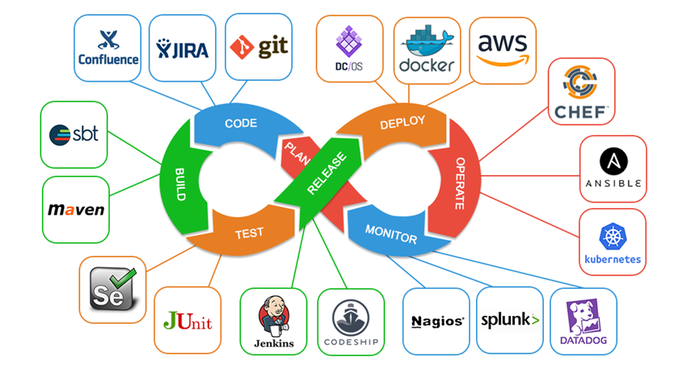

---

### GIT in action (5)


---

### GIT in action (6)


---

### GIT in action (7)


---

### Gource

https://gource.io/

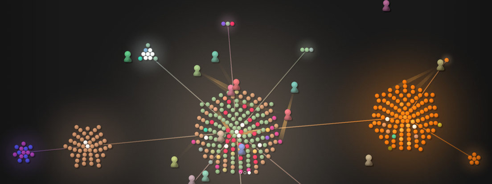


---

### References (1)

[Source Code Management | Atlassian Git Tutorial](https://www.atlassian.com/git/tutorials/source-code-management#:~:text=Source%20code%20management%20(SCM)%20is,also%20synonymous%20with%20Version%20control).

[What is Source Code Management or Version Control ? - The Linux Juggernaut](https://www.linuxnix.com/what-is-source-code-management-or-version-control/)

https://www.edureka.co/blog/how-to-use-github/

https://www.edureka.co/blog/git-tutorial/

https://www.edureka.co/blog/install-git/

---

### References (2)

[git - the simple guide - no deep shit!](https://rogerdudler.github.io/git-guide/index.html)

[GitHub - rogerdudler/git-guide: git - the simple guide](https://github.com/rogerdudler/git-guide)

[https://dev.to/lydiahallie/cs-visualized-useful-git-commands-37p1#merge](https://dev.to/lydiahallie/cs-visualized-useful-git-commands-37p1)

[How to write a good commit message - DEV Community](https://dev.to/chrissiemhrk/git-commit-message-5e21)

https://blog.xebialabs.com/2016/06/14/periodic-table-devops-tools-v-2/

---

### References (3)

https://harness.io/2018/01/devops-tools-lifecycle-mesh-2018/

https://medium.com/swlh/how-to-become-an-devops-engineer-in-2020-80b8740d5a52


https://www.lucidchart.com/blog/devops-process-flow

https://www.researchgate.net/publication/262450962_Rugby_An_Agile_Process_Model_Based_on_Continuous_Delivery


---

### References (4)

[git - the simple guide - no deep shit!](https://rogerdudler.github.io/git-guide/index.html)

[Git Tutorial | Commands And Operations In Git | Edureka](https://www.edureka.co/blog/git-tutorial/)

[How to write a good commit message - DEV Community](https://dev.to/chrissiemhrk/git-commit-message-5e21)

[An Introduction to Git and GitHub by Brian Yu - YouTube](https://www.youtube.com/watch?v=MJUJ4wbFm_A&ab_channel=CS50)

---

### References (5)

https://education.github.com/git-cheat-sheet-education.pdf

[NDP Software :: Git Cheatsheet](http://www.ndpsoftware.com/git-cheatsheet.html#loc=remote_repo);

[Learn Git Branching](https://learngitbranching.js.org/)

https://guides.github.com/introduction/git-handbook/
