<!-- _backgroundColor: aquq -->

<!-- _color: orange -->

<!-- paginate: false -->

## CE103 Algorithms and Programming I

### Week-4

#### Introduction to Code Reusability and Automated Testing

Download [DOC](ce103-week-4-test.en.md_doc.pdf), [SLIDE](ce103-week-4-test.en.md_slide.pdf), [PPTX](ce103-week-4-test.en.md_slide.pptx)

<iframe width=700, height=500 frameBorder=0 src="../ce103-week-4-test.en.md_slide.html"></iframe>

---

<style scoped>section{ font-size: 25px; }</style>

<!-- paginate: true -->

#### Outline

- Introduction to Code Reusability and Automated Testing
- Shared Library Development
	-  C
	-  C++
	-  C#
	- Java
- Unit Testing
	- C
	- C++
	- C#
	- Java
- Continues Integration Platforms 

---

<style scoped>section{ font-size: 25px; }</style>

## Introduction to Code Reusability and Automated Testing

- During this course, we will use entry-level shared library development and their tests and test automation. Also, we will see TDD(Test Driven Development) approach.

---

<style scoped>section{ font-size: 25px; }</style>

## Selected Development Environment

- During this course, we will use **Windows OS, Eclipse and Visual Studio Community Edition** environments for examples.

---

<style scoped>section{ font-size: 25px; }</style>

## Example Content

- Each example will include two function
- "`Hello <name>`" printing function with name `sayHelloTo(name)` and sum of two variable function for basic, `sum = sum(a,b)`. This sum function will add a to b and return the result to the sum variable.
- We will locate them in the library and use them from a console application, also we will create unit tests for testing their functionalities and return variables

---

<style scoped>section{ font-size: 30px; }</style>

## Shared Library Development
### C Programming (Static Library)
#### Visual Studio Community Edition

---


<style scoped>section{ font-size: 25px; }</style>

## Shared Library Development - (VS C Static Library)-1

- In this sample, we will create a **c-lib-sample** project that contains a library, executable, unit tests and unit test runners.
- First of all, you install Visual Studio Community Edition from the website
    - [Visual Studio 2019 Community Edition - Son Ücretsiz Sürümü İndir](https://visualstudio.microsoft.com/tr/vs/community/)

---


<style scoped>section{ font-size: 25px; }</style>

## Shared Library Development - (VS C Static Library)-2

- Open visual studio community edition and select create a new project


---

<style scoped>section{ font-size: 25px; }</style>

## Shared Library Development - (VS C Static Library)-3

- Select create a new project


---

<style scoped>section{ font-size: 25px; }</style>

## Shared Library Development - (VS C Static Library)-4

- Select C++ static library from the project list

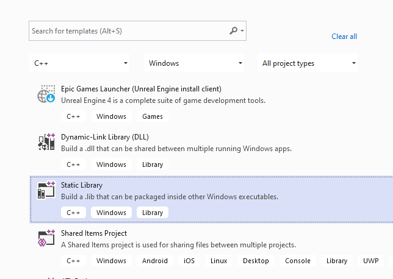

---

<style scoped>section{ font-size: 25px; }</style>

## Shared Library Development - (VS C Static Library)-5

- Give static library project name

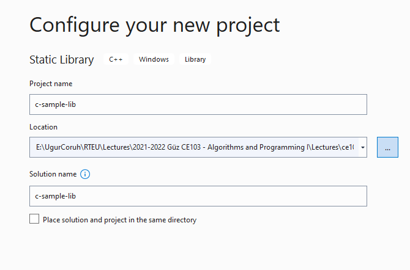

---

<style scoped>section{ font-size: 25px; }</style>

## Shared Library Development - (VS C Static Library)-6

- Default configuration come with C++ project types and setting


---

<style scoped>section{ font-size: 25px; }</style>

## Shared Library Development - (VS C Static Library)-7

In the c-sample-lib.cpp you will sample function

```c
void fncsamplelib(){

}
```

---

<style scoped>section{ font-size: 25px; }</style>

## Shared Library Development - (VS C Static Library)-8

Delete pch.h and pch.c files. Also disable use precompiled header settings from configurations and change to "Not Using Precomplied Headers", also you can delete precomplied Header File.


---

<style scoped>section{ font-size: 13px; }</style>

## Shared Library Development - (VS C Static Library)-9

- Customize library header name and update `framework.h` to `samplelib.h`

- Insert your functions inside the `c-sample-lib.c` and update header files also.

```c
// c-sample-lib.cpp : Defines the functions for the static library.
//

#include "samplelib.h"
#include "stdio.h"

/// <summary>
///
/// </summary>
/// <param name="name"></param>
void sayHelloTo(char* name){

    if (name != NULL){
        printf("Hello %s \n",name);
    }
    else {
        printf("Hello There\n");
    }
}

/// <summary>
///
/// </summary>
/// <param name="a"></param>
/// <param name="b"></param>
/// <returns></returns>
int sum(int a, int b){

    int c = 0;
    c = a + b;
    return c;
}
```

---

<style scoped>section{ font-size: 25px; }</style>

## Shared Library Development - (VS C Static Library)-10

- Also, update `samplelib.h` as follows.

```c
#pragma once

#define WIN32_LEAN_AND_MEAN             // Exclude rarely-used stuff from Windows headers

void sayHelloTo(char* name);
int sum(int a, int b);
```

---

<style scoped>section{ font-size: 25px; }</style>

## Shared Library Development - (VS C Static Library)-11

- If you check the configuration you will see that for C compiler we are using Microsoft Environment and Toolkits

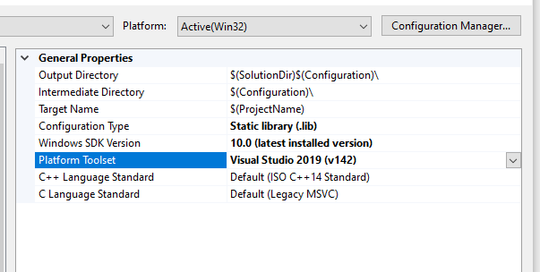

---

<style scoped>section{ font-size: 25px; }</style>

## Shared Library Development - (VS C Static Library)-12

- Now we can compile our library


---

<style scoped>section{ font-size: 25px; }</style>

## Shared Library Development - (VS C Static Library)-13

- You can follow operation from the output window

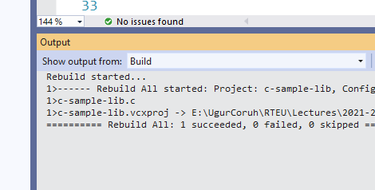

---

<style scoped>section{ font-size: 25px; }</style>

## Shared Library Development - (VS C Static Library)-14

- In the debug folder, we will see our output


---

<style scoped>section{ font-size: 25px; }</style>

## Shared Library Development - (VS C Static Library)-15

- Now we will add a console application c-sample-app and use our library


---

<style scoped>section{ font-size: 25px; }</style>

## Shared Library Development - (VS C Static Library)-16

select C++ Windows Console Application from list


---

<style scoped>section{ font-size: 25px; }</style>

## Shared Library Development - (VS C Static Library)-17

- C++ Console Application Selection will generate a C++ console project we can change extension to C to compile our application as C application.

we will convert `c-sample-app.c` to following code

```c
#include <stdio.h>

/// <summary>
///
/// </summary>
/// <returns></returns>
int main()
{
    printf("Hello World!\n");
}
```

---

<style scoped>section{ font-size: 22px; }</style>

## Shared Library Development - (VS C Static Library)-18

after conversion set `c-sample-app` as startup project and build it


- this will create `c-sample-app.exe` in the same folder with `c-sample-lib.lib` library


- if we run the application we will see only   `"Hello World"`

---

<style scoped>section{ font-size: 22px; }</style>

## Shared Library Development - (VS C Static Library)-19

- now we will see two options to add a library as references in our application and use its functions.

---

<style scoped>section{ font-size: 22px; }</style>

## Shared Library Development - (VS C Static Library)-20

**First option**

- right click references for c-sample-app and add current library as reference


---

<style scoped>section{ font-size: 22px; }</style>

## Shared Library Development - (VS C Static Library)-21

- Select Add Reference


---

<style scoped>section{ font-size: 22px; }</style>

## Shared Library Development - (VS C Static Library)-22

- Browse for solution and select `c-sample-lib`


---

<style scoped>section{ font-size: 22px; }</style>

## Shared Library Development - (VS C Static Library)-23

You can check added reference from references section


---

<style scoped>section{ font-size: 22px; }</style>

## Shared Library Development - (VS C Static Library)-24

- Now we can include required headers from `c-sample-lib` folder and use it.

- We can include required header with relative path as follow or with configuration

```c
#include <stdio.h>
#include "..\c-sample-lib\samplelib.h"
/// <summary>
///
/// </summary>
/// <returns></returns>
int main()
{
    printf("Hello World!\n");
}
```

---

<style scoped>section{ font-size: 22px; }</style>

## Shared Library Development - (VS C Static Library)-25

- we can build our `c-sample-app`

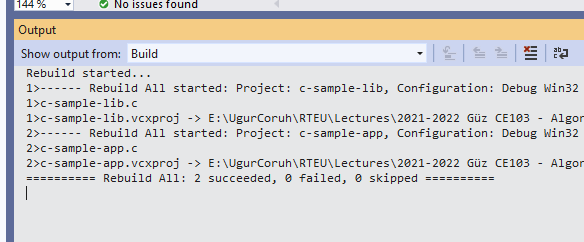

---

<style scoped>section{ font-size: 22px; }</style>

## Shared Library Development - (VS C Static Library)-26

- Also we can only write header name

```c
#include <samplelib.h>
```

---

<style scoped>section{ font-size: 22px; }</style>

## Shared Library Development - (VS C Static Library)-27

- For this option, we need to configure include directories


---

<style scoped>section{ font-size: 22px; }</style>

## Shared Library Development - (VS C Static Library)-28

select c-sample-lib header file location


browse for folder


---

<style scoped>section{ font-size: 22px; }</style>

## Shared Library Development - (VS C Static Library)-29

your full path will be added to your configuration


---

<style scoped>section{ font-size: 22px; }</style>

## Shared Library Development - (VS C Static Library)-30

if you add header file paths to your configuration you can use header files by name in your source code

```c
#include <stdio.h>
#include <samplelib.h>
/// <summary>
///
/// </summary>
/// <returns></returns>
int main()
{
    printf("Hello World!\n");
}
```

---

<style scoped>section{ font-size: 22px; }</style>

## Shared Library Development - (VS C Static Library)-31

- we can compile the following we don't have problems but here we need to configure relative paths for configuration open include library settings and update with relative path

```batch
..\c-sample-lib
```


---

<style scoped>section{ font-size: 22px; }</style>

## Shared Library Development - (VS C Static Library)-32

- now we have portable source code configuration. we can call our functions and then we can update header and library folder configurations.

```c
#include <stdio.h>
#include <samplelib.h>
/// <summary>
///
/// </summary>
/// <returns></returns>
int main()
{
    int result = 0;
    //printf("Hello World!\n");
    result = sum(5, 4);
    sayHelloTo("Computer");
    printf("Result is %d \n",result);
    printf("Press any key to continue...\n");
    getchar();
    return 0;
}
```

---

<style scoped>section{ font-size: 22px; }</style>

## Shared Library Development - (VS C Static Library)-33

- when you run you will see the following outputs, which mean we called library functions.


---

<style scoped>section{ font-size: 22px; }</style>

## Shared Library Development - (VS C Static Library)-34

- A static library is a code-sharing approach if you want to share your source code with your customers then you can share static libraries and header files. In another case you can use a precompiled static library with you or this library can be part of any installation then if there is an installed app and static libraries are placed on the system folder or any different location then you can use configuration files to set library path and included header paths

---

<style scoped>section{ font-size: 22px; }</style>

## Shared Library Development - (VS C Static Library)-35

- Now we can remove the project from c-sample-app references but we will set library file in configuration

Before this copy static library and header files to a folder like that

```c
DebugStaticLibDeployment
```

- Set C/C++ -> General -> Additional Include Directories

There is a bug in configurations and relative path not finding headers so for this reason we will set full path but this is not a good practice for team working

---

<style scoped>section{ font-size: 22px; }</style>

## Shared Library Development - (VS C Static Library)-36

**Not Working Solution**

```c
..\c-sample-lib\DebugStaticLibDeployment
```


---

<style scoped>section{ font-size: 22px; }</style>

## Shared Library Development - (VS C Static Library)-37

**Working Solution**

```c
E:\...\c-lib-sample\c-sample-lib\DebugStaticLibDeployment
```


---

<style scoped>section{ font-size: 22px; }</style>

## Shared Library Development - (VS C Static Library)-38

Now we will set library folder that our static library placed

we will set VC++ Directories -> Library Directories

Here is the same issue if we use relative path it doesn't work we need to set full path for library folder

---

<style scoped>section{ font-size: 22px; }</style>

## Shared Library Development - (VS C Static Library)-39

**Working Solution**

```c
E:\...\c-lib-sample\c-sample-lib\DebugStaticLibDeployment
```

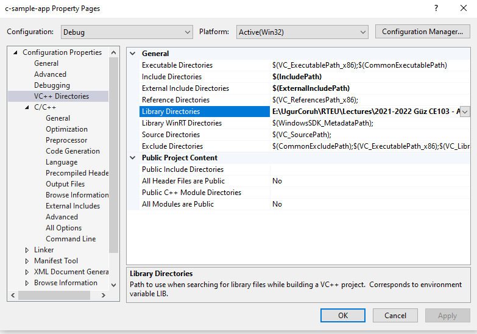

---

<style scoped>section{ font-size: 22px; }</style>

## Shared Library Development - (VS C Static Library)-40


---

<style scoped>section{ font-size: 22px; }</style>

## Shared Library Development - (VS C Static Library)-41

**Not Working**

```c
..\c-sample-lib\DebugStaticLibDeployment
```


---

<style scoped>section{ font-size: 22px; }</style>

## Shared Library Development - (VS C Static Library)-42


---

<style scoped>section{ font-size: 22px; }</style>

## Shared Library Development - (VS C Static Library)-43

If we set full path for both libraries and headers then we need to set library name for project

**Linker->Input->Additional Dependencies**

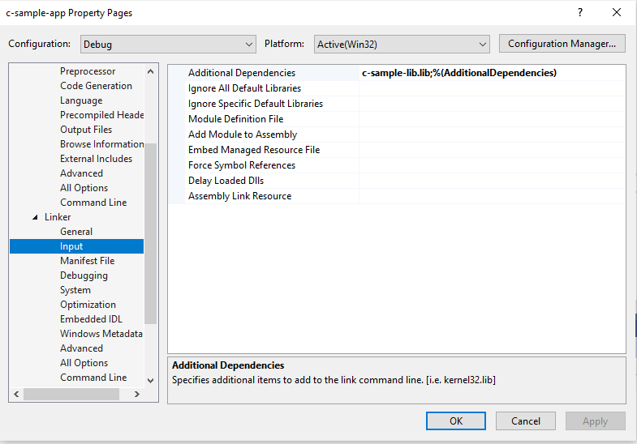

In this case we will compile c-sample-app and we do not need to compile c-sample-lib because we copied output files to a different location and they are ready to use.

---

<style scoped>section{ font-size: 22px; }</style>

## Shared Library Development - (VS C Static Library)-44

current source code will be like that nothing changed

```c
#include <stdio.h>
#include <samplelib.h>

/// <summary>
///
/// </summary>
/// <returns></returns>
int main()
{
    int result = 0;
    //printf("Hello World!\n");
    result = sum(5, 4);
    sayHelloTo("Computer");
    printf("Result is %d \n",result);
    printf("Press any key to continue...\n");
    getchar();
    return 0;
}
```

---

<style scoped>section{ font-size: 22px; }</style>

## Shared Library Development - (VS C Static Library)-45

- and output will be as follow


---

<style scoped>section{ font-size: 22px; }</style>

## Shared Library Development - (VS C Static Library)-46

There is a option about portability that we can set for team works

We will remove all library related settings from configurations and we will write them in source code

Clear linker->general->additional library directories


---

<style scoped>section{ font-size: 22px; }</style>

## Shared Library Development - (VS C Static Library)-47

Clear C/C++ -> General -> Additional Include Directories


---

<style scoped>section{ font-size: 22px; }</style>

## Shared Library Development - (VS C Static Library)-48

Clear Linker->Input->Additional Dependencies

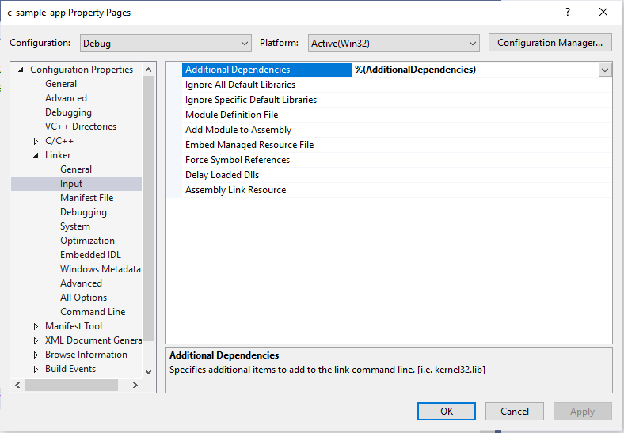

---

<style scoped>section{ font-size: 22px; }</style>

## Shared Library Development - (VS C Static Library)-49

Now we can set this configurations in source code as follow

```c
#pragma comment(lib, "..\\DebugStaticLibDeployment\\c-sample-lib.lib")
#include "..\DebugStaticLibDeployment\samplelib.h"

#include <stdio.h>

/// <summary>
///
/// </summary>
/// <returns></returns>
int main()
{
    int result = 0;
    //printf("Hello World!\n");
    result = sum(5, 4);
    sayHelloTo("Computer");
    printf("Result is %d \n",result);
    printf("Press any key to continue...\n");
    getchar();
    return 0;
}
```

with this configuration if your friends download this code then they can run them with their environment without setting a path.

---

<style scoped>section{ font-size: 30px; }</style>

## Shared Library Development
### C++ Programming (Static Library)
#### Visual Studio Community Edition

---

<style scoped>section{ font-size: 22px; }</style>

## Shared Library Development - (VS Cpp Static Library)-1

- All steps are similar with C programming above, but you do not need to delete pch.h

- You should take care about compiled source codes

- for example if your code is compiled for x86 then your application also should use the x86 configuration else x64 then library should be x64 complied version.

---

<style scoped>section{ font-size: 22px; }</style>

## Shared Library Development - (VS Cpp Static Library)-2

- Source will look like the following

```cpp
// cpp-sample-app.cpp : This file contains the 'main' function. Program execution begins and ends there.
//

#pragma comment(lib, "..\\DebugStaticLibDeployment\\cpp-sample-lib.lib")

#include "..\DebugStaticLibDeployment\samplelib.h"

#include <iostream>

int main()
{
    std::cout << "Hello World!\n";

    int result = 0;
    //printf("Hello World!\n");
    result = sum(5, 4);
    sayHelloTo("Computer");
    printf("Result is %d \n", result);
    printf("Press any key to continue...\n");
    getchar();
    return 0;

}
```

---

<style scoped>section{ font-size: 30px; }</style>

## Shared Library Development
### C++ Programming (Static Library)
#### Visual Studio Community Edition WSL Option

---

<style scoped>section{ font-size: 22px; }</style>

## Shared Library Development - (VS Cpp WSL Static Library)-1

- Install WSL2
    - [GitHub - ucoruh/ns3-wsl-win10-setup: ns3 windows 10 WSL2 setup and usage](https://github.com/ucoruh/ns3-wsl-win10-setup)
- Create a Linux project


---

<style scoped>section{ font-size: 22px; }</style>

## Shared Library Development - (VS Cpp WSL Static Library)-2

- Configure Platform Toolset to WSL


---

<style scoped>section{ font-size: 22px; }</style>

## Shared Library Development - (VS Cpp WSL Static Library)-3

- Select GCC for Windows Subsystem for Linux

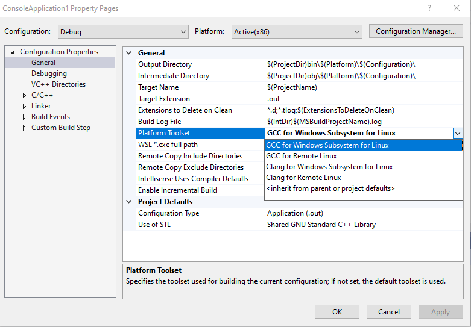

---

<style scoped>section{ font-size: 22px; }</style>

## Shared Library Development - (VS Cpp WSL Static Library)-4

Put a breakpoint and run debugger


---

<style scoped>section{ font-size: 22px; }</style>

## Shared Library Development - (VS Cpp WSL Static Library)-5

In the debugger for WSL you can use local WSL installation but if you want to run it on Release setting it require a SSH connection.


---

<style scoped>section{ font-size: 22px; }</style>

## Shared Library Development - (VS Cpp WSL Static Library)-6

- Configure SSH parameters


---

<style scoped>section{ font-size: 22px; }</style>

## Shared Library Development - (VS Cpp WSL Static Library)-7

- so you have to complete the following steps.
- C/C++ Remote Linux Option over SSH
    - Enable SSH
        - [SSH on Windows Subsystem for Linux (WSL) | Illuminia Studios](https://www.illuminiastudios.com/dev-diaries/ssh-on-windows-subsystem-for-linux/)
    - Connect to Remote WSL Environment
        - [Bağlan hedef Linux sisteminize Visual Studio | Microsoft Docs](https://docs.microsoft.com/tr-tr/cpp/linux/connect-to-your-remote-linux-computer?view=msvc-160)

---

<style scoped>section{ font-size: 22px; }</style>

## Shared Library Development
### C# Programming (Dinamik Library)
#### Visual Studio Community Edition

---

<style scoped>section{ font-size: 22px; }</style>

## Shared Library Development - (VS Csharp Dynamic Library)-1


- In C# project we will create class library we have several options 
- for this sample we will select .NET core that we can build cross platform library


---

<style scoped>section{ font-size: 22px; }</style>

## Shared Library Development - (VS Csharp Dynamic Library)-2

- <mark>There is no static library option</mark>


---

<style scoped>section{ font-size: 22px; }</style>

## Shared Library Development - (VS Csharp Dynamic Library)-3

- We will select .Net Core 3.1

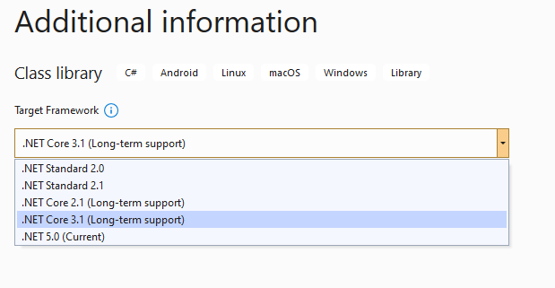

---

<style scoped>section{ font-size: 22px; }</style>

## Shared Library Development - (VS Csharp Dynamic Library)-4

- You will have default empty class library file


---

<style scoped>section{ font-size: 22px; }</style>

## Shared Library Development - (VS Csharp Dynamic Library)-5

- In the project you can see .NETcore reference


---

<style scoped>section{ font-size: 22px; }</style>

## Shared Library Development - (VS Csharp Dynamic Library)-6

- We can build empty class library that generate dll for our application


---

<style scoped>section{ font-size: 22px; }</style>

## Shared Library Development - (VS Csharp Dynamic Library)-7

- Now we will add Console Application but this will also use .NETCore

---

<style scoped>section{ font-size: 22px; }</style>

## Shared Library Development - (VS Csharp Dynamic Library)-8

- Select New Project


---

<style scoped>section{ font-size: 25px; }</style>

## Shared Library Development - (VS Csharp Dynamic Library)-9

- Set project name

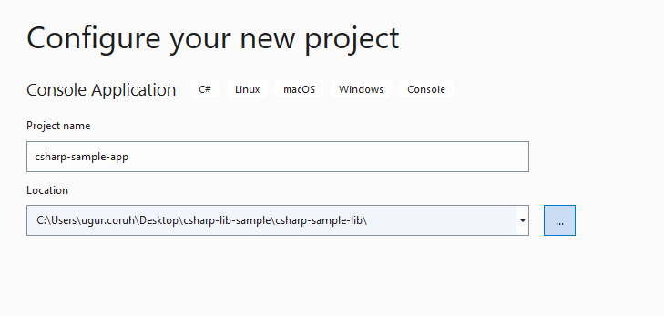

---

<style scoped>section{ font-size: 25px; }</style>

## Shared Library Development - (VS Csharp Dynamic Library)-10

- Select .NETCore framework


---

<style scoped>section{ font-size: 25px; }</style>

## Shared Library Development - (VS Csharp Dynamic Library)-11

- You will have the following sample main.cs file

```csharp
using System;

namespace csharp_sample_app
{
    class Program
    {
        static void Main(string[] args)
        {
            Console.WriteLine("Hello World!");
        }
    }
}
```

---

<style scoped>section{ font-size: 25px; }</style>

## Shared Library Development - (VS Csharp Dynamic Library)-12

- Now we can link projects with adding references open reference section


---

<style scoped>section{ font-size: 25px; }</style>

## Shared Library Development - (VS Csharp Dynamic Library)-13

- browse for class library project output folder and select output dll file for console application


---

<style scoped>section{ font-size: 25px; }</style>

## Shared Library Development - (VS Csharp Dynamic Library)-14

- now we can update our library code and use it in console application

- copy following sample to sampleLibClass file in the library

---

<style scoped>section{ font-size: 25px; }</style>

## Shared Library Development - (VS Csharp Dynamic Library)-15

```csharp
using System;

namespace csharp_sample_lib
{
    public class sampleLibClass
    {
        public static void sayHelloTo(string name)
        {
            if (!String.IsNullOrEmpty(name))
            {
                Console.WriteLine("Hello " + name);
            }
            else
            {
                Console.WriteLine("Hello There");
            }

        }

        public static int sum(int a, int b)
        {
            int c = 0;
            c = a + b;
            return c;
        }
    }
}
```

---

<style scoped>section{ font-size: 25px; }</style>

## Shared Library Development - (VS Csharp Dynamic Library)-16

- After this operation copy following sample to console application and build app then you can run

```csharp
using csharp_sample_lib;
using System;

namespace csharp_sample_app
{
    class Program
    {
        static void Main(string[] args)
        {
            Console.WriteLine("Hello World!");

            sampleLibClass.sayHelloTo("Computer");
            int result = sampleLibClass.sum(5, 4);
            Console.WriteLine("Results is" + result);
            Console.WriteLine("Results is {0}", result);
            Console.Read();
        }
    }
}
```

---

<style scoped>section{ font-size: 25px; }</style>

## Shared Library Development - (VS Csharp Dynamic Library)-17

- You will see following output that mean we called DLL functions


---

<style scoped>section{ font-size: 25px; }</style>

## Shared Library Development - (VS Csharp Dynamic Library)-18

- Also we can publish this console application with dll for linux environment or others

- for linux environment we should install .NETCore

---

<style scoped>section{ font-size: 25px; }</style>

## Shared Library Development - (VS Csharp Dynamic Library)-19

- follow the link below or commands that I shared with you as below for deployment

- [How to Install Dotnet Core on Ubuntu 20.04 &ndash; TecAdmin](https://tecadmin.net/how-to-install-net-core-on-ubuntu-20-04/)

Step 1 – Enable Microsoft PPA

```batch
 wget https://packages.microsoft.com/config/ubuntu/20.04/packages-microsoft-prod.deb
sudo dpkg -i packages-microsoft-prod.deb
```

---

<style scoped>section{ font-size: 25px; }</style>

## Shared Library Development - (VS Csharp Dynamic Library)-20

Step 2 – Installing Dotnet Core SDK

```batch
sudo apt update
sudo apt install apt-transport-https
sudo apt install dotnet-sdk-3.1
```

---

<style scoped>section{ font-size: 25px; }</style>

## Shared Library Development - (VS Csharp Dynamic Library)-21

Step 3 – Install Dotnet Core Runtime Only

To install .NET Core Runtime on Ubuntu 20.04 LTS system, execute the commands:

```batch
sudo apt update
```

---

<style scoped>section{ font-size: 25px; }</style>

## Shared Library Development - (VS Csharp Dynamic Library)-22

To install the previous version of .Net core runtime 2.1, type:

```batch
sudo apt install dotnet-runtime-2.1
```

Press “y” for any input prompted by the installer.

---

<style scoped>section{ font-size: 25px; }</style>

## Shared Library Development - (VS Csharp Dynamic Library)-23

Step 4 – (Optional) Check .NET Core Version

You can use dotnet command line utility to check installed version of .NET Core on your system. To check dotnet version, type:

```
dotnet --version
```


---

<style scoped>section{ font-size: 25px; }</style>

## Shared Library Development - (VS Csharp Dynamic Library)-24

- Now we will publish our application as single executable
- Open publish menu


---

<style scoped>section{ font-size: 25px; }</style>

## Shared Library Development - (VS Csharp Dynamic Library)-25

- Select netcoreapp3.1 and Release for linux-x64


---

<style scoped>section{ font-size: 25px; }</style>

## Shared Library Development - (VS Csharp Dynamic Library)-26

- Select produce single file


---

<style scoped>section{ font-size: 25px; }</style>

## Shared Library Development - (VS Csharp Dynamic Library)-27

- After succesfull publish you will have linux binary that you can run with WSL


---

<style scoped>section{ font-size: 25px; }</style>

## Shared Library Development - (VS Csharp Dynamic Library)-28

- Open WSL and enter the path where this folder located
- And run application as follow

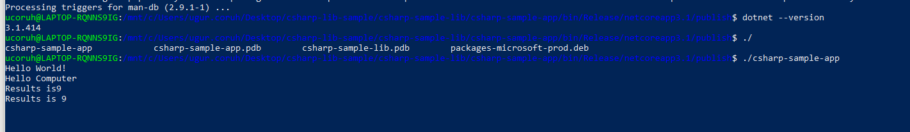

---

<style scoped>section{ font-size: 25px; }</style>

## Shared Library Development - (VS Csharp Dynamic Library)-29

check dotnet --version and then run application


- you will see similar output


---

<style scoped>section{ font-size: 25px; }</style>

## Shared Library Development - (VS Csharp Dynamic Library)-30

In this sample we created single application from settings lets try with shared library located option uncheck the "produce single file" option and publish again.

Then you will have the following outputs


---

<style scoped>section{ font-size: 25px; }</style>

## Shared Library Development - (VS Csharp Dynamic Library)-31

- If you run csharp-sample-app

- you will have the same output

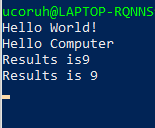

---

<style scoped>section{ font-size: 30px; }</style>

## Shared Library Development
### Java Programming
#### Eclipse IDE

---

<style scoped>section{ font-size: 25px; }</style>

## Shared Library Development - (Eclipse Java Jar Library)-1


- You should download and install eclipse installer and then you should select Eclipse IDE for Java Developers
    - [Eclipse Installer 2021-09 R | Eclipse Packages](https://www.eclipse.org/downloads/packages/installer)

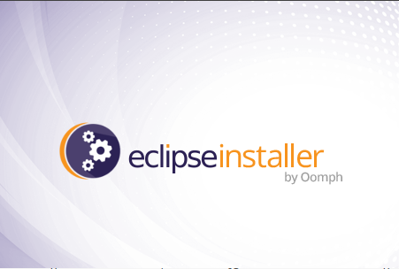

---

<style scoped>section{ font-size: 25px; }</style>

## Shared Library Development - (Eclipse Java Jar Library)-2


---

<style scoped>section{ font-size: 25px; }</style>

## Shared Library Development - (Eclipse Java Jar Library)-3


---

<style scoped>section{ font-size: 25px; }</style>

## Shared Library Development - (Eclipse Java Jar Library)-4


---

<style scoped>section{ font-size: 25px; }</style>

## Shared Library Development - (Eclipse Java Jar Library)-5

- select create a project

<TODO>


---

<style scoped>section{ font-size: 25px; }</style>

## Shared Library Development - (Eclipse Java Jar Library)-6

select java project


---

<style scoped>section{ font-size: 25px; }</style>

## Shared Library Development - (Eclipse Java Jar Library)-7

- give project name


---

<style scoped>section{ font-size: 25px; }</style>

## Shared Library Development - (Eclipse Java Jar Library)-8

- select finish


---

<style scoped>section{ font-size: 25px; }</style>

## Shared Library Development - (Eclipse Java Jar Library)-9

- first we need to add a default package to keep everything organized


---

<style scoped>section{ font-size: 25px; }</style>

## Shared Library Development - (Eclipse Java Jar Library)-10

- then we can create our class that includes our functions


---

<style scoped>section{ font-size: 25px; }</style>

## Shared Library Development - (Eclipse Java Jar Library)-11

- give class a name

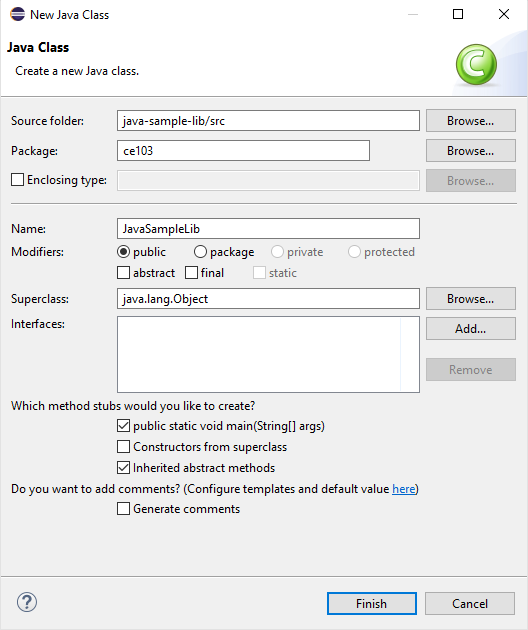

---

<style scoped>section{ font-size: 25px; }</style>

## Shared Library Development - (Eclipse Java Jar Library)-12

- you will have following class with main


---

<style scoped>section{ font-size: 25px; }</style>

## Shared Library Development - (Eclipse Java Jar Library)-13

- We will create sample java library with static functions as below.

```java
package ce103;

import java.io.IOException;

public class JavaSampleLib {

    public static void sayHelloTo(String name) {
        if(name.isBlank() || name.isEmpty())
        {
            System.out.println("Hello "+name);
        }else {
            System.out.println("Hello There");
        }
    }

    public static int sum(int a,int b)
    {
        int c = 0;
        c = a+b;
        return c;
    }

    public static void main(String[] args) {
        // TODO Auto-generated method stub
        System.out.println("Hello World!");

        JavaSampleLib.sayHelloTo("Computer");
        int result = JavaSampleLib.sum(5, 4);
        System.out.println("Results is" + result);
        System.out.printf("Results is %d \n", result);


        try {
            System.in.read();
        } catch (IOException e) {
            // TODO Auto-generated catch block
            e.printStackTrace();
        }

    }

}
```

---

<style scoped>section{ font-size: 25px; }</style>

## Shared Library Development - (Eclipse Java Jar Library)-14

also we can add main method to run our library functions. If we run this file its process main function


---

<style scoped>section{ font-size: 25px; }</style>

## Shared Library Development - (Eclipse Java Jar Library)-15

- we can see output from console as below


---

<style scoped>section{ font-size: 25px; }</style>

## Shared Library Development - (Eclipse Java Jar Library)-16

- There is no exe files java runtime environment run class files but we can export this as an executable.


---

<style scoped>section{ font-size: 25px; }</style>

## Shared Library Development - (Eclipse Java Jar Library)-17

- Select Java->Runnable JAR File


---

<style scoped>section{ font-size: 25px; }</style>

## Shared Library Development - (Eclipse Java Jar Library)-18

click next and set output path for jar file


---

<style scoped>section{ font-size: 25px; }</style>

## Shared Library Development - (Eclipse Java Jar Library)-19

- If our project has several external dependecy then we can extract this required files (jar, so, dll) in seperated folder or we can combine them and generate a single executable jar

- Lets pack everthing together, Select launch configuration that has main function


---

<style scoped>section{ font-size: 25px; }</style>

## Shared Library Development - (Eclipse Java Jar Library)-20

end of this operation we will have the following jar that we can by click


---

<style scoped>section{ font-size: 20px; }</style>

## Shared Library Development - (Eclipse Java Jar Library)-21

- When you click application if cannot run then try command line to see problem

- enter jar folder and run the following command

```batch
java -jar JavaSampleLibExecutable.jar
```


In my case eclipse build JDK is newer than that I installed and set for my OS

If we check version we can see problem Java version 1.8.0_231


---

<style scoped>section{ font-size: 25px; }</style>

## Shared Library Development - (Eclipse Java Jar Library)-22

We can found installed and builded JDK for our application from Eclipse setting

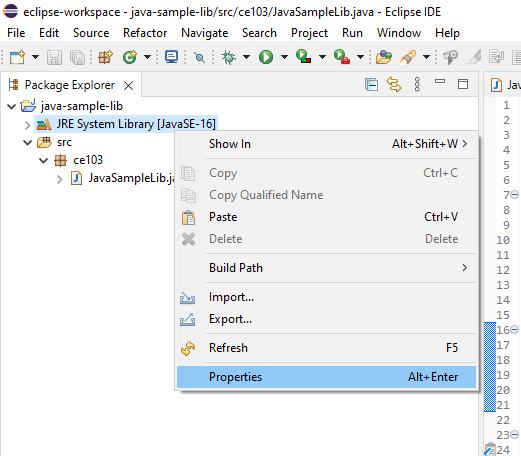

---

<style scoped>section{ font-size: 25px; }</style>

## Shared Library Development - (Eclipse Java Jar Library)-23

- select environments


---

<style scoped>section{ font-size: 25px; }</style>

## Shared Library Development - (Eclipse Java Jar Library)-24

- select installed JRE or JDK


---

<style scoped>section{ font-size: 25px; }</style>

## Shared Library Development - (Eclipse Java Jar Library)-25

- you can see installed JRE or JDK home

```batch
C:\Program Files\Java\jdk-16.0.1
```


---

<style scoped>section{ font-size: 25px; }</style>

## Shared Library Development - (Eclipse Java Jar Library)-26

- Open system environment to fix this problem


---

<style scoped>section{ font-size: 25px; }</style>

## Shared Library Development - (Eclipse Java Jar Library)-27

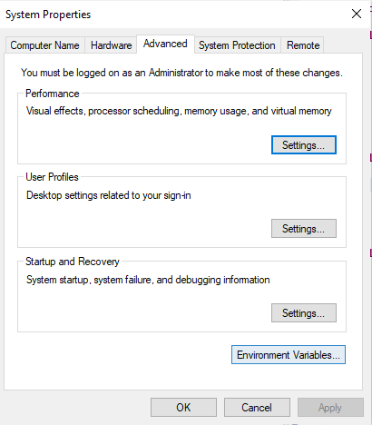

---

<style scoped>section{ font-size: 25px; }</style>

## Shared Library Development - (Eclipse Java Jar Library)-28

- Check user settings first

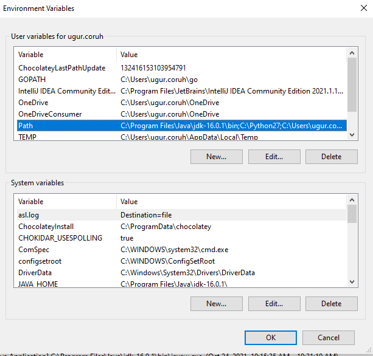

---

<style scoped>section{ font-size: 25px; }</style>

## Shared Library Development - (Eclipse Java Jar Library)-29


---

<style scoped>section{ font-size: 25px; }</style>

## Shared Library Development - (Eclipse Java Jar Library)-30

- Check system settings


---

<style scoped>section{ font-size: 25px; }</style>

## Shared Library Development - (Eclipse Java Jar Library)-31


---

<style scoped>section{ font-size: 25px; }</style>

## Shared Library Development - (Eclipse Java Jar Library)-32

- we will move up the JDK 16 configuration then command line will run first java


---

<style scoped>section{ font-size: 25px; }</style>

## Shared Library Development - (Eclipse Java Jar Library)-33

- Also in system setting check JAVA_HOME


---

<style scoped>section{ font-size: 25px; }</style>

## Shared Library Development - (Eclipse Java Jar Library)-34

- After this settings close current command line and open new one
- Write

```batch
java --version
```

- if you see java version updated and 16.0.1 then settings are correct


---

<style scoped>section{ font-size: 25px; }</style>

## Shared Library Development - (Eclipse Java Jar Library)-35

and now if we enter and run application as follow we will see output


---

<style scoped>section{ font-size: 25px; }</style>

## Shared Library Development - (Eclipse Java Jar Library)-36

- But when you click this jar its not running as you see so we have options to provide a clickable application there
- Launch4j is an option here
    - [Launch4j - Cross-platform Java executable wrapper](http://launch4j.sourceforge.net/index.html)


---

<style scoped>section{ font-size: 25px; }</style>

## Shared Library Development - (Eclipse Java Jar Library)-37

- you can watch this tutorial also
    - [How to convert jar to exe using Launch4J Full explanation - YouTube](https://www.youtube.com/watch?v=MyMPPuYGN-U&ab_channel=GoXR3PlusStudio)

---

<style scoped>section{ font-size: 25px; }</style>

## Shared Library Development - (Eclipse Java Jar Library)-38

- Download and install launch4j and open application


---

<style scoped>section{ font-size: 25px; }</style>

## Shared Library Development - (Eclipse Java Jar Library)-39

- Configure your application settings similar to below select jar file and exe output path


---

<style scoped>section{ font-size: 25px; }</style>

## Shared Library Development - (Eclipse Java Jar Library)-40

- We can customize main class if have multiple main class


---

<style scoped>section{ font-size: 25px; }</style>

## Shared Library Development - (Eclipse Java Jar Library)-41

select console from setting for this application


---

<style scoped>section{ font-size: 25px; }</style>

## Shared Library Development - (Eclipse Java Jar Library)-42

- we can provide a single running application, this setting avoid to run multiple instances


---

<style scoped>section{ font-size: 25px; }</style>

## Shared Library Development - (Eclipse Java Jar Library)-43

- we need to set runtime environment versions


---

<style scoped>section{ font-size: 25px; }</style>

## Shared Library Development - (Eclipse Java Jar Library)-44

you can set system parameters before running application


---

<style scoped>section{ font-size: 25px; }</style>

## Shared Library Development - (Eclipse Java Jar Library)-45

- with splash screen you can show a splash screen image for your application


---

<style scoped>section{ font-size: 25px; }</style>

## Shared Library Development - (Eclipse Java Jar Library)-46

- File attributes such as version product information is configured from version info tab


---

<style scoped>section{ font-size: 25px; }</style>

## Shared Library Development - (Eclipse Java Jar Library)-47

if your application runtime condition has an error then you can show this customized messages also


---

<style scoped>section{ font-size: 25px; }</style>

## Shared Library Development - (Eclipse Java Jar Library)-48

- with this options save configuration file xml


---

<style scoped>section{ font-size: 25px; }</style>

## Shared Library Development - (Eclipse Java Jar Library)-49

- and compile settings


---

<style scoped>section{ font-size: 25px; }</style>

## Shared Library Development - (Eclipse Java Jar Library)-50

- You will see generated output file in log screen

```batch
Compiling resources
Linking
Wrapping
WARNING: Sign the executable to minimize antivirus false positives or use launching instead of wrapping.
Successfully created C:\Users\ugur.coruh\Desktop\java-export-sample\JavaSampleLibExecutable.exe
```

---

<style scoped>section{ font-size: 25px; }</style>

## Shared Library Development - (Eclipse Java Jar Library)-51

- now we can run exe by click


---

<style scoped>section{ font-size: 25px; }</style>

## Shared Library Development - (Eclipse Java Jar Library)-52

another option here adding a bat file to run current jar file

---

<style scoped>section{ font-size: 25px; }</style>

## Shared Library Development - (Eclipse Java Jar Library)-53

**JavaSampleLibExecutable.bat**

```batch
java -jar JavaSampleLibExecutable.jar
```


- if we click bat file then we will automate command line task for current jar file


---

<style scoped>section{ font-size: 25px; }</style>

## Shared Library Development - (Eclipse Java Jar Library)-54

Now return back to our java library and create another console application that use library functions


---

<style scoped>section{ font-size: 25px; }</style>

## Shared Library Development - (Eclipse Java Jar Library)-55


---

<style scoped>section{ font-size: 25px; }</style>

## Shared Library Development - (Eclipse Java Jar Library)-56


---

<style scoped>section{ font-size: 25px; }</style>

## Shared Library Development - (Eclipse Java Jar Library)-57

- You can set libraries in this step from but our library should exported for our solution


---

<style scoped>section{ font-size: 25px; }</style>

## Shared Library Development - (Eclipse Java Jar Library)-58

- Select Add External JARs...


---

<style scoped>section{ font-size: 25px; }</style>

## Shared Library Development - (Eclipse Java Jar Library)-59

- Open Exported jar folder and select


---

<style scoped>section{ font-size: 25px; }</style>

## Shared Library Development - (Eclipse Java Jar Library)-60

- Or we can select by Add jar from current workspace


---

<style scoped>section{ font-size: 25px; }</style>

## Shared Library Development - (Eclipse Java Jar Library)-61

but in this step I won't add anything I'll add references later


---

<style scoped>section{ font-size: 25px; }</style>

## Shared Library Development - (Eclipse Java Jar Library)-62

- we will have the following project


---

<style scoped>section{ font-size: 25px; }</style>

## Shared Library Development - (Eclipse Java Jar Library)-63

- lets create a package

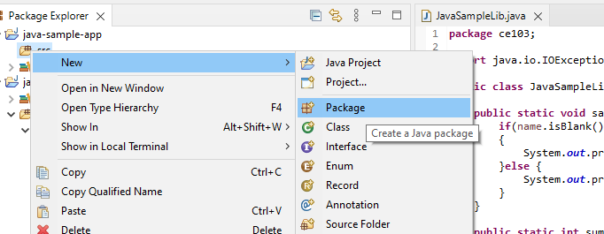

---

<style scoped>section{ font-size: 25px; }</style>

## Shared Library Development - (Eclipse Java Jar Library)-64


---

<style scoped>section{ font-size: 25px; }</style>

## Shared Library Development - (Eclipse Java Jar Library)-65

- and lets create a main class for our application


---

<style scoped>section{ font-size: 25px; }</style>

## Shared Library Development - (Eclipse Java Jar Library)-66

- check create main function


---

<style scoped>section{ font-size: 25px; }</style>

## Shared Library Development - (Eclipse Java Jar Library)-67


---

<style scoped>section{ font-size: 25px; }</style>

## Shared Library Development - (Eclipse Java Jar Library)-68

- right click to project and add reference


---

<style scoped>section{ font-size: 25px; }</style>

## Shared Library Development - (Eclipse Java Jar Library)-69

- you can enter same configurations from project properties


---

<style scoped>section{ font-size: 25px; }</style>

## Shared Library Development - (Eclipse Java Jar Library)-70

Lets export our library as a JAR file and then add to our classpath

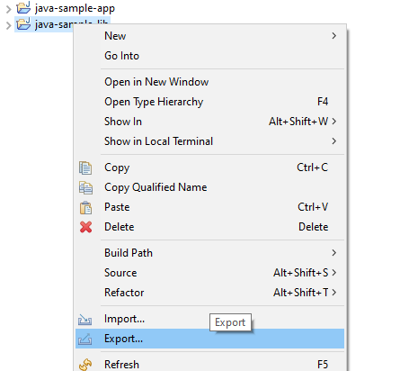

---

<style scoped>section{ font-size: 25px; }</style>

## Shared Library Development - (Eclipse Java Jar Library)-71

Select JAR file


---

<style scoped>section{ font-size: 25px; }</style>

## Shared Library Development - (Eclipse Java Jar Library)-72

we configured output as

```batch
C:\Users\ugur.coruh\Desktop\java-export-sample\JavaSampleLib.jar
```


---

<style scoped>section{ font-size: 25px; }</style>

## Shared Library Development - (Eclipse Java Jar Library)-73


---

<style scoped>section{ font-size: 25px; }</style>

## Shared Library Development - (Eclipse Java Jar Library)-74


---

<style scoped>section{ font-size: 25px; }</style>

## Shared Library Development - (Eclipse Java Jar Library)-75

In the same export folder now we have JavaSampleLib.jar


---

<style scoped>section{ font-size: 25px; }</style>

## Shared Library Development - (Eclipse Java Jar Library)-76

return back to java-sample-app and then add this jar file to our project

Build Path->Add External Archives


---

<style scoped>section{ font-size: 25px; }</style>

## Shared Library Development - (Eclipse Java Jar Library)-77

you will see its added to reference libraries


---

<style scoped>section{ font-size: 20px; }</style>

## Shared Library Development - (Eclipse Java Jar Library)-78

in our JavaSampleApp.java we can use the following source codes

```java
package ce103;

import java.io.IOException;

public class JavaSampleApp {

    public static void main(String[] args) {
        // TODO Auto-generated method stub

        System.out.println("Hello World!");

        JavaSampleLib.sayHelloTo("Computer");
        int result = JavaSampleLib.sum(5, 4);
        System.out.println("Results is" + result);
        System.out.printf("Results is %d \n", result);


        try {
            System.in.read();
        } catch (IOException e) {
            // TODO Auto-generated catch block
            e.printStackTrace();
        }

    }

}
```

---

<style scoped>section{ font-size: 25px; }</style>

## Shared Library Development - (Eclipse Java Jar Library)-79

When we run application we will see similar output


---

<style scoped>section{ font-size: 25px; }</style>

## Shared Library Development - (Eclipse Java Jar Library)-80

Lets export this application with its dependent library


---

<style scoped>section{ font-size: 25px; }</style>

## Shared Library Development - (Eclipse Java Jar Library)-81

Select runnable jar


---

<style scoped>section{ font-size: 25px; }</style>

## Shared Library Development - (Eclipse Java Jar Library)-82

Set Launch configuration and Export destination

```batch
C:\Users\ugur.coruh\Desktop\java-export-sample\JavaSampleAppSingle.jar
```

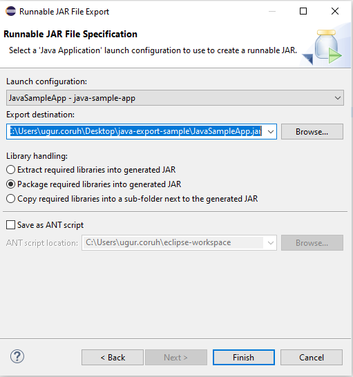

---

<style scoped>section{ font-size: 25px; }</style>

## Shared Library Development - (Eclipse Java Jar Library)-83

In this option we will have single jar file

In the export folder we do not see reference libraries


and we can run with command line


---

<style scoped>section{ font-size: 25px; }</style>

## Shared Library Development - (Eclipse Java Jar Library)-84

only change copy required libraries setting and then give a new name for new jar file and export

```batch
C:\Users\ugur.coruh\Desktop\java-export-sample\JavaSampleAppMultiple.jar
```


---

<style scoped>section{ font-size: 25px; }</style>

## Shared Library Development - (Eclipse Java Jar Library)-85

now we have a folder that contains our libraries referenced


---

<style scoped>section{ font-size: 25px; }</style>

## Shared Library Development - (Eclipse Java Jar Library)-86

in this file we can find our library


---

<style scoped>section{ font-size: 25px; }</style>

## Shared Library Development - (Eclipse Java Jar Library)-87

if we test our application we will see it will work


if we delete JavaSampleLib.jar and then try running application we will get error


---


## Application Testing
- C
- C++
- C#
- Java

---

<style scoped>section{ font-size: 25px; }</style>

## Unit Test Development

Wikipedia Unit Test Library List for Each Language

https://en.wikipedia.org/wiki/List_of_unit_testing_frameworks

---

<style scoped>section{ font-size: 25px; }</style>

#### Visual Studio Community Edition
##### C Unit Tests

---

<style scoped>section{ font-size: 25px; }</style>

#### Visual Studio Community Edition - C Unit Tests

- There is no direct C source testing but with additional frameworks. Visual Studio can test C sources. 
- You can check the following entry
    -  https://stackoverflow.com/questions/65820/unit-testing-c-code
- Recommended framework is Check 
    - https://libcheck.github.io/check/web/install.html
    - https://github.com/libcheck/check/releases

---

<style scoped>section{ font-size: 25px; }</style>

#### Visual Studio Community Edition
##### C++ Unit Tests

---

<style scoped>section{ font-size: 25px; }</style>

#### Visual Studio Community Edition - C++ Unit Tests-1

- [C/C++ için birim testleri yazma - Visual Studio (Windows) | Microsoft Docs](https://docs.microsoft.com/tr-tr/visualstudio/test/writing-unit-tests-for-c-cpp?view=vs-2019)

---

<style scoped>section{ font-size: 25px; }</style>

#### Visual Studio Community Edition - C++ Unit Tests-2

- Use cpp-sample-lib project and add


---

<style scoped>section{ font-size: 25px; }</style>

#### Visual Studio Community Edition - C++ Unit Tests-3

- Select Native Unit Test


---

<style scoped>section{ font-size: 25px; }</style>

#### Visual Studio Community Edition - C++ Unit Tests-4

- Set project path and name


---

<style scoped>section{ font-size: 25px; }</style>

#### Visual Studio Community Edition - C++ Unit Tests-5

- You will have `cpp-sample-test` project


---

<style scoped>section{ font-size: 25px; }</style>

#### Visual Studio Community Edition - C++ Unit Tests-6

- Add library project from references

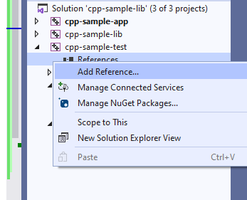

---

<style scoped>section{ font-size: 25px; }</style>

#### Visual Studio Community Edition - C++ Unit Tests-7

- Add `cpp-sample-lib` to `cpp-sample-test` project


---

<style scoped>section{ font-size: 25px; }</style>

#### Visual Studio Community Edition - C++ Unit Tests-8

**cpp-sample-test.cpp**

```cpp
#include "pch.h"
#include "CppUnitTest.h"
#include "..\cpp-sample-lib\samplelib.h"

using namespace Microsoft::VisualStudio::CppUnitTestFramework;

namespace cppsampletest
{
    TEST_CLASS(cppsampletest)
    {
    public:

        TEST_METHOD(TestSumCorrect)
        {
            Assert::AreEqual(9, sum(4, 5));
        }

        TEST_METHOD(TestSumInCorrect)
        {
            Assert::AreEqual(10, sum(4, 5));
        }
    };
}
```

---

<style scoped>section{ font-size: 25px; }</style>

#### Visual Studio Community Edition - C++ Unit Tests-9


---

<style scoped>section{ font-size: 25px; }</style>

#### Visual Studio Community Edition
##### C# Unit Tests
- MSTest + .Net
- Fine Code Coverage
- NUnit + .NetCore

---

<style scoped>section{ font-size: 25px; }</style>

### Visual Studio Community Edition (C# Unit Test + MSTestV2+.Net)-1

- Install extension fine code coverage

https://marketplace.visualstudio.com/items?itemName=FortuneNgwenya.FineCodeCoverage

---

<style scoped>section{ font-size: 25px; }</style>

### Visual Studio Community Edition (C# Unit Test + MSTestV2+.Net)-2

- Create a .Net Framework Library


---

<style scoped>section{ font-size: 25px; }</style>

### Visual Studio Community Edition (C# Unit Test + MSTestV2+.Net)-3

- Set project framework and path


---

<style scoped>section{ font-size: 25px; }</style>

### Visual Studio Community Edition (C# Unit Test + MSTestV2+.Net)-4

- Create library functions

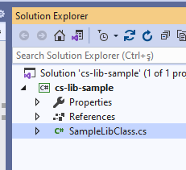

---

<style scoped>section{ font-size: 25px; }</style>

### Visual Studio Community Edition (C# Unit Test + MSTestV2+.Net)-5

```csharp
using System;
using System.Collections.Generic;
using System.Text;

namespace cs_lib_sample
{
    public class SampleLibClass
    {
        public static string sayHelloTo(string name)
        {
            string result = String.Empty;

            if (!String.IsNullOrEmpty(name))
            {
                result = "Hello " + name;
            }
            else
            {
                result = "Hello There";
            }

            Console.WriteLine(result);

            return result;
        }

        public static int sum(int a, int b)
        {
            int c = 0;
            c = a + b;
            return c;
        }

        public int multiply(int a, int b)
        {
            return a * b;
        }
    }
}
```

---

<style scoped>section{ font-size: 25px; }</style>

### Visual Studio Community Edition (C# Unit Test + MSTestV2+.Net)-6

- Right click and then create unit test project


---

<style scoped>section{ font-size: 25px; }</style>

### Visual Studio Community Edition (C# Unit Test + MSTestV2+.Net)-7

- Press OK


---

<style scoped>section{ font-size: 25px; }</style>

### Visual Studio Community Edition (C# Unit Test + MSTestV2+.Net)-8

- Enter test code

```csharp
using Microsoft.VisualStudio.TestTools.UnitTesting;
using cs_lib_sample;
using System;
using System.Collections.Generic;
using System.Linq;
using System.Text;
using System.Threading.Tasks;

namespace cs_lib_sample.Tests
{
    [TestClass()]
    public class SampleLibClassTests
    {

        [TestMethod()]
        public void testSayHelloTo()
        {


            Assert.AreEqual("Hello Computer", SampleLibClass.sayHelloTo("Computer"), "Regular say hello should work");
        }
        [TestMethod()]
        public void testSayHelloToWrong()
        {
            Assert.AreEqual("Hello All", SampleLibClass.sayHelloTo("Computer"), "Regular say hello won't work");
        }


        [TestMethod()]
        public void testSumCorrect()
        {
            Assert.AreEqual(9, SampleLibClass.sum(4, 5), "Regular sum should work");
        }

        [TestMethod()]
        public void testSumWrong()
        {
            Assert.AreEqual(10, SampleLibClass.sum(4, 5), "Regular sum shouldn't work");
        }

        [TestMethod()]
        public void testMultiply()
        {
            SampleLibClass sampleLib = new SampleLibClass();

            Assert.AreEqual(20, sampleLib.multiply(4, 5), "Regular multiplication should work");
        }


    }
}
```

---

<style scoped>section{ font-size: 25px; }</style>

### Visual Studio Community Edition (C# Unit Test + MSTestV2+.Net)-9

- Run tests


---

<style scoped>section{ font-size: 25px; }</style>

### Visual Studio Community Edition (C# Unit Test + MSTestV2+.Net)-10

you will code coverage and entered or passed branches


---

<style scoped>section{ font-size: 25px; }</style>

#### Visual Studio Community Edition 
##### C# Unit Test + NUnit + .NETCore


---

<style scoped>section{ font-size: 25px; }</style>

#### Visual Studio Community Edition (C# Unit Test+NUnit+.NETCore)-1

- Use `cshar-sample-lib` for this example
- Create and add a unit test project to solution


---

<style scoped>section{ font-size: 25px; }</style>

#### Visual Studio Community Edition (C# Unit Test+NUnit+.NETCore)-2


---

<style scoped>section{ font-size: 25px; }</style>

#### Visual Studio Community Edition (C# Unit Test+NUnit+.NETCore)-3


---

<style scoped>section{ font-size: 25px; }</style>

#### Visual Studio Community Edition (C# Unit Test+NUnit+.NETCore)-4

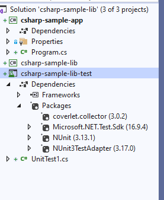

---

<style scoped>section{ font-size: 25px; }</style>

#### Visual Studio Community Edition (C# Unit Test+NUnit+.NETCore)-5

- Add project reference


---

<style scoped>section{ font-size: 25px; }</style>

#### Visual Studio Community Edition (C# Unit Test+NUnit+.NETCore)-6


---

<style scoped>section{ font-size: 25px; }</style>

#### Visual Studio Community Edition (C# Unit Test+NUnit+.NETCore)-7

SampleLibraryTestClasss in NUnit Project

```csharp
using csharp_sample_lib;
using NUnit.Framework;

namespace csharp_sample_lib_test
{
    public class SampleLibraryTestClass
    {
        sampleLibClass sampleLib;

        [SetUp]
        public void Setup()
        {
            sampleLib = new sampleLibClass();
        }

        [Test]
        public void testSayHelloTo()
        {
            Assert.AreEqual("Hello Computer", sampleLibClass.sayHelloTo("Computer"), "Regular say hello should work");
        }

        [Test]
        public void testSayHelloToWrong()
        {
            Assert.AreEqual("Hello All", sampleLibClass.sayHelloTo("Computer"), "Regular say hello won't work");
        }


        [Test]
        public void testSumCorrect()
        {
            Assert.AreEqual(9, sampleLibClass.sum(4, 5), "Regular sum should work");
        }

        [Test]
        public void testSumWrong()
        {
            Assert.AreEqual(10, sampleLibClass.sum(4, 5), "Regular sum shouldn't work");
        }

        [Test]
        public void testMultiply()
        {
            Assert.AreEqual(20, sampleLib.multiply(4, 5), "Regular multiplication should work");
        }
    }
}
```

---

<style scoped>section{ font-size: 25px; }</style>

#### Visual Studio Community Edition (C# Unit Test+NUnit+.NETCore)-8

- Sample class library

```csharp
using System;

namespace csharp_sample_lib
{
    public class sampleLibClass
    {
        public static string sayHelloTo(string name)
        {
            string result = String.Empty;

            if (!String.IsNullOrEmpty(name))
            {
                result = "Hello " + name;
            }
            else
            {
                result = "Hello There";
            }

            Console.WriteLine(result);

            return result;
        }

        public static int sum(int a, int b)
        {
            int c = 0;
            c = a + b;
            return c;
        }

        public int multiply(int a, int b)
        {
            return a * b;
        }
    }
}
```

---

<style scoped>section{ font-size: 25px; }</style>

#### Visual Studio Community Edition (C# Unit Test+NUnit+.NETCore)-9

- Open test explorer and run tests


---

<style scoped>section{ font-size: 25px; }</style>

#### Visual Studio Community Edition (C# Unit Test+NUnit+.NETCore)-10

- or you can run from project


---

<style scoped>section{ font-size: 25px; }</style>

#### Visual Studio Community Edition (C# Unit Test+NUnit+.NETCore)-11

- Also we can create unit test from library class,
- Right click the sampleLibClass and select create unit tests but this option do not provide nunit tests.


---

<style scoped>section{ font-size: 25px; }</style>

#### Visual Studio Community Edition (C# Unit Test+NUnit+.NETCore)-12


---

<style scoped>section{ font-size: 25px; }</style>

#### Visual Studio Community Edition (C# Unit Test+NUnit+.NETCore)-13


---

<style scoped>section{ font-size: 25px; }</style>

#### Visual Studio Community Edition (C# Unit Test+NUnit+.NETCore)-14


---

<style scoped>section{ font-size: 25px; }</style>

#### Visual Studio Community Edition (C# Unit Test+NUnit+.NETCore)-15

```csharp
using Microsoft.VisualStudio.TestTools.UnitTesting;
using csharp_sample_lib;
using System;
using System.Collections.Generic;
using System.Text;

namespace csharp_sample_lib.Tests
{
    [TestClass()]
    public class sampleLibClassTests
    {
        [TestMethod()]
        public void sayHelloToTest()
        {
            Assert.Fail();
        }

        [TestMethod()]
        public void sumTest()
        {
            Assert.Fail();
        }

        [TestMethod()]
        public void multiplyTest()
        {
            Assert.Fail();
        }
    }
}
```

---

<style scoped>section{ font-size: 25px; }</style>

#### Visual Studio Community Edition (C# Unit Test+NUnit+.NETCore)-16

- We will not commit this changes and continue from nunit test project, the fine code
- Coverage also work for nunit test but not provide inline highlighting
- If we run tests we will have the following outputs


---

<style scoped>section{ font-size: 25px; }</style>

#### Visual Studio Community Edition (C# Unit Test+NUnit+.NETCore)-17

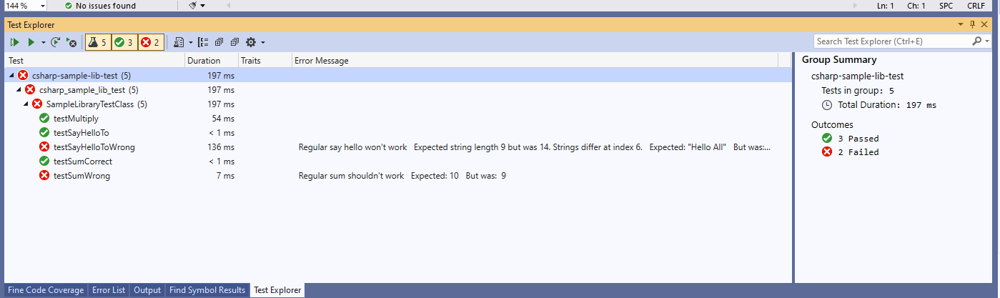

- Inline code highlight is part of enterprise visual studio edition
    - [Analyzing code coverage in Visual Studio - DEV Community](https://dev.to/rruizdev/analizando-cobertura-del-codigo-en-visual-studio-1p27)


---

<style scoped>section{ font-size: 30px; }</style>

#### Visual Studio Community Edition (C# Unit Test+OpenCover + Nunit Runner + Report)

---

<style scoped>section{ font-size: 25px; }</style>

#### Visual Studio Community Edition (C# Unit Test+OpenCover + Nunit Runner + Report)-1

##### TL;DR

- Additional information you can use OpenCover + Nunit Runner + Report Generator together to setup a code coverage report but it has complex batch running process. After a few try I decided to use fine code coverage but here is the usage not tested well.

- First unit test runner tool doesn't support .Net Core

[c# - The NUnit 3 driver encountered an error while executing reflected code (NUnit.Engine.NUnitEngineException) - Stack Overflow](https://stackoverflow.com/questions/64611083/the-nunit-3-driver-encountered-an-error-while-executing-reflected-code-nunit-en)

- Follow the instructions on the link
    - [CMD OpenCover · sukhoi1/Useful-Notes Wiki · GitHub](https://github.com/sukhoi1/Useful-Notes/wiki/CMD-OpenCover)

- Install OpenCover, ReportGenerator, Nunit,Runners packages then use the package installation folder to get tools that you need

---

<style scoped>section{ font-size: 25px; }</style>

#### Visual Studio Community Edition (C# Unit Test+OpenCover + Nunit Runner + Report)-2

- Here is a sample for open cover, select package and copy path


---

<style scoped>section{ font-size: 25px; }</style>

#### Visual Studio Community Edition (C# Unit Test+OpenCover + Nunit Runner + Report)-3

- Goto path and tools

```batch
C:\Users\ugur.coruh\.nuget\packages\opencover\4.7.1221
```

- You need to setup some batch similar with following

**run-test-coverage.bat**

```batch

set pathA=C:\Users\ugur.coruh\.nuget\packages\opencover\4.7.1221\tools
set pathB=C:\Users\ugur.coruh\.nuget\packages\nunit.consolerunner\3.12.0\tools
set pathC=C:\Users\ugur.coruh\.nuget\packages\reportgenerator\4.8.13\tools\netcoreapp3.0
set dllpath=C:\Users\ugur.coruh\Desktop\csharp-sample-lib\csharp-sample-lib-test\bin\Debug\netcoreapp3.1

"%pathA%\OpenCover.Console.exe" ^
-targetargs:"%dllpath%\csharp-sample-lib-test.dll" ^
-filter:"+[csharp-sample-lib*]* -[*test]*" ^
-target:"%pathB%\nunit3-console.exe" ^
-output:"%dllpath%\coverReport.xml" ^
-skipautoprops -register:user && "%pathC%\ReportGenerator.exe" -reports:"%dllpath%\coverReport.xml" -targetdir:""%dllpath%\coverage"
pause

```

---

<style scoped>section{ font-size: 25px; }</style>

#### Visual Studio Community Edition (C# Unit Test+OpenCover + Nunit Runner + Report)-4

- but `nunit3-console.exe` gives error


---

<style scoped>section{ font-size: 25px; }</style>

#### Visual Studio Community Edition (C# Unit Test+OpenCover + Nunit Runner + Report)-5

- For this compatibility issues I prefer to use fine code coverage extension.

- OpenCover related studies
    - [Code coverage of manual or automated tests with OpenCover for .NET applications – Automation Rhapsody](https://automationrhapsody.com/code-coverage-manual-automated-tests-opencover-net-applications/)
    - [Code coverage of .NET Core unit tests with OpenCover – Automation Rhapsody](https://automationrhapsody.com/code-coverage-net-core-unit-tests-opencover/)

- Sample OpenCover report
    - [Summary - Coverage Report](https://automationrhapsody.com/examples/OpenCover-report/)

---

<style scoped>section{ font-size: 25px; }</style>

#### Visual Studio Community Edition (C# Unit Test+OpenCover + Nunit Runner + Report)-6

#### Download and Setup OpenCover, NUnit Console, Report Generator without Package Manager

- You can also download the tools from github project pages and install on your operating system,

---

<style scoped>section{ font-size: 25px; }</style>

#### Visual Studio Community Edition (C# Unit Test+OpenCover + Nunit Runner + Report)-7

#### OpenCover

- [Releases · OpenCover/opencover · GitHub](https://github.com/OpenCover/opencover/releases)


---

<style scoped>section{ font-size: 25px; }</style>

#### Visual Studio Community Edition (C# Unit Test+OpenCover + Nunit Runner + Report)-8


---

<style scoped>section{ font-size: 25px; }</style>

#### Visual Studio Community Edition (C# Unit Test+OpenCover + Nunit Runner + Report)-9

Select advanced and then install for all users


---

<style scoped>section{ font-size: 25px; }</style>

#### Visual Studio Community Edition (C# Unit Test+OpenCover + Nunit Runner + Report)-10


---

<style scoped>section{ font-size: 25px; }</style>

#### Visual Studio Community Edition (C# Unit Test+OpenCover + Nunit Runner + Report)-11

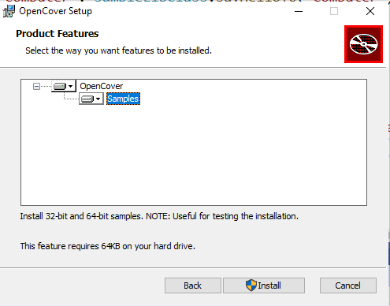

---

<style scoped>section{ font-size: 25px; }</style>

#### Visual Studio Community Edition (C# Unit Test+OpenCover + Nunit Runner + Report)-12


---

<style scoped>section{ font-size: 25px; }</style>

#### Visual Studio Community Edition (C# Unit Test+OpenCover + Nunit Runner + Report)-13


---

<style scoped>section{ font-size: 25px; }</style>

#### Visual Studio Community Edition (C# Unit Test+OpenCover + Nunit Runner + Report)-14


---

<style scoped>section{ font-size: 25px; }</style>

#### Visual Studio Community Edition (C# Unit Test+OpenCover + Nunit Runner + Report)-15


---

<style scoped>section{ font-size: 25px; }</style>

#### Visual Studio Community Edition (C# Unit Test+OpenCover + Nunit Runner + Report)-16


---

<style scoped>section{ font-size: 25px; }</style>

#### Visual Studio Community Edition (C# Unit Test+OpenCover + Nunit Runner + Report)-17

##### ReportGenerator

- [Release ReportGenerator_4.8.13 · danielpalme/ReportGenerator · GitHub](https://github.com/danielpalme/ReportGenerator/releases/tag/v4.8.13)


---

<style scoped>section{ font-size: 25px; }</style>

#### Visual Studio Community Edition (C# Unit Test+OpenCover + Nunit Runner + Report)-18


---

<style scoped>section{ font-size: 25px; }</style>

#### Visual Studio Community Edition (C# Unit Test+OpenCover + Nunit Runner + Report)-19

##### NUnit Console

- [Downloads](https://nunit.org/download/)


---

<style scoped>section{ font-size: 25px; }</style>

#### Visual Studio Community Edition (C# Unit Test+OpenCover + Nunit Runner + Report)-20


---

<style scoped>section{ font-size: 25px; }</style>

#### Visual Studio Community Edition (C# Unit Test+OpenCover + Nunit Runner + Report)-21

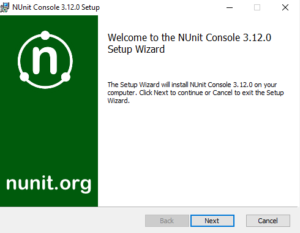

---

<style scoped>section{ font-size: 25px; }</style>

#### Visual Studio Community Edition (C# Unit Test+OpenCover + Nunit Runner + Report)-22

- Download setup 


---

<style scoped>section{ font-size: 25px; }</style>

#### Visual Studio Community Edition (C# Unit Test+OpenCover + Nunit Runner + Report)-23

- Install setup 


---

<style scoped>section{ font-size: 25px; }</style>

#### Visual Studio Community Edition (C# Unit Test+OpenCover + Nunit Runner + Report)-24

### NUnit + MSTest Batch Report Generation (Not Tested)

- [OpenCover and ReportGenerator Unit Test Coverage in Visual Studio 2013 and 2015 &#8211; CodeHelper.Net](http://codehelper.net/unit-testing/opencover-and-reportgenerator-unit-test-coverage-in-visual-studio-2013-and-2015/)

- [OpenCover and ReportGenerator Unit Test Coverage in Visual Studio 2013 and 2015 - CodeProject](https://www.codeproject.com/Articles/1276980/OpenCover-and-ReportGenerator-Unit-Test-Coverage-i)

---

<style scoped>section{ font-size: 30px; }</style>

### Java Unit Tests
#### Eclipse IDE (JUnit4 , JUnit5)

---

<style scoped>section{ font-size: 25px; }</style>

#### Eclipse IDE (JUnit4 , JUnit5) + Java Unit Test

In this sample we will create two example for similar library

Please check the following links

[JUnit 5 tutorial - Learn how to write unit tests](https://www.vogella.com/tutorials/JUnit/article.html)

[JUnit 5](https://junit.org/junit5/)

[JUnit 5 User Guide](https://junit.org/junit5/docs/current/user-guide/)

https://www.eclemma.org/

[JUnit Hello World Example - Examples Java Code Geeks - 2021](https://examples.javacodegeeks.com/core-java/junit/junit-hello-world-example/)

https://yasinmemic.medium.com/java-ile-unit-test-yazmak-birim-test-ca15cf0d024b

---

<style scoped>section{ font-size: 25px; }</style>

#### Eclipse IDE (JUnit4 , JUnit5) + Java Unit Test

In normal java application we can right click the project java-sample-lib and add Junit case


---

<style scoped>section{ font-size: 25px; }</style>

#### Eclipse IDE (JUnit4 , JUnit5) + Java Unit Test


---

<style scoped>section{ font-size: 25px; }</style>

#### Eclipse IDE (JUnit4 , JUnit5) + Java Unit Test


---

<style scoped>section{ font-size: 25px; }</style>

#### Eclipse IDE (JUnit4 , JUnit5) + Java Unit Test

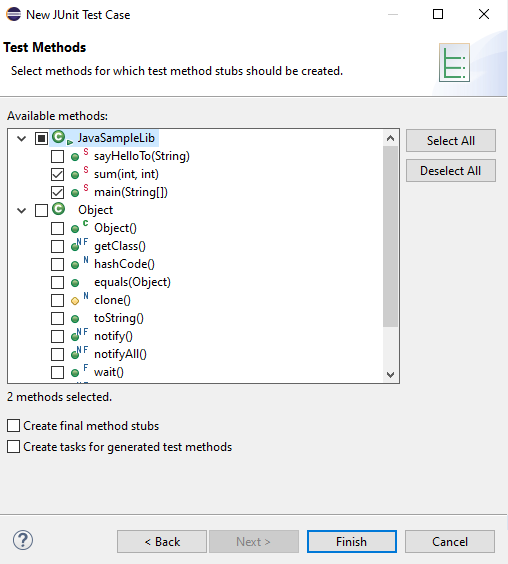

---

<style scoped>section{ font-size: 25px; }</style>

#### Eclipse IDE (JUnit4 , JUnit5) + Java Unit Test

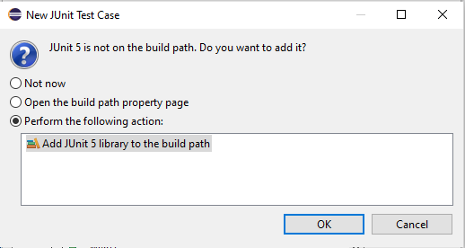

---

<style scoped>section{ font-size: 25px; }</style>

#### Eclipse IDE (JUnit4, JUnit5) + Java Unit Test

and you will have the following test class


---

<style scoped>section{ font-size: 25px; }</style>

#### Eclipse IDE (JUnit4, JUnit5) + Java Unit Test

Now we will create tests that check our function flowchart and return values

We need to cover all code branches that we coded

I have updated `JavaSampleLib.java` as follows to check outputs

**JavaSampleLib.java**

```java
package ce103;

public class JavaSampleLib {

    public static String sayHelloTo(String name) {

        String output = "";

        if(!name.isBlank() && !name.isEmpty()){
            output = "Hello "+name;
        }else {
            output = "Hello There";
        }

        System.out.println(output);

        return output;
    }

    public static int sum(int a,int b)
    {
        int c = 0;
        c = a+b;
        return c;
    }

    public int multiply(int a, int b) {
        return a * b;
    }

//    public static void main(String[] args) {
//        // TODO Auto-generated method stub
//        System.out.println("Hello World!");
//
//        JavaSampleLib.sayHelloTo("Computer");
//        int result = JavaSampleLib.sum(5, 4);
//        System.out.println("Results is" + result);
//        System.out.printf("Results is %d \n", result);
//
//
//        try {
//            System.in.read();
//        } catch (IOException e) {
//            // TODO Auto-generated catch block
//            e.printStackTrace();
//        }
//
//    }

}
```

---

<style scoped>section{ font-size: 25px; }</style>

#### Eclipse IDE (JUnit4 , JUnit5) + Java Unit Test

and JavaSampleLibTest.java

```java
package ce103;

import static org.junit.jupiter.api.Assertions.*;

import org.junit.jupiter.api.AfterAll;
import org.junit.jupiter.api.AfterEach;
import org.junit.jupiter.api.BeforeAll;
import org.junit.jupiter.api.BeforeEach;
import org.junit.jupiter.api.DisplayName;
import org.junit.jupiter.api.RepeatedTest;
import org.junit.jupiter.api.Test;
import org.junit.jupiter.params.ParameterizedTest;
import org.junit.jupiter.params.provider.MethodSource;

class JavaSampleLibTest {

    JavaSampleLib sampleLib;

    @BeforeAll
    static void setUpBeforeClass() throws Exception {
    }

    @AfterAll
    static void tearDownAfterClass() throws Exception {
    }

    @BeforeEach
    void setUp() throws Exception {
        sampleLib = new JavaSampleLib();
    }

    @AfterEach
    void tearDown() throws Exception {
    }

    @Test
    @DisplayName("Simple Say Hello should work")
    void testSayHelloTo() {
        assertEquals("Hello Computer", JavaSampleLib.sayHelloTo("Computer"), "Regular say hello should work");
    }

    @Test
    @DisplayName("Simple Say Hello shouldn' work")
    void testSayHelloToWrong() {
        assertEquals("Hello All", JavaSampleLib.sayHelloTo("Computer"), "Regular say hello won't work");
    }


    @Test
    @DisplayName("Simple sum should work")
    void testSumCorrect() {
        assertEquals(9, JavaSampleLib.sum(4, 5), "Regular sum should work");
    }

    @Test
    @DisplayName("Simple sum shouldn't work")
    void testSumWrong() {
        assertEquals(10, JavaSampleLib.sum(4, 5), "Regular sum shouldn't work");
    }

    @Test
    @DisplayName("Simple multiplication should work")
    void testMultiply() {
        assertEquals(20, sampleLib.multiply(4, 5), "Regular multiplication should work");
    }

    @RepeatedTest(5)
    @DisplayName("Ensure correct handling of zero")
    void testMultiplyWithZero() {
        assertEquals(0, sampleLib.multiply(0, 5), "Multiple with zero should be zero");
        assertEquals(0, sampleLib.multiply(5, 0), "Multiple with zero should be zero");
    }

    public static int[][] data() {
        return new int[][] { { 1, 2, 2 }, { 5, 3, 15 }, { 121, 4, 484 },{ 2, 2, 2 } };
    }

    @ParameterizedTest
    @MethodSource(value = "data")
    void testWithStringParameter(int[] data) {
        JavaSampleLib tester = new JavaSampleLib();
        int m1 = data[0];
        int m2 = data[1];
        int expected = data[2];
        assertEquals(expected, tester.multiply(m1, m2));
    }

}
```

---

<style scoped>section{ font-size: 25px; }</style>

#### Eclipse IDE (JUnit4 , JUnit5) + Java Unit Test

if we run tests


---

<style scoped>section{ font-size: 25px; }</style>

#### Eclipse IDE (JUnit4 , JUnit5) + Java Unit Test

we will see all results there


---

<style scoped>section{ font-size: 25px; }</style>

#### Eclipse IDE (JUnit4 , JUnit5) + Java Unit Test

also we can see the code coverage of tests


---

<style scoped>section{ font-size: 25px; }</style>

#### Eclipse IDE (JUnit4 , JUnit5) + Java Unit Test

when we open our source code (just close and open again another case highlighting will not work) you will see tested part of your codes


---

<style scoped>section{ font-size: 25px; }</style>

#### Eclipse IDE (JUnit4 , JUnit5) + Java Unit Test

#### Maven Java Application + JUnit

Lets create Maven project with tests

Create a maven project

_File -> New -> Maven Project_


---

<style scoped>section{ font-size: 25px; }</style>

#### Eclipse IDE (JUnit4 , JUnit5) + Java Unit Test


---

<style scoped>section{ font-size: 25px; }</style>

#### Eclipse IDE (JUnit4 , JUnit5) + Java Unit Test

Lets convert our sample java-sample-lib directories to standard folder structure for test and app division

[Maven &#x2013; Introduction to the Standard Directory Layout](http://maven.apache.org/guides/introduction/introduction-to-the-standard-directory-layout.html)

Also for intro you can use this

[JUnit Hello World Example - Examples Java Code Geeks - 2021](https://examples.javacodegeeks.com/core-java/junit/junit-hello-world-example/)

Eclipse  
Maven  
Java  
JUnit 4.12 (pulled by Maven automatically)

---

<style scoped>section{ font-size: 25px; }</style>

#### Eclipse IDE (JUnit4 , JUnit5) + Java Unit Test

Lets give new sample java-sample-lib-mvnbut in this time we will create a maven project


---

<style scoped>section{ font-size: 25px; }</style>

#### Eclipse IDE (JUnit4 , JUnit5) + Java Unit Test


---

<style scoped>section{ font-size: 25px; }</style>

#### Eclipse IDE (JUnit4 , JUnit5) + Java Unit Test

**pom.xml** file

```xml
<project xmlns="http://maven.apache.org/POM/4.0.0" xmlns:xsi="http://www.w3.org/2001/XMLSchema-instance" xsi:schemaLocation="http://maven.apache.org/POM/4.0.0 https://maven.apache.org/xsd/maven-4.0.0.xsd">
  <modelVersion>4.0.0</modelVersion>
  <groupId>com.ce103</groupId>
  <artifactId>java-sample-lib-ext</artifactId>
  <version>0.0.1-SNAPSHOT</version>
  <name>Java Sample Lib</name>
  <description>Java Sample with Unit Test</description>
</project>
```

---

<style scoped>section{ font-size: 25px; }</style>

#### Eclipse IDE (JUnit4 , JUnit5) + Java Unit Test

we will add JUnit 5 for our project

```xml
<project xmlns="http://maven.apache.org/POM/4.0.0"
    xmlns:xsi="http://www.w3.org/2001/XMLSchema-instance"
    xsi:schemaLocation="http://maven.apache.org/POM/4.0.0 https://maven.apache.org/xsd/maven-4.0.0.xsd">
    <modelVersion>4.0.0</modelVersion>
    <groupId>com.ce103</groupId>
    <artifactId>java-sample-lib-ext</artifactId>
    <version>0.0.1-SNAPSHOT</version>
    <name>Java Sample Lib</name>
    <description>Java Sample with Unit Test</description>

    <dependencies>
        <dependency>
            <groupId>org.junit.jupiter</groupId>
            <artifactId>junit-jupiter-params</artifactId>
            <version>5.7.1</version>
            <scope>test</scope>
        </dependency>
    </dependencies>

</project>
```

---

<style scoped>section{ font-size: 25px; }</style>

#### Eclipse IDE (JUnit4 , JUnit5) + Java Unit Test

it will automatically download libraries


---

<style scoped>section{ font-size: 25px; }</style>

#### Eclipse IDE (JUnit4 , JUnit5) + Java Unit Test


---

<style scoped>section{ font-size: 25px; }</style>

#### Eclipse IDE (JUnit4 , JUnit5) + Java Unit Test

Create java sample library in ce103 package, first create java package


---

<style scoped>section{ font-size: 25px; }</style>

#### Eclipse IDE (JUnit4 , JUnit5) + Java Unit Test

In this package create library class


---

<style scoped>section{ font-size: 25px; }</style>

#### Eclipse IDE (JUnit4 , JUnit5) + Java Unit Test


---

<style scoped>section{ font-size: 25px; }</style>

#### Eclipse IDE (JUnit4 , JUnit5) + Java Unit Test

copy content from other library

```java
package ce103;

public class JavaSampleLib {

public static String sayHelloTo(String name) {

        String output = "";

        if(!name.isBlank() && !name.isEmpty()){
            output = "Hello "+name;
        }else {
            output = "Hello There";
        }

        System.out.println(output);

        return output;
    }

    public static int sum(int a,int b)
    {
        int c = 0;
        c = a+b;
        return c;
    }

    public int multiply(int a, int b) {
        return a * b;
    }


}
```

---

<style scoped>section{ font-size: 25px; }</style>

#### Eclipse IDE (JUnit4 , JUnit5) + Java Unit Test

Now lets create tests inf src/test/java


---

<style scoped>section{ font-size: 25px; }</style>

#### Eclipse IDE (JUnit4 , JUnit5) + Java Unit Test


---

<style scoped>section{ font-size: 25px; }</style>

#### Eclipse IDE (JUnit4 , JUnit5) + Java Unit Test

create a JUnit Case


---

<style scoped>section{ font-size: 25px; }</style>

#### Eclipse IDE (JUnit4, JUnit5) + Java Unit Test


---

<style scoped>section{ font-size: 25px; }</style>

#### Eclipse IDE (JUnit4, JUnit5) + Java Unit Test


---

<style scoped>section{ font-size: 25px; }</style>

#### Eclipse IDE (JUnit4, JUnit5) + Java Unit Test


---

<style scoped>section{ font-size: 25px; }</style>

#### Eclipse IDE (JUnit4, JUnit5) + Java Unit Test

you will simple template

```java
package ce103;

import static org.junit.jupiter.api.Assertions.*;

import org.junit.jupiter.api.AfterAll;
import org.junit.jupiter.api.AfterEach;
import org.junit.jupiter.api.BeforeAll;
import org.junit.jupiter.api.BeforeEach;
import org.junit.jupiter.api.Test;

class JavaSampleLibTest {

    @BeforeAll
    static void setUpBeforeClass() throws Exception {
    }

    @AfterAll
    static void tearDownAfterClass() throws Exception {
    }

    @BeforeEach
    void setUp() throws Exception {
    }

    @AfterEach
    void tearDown() throws Exception {
    }

    @Test
    void testSayHelloTo() {
        fail("Not yet implemented");
    }

    @Test
    void testSum() {
        fail("Not yet implemented");
    }

    @Test
    void testMultiply() {
        fail("Not yet implemented");
    }

}
```

---

<style scoped>section{ font-size: 25px; }</style>

#### Eclipse IDE (JUnit4, JUnit5) + Java Unit Test

now lets copy tests from other projects

```java
Convert source codes to java codes...
```

---

<style scoped>section{ font-size: 25px; }</style>

#### Eclipse IDE (JUnit4, JUnit5) + Java Unit Test


---

<style scoped>section{ font-size: 25px; }</style>

#### Eclipse IDE (JUnit4, JUnit5) + Java Unit Test


---

<style scoped>section{ font-size: 25px; }</style>

#### Eclipse IDE (JUnit4, JUnit5) + Java Unit Test


---

<style scoped>section{ font-size: 25px; }</style>

#### Eclipse IDE (JUnit4, JUnit5) + Java Unit Test

That's a part of java unit testing...

---

<style scoped>section{ font-size: 25px; }</style>

## TDD (Test Driven Development)

- Test Driven Development (TDD) 
    -  https://en.wikipedia.org/wiki/Test-driven_development
- Acceptance Test Driven Development (ATDD) 
    - https://en.wikipedia.org/wiki/Acceptance_test-driven_development

- Also check out 
    - https://en.wikipedia.org/wiki/Kent_Beck

- Extreme Programming 
    - https://en.wikipedia.org/wiki/Extreme_programming

- Software Design Patterns
    - https://en.wikipedia.org/wiki/Software_design_pattern

---

<style scoped>section{ font-size: 25px; }</style>

## Test and Deployment Automation Management

There are several Continues-Integration services online as follow;
- Travis-CI
- Appveyor
- Jenkins
- CircleCI
- GitLab
- Pantheon
- GitHub
- Bitrise
- Flosum
- Buddy
- Semaphore 

---

<style scoped>section{ font-size: 25px; }</style>

## Test and Deployment Automation Management

- Github provides Github Actions for Releases and Tests
- Jenkins has on promise solutions private development

---

<style scoped>section{ font-size: 25px; }</style>

## Test and Deployment Automation Management

- GitHub Actions provide several actions and marketspace 
    - https://github.com/marketplace/actions/build-c-project
- Also, we Can Provide Our Custom Actions
```yaml
name: hello-world
on: push
jobs:
  my-job:
    runs-on: ubuntu-latest
    steps:
      - name: my-step
        run: echo "Hello World!"
```

---

<style scoped>section{ font-size: 25px; }</style>

## Test and Deployment Automation Management


---

<style scoped>section{ font-size: 25px; }</style>

## Test and Deployment Automation Management

- https://github.com/ucoruh/project-cleaner/blob/main/.github/workflows/dotnet-desktop.yml

This action build c# application and generates setup manually. 

- Also there is a nice web example
    - https://dev.to/geromegrignon/github-actions-full-ci-cd-javascript-workflow-39om

---

![center height:450px](http://www.plantuml.com/plantuml/png/jLPXRzis4FtkNt5e1mmOAdahq64GO21fwgt1YZH87EoB0PUMJZ8JcXHunzX1r_y-YgOZQwEpPC3oIRfxxzsxuqNq2R6m_23MQgJ56WkuGeM2S3GokXW1R8ozgvNPB2f9hU1oLOn6jsP9NMxffAhyEm20TPeoJu6Dr9NPKAO48_4kIOnjO01ai2jpjiBopZY6qbIOXnI08wG2HCdIQ1gN4N9o_pRc1mhdcbWe1N_8xJFf6ydUFiG_YwqXoSO-550lXRL8Shnv50DeXOS36MTBdEyJ2IFNoAw5_68wI_gWBfrLXZLwBpyblUoosJrQajqGt-K_vjlHeCffLS6QmiY13LoUpZuEogrbQGsPccF1YFKLlTRRKSBnXMkG1neX4lcwUzwntmtPLqXiB490G2lAEz4WHI7hT14pDkBY12-jkSMIpnGAZJOdfOUoxqDhrqQvRcw7Sh6Luq8mReipeslPE2iwzcI_nN3mbwWMDI1AFhletpsKrFh0apRI1lpoxat4KtcfbS1AnNA_iizrzJfXAuZiaj77d_it0AyzPsCKpKkXAuKvRh6pNhcIyysM83EGLVl3d6vv4iwf3_qg5LxuYfF4QVQe1E8WUobubUOd-_Nnpuu_I3jPIZsFmRcFNYh1jR7hoVQNd_rhLEo0UJxFy-J0UrneBiwwZoRxY-H_eeyXUqJezRYTfwlCX6tmNneQpYHIGczhall0asqDWCT0Uq2weRITexMCOp3BsmFVmfOh2CU8M-xM-8QbybsW9cbq7ptlOyUs1LBRhcIpuh3iNTqVkXdxXsxREyFnIa8RxBt4GWXyagKFu1NNarVnERTSlnebls1d5WKZ3F-PPLL06H8B6nF9kp50iWZfRoNKz_sbzDlvxEFD-yNiy-_JYmA--_eL23sHAJ_CmBTloIkDHRFO6Uska8xT-BnRvjRfXNRh9TgU2X2jl8HIML5p0RLG1n_wrcAKYfdqy6vQPKG5Cz4qMC7ZkHrCqGL4nW6ndrGcY90XETD8623_Zyb6PmjdLUGojfGFJpqtZbld1NkmbuFNC5j9WjOfHL1RimPU8PnTJKzdKxYQVfgUNa-37eYbkSStOB56YxgKkW79tnESVm0sq23xLu9OfVjdm9BVm6ObonL8NIfN8GZuqfV_aiCr8d1NVwbC0wqXXjfOM1kBdbER0bRCBHNZyQqWev7pqemx68qrRh8Q1JkBb9awsor6jf_zwrOGUOzP9LXaRBBQTT0iZ0OU9nVEP37uNVSVlpr3oRYr2UpY_gbLJYYLHZDgNl13wnL5sofPXk_IU9iTeXCF9wYhxeVyNm00)

---

<style scoped>section{ font-size: 25px; }</style>

# References

[GitHub - MicrosoftDocs/cpp-docs: C++ Documentation](https://github.com/MicrosoftDocs/cpp-docs)

---

<style scoped>section{ font-size: 25px; }</style>

$$
End-Of-Week-4
$$
