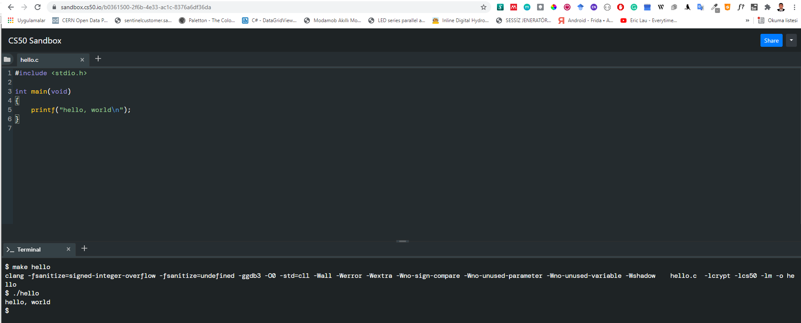
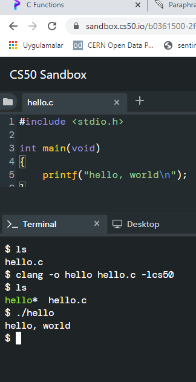

<!-- _backgroundColor: aquq -->

<!-- _color: orange -->

<!-- paginate: false -->

## CE103 Algorithms and Programming I

### Week-5

#### C Functional Console Programming

Download [DOC](ce103-week-5-c.en.md_doc.pdf), [SLIDE](ce103-week-5-c.en.md_slide.pdf), [PPTX](ce103-week-5-c.en.md_slide.pptx)

<iframe width=700, height=500 frameBorder=0 src="../ce103-week-5-c.en.md_slide.html"></iframe>

---

<!-- paginate: true -->

# C Functional Console Programming

---

## Books and Resources

- [free-programming-books/free-programming-books-langs.md at master · EbookFoundation/free-programming-books · GitHub](https://github.com/EbookFoundation/free-programming-books/blob/master/books/free-programming-books-langs.md#c)

- [goalkicker-C Programming Notes for Professionals book](https://books.goalkicker.com/CBook/)

---

# C Functional Console Programming

- We will use the following course notes and examples.

---

- [Learn C Programming](https://www.programiz.com/c-programming)


---

- [C Tutorials - Introduction to C Programming Language](http://www.btechsmartclass.com/c_programming/introduction-to-c-programming.html)


---

- [The C and C++ programming tutorials, hands-on approach with program examples, code samples and tons of output images using Visual C++, C++ Builder, Linux gcc and g++ compilers and IDE](https://www.tenouk.com/cncplusplustutorials.html)


---

- [CS50x 2021](https://cs50.harvard.edu/x/2021/)


---

[C Programming For Dummies](https://c-for-dummies.com/cprog/)


---

[C reference - cppreference.com](https://en.cppreference.com/w/c)


---

https://c.happycodings.com/


---

# C Programming

C is a versatile programming language. It is useful for creating software such as operating systems, databases, and compilers. For novices, C programming is a great language to learn to code in.

---

Our C tutorials will take you step by step through the process of learning C programming.

Before starting you should check your development enviroment. 

---

**You will open visual studio community edition and create a C++ console application then rename *.cpp file to *.c  for triggering c complier.**

---


---


---

Before starting you should understand the executable generation flows 

```c
#include <stdio.h>

int main(void)
{
    printf("hello, world");
}
```

---

and how we convert source code to binary code

```bash
01111111 01000101 01001100 01000110 00000010 00000001 00000001 00000000
00000000 00000000 00000000 00000000 00000000 00000000 00000000 00000000
00000010 00000000 00111110 00000000 00000001 00000000 00000000 00000000
10110000 00000101 01000000 00000000 00000000 00000000 00000000 00000000
01000000 00000000 00000000 00000000 00000000 00000000 00000000 00000000
11010000 00010011 00000000 00000000 00000000 00000000 00000000 00000000
00000000 00000000 00000000 00000000 01000000 00000000 00111000 00000000
00001001 00000000 01000000 00000000 00100100 00000000 00100001 00000000
00000110 00000000 00000000 00000000 00000101 00000000 00000000 00000000
01000000 00000000 00000000 00000000 00000000 00000000 00000000 00000000
01000000 00000000 01000000 00000000 00000000 00000000 00000000 00000000
01000000 00000000 01000000 00000000 00000000 00000000 00000000 00000000
11111000 00000001 00000000 00000000 00000000 00000000 00000000 00000000
11111000 00000001 00000000 00000000 00000000 00000000 00000000 00000000
00001000 00000000 00000000 00000000 00000000 00000000 00000000 00000000
00000011 00000000 00000000 00000000 00000100 00000000 00000000 00000000
00111000 00000010 00000000 00000000 00000000 00000000 00000000 00000000
...
```

---

There is a sandbox in CS50 harvard course [Week 0 - CS50x](https://cs50.harvard.edu/x/2020/weeks/0/)

---

https://sandbox.cs50.io/ you can use it for online compiler

---



---


---

```bash
$ make hello
clang -fsanitize=signed-integer-overflow -fsanitize=undefined -ggdb3 -O0 -std=c11 -Wall -Werror -Wextra -Wno-sign-compare -Wno-unused-parameter -Wno-unused-variable -Wshadow    hello.c  -lcrypt -lcs50 -lm -o hello
$ ./hello
hello, world
```

---

<u>if you want to make samething in windows environment you should create the following makefile near the hello.c</u>


---

**Makefile**

``` makefile
# This is the default target, which will be built when 
# you invoke make
.PHONY: all
all: hello

# This rule tells make how to build hello from hello.cpp
hello: hello.c
    g++ -o hello hello.c

# This rule tells make to copy hello to the binaries subdirectory,
# creating it if necessary
.PHONY: install
install:
    mkdir -p binaries
    cp -p hello binaries

# This rule tells make to delete hello and hello.o
.PHONY: clean 
clean:
    rm -f hello
```

---


---

``` bash
C:\Users\ugur.coruh\Desktop\hello-make>make hello
g++ -o hello hello.c

C:\Users\ugur.coruh\Desktop\hello-make>dir
 Volume in drive C is Windows
 Volume Serial Number is 8C3C-8F8C

 Directory of C:\Users\ugur.coruh\Desktop\hello-make

11/02/2021  01:44 AM    <DIR>          .
11/02/2021  01:44 AM    <DIR>          ..
11/02/2021  01:15 AM                73 hello.c
11/02/2021  01:44 AM            54,022 hello.exe
11/02/2021  01:43 AM               458 Makefile
               3 File(s)         54,553 bytes
               2 Dir(s)  101,382,164,480 bytes free

C:\Users\ugur.coruh\Desktop\hello-make>hello.exe
hello, world

C:\Users\ugur.coruh\Desktop\hello-make>
```

---


---

``` bash
$ clang hello.c
$ ls
a.out*  hello*  hello.c
$ ./a.out 
hello, world
```

---


---

``` bash
$ clang -o hello hello.c
$ ls
a.out*  hello*  hello.c
$ ./hello 
hello, world
```

---



---

``` bash
$ ls
hello.c
$ clang -o hello hello.c -lcs50
$ ls
hello*  hello.c
$ ./hello 
hello, world
$ 
```

---

Also you can use visual studio community edition. 

---

# preprocessing

---

get included file declarations

``` c
#include <cs50.h>
#include <stdio.h>

int main(void)
{
    string name = get_string("What's your name? ");
    printf("hello, %s\n", name);
}
```

---

to this

``` c
string get_string(string prompt);
int printf(string format, ...);

int main(void)
{
    string name = get_string("What's your name? ");
    printf("hello, %s\n", name);
}
```

---

# compiling

---

convert source code to assembler code

``` asm6502
...
main:                                   # @main
    .cfi_startproc
# BB#0:
    pushq    %rbp
.Ltmp0:
    .cfi_def_cfa_offset 16
.Ltmp1:
    .cfi_offset %rbp, -16
    movq    %rsp, %rbp
.Ltmp2:
    .cfi_def_cfa_register %rbp
    subq    $16, %rsp
    xorl    %eax, %eax
    movl    %eax, %edi
    movabsq    $.L.str, %rsi
    movb    $0, %al
    callq    get_string
    movabsq    $.L.str.1, %rdi
    movq    %rax, -8(%rbp)
    movq    -8(%rbp), %rsi
    movb    $0, %al
    callq    printf
    ...
```

---

# assembling

---

convert assembler to opcodes

``` asm6502
...
main:                                   # @main
    .cfi_startproc
# BB#0:
    pushq    %rbp
.Ltmp0:
    .cfi_def_cfa_offset 16
.Ltmp1:
    .cfi_offset %rbp, -16
    movq    %rsp, %rbp
.Ltmp2:
    .cfi_def_cfa_register %rbp
    subq    $16, %rsp
    xorl    %eax, %eax
    movl    %eax, %edi
    movabsq    $.L.str, %rsi
    movb    $0, %al
    callq    get_string
    movabsq    $.L.str.1, %rdi
    movq    %rax, -8(%rbp)
    movq    -8(%rbp), %rsi
    movb    $0, %al
    callq    printf
    ...
```

---

to this

``` bash
01111111010001010100110001000110
00000010000000010000000100000000
00000000000000000000000000000000
00000000000000000000000000000000
00000001000000000011111000000000
00000001000000000000000000000000
00000000000000000000000000000000
00000000000000000000000000000000
00000000000000000000000000000000
00000000000000000000000000000000
10100000000000100000000000000000
00000000000000000000000000000000
00000000000000000000000000000000
01000000000000000000000000000000
00000000000000000100000000000000
00001010000000000000000100000000
01010101010010001000100111100101
01001000100000111110110000010000
00110001110000001000100111000111
01001000101111100000000000000000
00000000000000000000000000000000
00000000000000001011000000000000
11101000000000000000000000000000
00000000010010001011111100000000
00000000000000000000000000000000
00000000000000000000000001001000
...
```

---

# linking

---

| hello.c                               | cs50.c                           | stdio.c |
| ------------------------------------- | -------------------------------- | ------- |
| 01111111010001010100110001000110      |                                  |         |
| <br/>00000010000000010000000100000000 |                                  |         |
| <br/>00000000000000000000000000000000 |                                  |         |
| <br/>00000000000000000000000000000000 |                                  |         |
| <br/>00000001000000000011111000000000 |                                  |         |
| <br/>00000001000000000000000000000000 |                                  |         |
| <br/>00000000000000000000000000000000 |                                  |         |
| <br/>00000000000000000000000000000000 |                                  |         |
| <br/>00000000000000000000000000000000 |                                  |         |
| <br/>00000000000000000000000000000000 |                                  |         |
| <br/>10100000000000100000000000000000 |                                  |         |
| <br/>00000000000000000000000000000000 |                                  |         |
| <br/>00000000000000000000000000000000 |                                  |         |
| <br/>01000000000000000000000000000000 |                                  |         |
| <br/>00000000000000000100000000000000 |                                  |         |
| <br/>00001010000000000000000100000000 |                                  |         |
| <br/>01010101010010001000100111100101 |                                  |         |
| <br/>01001000100000111110110000010000 |                                  |         |
| <br/>00110001110000001000100111000111 |                                  |         |
| <br/>01001000101111100000000000000000 |                                  |         |
| <br/>00000000000000000000000000000000 |                                  |         |
| <br/>00000000000000001011000000000000 |                                  |         |
| <br/>11101000000000000000000000000000 |                                  |         |
| <br/>00000000010010001011111100000000 |                                  |         |
| <br/>00000000000000000000000000000000 |                                  |         |
| <br/>00000000000000000000000001001000 |                                  |         |
| <br/>...                              | 01111111010001010100110001000110 |         |
| <br/>00000010000000010000000100000000 |                                  |         |
| <br/>00000000000000000000000000000000 |                                  |         |
| <br/>00000000000000000000000000000000 |                                  |         |
| <br/>00000011000000000011111000000000 |                                  |         |
| <br/>00000001000000000000000000000000 |                                  |         |
| <br/>11000000000011110000000000000000 |                                  |         |
| <br/>00000000000000000000000000000000 |                                  |         |
| <br/>01000000000000000000000000000000 |                                  |         |
| <br/>00000000000000000000000000000000 |                                  |         |
| <br/>00101000001100100000000000000000 |                                  |         |
| <br/>00000000000000000000000000000000 |                                  |         |
| <br/>00000000000000000000000000000000 |                                  |         |
| <br/>01000000000000000011100000000000 |                                  |         |
| <br/>00000111000000000100000000000000 |                                  |         |
| <br/>00011100000000000001100100000000 |                                  |         |
| <br/>00000001000000000000000000000000 |                                  |         |
| <br/>00000101000000000000000000000000 |                                  |         |
| <br/>00000000000000000000000000000000 |                                  |         |
| <br/>00000000000000000000000000000000 |                                  |         |
| <br/>00000000000000000000000000000000 |                                  |         |
| <br/>00000000000000000000000000000000 |                                  |         |
| <br/>00000000000000000000000000000000 |                                  |         |
| <br/>00000000000000000000000000000000 |                                  |         |
| <br/>01011100001001010000000000000000 |                                  |         |
| <br/>00000000000000000000000000000000 |                                  |         |
| <br/>...                              | 00101111011011000110100101100010 |         |
| <br/>01100011001011100111001101101111 |                                  |         |
| <br/>00101110001101100010000000101111 |                                  |         |
| <br/>01110101011100110111001000101111 |                                  |         |
| <br/>01101100011010010110001000101111 |                                  |         |
| <br/>01111000001110000011011001011111 |                                  |         |
| <br/>00110110001101000010110101101100 |                                  |         |
| <br/>01101001011011100111010101111000 |                                  |         |
| <br/>00101101011001110110111001110101 |                                  |         |
| <br/>00101111011011000110100101100010 |                                  |         |
| <br/>01100011010111110110111001101111 |                                  |         |
| <br/>01101110011100110110100001100001 |                                  |         |
| <br/>01110010011001010110010000101110 |                                  |         |
| <br/>01100001001000000010000001000001 |                                  |         |
| <br/>01010011010111110100111001000101 |                                  |         |
| <br/>01000101010001000100010101000100 |                                  |         |
| <br/>00100000001010000010000000101111 |                                  |         |
| <br/>01101100011010010110001000101111 |                                  |         |
| <br/>01111000001110000011011001011111 |                                  |         |
| <br/>00110110001101000010110101101100 |                                  |         |
| <br/>01101001011011100111010101111000 |                                  |         |
| <br/>00101101011001110110111001110101 |                                  |         |
| <br/>00101111011011000110010000101101 |                                  |         |
| <br/>01101100011010010110111001110101 |                                  |         |
| <br/>01111000001011010111100000111000 |                                  |         |
| <br/>00110110001011010011011000110100 |                                  |         |
| <br/>...                              |                                  |         |


---

combine binary codes to generate exe

``` bash
011111110100010101001100010001100000001000000001000000010000000000000000000000000000000000000000000000
000000000000000000000000000000000100000000001111100000000000000001000000000000000000000000000000000000
000000000000000000000000000000000000000000000000000000000000000000000000000000000000000000000000000000
000000000000001010000000000010000000000000000000000000000000000000000000000000000000000000000000000000
000000000100000000000000000000000000000000000000000000000100000000000000000010100000000000000001000000
000101010101001000100010011110010101001000100000111110110000010000001100011100000010001001110001110100
100010111110000000000000000000000000000000000000000000000000000000000000000010110000000000001110100000
000000000000000000000000000000010010001011111100000000000000000000000000000000000000000000000000000000
0000000001001000...01111111010001010100110001000110000000100000000100000001000000000000000000000000000
000000000000000000000000000000000000000000000000000110000000000111110000000000000000100000000000000000
000000011000000000011110000000000000000000000000000000000000000000000000100000000000000000000000000000
000000000000000000000000000000000001010000011001000000000000000000000000000000000000000000000000000000
000000000000000000000000000010000000000000000111000000000000000011100000000010000000000000000011100000
000000001100100000000000000010000000000000000000000000000010100000000000000000000000000000000000000000
000000000000000000000000000000000000000000000000000000000000000000000000000000000000000000000000000000
000000000000000000000000000000000000000000000000000000000000000000000000001011100001001010000000000000
00000000000000000000000000000000000...0010111101101100011010010110001001100011001011100111001101101111
001011100011011000100000001011110111010101110011011100100010111101101100011010010110001000101111011110
000011100000110110010111110011011000110100001011010110110001101001011011100111010101111000001011010110
011101101110011101010010111101101100011010010110001001100011010111110110111001101111011011100111001101
101000011000010111001001100101011001000010111001100001001000000010000001000001010100110101111101001110
010001010100010101000100010001010100010000100000001010000010000000101111011011000110100101100010001011
110111100000111000001101100101111100110110001101000010110101101100011010010110111001110101011110000010
110101100111011011100111010100101111011011000110010000101101011011000110100101101110011101010111100000
101101011110000011100000110110001011010011011000110100...
```

---

## C Introduction

---

### Keywords and Identifiers

This tutorial will teach you about keywords, which are reserved words in C programming that are part of the syntax. You will also be taught about identifiers and how to name them.

---

## Character set

A character set is a collection of alphabets, letters, and special characters that are supported by the C programming language. As variables and functions, C accepts both lowercase and uppercase alphabets.

---

### Alphabets

``` c
Uppercase: A B C ................................... X Y Z
Lowercase: a b c ...................................... x y z
```

---

### Digits

``` c
0 1 2 3 4 5 6 7 8 9
```

---

### Special Characters

Special Characters in C Programming

| ,   | <   | >   | .   | -   |
| --- | --- | --- | --- | --- |
| (   | )   | ;   | $   | :   |
| %   | [   | ]   | #   | ?   |
| '   | &   | {   | }   | "   |
| ^   | !   | *   | /   |     |
| -   | \   | ~   | +   |     |

---

**White space Characters**

A newline, a horizontal tab, a carriage return, and a form feed are all examples of punctuation.

---

## C Keywords

Keywords are reserved words in programming that have special meanings to the compiler. Keywords are syntax elements that cannot be used as identifiers. As an example:

---

``` c
int money;
```

In this case, `int` is a keyword indicating that `money`is a variable of type `int`(integer).

---

Because C is a case-sensitive language, all keywords must be written in lowercase. The following is a list of all the keywords permitted in ANSI C.

---

C Keywords

| auto     | double | int      | struct   |
| -------- | ------ | -------- | -------- |
| break    | else   | long     | switch   |
| case     | enum   | register | typedef  |
| char     | extern | return   | union    |
| continue | for    | signed   | void     |
| do       | if     | static   | while    |
| default  | goto   | sizeof   | volatile |
| const    | float  | short    | unsigned |

All of these keywords, as well as their syntax and application, will be covered in their respective topics.

---

[The Complete List of all 32 C Programming Keywords (With Examples) - Programiz](https://www.programiz.com/c-programming/list-all-keywords-c-language)


---

## C Identifiers

The term "identifier" refers to the name given to entities such as variables, functions, structures, and so on. Identifiers must be distinct. They are created to give a unique name to an entity in order to identify it during program execution. As an example:

---

``` c
int money;
double accountBalance;
```

`money `and `accountBalance`are identifiers in this context. Also, keep in mind that identifier names must be distinct from keyword names. Because `int`is a keyword, it cannot be used as an identifier.

---

### Rules for naming identifiers

1. Letters (including capital and lowercase letters), numbers, and underscores can all be used in a valid identification.

2. An identifier's initial letter should be either a letter or an underscore.

3. Keywords such as int, while, and so on cannot be used as identifiers.

4. There are no restrictions on the length of an identification. However, if the identifier is larger than 31 characters, you may have issues with some compilers.
   
   If you follow the above criterion, you can use any name as an identifier; nevertheless, provide meaningful names to identifiers that make sense.

---

## C Variables, Constants and Literals

This article will teach you about variables and the rules for naming variables. You will also learn about different literals and how to build constants in C programming.

---

## Variables

A variable in programming is a container (storage space) for data.
Each variable should be given a unique name to denote the storage region (identifier). Variable names are simply a graphical representation of a memory location. As an example:

``` c
int playerScore = 95;
```

In this case, `playerScore` is an `int` variable. The variable is given the integer value `95`in this case.

---

A variable's value may be altered, thus the term variable.

``` c
char ch = 'a';
// some code
ch = 'l';
```

---

### Rules for naming a variable

1. A variable name can only contain characters (uppercase and lowercase), numbers, and underscores.

2. A variable's initial letter should be either a letter or an underscore.

3. There are no restrictions on the length of a variable name (identifier). However, if the variable name is larger than `31`characters, you may have issues with some compilers.

---

Please keep in mind that you should always aim to give variables meaningful names. For example, `firstName` is a more appropriate variable name than `fn`.

---

C is a highly typed programming language. This means that once a variable is declared, it cannot be modified. As an example:

``` c
int number = 5;      // integer variable
number = 5.5;        // error
double number;       // error
```

---

In this case, the type of number variable is int. This variable cannot be assigned the floating-point (decimal) value 5.5. Furthermore, you cannot change the variable's data type to double. By the way, in order to hold decimal values in C, you must designate their type as double or float.

---

## Literals

Literals are data that are used to represent fixed values. They can be directly utilized in the code. For example: 1, 2.5, 'c,' and so on. Literals are 1, 2.5, and 'c' in this case. Why? These words cannot have various values assigned to them.

---

### 1. Integers

An integer is a numeric literal (related with numbers) that does not have any fractional or exponential components. In C programming, there are three types of integer literals:

- digits (base 10)

- the number octal (base 8)

- hexadecimal (base 16)

---

For example:

``` c
Decimal: 0, -9, 22 etc
Octal: 021, 077, 033 etc
Hexadecimal: 0x7f, 0x2a, 0x521 etc
```

In C, octal begins with a 0 while hexadecimal begins with a 0x.

---

### 2. Floating-point Literals

A floating-point literal is a numeric literal with a fractional or exponent form. As an example:

```c
-2.0
0.0000234
-0.22E-5
```

---

Please note that

$$
E-5 = 10^{-5}
$$

---

### 3. Characters

Enclosing a single character inside single quote marks yields a character literal. For example, 'a','m', 'F', '2', ", and so on.

---

### 4. Escape Sequences

In C programming, it is sometimes important to employ characters that cannot be typed or have specific meaning. For instance, newline (enter), tab, question mark, and so on.

---

Escape sequences are utilized to utilise these characters.

| Escape Sequences | Character             |
| ---------------- | --------------------- |
| `\b`             | Backspace             |
| `\f`             | Form feed             |
| `\n`             | Newline               |
| `\r`             | Return                |
| `\t`             | Horizontal Tab        |
| `\v`             | Vertical Tab          |
| `\\\             | Backslash             |
| `\'`             | Single quotation mark |
| `\"`             | Double quotation mark |
| `\?`             | Question mark         |
| `\0`             | Null character        |

---

### 5. String Literals

A string literal is a string of characters surrounded by double quotation marks. As an example:

``` c
"good"                  //string constant
""                     //null string constant
"      "               //string constant of six white space
"x"                    //string constant having a single character.
"Earth is round\n"         //prints string with a newline
```

---

## Constants

The const keyword can be used to declare a variable whose value cannot be modified. This will result in a constant. As an example,

```c
const double PI = 3.14;
```

We've introduced the keyword const. PI is a symbolic constant in this context; its value cannot be modified.

---

``` c
const double PI = 3.14;
PI = 2.9; //Error
```

You may also use the `#define` preprocessor directive to declare a constant.

---

# C Data Types

In this course, you will learn about basic data types in C programming, such as int, float, and char.

Data types are variable declarations in C programming. The kind and quantity of data linked with variables are determined by this. As an example,

``` c
int myVar;
```

In this case, `myVar` is an `int` (integer) variable. `int` has a size of 4 bytes.

---

## Basic types

Here's a table containing commonly used types in C programming for quick access.

| Type                   | Size(bytes)                   | Format Specifiers |
| ---------------------- | ----------------------------- | ----------------- |
| int                    | at least 2, usually 4         | %d %i             |
| char                   | 1                             | %c                |
| float                  | 4                             | %f                |
| double                 | 8                             | %lf               |
| short int              | 2 usually                     | %hd               |
| unsigned int           | at least 2, usually 4         | %u                |
| long int               | at least 4, usually 8         | %ld %li           |
| long long int          | at least 8                    | %lld %lli         |
| unsigned long int      | at least 4                    | %lu               |
| unsigned long long int | at least 8                    | %llu              |
| signed char            | 1                             | %c                |
| usigned char           | 1                             | %c                |
| long double            | at least 10, usually 12 or 16 | %Lf               |

---

### int

Integers are entire integers with zero, positive, and negative values but no decimal values. For instance, $0$, $-5$, and $10$

In order to declare an integer variable, we can use `int`.

``` c
int id;
```

---

In this case, id is an integer variable.

In C programming, you can define many variables at the same time. As an example,

``` c
int id, age;
```

Integers are typically $\text{4 bytes}$ in size ($\text{32 bits}$). It may also take   $2^{32} $ different states from $-2147483648$ to $2147483647$.


---

### float and double

Real values are stored in float and double variables.

``` c
float salary;
double price;
```

---

Floating-point numbers in C can also be expressed in exponential form. As an example,

``` c
float normalizationFactor = 22.442e2;
```

What is the distinction between float and double?

Float (single precision float data type) has a size of 4 bytes. And double (double precision float data type) is 8 bytes in size.

---

### char

The keyword char is used to declare variables of the character type. As an example, 

``` c
char test = 'h';
```

The character variable is 1 byte in size.

---

### void

void is an unfinished type. It signifies "nothing" or "nothing of the sort." You might conceive of emptiness as the absence of something.

If a function does not return anything, its return type should be void.

<mark>It is important to note that void variables cannot be created.</mark>

---

### short and long

If you need to utilize a huge number, a type specifier `long` can be used. Here's how it works:

``` c
long a;
long long b;
long double c;
```

Variables a and b can store integer values in this case. In addition, c may hold a floating-point number.

---

You can use `short` if you are certain that just a tiny integer range between

$-32767, +32767$  will be utilized.

``` c
short d;
```

---

The `sizeof()` operator may always be used to determine the size of a variable.

``` c
#include <stdio.h>    

int main() {
  short a;
  long b;
  long long c;
  long double d;

  printf("size of short = %d bytes\n", sizeof(a));
  printf("size of long = %d bytes\n", sizeof(b));
  printf("size of long long = %d bytes\n", sizeof(c));
  printf("size of long double= %d bytes\n", sizeof(d));
  return 0;
}
```

---

### signed and unsigned

Signed and unsigned are type modifiers in C. You may use them to change the data storage of a data type. As an example,

``` c
unsigned int x;
int y;
```

---

Because we applied the unsigned modifier, the variable `x` can only retain zero and positive numbers.

Given that `int` has a capacity of `4 bytes`, variable `y` can have values ranging from

  -$2^{31}$ to  $2^{31}-1$, 

But variable `x`can hold values ranging from

 $0$ to  $2^{32}-1$.

---

## Other data types defined in C programming are:

- bool Type
- Enumerated type
- Complex types

---

## Derived Data Types

Derived types are data types that are derived from basic data types. Arrays, pointers, function types, structures, and so on are examples.

---

# C Input Output (I/O)

In this lesson, you will learn how to utilize the `scanf()` function to accept user input and the `printf()` method to display output to the user.

---

## C Output

`printf()` is a common output function in C programming. The function outputs formatted data to the screen. As an example,

---

### Example 1: C Output

``` c
#include <stdio.h>    
int main()
{ 
    // Displays the string inside quotations
    printf("C Programming");
    return 0;
}
```

---

**Output**

``` bash
C Programming
```

---

How does this software function?

The `main()` function is required in all legal C programs. 

The execution of the code begins at the commencement of the main() function.

The `printf()` function is a library function that is used to provide formatted output to the screen. 

---

The string is printed within quote marks by the function.

In order to utilize printf() in our program, we must include the `stdio.h` header file using the `#include <stdio.h>` declaration.

The "Exit status" of the program is the return 0; statement within the main() method. It's entirely voluntary.

---

### Example 2: Integer Output

``` c
#include <stdio.h>
int main()
{
    int testInteger = 5;
    printf("Number = %d", testInteger);
    return 0;
}
```

---

**Output**

``` bash
Number = 5
```

---

To print `int `types, we utilize the `%d` format specifier. The value of `testInteger` will be used in instead of the `%d` inside the quotes.

---

### Example 3: float and double Output

``` c
#include <stdio.h>
int main()
{
    float number1 = 13.5;
    double number2 = 12.4;

    printf("number1 = %f\n", number1);
    printf("number2 = %lf", number2);
    return 0;
}
```

---

**Output**

``` bash
number1 = 13.500000
number2 = 12.400000
```

---

We utilize the `%f` format specifier to print `floats`. Similarly, to display `double` numbers, we use `%lf`.

---

### Example 4: Print Characters

``` c
#include <stdio.h>
int main()
{
    char chr = 'a';    
    printf("character = %c", chr);  
    return 0;
} 
```

---

**Output**

```bash
character = a
```

---

We utilize the `%c` format specifier to print char.

---

## C Input

`scanf()` is a widely used function in C programming to accept user input. The `scanf()` function reads formatted input from typical input devices like keyboards.

---

### Example 5: Integer Input/Output

``` c
#include <stdio.h>
int main()
{
    int testInteger;
    printf("Enter an integer: ");
    scanf("%d", &testInteger);  
    printf("Number = %d",testInteger);
    return 0;
}
```

---

**Output**

``` bash
Enter an integer: 4
Number = 4
```

---

To accept `int` input from the user, we utilized the `%d` format specifier inside the `scanf()` method. When a user enters an integer, it is saved in the variable `testInteger`.

---

You'll see that we used `&testInteger` within `scanf ()`. This is due to the fact that `&testInteger` obtains the address of `testInteger`, and the value given by the user is saved in that address.

---

### Example 6: Float and Double Input/Output

``` c

#include <stdio.h>
int main()
{
    float num1;
    double num2;

    printf("Enter a number: ");
    scanf("%f", &num1);
    printf("Enter another number: ");
    scanf("%lf", &num2);

    printf("num1 = %f\n", num1);
    printf("num2 = %lf", num2);

    return 0;
}
```

---

**Output**

``` bash

Enter a number: 12.523
Enter another number: 10.2
num1 = 12.523000
num2 = 10.200000

```

---

For `float`and `double`, we use the format specifiers `%f` and `%lf`, respectively.

---

### Example 7: C Character I/O

``` c
#include <stdio.h>
int main()
{
    char chr;
    printf("Enter a character: ");
    scanf("%c",&chr);     
    printf("You entered %c.", chr);  
    return 0;
}   
```

---

**Output**

``` bash
Enter a character: g
You entered g
```

---

When a user enters a character into the aforementioned software, the character itself is not saved. An integer value (ASCII value) is instead stored.

---

When we use the `%c` text format to represent that value, the input character is displayed. The ASCII value of the character is printed when we utilize `%d` to show it.

---

### Example 8: ASCII Value

``` c
#include <stdio.h>

int main()
{
    char chr;
    printf("Enter a character: ");
    scanf("%c", &chr);     

    // When %c is used, a character is displayed
    printf("You entered %c.\n",chr);  

    // When %d is used, ASCII value is displayed
    printf("ASCII value is %d.", chr);  
    return 0;
}
```

---

**Output**

``` bash
Enter a character: g
You entered g.
ASCII value is 103.
```

---

## I/O Multiple Values

Here's how to take numerous user inputs and show them.

``` c
#include <stdio.h>

int main()
{
    int a;
    float b;

    printf("Enter integer and then a float: ");

    // Taking multiple inputs
    scanf("%d%f", &a, &b);

    printf("You entered %d and %f", a, b);  
    return 0;
}
```

---

**Output**

``` bash
Enter integer and then a float: -3
3.4
You entered -3 and 3.400000
```

---

## Format Specifiers for I/O

As you can see from the samples above, we apply

- `%d` for `int`
- `%f` for `float`
- `%lf` for `double`
- `%c` for `char`

---

The following is a collection of widely used C data types and associated format specifiers.

| Type                   | Size(bytes)                   | Format Specifiers |
| ---------------------- | ----------------------------- | ----------------- |
| int                    | at least 2, usually 4         | %d %i             |
| char                   | 1                             | %c                |
| float                  | 4                             | %f                |
| double                 | 8                             | %lf               |
| short int              | 2 usually                     | %hd               |
| unsigned int           | at least 2, usually 4         | %u                |
| long int               | at least 4, usually 8         | %ld %li           |
| long long int          | at least 8                    | %lld %lli         |
| unsigned long int      | at least 4                    | %lu               |
| unsigned long long int | at least 8                    | %llu              |
| signed char            | 1                             | %c                |
| usigned char           | 1                             | %c                |
| long double            | at least 10, usually 12 or 16 | %Lf               |

---

# C Programming Operators

With the assistance of examples, you will learn about several operators in C programming in this course.

An operator is a symbol that performs an operation on a value or variable. For example, the operator + is used to compute addition.

C has a diverse set of operators to execute a variety of tasks.

---

## C Arithmetic Operators

An arithmetic operator performs mathematical operations such as addition, subtraction, multiplication, division etc on numerical values (constants and variables).

| Operator | Meaning of Operator                        |
| -------- | ------------------------------------------ |
| +        | Addition or unary plus                     |
| -        | Substraction or unary minus                |
| *        | Multiplication                             |
| /        | Division                                   |
| %        | Remainder after division (modulo division) |

---

### Example 1: Arithmetic Operators

``` c
// Working of arithmetic operators
#include <stdio.h>
int main()
{
    int a = 9,b = 4, c;

    c = a+b;
    printf("a+b = %d \n",c);
    c = a-b;
    printf("a-b = %d \n",c);
    c = a*b;
    printf("a*b = %d \n",c);
    c = a/b;
    printf("a/b = %d \n",c);
    c = a%b;
    printf("Remainder when a divided by b = %d \n",c);

    return 0;
}
```

---

**Output**

``` bash
a+b = 13
a-b = 5
a*b = 36
a/b = 2
Remainder when a divided by b=1
```

---

As you might guess, the operators +, -, and * calculate addition, subtraction, and multiplication, respectively.

`9/4`Equals `2.25` in standard math. In the program, however, the result is `2`.

This is due to the fact that both variables a and b are integers. As a result, the output is also an integer. The compiler ignores the word following the decimal point and displays response `2` rather than `2.25`.

---

The residual is computed using the modulo operator percent. The remaining is `1` when `a=9` is divided by `b=4`. Only integers can be used with the percent operator.

Assume that `a = 5.0, b = 2.0, c = 5`, and `d = 2`. After that, in C programming.

``` bash
// Either one of the operands is a floating-point number
a/b = 2.5  
a/d = 2.5  
c/b = 2.5  

// Both operands are integers
c/d = 2
```

---

## C Increment and Decrement Operators

To alter the value of an operand (constant or variable) by one, C programming offers two operators: increment `++` and decrease `--`.

Increment `++` raises the value by one, and decrement `--` lowers the value by one. These two operators are unary, which means they only work on a single operand.

---

### Example 2: Increment and Decrement Operators

``` c
// Working of increment and decrement operators
#include <stdio.h>
int main()
{
    int a = 10, b = 100;
    float c = 10.5, d = 100.5;

    printf("++a = %d \n", ++a);
    printf("--b = %d \n", --b);
    printf("++c = %f \n", ++c);
    printf("--d = %f \n", --d);

    return 0;
}
```

---

**Output**

``` bash
++a = 11
--b = 99
++c = 11.500000
--d = 99.500000
```

---

The operators `++` and `--` are used as prefixes here. These two operators, like `a++` and `a--` can also be used as postfixes.

---

# Increment ++ and Decrement -- Operator as Prefix and Postfix

The increment operator ++ in programming (Java, C, C++, JavaScript, and so on) increments the value of a variable by one. Similarly, the decrement operator -- reduces a variable's value by one.

``` bash
a = 5
++a;          // a becomes 6
a++;          // a becomes 7
--a;          // a becomes 6
a--;          // a becomes 5
```

---

So far, so straightforward. When these two operators are employed as a prefix and a postfix, there is a significant difference.

---

## ++ and -- operator as prefix and postfix

When you use the ++ operator as a prefix, such as: ++var, the value of var is increased by one and then returned.

If you use the ++ operator as a postfix, such as var++, the original value of var is returned first, followed by a one-digit increase of var.

The -- operator functions similarly to the ++ operator, except that it reduces the value by one.

---

## Example 1: C Programming

``` c
#include <stdio.h>
int main() {
   int var1 = 5, var2 = 5;

   // 5 is displayed
   // Then, var1 is increased to 6.
   printf("%d\n", var1++);

   // var2 is increased to 6 
   // Then, it is displayed.
   printf("%d\n", ++var2);

   return 0;
}
```

---

**Output**

``` bash
5
6
```

---

## C Assignment Operators

An assignment operator is a type of operator that is used to assign a value to a variable. = is the most commonly used assignment operator.

| Operator | Example | Same as |
| -------- | ------- | ------- |
| =        | a=b     | a=b     |
| +=       | a+=b    | a=a+b   |
| -=       | a-=b    | a=a-b   |
| *=       | a*=b    | a=a*b   |
| /=       | a/=b    | a=a/b   |
| %=       | a%=b    | a=a%b   |

---

### Example 3: Assignment Operators

``` c
// Working of assignment operators
#include <stdio.h>
int main()
{
    int a = 5, c;

    c = a;      // c is 5
    printf("c = %d\n", c);
    c += a;     // c is 10 
    printf("c = %d\n", c);
    c -= a;     // c is 5
    printf("c = %d\n", c);
    c *= a;     // c is 25
    printf("c = %d\n", c);
    c /= a;     // c is 5
    printf("c = %d\n", c);
    c %= a;     // c = 0
    printf("c = %d\n", c);

    return 0;
}
```

---

**Output**

``` bash
c = 5 
c = 10 
c = 5 
c = 25 
c = 5 
c = 0
```

---

### C Relational Operators

A relational operator verifies the relationship of two operands. If the relationship is true, it returns 1; if the relationship is false, it returns 0.

| Operator | Meaning of Operator      | Example                  |
| -------- | ------------------------ | ------------------------ |
| ==       | Equal to                 | 5 == 3 is evaluated to 0 |
| >        | Greater than             | 5 > 3 is evaluated to 1  |
| <        | Less than                | 5 < 3 is evaluated to 0  |
| !=       | Not equal to             | 5 != 3 is evaluated to 1 |
| >=       | Greater than or equal to | 5 >= 3 is evaluated to 1 |
| <=       | Less than or equal to    | 5 <= 3 is evaluated to 0 |


---

### Example 4: Relational Operators

``` c
// Working of relational operators
#include <stdio.h>
int main()
{
    int a = 5, b = 5, c = 10;

    printf("%d == %d is %d \n", a, b, a == b);
    printf("%d == %d is %d \n", a, c, a == c);
    printf("%d > %d is %d \n", a, b, a > b);
    printf("%d > %d is %d \n", a, c, a > c);
    printf("%d < %d is %d \n", a, b, a < b);
    printf("%d < %d is %d \n", a, c, a < c);
    printf("%d != %d is %d \n", a, b, a != b);
    printf("%d != %d is %d \n", a, c, a != c);
    printf("%d >= %d is %d \n", a, b, a >= b);
    printf("%d >= %d is %d \n", a, c, a >= c);
    printf("%d <= %d is %d \n", a, b, a <= b);
    printf("%d <= %d is %d \n", a, c, a <= c);

    return 0;
}
```

---

**Output**

``` bash
5 == 5 is 1
5 == 10 is 0
5 > 5 is 0
5 > 10 is 0
5 < 5 is 0
5 < 10 is 1
5 != 5 is 0
5 != 10 is 1
5 >= 5 is 1
5 >= 10 is 0
5 <= 5 is 1
5 <= 10 is 1 
```

---

### C Logical Operators

A logical operator expression returns either 0 or 1, depending on whether the expression is true or false.

| Operator | Meaning                                         | Example                                                            |
| -------- | ----------------------------------------------- | ------------------------------------------------------------------ |
| &&       | Logical AND. True only if all operands are true | If c = 5 and d = 2 then, expression ((c==5) && (d>5)) equals to 0. |
|          | \|                                              | Logical OR. True only if either one operand is true                |
| !        | Logical NOT. True only if the operand is 0      | If c = 5 then, expression !(c==5) equals to 0.                     |

---

### Example 5: Logical Operators

``` c
// Working of logical operators

#include <stdio.h>
int main()
{
    int a = 5, b = 5, c = 10, result;

    result = (a == b) && (c > b);
    printf("(a == b) && (c > b) is %d \n", result);

    result = (a == b) && (c < b);
    printf("(a == b) && (c < b) is %d \n", result);

    result = (a == b) || (c < b);
    printf("(a == b) || (c < b) is %d \n", result);

    result = (a != b) || (c < b);
    printf("(a != b) || (c < b) is %d \n", result);

    result = !(a != b);
    printf("!(a != b) is %d \n", result);

    result = !(a == b);
    printf("!(a == b) is %d \n", result);

    return 0;
}
```

---

**Output**

``` bash
(a == b) && (c > b) is 1 
(a == b) && (c < b) is 0 
(a == b) || (c < b) is 1 
(a != b) || (c < b) is 0 
!(a != b) is 1 
!(a == b) is 0 
```

---

**Explanation of logical operator program**

- `(a == b) && (c > 5)` evaluates to 1 because both operands `(a == b)` and `(c > b)` is 1 (true).
- `(a == b) && (c < b)` evaluates to 0 because operand `(c < b)` is 0 (false).
- `(a == b) || (c < b)` evaluates to 1 because `(a = b)` is 1 (true).
- `(a != b) || (c < b)` evaluates to 0 because both operand `(a != b)` and `(c < b)` are 0 (false).
- `!(a != b)` evaluates to 1 because operand `(a != b)` is 0 (false). Hence, !(a != b) is 1 (true).
- `!(a == b)` evaluates to 0 because `(a == b)` is 1 (true). Hence, `!(a == b)` is 0 (false).

---

### C Bitwise Operators

Mathematical operations like as addition, subtraction, multiplication, division, and so on are transformed to bit-level during computation, which speeds up processing and saves power.

---

In C programming, bitwise operators are used to execute bit-level operations.

| Operators | Meaning of Operators |
| --------- | -------------------- |
| &         | Bitwise AND          |
|           |                      |
| ^         | Bitwise exclusive OR |
| ~         | Bitwise complement   |
| <<        | Shift left           |
| >>        | Shift right          |

---

## Other Operators

---

### Comma Operator

Comma operators are used to connect similar expressions. As an example:

``` c
int a, c = 5, d;
```

---

### The sizeof operator

`sizeof` is a unary operator that returns the data size (constants, variables, array, structure, etc).

---

### Example 6: sizeof Operator

``` c
#include <stdio.h>

int main()
{
    int a;
    float b;
    double c;
    char d;
    printf("Size of int=%lu bytes\n",sizeof(a));
    printf("Size of float=%lu bytes\n",sizeof(b));
    printf("Size of double=%lu bytes\n",sizeof(c));
    printf("Size of char=%lu byte\n",sizeof(d));

    return 0;
}
```

---

**Output**

``` bash
Size of int = 4 bytes
Size of float = 4 bytes
Size of double = 8 bytes
Size of char = 1 byte
```

---

<u>Other operators, </u>

such as the<mark> ternary operator</mark> `?:`, 

the <mark>reference operato</mark>r `&`, 

the <mark>dereference operator</mark> `*`, and 

the <mark>member selection operator</mark> `->`, will be covered in more detail later.

---

## C Flow Control

---

## C if...else Statement

With the assistance of examples, you will learn about the if statement (including if...else and nested if...else) in C programming.

---

## C if Statement

In C programming, the if statement has the following syntax:

``` c
if (test expression) 
{
   // code
}
```

---

### How if statement works?

The test expression inside the parentheses is evaluated by the if statement ().

If the test expression is true, the statements within the if body are performed.
If the test expression is interpreted as false, the statements within the if body are not performed.

---

How if statement works?


---

Check relational and logical operators to understand more about when a test expression is evaluated to true (non-zero value) and false (0).

---

### Example 1: if statement

``` c
// Program to display a number if it is negative

#include <stdio.h>
int main() {
    int number;

    printf("Enter an integer: ");
    scanf("%d", &number);

    // true if number is less than 0
    if (number < 0) {
        printf("You entered %d.\n", number);
    }

    printf("The if statement is easy.");

    return 0;
}
```

---

**Output 1**

``` bash
Enter an integer: -2
You entered -2.
The if statement is easy.
```

---

When the user types -2, the test expression number 0 is evaluated as true. As a result, the value -2 that you typed is displayed on the screen.

---

**Output 2**

``` bash
Enter an integer: 5
The if statement is easy.
```

---

When the user enters 5, the test expression number 0 is assessed as false, and the statement within the body of the if is not performed.

---

## C if...else Statement

An else block is optional in the if statement. The if...else sentence has the following syntax:


``` c
if (test expression) {
    // run code if test expression is true
}
else {
    // run code if test expression is false
}
```

---

### How if...else statement works?

If the test expression is found to be true,

Statements within the if body are performed.
Statements within the body of else are not executed.
If the test expression is found to be false,

Phrases inside the body of else are performed; statements within the body of if are skipped.

---

How if...else statement works?


---

### Example 2: if...else statement

``` c
// Check whether an integer is odd or even

#include <stdio.h>
int main() {
    int number;
    printf("Enter an integer: ");
    scanf("%d", &number);

    // True if the remainder is 0
    if  (number%2 == 0) {
        printf("%d is an even integer.",number);
    }
    else {
        printf("%d is an odd integer.",number);
    }

    return 0;
}
```

---

**Output**

``` bash
Enter an integer: 7
7 is an odd integer.
```

---

When the user enters 7, the test expression `number% 2==0` returns false. As a result, the statement within the body of else is performed.

---

## C if...else Ladder

Depending on whether the test phrase is true or false, the if...else statement runs two separate programs. Sometimes a decision must be made between more than two options. You may use the `if...else` ladder to compare numerous test expressions and execute various statements.

---

### Syntax of if...else Ladder

``` c
if (test expression1) {
   // statement(s)
}
else if(test expression2) {
   // statement(s)
}
else if (test expression3) {
   // statement(s)
}
.
.
else {
   // statement(s)
}
```

---

### Example 3: C if...else Ladder

``` c
// Program to relate two integers using =, > or < symbol

#include <stdio.h>
int main() {
    int number1, number2;
    printf("Enter two integers: ");
    scanf("%d %d", &number1, &number2);

    //checks if the two integers are equal.
    if(number1 == number2) {
        printf("Result: %d = %d",number1,number2);
    }

    //checks if number1 is greater than number2.
    else if (number1 > number2) {
        printf("Result: %d > %d", number1, number2);
    }

    //checks if both test expressions are false
    else {
        printf("Result: %d < %d",number1, number2);
    }

    return 0;
}
```

---

**Output**

``` bash
Enter two integers: 12
23
Result: 12 < 23
```

---

## Nested if...else

An `if...else` statement can be included within the body of another `if...else`statement.

---

### Example 4: Nested if...else

This program, similar to the if...else ladder's example, compares two numbers using, >, and =. To fix this problem, we will utilize a layered if...else expression.

``` c
#include <stdio.h>
int main() {
    int number1, number2;
    printf("Enter two integers: ");
    scanf("%d %d", &number1, &number2);

    if (number1 >= number2) {
      if (number1 == number2) {
        printf("Result: %d = %d",number1,number2);
      }
      else {
        printf("Result: %d > %d", number1, number2);
      }
    }
    else {
        printf("Result: %d < %d",number1, number2);
    }

    return 0;
}
```

---

You do not need to use brackets if the body of an if...else statement contains only one sentence.

``` c
if (a > b) {
    printf("Hello");
}
printf("Hi");
```

is equivalent to

``` c
if (a > b)
    printf("Hello");
printf("Hi");
```

---

## C for Loop

With the assistance of examples, you will learn how to design a for loop in C programming in this article.

A loop is a programming construct that is used to repeat a block of code until the stated condition is fulfilled.

Loops in C programming are classified into three types:

- while loop 

- for loop

- do..while loop

This lesson will teach us about the for loop. The while and do...while loops will be covered in the next tutorial.

---

## for Loop

The for loop has the following syntax:

``` c
for (initializationStatement; testExpression; updateStatement)
{
    // statements inside the body of loop
}
```

---

### How for loop works?

The initialization statement is only used once.
The test expression is then evaluated. The for loop is ended if the test statement is interpreted as false.
If the test expression is true, the statements inside the for loop's body are performed, and the update expression is updated.
The test expression is examined once more.
This procedure is repeated until the test expression is false. The loop is terminated when the test expression is false.

---

How for loop works?


---

### Example 1: for loop

``` c
// Print numbers from 1 to 10
#include <stdio.h>

int main() {
  int i;

  for (i = 1; i < 11; ++i)
  {
    printf("%d ", i);
  }
  return 0;
}
```

---

**Output**

``` bash
1 2 3 4 5 6 7 8 9 10
```

---

1. i is initialized to 1.
2. The test expression `i < 11` is evaluated. Since 1 less than 11 is true, the body of `for` loop is executed. This will print the **1** (value of i) on the screen.
3. The update statement `++i` is executed. Now, the value of i will be 2. Again, the test expression is evaluated to true, and the body of `for` loop is executed. This will print **2** (value of i) on the screen.
4. Again, the update statement `++i` is executed and the test expression `i < 11` is evaluated. This process goes on until i becomes 11.
5. When i becomes 11, i < 11 will be false, and the `for` loop terminates.

---

### Example 2: for loop

``` c
// Program to calculate the sum of first n natural numbers
// Positive integers 1,2,3...n are known as natural numbers

#include <stdio.h>
int main()
{
    int num, count, sum = 0;

    printf("Enter a positive integer: ");
    scanf("%d", &num);

    // for loop terminates when num is less than count
    for(count = 1; count <= num; ++count)
    {
        sum += count;
    }

    printf("Sum = %d", sum);

    return 0;
}
```

---

**Output**

``` bash
Enter a positive integer: 10
Sum = 55
```

---

The value entered by the user is stored in the variable num. Suppose, the user entered 10.

The count is initialized to 1 and the test expression is evaluated. Since the test expression `count<=num` (1 less than or equal to 10) is true, the body of `for` loop is executed and the value of sum will equal to 1.

Then, the update statement `++count` is executed and count will equal to 2. Again, the test expression is evaluated. Since 2 is also less than 10, the test expression is evaluated to true and the body of the `for` loop is executed. Now, sum will equal 3.

This process goes on and the sum is calculated until the count reaches 11.

When the count is 11, the test expression is evaluated to 0 (false), and the loop terminates.

Then, the value of `sum` is printed on the screen.

---

## C while and do...while Loop

In this tutorial, you will learn to create while and do...while loop in C programming with the help of examples.

In programming, loops are used to repeat a block of code until a specified condition is met.

C programming has three types of loops.

1. for loop
2. while loop
3. do...while loop

In the previous tutorial, we learned about `for` loop. In this tutorial, we will learn about `while` and `do..while` loop.

---

## while loop

The syntax of the `while` loop is:

``` c
while (testExpression) {
  // the body of the loop 
}
```

---

### How while loop works?

- The `while` loop evaluates the `testExpression` inside the parentheses `()`.
- If `testExpression` is **true**, statements inside the body of `while` loop are executed. Then, `testExpression` is evaluated again.
- The process goes on until `testExpression` is evaluated to **false**.
- If `testExpression` is **false**, the loop terminates (ends).

---

How while loop works?


---

### Example 1: while loop

``` c
// Print numbers from 1 to 5

#include <stdio.h>
int main() {
  int i = 1;

  while (i <= 5) {
    printf("%d\n", i);
    ++i;
  }

  return 0;
}
```

---

**Output**

``` bash
1
2
3
4
5
```

---

Here, we have initialized i to 1.

1. When `i = 1`, the test expression `i <= 5` is **true**. Hence, the body of the `while` loop is executed. This prints `1` on the screen and the value of i is increased to `2`.
2. Now, `i = 2`, the test expression `i <= 5` is again **true**. The body of the `while` loop is executed again. This prints `2` on the screen and the value of i is increased to `3`.
3. This process goes on until i becomes 6. Then, the test expression `i <= 5` will be **false** and the loop terminates.

---

## do...while loop

The `do..while` loop is similar to the `while` loop with one important difference. The body of `do...while` loop is executed at least once. Only then, the test expression is evaluated.

The syntax of the `do...while` loop is:

``` c
do {
  // the body of the loop
}
while (testExpression);
```

---

### How do...while loop works?

- The body of `do...while` loop is executed once. Only then, the `testExpression` is evaluated.
- If `testExpression` is **true**, the body of the loop is executed again and `testExpression` is evaluated once more.
- This process goes on until `testExpression` becomes **false**.
- If `testExpression` is **false**, the loop ends.

---

How do...while loop works?


---

### Example 2: do...while loop

``` c
// Program to add numbers until the user enters zero

#include <stdio.h>
int main() {
  double number, sum = 0;

  // the body of the loop is executed at least once
  do {
    printf("Enter a number: ");
    scanf("%lf", &number);
    sum += number;
  }
  while(number != 0.0);

  printf("Sum = %.2lf",sum);

  return 0;
}
```

---

**Output**

``` bash
Enter a number: 1.5
Enter a number: 2.4
Enter a number: -3.4
Enter a number: 4.2
Enter a number: 0
Sum = 4.70
```

---

Here, we have used a `do...while` loop to prompt the user to enter a number. The loop works as long as the input number is not `0`.

The `do...while` loop executes at least once i.e. the first iteration runs without checking the condition. The condition is checked only after the first iteration has been executed.

---

``` c
do {
  printf("Enter a number: ");
  scanf("%lf", &number);
  sum += number;
}
while(number != 0.0);
```

---

So, if the first input is a non-zero number, that number is added to the sum variable and the loop continues to the next iteration. This process is repeated until the user enters `0`.

But if the first input is 0, there will be no second iteration of the loop and sum becomes `0.0`.

Outside the loop, we print the value of sum.

---

## C break and continue

We learned about loops in previous tutorials. In this tutorial, we will learn to use break and continue statements with the help of examples.

---

## C break

The break statement ends the loop immediately when it is encountered. Its syntax is:

``` c
break;
```

The break statement is almost always used with `if...else` statement inside the loop.

---

How break statement works?


---

### Example 1: break statement

``` c
// Program to calculate the sum of numbers (10 numbers max)
// If the user enters a negative number, the loop terminates

#include <stdio.h>

int main() {
   int i;
   double number, sum = 0.0;

   for (i = 1; i <= 10; ++i) {
      printf("Enter n%d: ", i);
      scanf("%lf", &number);

      // if the user enters a negative number, break the loop
      if (number < 0.0) {
         break;
      }

      sum += number; // sum = sum + number;
   }

   printf("Sum = %.2lf", sum);

   return 0;
}
```

---

**Output**

``` bash
Enter n1: 2.4
Enter n2: 4.5
Enter n3: 3.4
Enter n4: -3
Sum = 10.30
```

---

This program calculates the sum of a maximum of 10 numbers. Why a maximum of 10 numbers? It's because if the user enters a negative number, the `break` statement is executed. This will end the `for` loop, and the sum is displayed.

In C, `break` is also used with the `switch` statement. This will be discussed in the next tutorial.

---

## C continue

The `continue` statement skips the current iteration of the loop and continues with the next iteration. Its syntax is:

``` c
continue;
```

The `continue` statement is almost always used with the `if...else` statement.

---

How continue statement works?


---

### Example 2: continue statement

``` c
// Program to calculate the sum of numbers (10 numbers max)
// If the user enters a negative number, it's not added to the result

#include <stdio.h>
int main() {
   int i;
   double number, sum = 0.0;

   for (i = 1; i <= 10; ++i) {
      printf("Enter a n%d: ", i);
      scanf("%lf", &number);

      if (number < 0.0) {
         continue;
      }

      sum += number; // sum = sum + number;
   }

   printf("Sum = %.2lf", sum);

   return 0;
}
```

---

**Output**

``` bash
Enter n1: 1.1
Enter n2: 2.2
Enter n3: 5.5
Enter n4: 4.4
Enter n5: -3.4
Enter n6: -45.5
Enter n7: 34.5
Enter n8: -4.2
Enter n9: -1000
Enter n10: 12
Sum = 59.70
```

---

In this program, when the user enters a positive number, the sum is calculated using `sum += number;` statement.

When the user enters a negative number, the `continue` statement is executed and it skips the negative number from the calculation.

---

## C switch Statement

In this tutorial, you will learn to create the switch statement in C programming with the help of an example.

The switch statement allows us to execute one code block among many alternatives.

You can do the same thing with the `if...else..if` ladder. However, the syntax of the `switch` statement is much easier to read and write.

---

## Syntax of switch...case

``` c
switch (expression)
{
    case constant1:
      // statements
      break;

    case constant2:
      // statements
      break;
    .
    .
    .
    default:
      // default statements
}
```

---

## How does the switch statement work?

The expression is evaluated once and compared with the values of each case label.

- If there is a match, the corresponding statements after the matching label are executed. For example, if the value of the expression is equal to constant2, statements after `case constant2:` are executed until `break` is encountered.
- If there is no match, the default statements are executed.

If we do not use `break`, all statements after the matching label are executed.

By the way, the `default` clause inside the `switch` statement is optional.

---

How does the switch statement work?


---

### Example: Simple Calculator

``` c
// Program to create a simple calculator
#include <stdio.h>

int main() {
    char operator;
    double n1, n2;

    printf("Enter an operator (+, -, *, /): ");
    scanf("%c", &operator);
    printf("Enter two operands: ");
    scanf("%lf %lf",&n1, &n2);

    switch(operator)
    {
        case '+':
            printf("%.1lf + %.1lf = %.1lf",n1, n2, n1+n2);
            break;

        case '-':
            printf("%.1lf - %.1lf = %.1lf",n1, n2, n1-n2);
            break;

        case '*':
            printf("%.1lf * %.1lf = %.1lf",n1, n2, n1*n2);
            break;

        case '/':
            printf("%.1lf / %.1lf = %.1lf",n1, n2, n1/n2);
            break;

        // operator doesn't match any case constant +, -, *, /
        default:
            printf("Error! operator is not correct");
    }

    return 0;
}
```

---

**Output**

``` bash
Enter an operator (+, -, *,): -
Enter two operands: 32.5
12.4
32.5 - 12.4 = 20.1
```

---

The - operator entered by the user is stored in the operator variable. And, two operands 32.5 and 12.4 are stored in variables n1 and n2 respectively.

Since the operator is `-`, the control of the program jumps to

``` c
printf("%.1lf - %.1lf = %.1lf", n1, n2, n1-n2);
```

Finally, the break statement terminates the switch statement.

---

## C goto Statement

In this tutorial, you will learn to create the goto statement in C programming. Also, you will learn when to use a goto statement and when not to use it.

The `goto` statement allows us to transfer control of the program to the specified label.

---

### Syntax of goto Statement

``` c
goto label;
... .. ...
... .. ...
label: 
statement;
```

The label is an identifier. When the `goto` statement is encountered, the control of the program jumps to `label:` and starts executing the code.

---

How goto statement work?


---

### Example: goto Statement

``` c
// Program to calculate the sum and average of positive numbers
// If the user enters a negative number, the sum and average are displayed.

#include <stdio.h>

int main() {

   const int maxInput = 100;
   int i;
   double number, average, sum = 0.0;

   for (i = 1; i <= maxInput; ++i) {
      printf("%d. Enter a number: ", i);
      scanf("%lf", &number);

      // go to jump if the user enters a negative number
      if (number < 0.0) {
         goto jump;
      }
      sum += number;
   }

jump:
   average = sum / (i - 1);
   printf("Sum = %.2f\n", sum);
   printf("Average = %.2f", average);

   return 0;
}
```

---

**Output**

```bash
1. Enter a number: 3
2. Enter a number: 4.3
3. Enter a number: 9.3
4. Enter a number: -2.9
Sum = 16.60
Average = 5.53
```

---

### Reasons to avoid goto

The use of `goto` statement may lead to code that is buggy and hard to follow. For example,

``` c
one:
for (i = 0; i < number; ++i)
{
    test += i;
    goto two;
}
two: 
if (test > 5) {
  goto three;
}
... .. ...
```

Also, the `goto` statement allows you to do bad stuff such as jump out of the scope.

That being said, `goto` can be useful sometimes. For example: to break from nested loops.

---

### Should you use goto?

If you think the use of `goto` statement simplifies your program, you can use it. That being said, `goto` is rarely useful and you can create any C program without using `goto` altogether.

Here's a quote from Bjarne Stroustrup, creator of C++, **"The fact that 'goto' can do anything is exactly why we don't use it."**

---

https://www.programiz.com/c-programming/c-decision-making-loops-examples

---

## C Functions

In this tutorial, you will be introduced to functions (both user-defined and standard library functions) in C programming. Also, you will learn why functions are used in programming.

A function is a block of code that performs a specific task.

Suppose, you need to create a program to create a circle and color it. You can create two functions to solve this problem:

- create a circle function
- create a color function

Dividing a complex problem into smaller chunks makes our program easy to understand and reuse.

---

## Types of function

There are two types of function in C programming:

- [Standard library functions](https://www.programiz.com/c-programming/library-function "C Library Functions")
- [User-defined functions](https://www.programiz.com/c-programming/c-user-defined-functions "C user-defined functions")

---

### Standard library functions

The standard library functions are built-in functions in C programming.

These functions are defined in header files. For example,

- The `printf()` is a standard library function to send formatted output to the screen (display output on the screen). This function is defined in the `stdio.h` header file.  
  Hence, to use the `printf()`function, we need to include the `stdio.h` header file using `#include <stdio.h>`.
- The `sqrt()` function calculates the square root of a number. The function is defined in the `math.h` header file.  

---

Visit [standard library functions in C programming](https://www.programiz.com/c-programming/library-function "C Library Functions") to learn more.

---

### User-defined function

You can also create functions as per your need. Such functions created by the user are known as user-defined functions.

## How user-defined function works?

``` c
#include <stdio.h>
void functionName()
{
    ... .. ...
    ... .. ...
}
int main()
{
    ... .. ...
    ... .. ...
    functionName();

    ... .. ...
    ... .. ...

}
```

---

The execution of a C program begins from the `main()` function.

When the compiler encounters `functionName();`, control of the program jumps to

``` c
 void functionName()
```

And, the compiler starts executing the codes inside `functionName()`.

The control of the program jumps back to the `main()` function once code inside the function definition is executed.

---

How functions are work in C?


---

Working of C Function

Note, function names are identifiers and should be unique.

This is just an overview of user-defined functions. Visit these pages to learn more on:

- [User-defined Function in C programming](https://www.programiz.com/c-programming/c-user-defined-functions "C user-defined Functions")
- [Types of user-defined Functions](https://www.programiz.com/c-programming/types-user-defined-functions "User-defined Function Types")

---

### Advantages of user-defined function

1. The program will be easier to understand, maintain and debug.
2. Reusable codes that can be used in other programs
3. A large program can be divided into smaller modules. Hence, a large project can be divided among many programmers.

---

## C User-defined functions

In this tutorial, you will learn to create user-defined functions in C programming with the help of an example.

A function is a block of code that performs a specific task.

C allows you to define functions according to your need. These functions are known as user-defined functions. For example:

Suppose, you need to create a circle and color it depending upon the radius and color. You can create two functions to solve this problem:

- `createCircle()` function
- `color()` function

---

## Example: User-defined function

Here is an example to add two integers. To perform this task, we have created an user-defined `addNumbers()`.

``` c
#include <stdio.h>
int addNumbers(int a, int b);         // function prototype

int main()
{
    int n1,n2,sum;

    printf("Enters two numbers: ");
    scanf("%d %d",&n1,&n2);

    sum = addNumbers(n1, n2);        // function call
    printf("sum = %d",sum);

    return 0;
}

int addNumbers(int a, int b)         // function definition   
{
    int result;
    result = a+b;
    return result;                  // return statement
}
```

---

## Function prototype

A function prototype is simply the declaration of a function that specifies function's name, parameters and return type. It doesn't contain function body.

A function prototype gives information to the compiler that the function may later be used in the program.

---

### Syntax of function prototype

returnType functionName(type1 argument1, type2 argument2, ...);

In the above example, `int addNumbers(int a, int b);` is the function prototype which provides the following information to the compiler:

1. name of the function is `addNumbers()`
2. return type of the function is `int`
3. two arguments of type `int` are passed to the function

The function prototype is not needed if the user-defined function is defined before the `main()` function.

---

## Calling a function

Control of the program is transferred to the user-defined function by calling it.

---

### Syntax of function call

functionName(argument1, argument2, ...);

In the above example, the function call is made using `addNumbers(n1, n2);` statement inside the `main()` function.

---

## Function definition

Function definition contains the block of code to perform a specific task. In our example, adding two numbers and returning it.

---

#### Syntax of function definition

``` c
returnType functionName(type1 argument1, type2 argument2, ...)
{
    //body of the function
}
```

When a function is called, the control of the program is transferred to the function definition. And, the compiler starts executing the codes inside the body of a function.

---

## Passing arguments to a function

In programming, argument refers to the variable passed to the function. In the above example, two variables n1 and n2 are passed during the function call.

The parameters a and b accepts the passed arguments in the function definition. These arguments are called formal parameters of the function.

---

How arguments passed to a function in C?


---

Passing Argument to Function

The type of arguments passed to a function and the formal parameters must match, otherwise, the compiler will throw an error.

If n1 is of char type, a also should be of char type. If n2 is of float type, variable b also should be of float type.

A function can also be called without passing an argument.

---

## Return Statement

The return statement terminates the execution of a function and returns a value to the calling function. The program control is transferred to the calling function after the return statement.

In the above example, the value of the result variable is returned to the main function. The sum variable in the `main()` function is assigned this value.

---

How return statement work?


---

Return Statement of Function

---

### Syntax of return statement

``` c
return (expression);     
``` 

For example,

``` c
return a;
return (a+b);
```

The type of value returned from the function and the return type specified in the function prototype and function definition must match.

---

Visit this page to learn more on [passing arguments and returning value from a function](https://www.programiz.com/c-programming/types-user-defined-functions "Passing argument and returning value").

---

## Types of User-defined Functions in C Programming

In this tutorial, you will learn about different approaches you can take to solve the same problem using functions.

These 4 programs below check whether the integer entered by the user is a prime number or not.

The output of all these programs below is the same, and we have created a user-defined function in each example. However, the approach we have taken in each example is different.

---

## Example 1: No Argument Passed and No Return Value

``` c
#include <stdio.h>

void checkPrimeNumber();

int main() {
  checkPrimeNumber();    // argument is not passed
  return 0;
}

// return type is void meaning doesn't return any value
void checkPrimeNumber() {
  int n, i, flag = 0;

  printf("Enter a positive integer: ");
  scanf("%d",&n);

  // 0 and 1 are not prime numbers    
  if (n == 0 || n == 1)
    flag = 1;

  for(i = 2; i <= n/2; ++i) {
    if(n%i == 0) {
      flag = 1;
      break;
    }
  }

  if (flag == 1)
    printf("%d is not a prime number.", n);
  else
    printf("%d is a prime number.", n);
}
```

---

[Run Code](https://www.programiz.com/c-programming/online-compiler)

---

The `checkPrimeNumber()` function takes input from the user, checks whether it is a prime number or not, and displays it on the screen.

The empty parentheses in `checkPrimeNumber();` inside the `main()` function indicates that no argument is passed to the function.

The return type of the function is `void`. Hence, no value is returned from the function.

---

## Example 2: No Arguments Passed But Returns a Value

``` c
#include <stdio.h>
int getInteger();

int main() {

  int n, i, flag = 0;

  // no argument is passed
  n = getInteger();    

  // 0 and 1 are not prime numbers    
  if (n == 0 || n == 1)
    flag = 1;

  for(i = 2; i <= n/2; ++i) {
    if(n%i == 0){
      flag = 1;
      break;
    }
  }

  if (flag == 1)
    printf("%d is not a prime number.", n);
  else
    printf("%d is a prime number.", n);

  return 0;
}

// returns integer entered by the user
int getInteger() {
  int n;

  printf("Enter a positive integer: ");
  scanf("%d",&n);

  return n;
}
```

---

[Run Code](https://www.programiz.com/c-programming/online-compiler)

---

The empty parentheses in the `n = getInteger();` statement indicates that no argument is passed to the function. And, the value returned from the function is assigned to n.

Here, the `getInteger()` function takes input from the user and returns it. The code to check whether a number is prime or not is inside the `main()` function.

---

## Example 3: Argument Passed But No Return Value

``` c
#include <stdio.h>
void checkPrimeAndDisplay(int n);

int main() {

  int n;

  printf("Enter a positive integer: ");
  scanf("%d",&n);

  // n is passed to the function
  checkPrimeAndDisplay(n);

  return 0;
}

// return type is void meaning doesn't return any value
void checkPrimeAndDisplay(int n) {
  int i, flag = 0;

  // 0 and 1 are not prime numbers    
  if (n == 0 || n == 1)
    flag = 1;

  for(i = 2; i <= n/2; ++i) {
    if(n%i == 0){
      flag = 1;
      break;
    }
  }

  if(flag == 1)
    printf("%d is not a prime number.",n);
  else
    printf("%d is a prime number.", n);
}
```

[Run Code](https://www.programiz.com/c-programming/online-compiler)

The integer value entered by the user is passed to the `checkPrimeAndDisplay()` function.

Here, the `checkPrimeAndDisplay()` function checks whether the argument passed is a prime number or not and displays the appropriate message.

---

## Example 4: Argument Passed and Returns a Value

``` c
#include <stdio.h>
int checkPrimeNumber(int n);

int main() {

  int n, flag;

  printf("Enter a positive integer: ");
  scanf("%d",&n);

  // n is passed to the checkPrimeNumber() function
  // the returned value is assigned to the flag variable
  flag = checkPrimeNumber(n);

  if(flag == 1)
    printf("%d is not a prime number",n);
  else
    printf("%d is a prime number",n);

  return 0;
}

// int is returned from the function
int checkPrimeNumber(int n) {

  // 0 and 1 are not prime numbers    
  if (n == 0 || n == 1)
    return 1;

  int i;

  for(i=2; i <= n/2; ++i) {
    if(n%i == 0)
      return 1;
  }

  return 0;
}
```

---

[Run Code](https://www.programiz.com/c-programming/online-compiler)

---

The input from the user is passed to the `checkPrimeNumber()` function.

The `checkPrimeNumber()` function checks whether the passed argument is prime or not.

If the passed argument is a prime number, the function returns **0**. If the passed argument is a non-prime number, the function returns **1**. The return value is assigned to the flag variable.

Depending on whether flag is **0** or **1**, an appropriate message is printed from the `main()` function.

---

## Which approach is better?

Well, it depends on the problem you are trying to solve. In this case, passing an argument and returning a value from the function (example 4) is better.

A function should perform a specific task. The `checkPrimeNumber()` function doesn't take input from the user nor it displays the appropriate message. It only checks whether a number is prime or not.

---

## C Recursion

---

In this tutorial, you will learn to write recursive functions in C programming with the help of an example.

A function that calls itself is known as a recursive function. And, this technique is known as recursion.

---

### How recursion works?

```c
void recurse()
{
    ... .. ...
    recurse();
    ... .. ...
}
int main()
{
    ... .. ...
    recurse();
    ... .. ...
}
```

---

How recursion works ?


---

Working of Recursion

The recursion continues until some condition is met to prevent it.

To prevent infinite recursion, [if...else statement](https://www.programiz.com/c-programming/c-if-else-statement "C if...else") (or similar approach) can be used where one branch makes the recursive call, and other doesn't.

---

### Example: Sum of Natural Numbers Using Recursion

``` c
#include <stdio.h>
int sum(int n);

int main() {
    int number, result;

    printf("Enter a positive integer: ");
    scanf("%d", &number);

    result = sum(number);

    printf("sum = %d", result);
    return 0;
}

int sum(int n) {
    if (n != 0)
        // sum() function calls itself
        return n + sum(n-1); 
    else
        return n;
}
```

---

**Output**

``` bash
Enter a positive integer:3
sum = 6
```

---

Initially, the `sum()` is called from the `main()` function with number passed as an argument.

Suppose, the value of n inside `sum()` is 3 initially. During the next function call, 2 is passed to the `sum()` function. This process continues until n is equal to 0.

When n is equal to 0, the `if` condition fails and the `else` part is executed returning the sum of integers ultimately to the `main()` function.

---


---

Sum of Natural Numbers

---

### Advantages and Disadvantages of Recursion

Recursion makes program elegant. However, if performance is vital, use loops instead as recursion is usually much slower.

That being said, recursion is an important concept. It is frequently used in [data structure and algorithms](https://www.programiz.com/dsa "Data Structure and Algorithms"). For example, it is common to use recursion in problems such as tree traversal.

---

## C Storage Class

---

In this tutorial, you will learn about scope and lifetime of local and global variables. Also, you will learn about static and register variables.

Every variable in C programming has two properties: type and storage class.

Type refers to the data type of a variable. And, storage class determines the scope, visibility and lifetime of a variable.

There are 4 types of storage class:

1. automatic
2. external
3. static
4. register

---

## Local Variable

The variables declared inside a block are automatic or local variables. The local variables exist only inside the block in which it is declared.

Let's take an example.

``` c
#include <stdio.h>

int main(void) {

  for (int i = 0; i < 5; ++i) {
     printf("C programming");
  }

 // Error: i is not declared at this point
  printf("%d", i);  
  return 0;
}
```

---

[Run Code](https://www.programiz.com/c-programming/online-compiler)

---

When you run the above program, you will get an error undeclared identifier i. It's because i is declared inside the `for` loop block. Outside of the block, it's undeclared.

Let's take another example.

``` c
int main() {
    int n1; // n1 is a local variable to main()
}

void func() {
   int n2;  // n2 is a local variable to func()
}
```

---

In the above example, n1 is local to `main()` and n2 is local to `func()`.

This means you cannot access the n1 variable inside `func()` as it only exists inside `main()`. Similarly, you cannot access the n2 variable inside `main()` as it only exists inside `func()`.

---

## Global Variable

Variables that are declared outside of all functions are known as external or global variables. They are accessible from any function inside the program.

---

### Example 1: Global Variable

``` c
#include <stdio.h>
void display();

int n = 5;  // global variable

int main()
{
    ++n;     
    display();
    return 0;
}

void display()
{
    ++n;   
    printf("n = %d", n);
}
```

---

[Run Code](https://www.programiz.com/c-programming/online-compiler)

---

**Output**

``` bash
n = 7
```

---

Suppose, a global variable is declared in `file1`. If you try to use that variable in a different file `file2`, the compiler will complain. To solve this problem, keyword `extern` is used in `file2` to indicate that the external variable is declared in another file.

---

## Register Variable

The `register` keyword is used to declare register variables. Register variables were supposed to be faster than local variables.

However, modern compilers are very good at code optimization, and there is a rare chance that using register variables will make your program faster.

Unless you are working on embedded systems where you know how to optimize code for the given application, there is no use of register variables.

---

## Static Variable

A static variable is declared by using the `static` keyword. For example;

static int i;

The value of a static variable persists until the end of the program.

---

### Example 2: Static Variable

``` c
#include <stdio.h>
void display();

int main()
{
    display();
    display();
}
void display()
{
    static int c = 1;
    c += 5;
    printf("%d  ",c);
}
```

---

[Run Code](https://www.programiz.com/c-programming/online-compiler)

---

**Output**

``` bash
6 11
```

---

During the first function call, the value of c is initialized to 1. Its value is increased by 5. Now, the value of c is 6, which is printed on the screen.

During the second function call, c is not initialized to 1 again. It's because c is a static variable. The value c is increased by 5. Now, its value will be 11, which is printed on the screen.

---

[C Function Examples](https://www.programiz.com/c-programming/c-functions-examples)

---

## C Arrays

---

In this tutorial, you will learn to work with arrays. You will learn to declare, initialize and access elements of an array with the help of examples.

---

C Arrays 


---

Arrays in C

An array is a variable that can store multiple values. For example, if you want to store 100 integers, you can create an array for it.

``` c
int data[100];
```

---

## How to declare an array?

``` c
dataType arrayName[arraySize];
```

**For example,**

```c
float mark[5];
```

Here, we declared an array, mark, of floating-point type. And its size is 5. Meaning, it can hold 5 floating-point values.

It's important to note that the size and type of an array cannot be changed once it is declared.

---

## Access Array Elements

You can access elements of an array by indices.

Suppose you declared an array mark as above. The first element is mark[0], the second element is mark[1] and so on.

---

C Array Decleration


---

Declare an Array

#### **Few keynotes**:

- Arrays have 0 as the first index, not 1. In this example, mark[0] is the first element.
- If the size of an array is n, to access the last element, the `n-1` index is used. In this example, mark[4]
- Suppose the starting address of `mark[0]` is **2120d**. Then, the address of the `mark[1]` will be **2124d**. Similarly, the address of `mark[2]` will be **2128d** and so on.  
  This is because the size of a `float` is 4 bytes.

---

## How to initialize an array?

It is possible to initialize an array during declaration. For example,

``` c
int mark[5] = {19, 10, 8, 17, 9};
```

You can also initialize an array like this.

``` c
int mark[] = {19, 10, 8, 17, 9};
```

---

Here, we haven't specified the size. However, the compiler knows its size is 5 as we are initializing it with 5 elements.

---

Initialize Array


---

Initialize an Array

Here,

``` c
mark[0] is equal to 19
mark[1] is equal to 10
mark[2] is equal to 8
mark[3] is equal to 17
mark[4] is equal to 9
```

---

## Change Value of Array elements

``` c
int mark[5] = {19, 10, 8, 17, 9}

// make the value of the third element to -1
mark[2] = -1;

// make the value of the fifth element to 0
mark[4] = 0;
```

---

## Input and Output Array Elements

Here's how you can take input from the user and store it in an array element.

``` c
// take input and store it in the 3rd element
​scanf("%d", &mark[2]);

// take input and store it in the ith element
scanf("%d", &mark[i-1]);
```

---

Here's how you can print an individual element of an array.

``` c
// print the first element of the array
printf("%d", mark[0]);

// print the third element of the array
printf("%d", mark[2]);

// print ith element of the array
printf("%d", mark[i-1]);
```

---

## Example 1: Array Input/Output

``` c
// Program to take 5 values from the user and store them in an array
// Print the elements stored in the array

#include <stdio.h>

int main() {

  int values[5];

  printf("Enter 5 integers: ");

  // taking input and storing it in an array
  for(int i = 0; i < 5; ++i) {
     scanf("%d", &values[i]);
  }

  printf("Displaying integers: ");

  // printing elements of an array
  for(int i = 0; i < 5; ++i) {
     printf("%d\n", values[i]);
  }
  return 0;
}
```

---

[Run Code](https://www.programiz.com/c-programming/online-compiler)

---

**Output**

```bash
Enter 5 integers: 1
-3
34
0
3
Displaying integers: 1
-3
34
0
3
```

---

Here, we have used a `for` loop to take 5 inputs from the user and store them in an array. Then, using another `for` loop, these elements are displayed on the screen.

---

## Example 2: Calculate Average

``` c
// Program to find the average of n numbers using arrays

#include <stdio.h>

int main() {

  int marks[10], i, n, sum = 0;
  double average;

  printf("Enter number of elements: ");
  scanf("%d", &n);

  for(i=0; i < n; ++i) {
    printf("Enter number%d: ",i+1);
    scanf("%d", &marks[i]);

    // adding integers entered by the user to the sum variable
    sum += marks[i];
  }

  // explicitly convert sum to double
  // then calculate average
  average = (double) sum / n;

  printf("Average = %.2lf", average);

  return 0;
}
```

---

[Run Code](https://www.programiz.com/c-programming/online-compiler)

---

**Output**

``` bash
Enter number of elements: 5
Enter number1: 45
Enter number2: 35
Enter number3: 38
Enter number4: 31
Enter number5: 49
Average = 39.60
```

---

Here, we have computed the average of n numbers entered by the user.

---

### Access elements out of its bound!

Suppose you declared an array of 10 elements. Let's say,

``` c
int testArray[10];
```

You can access the array elements from `testArray[0]` to `testArray[9]`.

Now let's say if you try to access `testArray[12]`. The element is not available. This may cause unexpected output (undefined behavior). Sometimes you might get an error and some other time your program may run correctly.

Hence, you should never access elements of an array outside of its bound.

---

## Multidimensional arrays

In this tutorial, you learned about arrays. These arrays are called one-dimensional arrays.

---

In the next tutorial, you will learn about [multidimensional arrays (array of an array)](https://www.programiz.com/c-programming/c-multi-dimensional-arrays "C Multidimensional Array").

---

## C Multidimensional Arrays

---

In this tutorial, you will learn to work with multidimensional arrays (two-dimensional and three-dimensional arrays) with the help of examples.

In C programming, you can create an array of arrays. These arrays are known as multidimensional arrays. For example,

``` c
float x[3][4];
```

Here, x is a two-dimensional (2d) array. The array can hold 12 elements. You can think the array as a table with 3 rows and each row has 4 columns.

---


Two dimensional array


---

Two dimensional Array

Similarly, you can declare a three-dimensional (3d) array. For example,

``` c
float y[2][4][3];
```

Here, the array y can hold 24 elements.

---

## Initializing a multidimensional array

Here is how you can initialize two-dimensional and three-dimensional arrays:

---

### Initialization of a 2d array

``` c
// Different ways to initialize two-dimensional array

int c[2][3] = {{1, 3, 0}, {-1, 5, 9}};

int c[][3] = {{1, 3, 0}, {-1, 5, 9}};

int c[2][3] = {1, 3, 0, -1, 5, 9};
```

---

### Initialization of a 3d array

You can initialize a three-dimensional array in a similar way to a two-dimensional array. Here's an example,

``` c
int test[2][3][4] = {
    {{3, 4, 2, 3}, {0, -3, 9, 11}, {23, 12, 23, 2}},
    {{13, 4, 56, 3}, {5, 9, 3, 5}, {3, 1, 4, 9}}};
```

---

### Example 1: Two-dimensional array to store and print values

``` c
// C program to store temperature of two cities of a week and display it.
#include <stdio.h>
const int CITY = 2;
const int WEEK = 7;
int main()
{
  int temperature[CITY][WEEK];

  // Using nested loop to store values in a 2d array
  for (int i = 0; i < CITY; ++i)
  {
    for (int j = 0; j < WEEK; ++j)
    {
      printf("City %d, Day %d: ", i + 1, j + 1);
      scanf("%d", &temperature[i][j]);
    }
  }
  printf("\nDisplaying values: \n\n");

  // Using nested loop to display vlues of a 2d array
  for (int i = 0; i < CITY; ++i)
  {
    for (int j = 0; j < WEEK; ++j)
    {
      printf("City %d, Day %d = %d\n", i + 1, j + 1, temperature[i][j]);
    }
  }
  return 0;
}
```

---

[Run Code](https://www.programiz.com/c-programming/online-compiler)

---

**Output**

``` bash
City 1, Day 1: 33
City 1, Day 2: 34
City 1, Day 3: 35
City 1, Day 4: 33
City 1, Day 5: 32
City 1, Day 6: 31
City 1, Day 7: 30
City 2, Day 1: 23
City 2, Day 2: 22
City 2, Day 3: 21
City 2, Day 4: 24
City 2, Day 5: 22
City 2, Day 6: 25
City 2, Day 7: 26
Displaying values: 
City 1, Day 1 = 33
City 1, Day 2 = 34
City 1, Day 3 = 35
City 1, Day 4 = 33
City 1, Day 5 = 32
City 1, Day 6 = 31
City 1, Day 7 = 30
City 2, Day 1 = 23
City 2, Day 2 = 22
City 2, Day 3 = 21
City 2, Day 4 = 24
City 2, Day 5 = 22
City 2, Day 6 = 25
City 2, Day 7 = 26
```

---

### Example 2: Sum of two matrices

``` c
// C program to find the sum of two matrices of order 2*2

#include <stdio.h>
int main()
{
  float a[2][2], b[2][2], result[2][2];

  // Taking input using nested for loop
  printf("Enter elements of 1st matrix\n");
  for (int i = 0; i < 2; ++i)
    for (int j = 0; j < 2; ++j)
    {
      printf("Enter a%d%d: ", i + 1, j + 1);
      scanf("%f", &a[i][j]);
    }

  // Taking input using nested for loop
  printf("Enter elements of 2nd matrix\n");
  for (int i = 0; i < 2; ++i)
    for (int j = 0; j < 2; ++j)
    {
      printf("Enter b%d%d: ", i + 1, j + 1);
      scanf("%f", &b[i][j]);
    }

  // adding corresponding elements of two arrays
  for (int i = 0; i < 2; ++i)
    for (int j = 0; j < 2; ++j)
    {
      result[i][j] = a[i][j] + b[i][j];
    }

  // Displaying the sum
  printf("\nSum Of Matrix:");

  for (int i = 0; i < 2; ++i)
    for (int j = 0; j < 2; ++j)
    {
      printf("%.1f\t", result[i][j]);

      if (j == 1)
        printf("\n");
    }
  return 0;
}
```

---

[Run Code](https://www.programiz.com/c-programming/online-compiler)


---

**Output**

```bash
Enter elements of 1st matrix
Enter a11: 2;
Enter a12: 0.5;
Enter a21: -1.1;
Enter a22: 2;
Enter elements of 2nd matrix
Enter b11: 0.2;
Enter b12: 0;
Enter b21: 0.23;
Enter b22: 23;
Sum Of Matrix:
2.2     0.5
-0.9    25.0
```

---

### Example 3: Three-dimensional array

``` c
// C Program to store and print 12 values entered by the user

#include <stdio.h>
int main()
{
  int test[2][3][2];

  printf("Enter 12 values: \n");

  for (int i = 0; i < 2; ++i)
  {
    for (int j = 0; j < 3; ++j)
    {
      for (int k = 0; k < 2; ++k)
      {
        scanf("%d", &test[i][j][k]);
      }
    }
  }

  // Printing values with the proper index.

  printf("\nDisplaying values:\n");
  for (int i = 0; i < 2; ++i)
  {
    for (int j = 0; j < 3; ++j)
    {
      for (int k = 0; k < 2; ++k)
      {
        printf("test[%d][%d][%d] = %d\n", i, j, k, test[i][j][k]);
      }
    }
  }

  return 0;
}
```

---

[Run Code](https://www.programiz.com/c-programming/online-compiler)

---

**Output**

``` bash
Enter 12 values: 
1
2
3
4
5
6
7
8
9
10
11
12
Displaying Values:
test[0][0][0] = 1
test[0][0][1] = 2
test[0][1][0] = 3
test[0][1][1] = 4
test[0][2][0] = 5
test[0][2][1] = 6
test[1][0][0] = 7
test[1][0][1] = 8
test[1][1][0] = 9
test[1][1][1] = 10
test[1][2][0] = 11
test[1][2][1] = 12
```

---

## Pass arrays to a function in C

---

In this tutorial, you'll learn to pass arrays (both one-dimensional and multidimensional arrays) to a function in C programming with the help of examples.

In C programming, you can pass an entire array to functions. Before we learn that, let's see how you can pass individual elements of an array to functions.

---

## Pass Individual Array Elements

Passing array elements to a function is similar to [passing variables to a function](https://www.programiz.com/c-programming/c-user-defined-functions "C Functions").

---

### Example 1: Pass Individual Array Elements

``` c
#include <stdio.h>
void display(int age1, int age2) {
  printf("%d\n", age1);
  printf("%d\n", age2);
}

int main() {
  int ageArray[] = {2, 8, 4, 12};

  // pass second and third elements to display()
  display(ageArray[1], ageArray[2]); 
  return 0;
}
```

---

[Run Code](https://www.programiz.com/c-programming/online-compiler)

---

**Output**

``` bash
8
4
```

---

Here, we have passed array parameters to the `display()` function in the same way we pass variables to a function.

``` c
// pass second and third elements to display()
display(ageArray[1], ageArray[2]);
```

We can see this in the function definition, where the function parameters are individual variables:

``` c
void display(int age1, int age2) {
  // code
}
```

---

## Example 2: Pass Arrays to Functions

``` c
// Program to calculate the sum of array elements by passing to a function 

#include <stdio.h>
float calculateSum(float num[]);

int main() {
  float result, num[] = {23.4, 55, 22.6, 3, 40.5, 18};

  // num array is passed to calculateSum()
  result = calculateSum(num); 
  printf("Result = %.2f", result);
  return 0;
}

float calculateSum(float num[]) {
  float sum = 0.0;

  for (int i = 0; i < 6; ++i) {
    sum += num[i];
  }

  return sum;
}
```

---

[Run Code](https://www.programiz.com/c-programming/online-compiler)

---

**Output**

``` bash
Result = 162.50
```

---

To pass an entire array to a function, only the name of the array is passed as an argument.

``` c
result = calculateSum(num);
```

---

However, notice the use of `[]` in the function definition.

``` c
float calculateSum(float num[]) {
... ..
}
```

This informs the compiler that you are passing a one-dimensional array to the function.

---

## Pass Multidimensional Arrays to a Function

To pass multidimensional arrays to a function, only the name of the array is passed to the function (similar to one-dimensional arrays).

---

### Example 3: Pass two-dimensional arrays

``` c
#include <stdio.h>
void displayNumbers(int num[2][2]);

int main() {
  int num[2][2];
  printf("Enter 4 numbers:\n");
  for (int i = 0; i < 2; ++i) {
    for (int j = 0; j < 2; ++j) {
      scanf("%d", &num[i][j]);
    }
  }

  // pass multi-dimensional array to a function
  displayNumbers(num);

  return 0;
}

void displayNumbers(int num[2][2]) {
  printf("Displaying:\n");
  for (int i = 0; i < 2; ++i) {
    for (int j = 0; j < 2; ++j) {
      printf("%d\n", num[i][j]);
    }
  }
}
```

---

[Run Code](https://www.programiz.com/c-programming/online-compiler)

---

**Output**

``` bash
Enter 4 numbers:
2
3
4
5
Displaying:
2
3
4
5
```

---

Notice the parameter `int num[2][2]` in the function prototype and function definition:

``` c
// function prototype
void displayNumbers(int num[2][2]);
```

This signifies that the function takes a two-dimensional array as an argument. We can also pass arrays with more than 2 dimensions as a function argument.

---

When passing two-dimensional arrays, it is not mandatory to specify the number of rows in the array. However, the number of columns should always be specified.

For example,

``` c
void displayNumbers(int num[][2]) {
  // code
}
```

---

**Recommended Reading:** [Call by Reference in C](https://www.programiz.com/c-programming/c-pointer-functions "Call By Reference")

---

## C Pointers

---

In this tutorial, you'll learn about pointers; what pointers are, how do you use them and the common mistakes you might face when working with them with the help of examples.

Pointers are powerful features of C and C++ programming. Before we learn pointers, let's learn about addresses in C programming.

---

## Address in C

If you have a variable var in your program, `&var` will give you its address in the memory.

We have used address numerous times while using the `scanf()` function.

``` c
scanf("%d", &var);
```

---

Here, the value entered by the user is stored in the address of var variable. Let's take a working example.

``` c
#include <stdio.h>
int main()
{
  int var = 5;
  printf("var: %d\n", var);

  // Notice the use of & before var
  printf("address of var: %p", &var);  
  return 0;
}
```

---

**Output**

``` bash
var: 5 
address of var: 2686778
```

**Note:** You will probably get a different address when you run the above code.

---

## C Pointers

Pointers (pointer variables) are special variables that are used to store addresses rather than values.

---

### Pointer Syntax

Here is how we can declare pointers.

``` c
int* p;
```

Here, we have declared a pointer p of `int` type.

---

You can also declare pointers in these ways.

``` c
int *p1;
int * p2;
```

---

Let's take another example of declaring pointers.

``` c
int* p1, p2;
```

Here, we have declared a pointer p1 and a normal variable p2.

---

### Assigning addresses to Pointers

Let's take an example.

``` c
int* pc, c;
c = 5;
pc = &c;
```

Here, 5 is assigned to the c variable. And, the address of c is assigned to the pc pointer.

---

### Get Value of Thing Pointed by Pointers

To get the value of the thing pointed by the pointers, we use the `*` operator. For example:

``` c
int* pc, c;
c = 5;
pc = &c;
printf("%d", *pc);   // Output: 5
```

Here, the address of `c` is assigned to the pc pointer. To get the value stored in that address, we used *pc.

**Note:** In the above example, pc is a pointer, not `*pc`. You cannot and should not do something like `*pc = &c`;

By the way, `*` is called the dereference operator (when working with pointers). It operates on a pointer and gives the value stored in that pointer.

---

### Changing Value Pointed by Pointers

Let's take an example.

``` c
int* pc, c;
c = 5;
pc = &c;
c = 1;
printf("%d", c);    // Output: 1
printf("%d", *pc);  // Ouptut: 1
```

We have assigned the address of c to the pc pointer.

Then, we changed the value of c to 1. Since pc and the address of c is the same, `*pc` gives us 1.

---

Let's take another example.

``` c
int* pc, c;
c = 5;
pc = &c;
*pc = 1;
printf("%d", *pc);  // Ouptut: 1
printf("%d", c);    // Output: 1
```

We have assigned the address of c to the pc pointer.


---

Then, we changed `*pc` to 1 using `*pc = 1;`. Since pc and the address of c is the same, c will be equal to 1.

Let's take one more example.

``` c
int* pc, c, d;
c = 5;
d = -15;

pc = &c; printf("%d", *pc); // Output: 5
pc = &d; printf("%d", *pc); // Ouptut: -15
```

---

Initially, the address of c is assigned to the pc pointer using `pc = &c;`. Since c is 5, `*pc` gives us 5.

Then, the address of d is assigned to the pc pointer using `pc = &d;`. Since d is -15, `*pc` gives us -15.

---

### Example: Working of Pointers

Let's take a working example.

``` c
#include <stdio.h>
int main()
{
   int* pc, c;

   c = 22;
   printf("Address of c: %p\n", &c);
   printf("Value of c: %d\n\n", c);  // 22

   pc = &c;
   printf("Address of pointer pc: %p\n", pc);
   printf("Content of pointer pc: %d\n\n", *pc); // 22

   c = 11;
   printf("Address of pointer pc: %p\n", pc);
   printf("Content of pointer pc: %d\n\n", *pc); // 11

   *pc = 2;
   printf("Address of c: %p\n", &c);
   printf("Value of c: %d\n\n", c); // 2
   return 0;
}
```

---

**Output**

``` bash
Address of c: 2686784
Value of c: 22
Address of pointer pc: 2686784
Content of pointer pc: 22
Address of pointer pc: 2686784
Content of pointer pc: 11
Address of c: 2686784
Value of c: 2
``` 

---

**Explanation of the program**

1. `int* pc, c;`  
   
   

  Here, a pointer pc and a normal variable c, both of type `int`, is created.  
  Since pc and c are not initialized at initially, pointer pc points to either no address or a random address. And, variable c has an address but contains random garbage value.

---
   
2. `c = 22;`  

  

  This assigns 22 to the variable c. That is, 22 is stored in the memory location of variable c.  

---

3. `pc = &c;`  

  

  This assigns the address of variable c to the pointer pc.  

---

4. `c = 11;`  

  

  This assigns 11 to variable c.  

---

5. `*pc = 2;`  

  

  This change the value at the memory location pointed by the pointer pc to 2.

---

### Common mistakes when working with pointers

Suppose, you want pointer pc to point to the address of c. Then,

``` c
int c, *pc;

// pc is address but c is not
pc = c;  // Error

// &c is address but *pc is not
*pc = &c;  // Error

// both &c and pc are addresses
pc = &c;  // Not an error

// both c and *pc are values 
*pc = c;  // Not an error
```

---

Here's an example of pointer syntax beginners often find confusing.

``` c
#include <stdio.h>
int main() {
   int c = 5;
   int *p = &c;

   printf("%d", *p);  // 5
   return 0; 
}
```

---

**Why didn't we get an error when using `int *p = &c;`?**

It's because

``` c
int *p = &c;
```

is equivalent to
 
``` c
int *p:
p = &c;
```

In both cases, we are creating a pointer `p` (not `*p`) and assigning `&c` to it.

To avoid this confusion, we can use the statement like this:

``` c
int* p = &c;
```

---

Now you know what pointers are, you will learn how pointers are related to arrays in the next tutorial.

---

# Relationship Between Arrays and Pointers

In this tutorial, you'll learn about the relationship between arrays and pointers in C programming. You will also learn to access array elements using pointers.

Before you learn about the relationship between arrays and pointers, be sure to check these two topics:

- [C Arrays](https://www.programiz.com/c-programming/c-arrays "C arrays")
- [C Pointers](https://www.programiz.com/c-programming/c-pointers "C pointers")

---

## Relationship Between Arrays and Pointers

An array is a block of sequential data. Let's write a program to print addresses of array elements.

``` c
#include <stdio.h>
int main() {
   int x[4];
   int i;

   for(i = 0; i < 4; ++i) {
      printf("&x[%d] = %p\n", i, &x[i]);
   }

   printf("Address of array x: %p", x);

   return 0;
}
```

---

**Output**

``` bash
&x[0] = 1450734448
&x[1] = 1450734452
&x[2] = 1450734456
&x[3] = 1450734460
Address of array x: 1450734448
 ``` 

---

There is a difference of 4 bytes between two consecutive elements of array x. It is because the size of `int` is 4 bytes (on our compiler).

Notice that, the address of &x[0] and x is the same. It's because the variable name x points to the first element of the array.

---

Arrays as Pointers


---

Relation between Arrays and Pointers

From the above example, it is clear that `&x[0]` is equivalent to x. And, `x[0]` is equivalent to `*x`.

---

Similarly,

- `&x[1]` is equivalent to `x+1` and `x[1]` is equivalent to `*(x+1)`.
- `&x[2]` is equivalent to `x+2` and `x[2]` is equivalent to `*(x+2)`.
- ...
- Basically, `&x[i]` is equivalent to `x+i` and `x[i]` is equivalent to `*(x+i)`.

---

### Example 1: Pointers and Arrays
 
``` c
#include <stdio.h>
int main() {

  int i, x[6], sum = 0;

  printf("Enter 6 numbers: ");

  for(i = 0; i < 6; ++i) {
  // Equivalent to scanf("%d", &x[i]);
      scanf("%d", x+i);

  // Equivalent to sum += x[i]
      sum += *(x+i);
  }

  printf("Sum = %d", sum);

  return 0;
}
```

---

When you run the program, the output will be:

``` bash
Enter 6 numbers: 2
3
4
4
12
4
Sum = 29
``` 

Here, we have declared an array x of 6 elements. To access elements of the array, we have used pointers.

---

In most contexts, array names decay to pointers. In simple words, array names are converted to pointers. That's the reason why you can use pointers to access elements of arrays. However, you should remember that **pointers and arrays are not the same**.

There are a few cases where array names don't decay to pointers. To learn more, visit: [When does array name doesn't decay into a pointer?](https://stackoverflow.com/questions/17752978/exceptions-to-array-decaying-into-a-pointer)

---

### Example 2: Arrays and Pointers

``` c
#include <stdio.h>
int main() {

  int x[5] = {1, 2, 3, 4, 5};
  int* ptr;

  // ptr is assigned the address of the third element
  ptr = &x[2]; 

  printf("*ptr = %d \n", *ptr);   // 3
  printf("*(ptr+1) = %d \n", *(ptr+1)); // 4
  printf("*(ptr-1) = %d", *(ptr-1));  // 2

  return 0;
}
```

---

When you run the program, the output will be:

``` bash
*ptr = 3 
*(ptr+1) = 4 
*(ptr-1) = 2
```

---

In this example, `&x[2]`, the address of the third element, is assigned to the ptr pointer. Hence, `3` was displayed when we printed `*ptr`.

And, printing `*(ptr+1)` gives us the fourth element. Similarly, printing `*(ptr-1)` gives us the second element.

---

# C Pass Addresses and Pointers

In this tutorial, you'll learn to pass addresses and pointers as arguments to functions with the help of examples.

In C programming, it is also possible to pass addresses as arguments to functions.

To accept these addresses in the function definition, we can use pointers. It's because pointers are used to store addresses. Let's take an example:

---

## Example: Pass Addresses to Functions

``` c
#include <stdio.h>
void swap(int *n1, int *n2);

int main()
{
    int num1 = 5, num2 = 10;

    // address of num1 and num2 is passed
    swap( &num1, &num2);

    printf("num1 = %d\n", num1);
    printf("num2 = %d", num2);
    return 0;
}

void swap(int* n1, int* n2)
{
    int temp;
    temp = *n1;
    *n1 = *n2;
    *n2 = temp;
}
```

---

[Run Code](https://www.programiz.com/c-programming/online-compiler)

---

When you run the program, the output will be:

``` bash
num1 = 10
num2 = 5
```

---

The address of num1 and num2 are passed to the `swap()` function using `swap(&num1, &num2);`.

Pointers n1 and n2 accept these arguments in the function definition.

``` c
void swap(int* n1, int* n2) {
    ... ..
}
```

---

When *n1 and *n2 are changed inside the `swap()` function, num1 and num2 inside the main() function are also changed.

Inside the `swap()` function, `*n1` and `*n2` swapped. Hence, num1 and num2 are also swapped.

Notice that `swap()` is not returning anything; its return type is `void`.

---

## Example 2: Passing Pointers to Functions

``` c
#include <stdio.h>

void addOne(int* ptr) {
  (*ptr)++; // adding 1 to *ptr
}

int main()
{
  int* p, i = 10;
  p = &i;
  addOne(p);

  printf("%d", *p); // 11
  return 0;
}
```

---

[Run Code](https://www.programiz.com/c-programming/online-compiler)

---

Here, the value stored at p, `*p`, is 10 initially.

We then passed the pointer p to the `addOne()` function. The ptr pointer gets this address in the `addOne()` function.

Inside the function, we increased the value stored at ptr by 1 using `(*ptr)++;`. Since ptr and p pointers both have the same address, `*p` inside `main()` is also 11.

---

## C Dynamic Memory Allocation

---

In this tutorial, you'll learn to dynamically allocate memory in your C program using standard library functions: malloc(), calloc(), free() and realloc().

As you know, an array is a collection of a fixed number of values. Once the size of an array is declared, you cannot change it.

Sometimes the size of the array you declared may be insufficient. To solve this issue, you can allocate memory manually during run-time. This is known as dynamic memory allocation in C programming.

To allocate memory dynamically, library functions are `malloc()`, `calloc()`, `realloc()` and `free()` are used. These functions are defined in the `<stdlib.h>` header file.

---

## C malloc()

The name "malloc" stands for memory allocation.

The `malloc()` function reserves a block of memory of the specified number of bytes. And, it returns a [pointer](https://www.programiz.com/c-programming/c-pointers "C Pointers") of `void` which can be casted into pointers of any form.

---

### Syntax of malloc()

``` c
ptr = (castType*) malloc(size);
```

**Example**

``` c
ptr = (float*) malloc(100 * sizeof(float));
```

The above statement allocates 400 bytes of memory. It's because the size of `float` is 4 bytes. And, the pointer ptr holds the address of the first byte in the allocated memory.

The expression results in a `NULL` pointer if the memory cannot be allocated.

---

## C calloc()

The name "calloc" stands for contiguous allocation.

The `malloc()` function allocates memory and leaves the memory uninitialized, whereas the `calloc()` function allocates memory and initializes all bits to zero.

---

### Syntax of calloc()

``` c
ptr = (castType*)calloc(n, size);
```

**Example:**

``` c
ptr = (float*) calloc(25, sizeof(float));
```

The above statement allocates contiguous space in memory for 25 elements of type `float`.

---

## C free()

Dynamically allocated memory created with either `calloc()` or `malloc()` doesn't get freed on their own. You must explicitly use `free()` to release the space.

---

### Syntax of free()

``` c
free(ptr);
```

This statement frees the space allocated in the memory pointed by `ptr`.

---

### Example 1: malloc() and free()

``` c
// Program to calculate the sum of n numbers entered by the user

#include <stdio.h>
#include <stdlib.h>

int main() {
  int n, i, *ptr, sum = 0;

  printf("Enter number of elements: ");
  scanf("%d", &n);

  ptr = (int*) malloc(n * sizeof(int));

  // if memory cannot be allocated
  if(ptr == NULL) {
    printf("Error! memory not allocated.");
    exit(0);
  }

  printf("Enter elements: ");
  for(i = 0; i < n; ++i) {
    scanf("%d", ptr + i);
    sum += *(ptr + i);
  }

  printf("Sum = %d", sum);

  // deallocating the memory
  free(ptr);

  return 0;
}
```

---

[Run Code](https://www.programiz.com/c-programming/online-compiler)

---

**Output**

``` bash
Enter number of elements: 3
Enter elements: 100
20
36
Sum = 156
```

Here, we have dynamically allocated the memory for n number of `int`.

---

### Example 2: calloc() and free()

``` c
// Program to calculate the sum of n numbers entered by the user

#include <stdio.h>
#include <stdlib.h>

int main() {
  int n, i, *ptr, sum = 0;
  printf("Enter number of elements: ");
  scanf("%d", &n);

  ptr = (int*) calloc(n, sizeof(int));
  if(ptr == NULL) {
    printf("Error! memory not allocated.");
    exit(0);
  }

  printf("Enter elements: ");
  for(i = 0; i < n; ++i) {
    scanf("%d", ptr + i);
    sum += *(ptr + i);
  }

  printf("Sum = %d", sum);
  free(ptr);
  return 0;
}
```

---

[Run Code](https://www.programiz.com/c-programming/online-compiler)

---

**Output**

``` bash
Enter number of elements: 3
Enter elements: 100
20
36
Sum = 156
```

---

## C realloc()

If the dynamically allocated memory is insufficient or more than required, you can change the size of previously allocated memory using the `realloc()` function.

---

### Syntax of realloc()

``` c
ptr = realloc(ptr, x);
```

Here, ptr is reallocated with a new size x.

---

### Example 3: realloc()

``` c
#include <stdio.h>
#include <stdlib.h>

int main() {
  int *ptr, i , n1, n2;
  printf("Enter size: ");
  scanf("%d", &n1);

  ptr = (int*) malloc(n1 * sizeof(int));

  printf("Addresses of previously allocated memory:\n");
  for(i = 0; i < n1; ++i)
    printf("%pc\n",ptr + i);

  printf("\nEnter the new size: ");
  scanf("%d", &n2);

  // rellocating the memory
  ptr = realloc(ptr, n2 * sizeof(int));

  printf("Addresses of newly allocated memory:\n");
  for(i = 0; i < n2; ++i)
    printf("%pc\n", ptr + i);

  free(ptr);

  return 0;
}
```

---

[Run Code](https://www.programiz.com/c-programming/online-compiler)

---

**Output**

``` bash
Enter size: 2
Addresses of previously allocated memory:
26855472
26855476
Enter the new size: 4
Addresses of newly allocated memory:
26855472
26855476
26855480
26855484
``` 

---

[C Array and Pointer Examples](https://www.programiz.com/c-programming/c-pointer-examples)

---

## C Programming Strings

---

In this tutorial, you'll learn about strings in C programming. You'll learn to declare them, initialize them and use them for various I/O operations with the help of examples.

In C programming, a string is a sequence of characters terminated with a null character `\0`. For example:

``` c
char c[] = "c string";
```

When the compiler encounters a sequence of characters enclosed in the double quotation marks, it appends a null character `\0` at the end by default.

---

Strings in memory diagram


---

Memory Diagram

---

## How to declare a string?

Here's how you can declare strings:

``` c
char s[5];
```

---

String declaration


---

String Declaration in C

---

Here, we have declared a string of 5 characters.

---

## How to initialize strings?

You can initialize strings in a number of ways.

``` c
char c[] = "abcd";

char c[50] = "abcd";

char c[] = {'a', 'b', 'c', 'd', '\0'};

char c[5] = {'a', 'b', 'c', 'd', '\0'};
```

---

String Initialization


---

String Initialization in C

---

Let's take another example:

``` c
char c[5] = "abcde";
```

---

Here, we are trying to assign 6 characters (the last character is `'\0'`) to a `char` array having 5 characters. This is bad and you should never do this.

---

## Assigning Values to Strings

Arrays and strings are second-class citizens in C; they do not support the assignment operator once it is declared. For example,

``` c
char c[100];
c = "C programming";  // Error! array type is not assignable.
```

---

**Note:** Use the [strcpy() function](https://www.programiz.com/c-programming/library-function/string.h/strcpy "C strcpy") to copy the string instead.

---

## Read String from the user

You can use the `scanf()` function to read a string.

The `scanf()` function reads the sequence of characters until it encounters [whitespace](https://stackoverflow.com/questions/30033582/what-is-the-symbol-for-whitespace-in-c) (space, newline, tab, etc.).

---

### Example 1: scanf() to read a string

``` c
#include <stdio.h>
int main()
{
    char name[20];
    printf("Enter name: ");
    scanf("%s", name);
    printf("Your name is %s.", name);
    return 0;
}
```

---

**Output**

``` bash
Enter name: Dennis Ritchie
Your name is Dennis.
```

---

Even though Dennis Ritchie was entered in the above program, only "Dennis" was stored in the name string. It's because there was a space after Dennis.

Also notice that we have used the code name instead of `&name` with `scanf()`.

``` c
scanf("%s", name);
```

This is because name is a `char` array, and we know that array names decay to pointers in C.

Thus, the name in `scanf()` already points to the address of the first element in the string, which is why we don't need to use `&`.

---

### How to read a line of text?

You can use the `fgets()` function to read a line of string. And, you can use `puts()` to display the string.

---

### Example 2: fgets() and puts()

``` c
#include <stdio.h>
int main()
{
    char name[30];
    printf("Enter name: ");
    fgets(name, sizeof(name), stdin);  // read string
    printf("Name: ");
    puts(name);    // display string
    return 0;
}
```

---

**Output**

``` bash
Enter name: Tom Hanks
Name: Tom Hanks
```

---

Here, we have used `fgets()` function to read a string from the user.

`fgets(name, sizeof(name), stdlin); // read string`

The `sizeof(name)` results to 30. Hence, we can take a maximum of 30 characters as input which is the size of the name string.

To print the string, we have used `puts(name);`.

**Note:** The `gets()` function can also be to take input from the user. However, it is removed from the C standard.  

It's because `gets()` allows you to input any length of characters. Hence, there might be a buffer overflow.

---

## Passing Strings to Functions

Strings can be passed to a function in a similar way as arrays. Learn more about [passing arrays to a function](https://www.programiz.com/c-programming/c-arrays-functions).

---

### Example 3: Passing string to a Function

``` c
#include <stdio.h>
void displayString(char str[]);

int main()
{
    char str[50];
    printf("Enter string: ");
    fgets(str, sizeof(str), stdin);             
    displayString(str);     // Passing string to a function.    
    return 0;
}
void displayString(char str[])
{
    printf("String Output: ");
    puts(str);
}
```

---

## Strings and Pointers

Similar like arrays, string names are "decayed" to pointers. Hence, you can use pointers to manipulate elements of the string. We recommended you to check [C Arrays and Pointers](https://www.programiz.com/c-programming/c-pointers-arrays "C Arrays and Pointers") before you check this example.

---

### Example 4: Strings and Pointers
 
``` c
#include <stdio.h>

int main(void) {
  char name[] = "Harry Potter";

  printf("%c", *name);     // Output: H
  printf("%c", *(name+1));   // Output: a
  printf("%c", *(name+7));   // Output: o

  char *namePtr;

  namePtr = name;
  printf("%c", *namePtr);     // Output: H
  printf("%c", *(namePtr+1));   // Output: a
  printf("%c", *(namePtr+7));   // Output: o
}
```

---

### Commonly Used String Functions

- [**strlen()** - calculates the length of a string](https://www.programiz.com/c-programming/library-function/string.h/strlen)
- [**strcpy()** - copies a string to another](https://www.programiz.com/c-programming/library-function/string.h/strcpy)
- [**strcmp()** - compares two strings](https://www.programiz.com/c-programming/library-function/string.h/strcmp)
- [**strcat()** - concatenates two strings](https://www.programiz.com/c-programming/library-function/string.h/strcat)


---

# String Manipulations In C Programming Using Library Functions

In this article, you'll learn to manipulate strings in C using library functions such as gets(), puts, strlen() and more. You'll learn to get string from the user and perform operations on the string.

---

You need to often manipulate [strings](https://www.programiz.com/c-programming/c-strings "C strings") according to the need of a problem. Most, if not all, of the time string manipulation can be done manually but, this makes programming complex and large.

To solve this, C supports a large number of string handling functions in the [standard library](https://www.programiz.com/c-programming/library-function "C standard library functions") `"string.h"`.

---

Few commonly used string handling functions are discussed below:

| Function                                                                               | Work of Function                |
| -------------------------------------------------------------------------------------- | ------------------------------- |
| [strlen()](https://www.programiz.com/c-programming/library-function/strlen "Strlen()") | computes string's length        |
| [strcpy()](https://www.programiz.com/c-programming/library-function/strcpy "Strcpy()") | copies a string to another      |
| [strcat()](https://www.programiz.com/c-programming/library-function/strcat "Strcat()") | concatenates(joins) two strings |
| [strcmp()](https://www.programiz.com/c-programming/library-function/strcmp "Strcmp()") | compares two strings            |
| strlwr()                                                                               | converts string to lowercase    |
| strupr()                                                                               | converts string to uppercase    |

---

Strings handling functions are defined under `"string.h"` header file.

#include <string.h>

**Note:** You have to include the code below to run string handling functions.

---

### gets() and puts()

Functions gets() and puts() are two string functions to take string input from the user and display it respectively as mentioned in the [previous chapter](https://www.programiz.com/c-programming/c-strings "C strings").

``` c
#include<stdio.h>

int main()
{
    char name[30];
    printf("Enter name: ");
    gets(name);     //Function to read string from user.
    printf("Name: ");
    puts(name);    //Function to display string.
    return 0;
}
```

---

**Note:** Though, `gets()` and `puts()` function handle strings, both these functions are defined in `"stdio.h"` header file.

---


[String Examples in C Programming](https://www.programiz.com/c-programming/c-string-examples)

---

## C struct

---

In this tutorial, you'll learn about struct types in C Programming with the help of examples.

In C programming, a struct (or structure) is a collection of variables (can be of different types) under a single name.

---

## Define Structures

Before you can create structure variables, you need to define its data type. To define a struct, the `struct` keyword is used.

---

### Syntax of struct

``` c
struct structureName {
  dataType member1;
  dataType member2;
  ...
};
```

For example,

``` c
struct Person {
  char name[50];
  int citNo;
  float salary;
};
```

Here, a derived type `struct Person` is defined. Now, you can create variables of this type.

---

## Create struct Variables

When a `struct` type is declared, no storage or memory is allocated. To allocate memory of a given structure type and work with it, we need to create variables.

Here's how we create structure variables:

``` c
struct Person {
  // code
};

int main() {
  struct Person person1, person2, p[20];
  return 0;
}
```

---

Another way of creating a `struct` variable is:

``` c
struct Person {
   // code
} person1, person2, p[20];
```

---

In both cases,

- person1 and person2 are `struct Person` variables
- `p[]` is a `struct Person` array of size 20.

---

## Access Members of a Structure

There are two types of operators used for accessing members of a structure.

1. `.` - Member operator
2. `->` - Structure pointer operator (will be discussed in the next tutorial)

Suppose, you want to access the salary of person2. Here's how you can do it.

``` c
person2.salary
```

---

## Example 1: C structs

``` c
#include <stdio.h>
#include <string.h>

// create struct with person1 variable
struct Person {
  char name[50];
  int citNo;
  float salary;
} person1;

int main() {

  // assign value to name of person1
  strcpy(person1.name, "George Orwell");

  // assign values to other person1 variables
  person1.citNo = 1984;
  person1. salary = 2500;

  // print struct variables
  printf("Name: %s\n", person1.name);
  printf("Citizenship No.: %d\n", person1.citNo);
  printf("Salary: %.2f", person1.salary);

  return 0;
}
```

---

[Run Code](https://www.programiz.com/c-programming/online-compiler)

---

**Output**

``` bash
Name: George Orwell
Citizenship No.: 1984
Salary: 2500.00
```

---

In this program, we have created a `struct` named `Person`. We have also created a variable of `Person` named person1.

In `main()`, we have assigned values to the variables defined in `Person` for the person1 object.

``` c
strcpy(person1.name, "George Orwell");
person1.citNo = 1984;
person1. salary = 2500;
```

---

Notice that we have used `strcpy()` function to assign the value to person1.name.

This is because name is a `char` array ([C-string](https://www.programiz.com/c-programming/c-strings)) and we cannot use the assignment operator `=` with it after we have declared the string.

Finally, we printed the data of person1.

---

## Keyword typedef

We use the `typedef` keyword to create an alias name for data types. It is commonly used with structures to simplify the syntax of declaring variables.

For example, let us look at the following code:

``` c
struct Distance{
  int feet;
  float inch;
};

int main() {
  struct Distance d1, d2;
}
```

---

We can use `typedef` to write an equivalent code with a simplified syntax:

``` c
typedef struct Distance {
  int feet;
  float inch;
} distances;

int main() {
  distances d1, d2;
}
```

---

### Example 2: C typedef

``` c
#include <stdio.h>
#include <string.h>

// struct with typedef person
typedef struct Person {
  char name[50];
  int citNo;
  float salary;
} person;

int main() {

  // create  Person variable
  person p1;

  // assign value to name of p1
  strcpy(p1.name, "George Orwell");

  // assign values to other p1 variables
  p1.citNo = 1984;
  p1. salary = 2500;

  // print struct variables
  printf("Name: %s\n", p1.name);
  printf("Citizenship No.: %d\n", p1.citNo);
  printf("Salary: %.2f", p1.salary);

  return 0;
}
```

---

[Run Code](https://www.programiz.com/c-programming/online-compiler)

---

**Output**

``` bash
Name: George Orwell
Citizenship No.: 1984
Salary: 2500.00
```

---

Here, we have used `typedef` with the `Person` structure to create an alias `person`.

``` c
// struct with typedef person
typedef struct Person {
  // code
} person;
```

---

Now, we can simply declare a `Person` variable using the `person` alias:

``` c
// equivalent to struct Person p1
person p1;
```

---

## Nested Structures

You can create structures within a structure in C programming. For example,

``` c
struct complex {
  int imag;
  float real;
};

struct number {
  struct complex comp;
  int integers;
} num1, num2;
```

---

Suppose, you want to set imag of num2 variable to **11**. Here's how you can do it:

``` c
num2.comp.imag = 11;
```

---

### Example 3: C Nested Structures

``` c
#include <stdio.h>

struct complex {
  int imag;
  float real;
};

struct number {
  struct complex comp;
  int integer;
} num1;

int main() {

  // initialize complex variables
  num1.comp.imag = 11;
  num1.comp.real = 5.25;

  // initialize number variable
  num1.integer = 6;

  // print struct variables
  printf("Imaginary Part: %d\n", num1.comp.imag);
  printf("Real Part: %.2f\n", num1.comp.real);
  printf("Integer: %d", num1.integer);

  return 0;
}
```

---

[Run Code](https://www.programiz.com/c-programming/online-compiler)

---

**Output**

``` bash
Imaginary Part: 11
Real Part: 5.25
Integer: 6
```

---

## Why structs in C?

Suppose you want to store information about a person: his/her name, citizenship number, and salary. You can create different variables name, citNo and salary to store this information.

What if you need to store information of more than one person? Now, you need to create different variables for each information per person: name1, citNo1, salary1, name2, citNo2, salary2, etc.

A better approach would be to have a collection of all related information under a single name `Person` structure and use it for every person.

---

## More on struct

- [Structures and pointers](https://www.programiz.com/c-programming/c-structures-pointers)
- [Passing structures to a function](https://www.programiz.com/c-programming/c-structure-function)

---

# C structs and Pointers

In this tutorial, you'll learn to use pointers to access members of structs in C programming. You will also learn to dynamically allocate memory of struct types.

Before you learn about how pointers can be used with structs, be sure to check these tutorials:

- [C Pointers](https://www.programiz.com/c-programming/c-pointers "C Pointers")
- [C struct](https://www.programiz.com/c-programming/c-structures "C structs")

---

## C Pointers to struct

Here's how you can create pointers to structs.

``` c
struct name {
    member1;
    member2;
    .
    .
};

int main()
{
    struct name *ptr, Harry;
}
```

Here, ptr is a pointer to `struct`.

---

## Example: Access members using Pointer

To access members of a structure using pointers, we use the `->` operator.

``` c
#include <stdio.h>
struct person
{
   int age;
   float weight;
};

int main()
{
    struct person *personPtr, person1;
    personPtr = &person1;   

    printf("Enter age: ");
    scanf("%d", &personPtr->age);

    printf("Enter weight: ");
    scanf("%f", &personPtr->weight);

    printf("Displaying:\n");
    printf("Age: %d\n", personPtr->age);
    printf("weight: %f", personPtr->weight);

    return 0;
}
```

---

[Run Code](https://www.programiz.com/c-programming/online-compiler)

---

In this example, the address of person1 is stored in the personPtr pointer using `personPtr = &person1;`.

Now, you can access the members of person1 using the `personPtr` pointer.

By the way,

- `personPtr->age` is equivalent to `(*personPtr).age`
- `personPtr->weight` is equivalent to `(*personPtr).weight`

---

## Dynamic memory allocation of structs

Before you proceed this section, we recommend you to check [C dynamic memory allocation](https://www.programiz.com/c-programming/c-dynamic-memory-allocation).

Sometimes, the number of struct variables you declared may be insufficient. You may need to allocate memory during run-time. Here's how you can achieve this in C programming.

---

### Example: Dynamic memory allocation of structs

``` c
#include <stdio.h>
#include <stdlib.h>
struct person {
   int age;
   float weight;
   char name[30];
};

int main()
{
   struct person *ptr;
   int i, n;

   printf("Enter the number of persons: ");
   scanf("%d", &n);

   // allocating memory for n numbers of struct person
   ptr = (struct person*) malloc(n * sizeof(struct person));

   for(i = 0; i < n; ++i)
   {
       printf("Enter first name and age respectively: ");

       // To access members of 1st struct person,
       // ptr->name and ptr->age is used

       // To access members of 2nd struct person,
       // (ptr+1)->name and (ptr+1)->age is used
       scanf("%s %d", (ptr+i)->name, &(ptr+i)->age);
   }

   printf("Displaying Information:\n");
   for(i = 0; i < n; ++i)
       printf("Name: %s\tAge: %d\n", (ptr+i)->name, (ptr+i)->age);

   return 0;
}
```

---

[Run Code](https://www.programiz.com/c-programming/online-compiler)

---

When you run the program, the output will be:

``` bash
Enter the number of persons:  2
Enter first name and age respectively:  Harry 24
Enter first name and age respectively:  Gary 32
Displaying Information:
Name: Harry    Age: 24
Name: Gary    Age: 32
``` 

In the above example, n number of struct variables are created where n is entered by the user.

To allocate the memory for n number of struct person, we used,

```
ptr = (struct person*) malloc(n * sizeof(struct person));
```

Then, we used the ptr pointer to access elements of person.

---

## C Structure and Function

In this tutorial, you'll learn to pass struct variables as arguments to a function. You will learn to return struct from a function with the help of examples.

Similar to variables of built-in types, you can also pass structure variables to a function.

---

## Passing structs to functions

We recommended you to learn these tutorials before you learn how to pass structs to functions.

- [C structures](https://www.programiz.com/c-programming/c-structures)
- [C functions](https://www.programiz.com/c-programming/c-functions)
- [User-defined Function](https://www.programiz.com/c-programming/c-user-defined-functions)

---

Here's how you can pass structures to a function

``` c
#include <stdio.h>
struct student {
   char name[50];
   int age;
};

// function prototype
void display(struct student s);

int main() {
   struct student s1;

   printf("Enter name: ");

   // read string input from the user until \n is entered
   // \n is discarded
   scanf("%[^\n]%*c", s1.name);

   printf("Enter age: ");
   scanf("%d", &s1.age);

   display(s1); // passing struct as an argument

   return 0;
}

void display(struct student s) {
   printf("\nDisplaying information\n");
   printf("Name: %s", s.name);
   printf("\nAge: %d", s.age);
}
```

---

[Run Code](https://www.programiz.com/c-programming/online-compiler)

---

**Output**

``` bash
Enter name: Bond
Enter age: 13
Displaying information
Name: Bond
Age: 13 
``` 

Here, a struct variable s1 of type `struct student` is created. The variable is passed to the `display()` function using `display(s1);` statement.

---

## Return struct from a function

Here's how you can return structure from a function:

``` c
#include <stdio.h>
struct student
{
    char name[50];
    int age;
};

// function prototype
struct student getInformation();

int main()
{
    struct student s;

    s = getInformation();

    printf("\nDisplaying information\n");
    printf("Name: %s", s.name);
    printf("\nRoll: %d", s.age);

    return 0;
}
struct student getInformation() 
{
  struct student s1;

  printf("Enter name: ");
  scanf ("%[^\n]%*c", s1.name);

  printf("Enter age: ");
  scanf("%d", &s1.age);

  return s1;
}    
```

---

[Run Code](https://www.programiz.com/c-programming/online-compiler)

---

Here, the `getInformation()` function is called using `s = getInformation();` statement. The function returns a structure of type `struct student`. The returned structure is displayed from the `main()` function.

Notice that, the return type of `getInformation()` is also `struct student`.

---

## Passing struct by reference

You can also pass structs by reference (in a similar way like you pass variables of built-in type by reference). We suggest you to read [pass by reference](https://www.programiz.com/c-programming/c-pointer-functions) tutorial before you proceed.


---

During pass by reference, the memory addresses of struct variables are passed to the function.

``` c
#include <stdio.h>
typedef struct Complex
{
    float real;
    float imag;
} complex;

void addNumbers(complex c1, complex c2, complex *result); 

int main()
{
    complex c1, c2, result;

    printf("For first number,\n");
    printf("Enter real part: ");
    scanf("%f", &c1.real);
    printf("Enter imaginary part: ");
    scanf("%f", &c1.imag);

    printf("For second number, \n");
    printf("Enter real part: ");
    scanf("%f", &c2.real);
    printf("Enter imaginary part: ");
    scanf("%f", &c2.imag);

    addNumbers(c1, c2, &result); 
    printf("\nresult.real = %.1f\n", result.real);
    printf("result.imag = %.1f", result.imag);

    return 0;
}
void addNumbers(complex c1, complex c2, complex *result) 
{
     result->real = c1.real + c2.real;
     result->imag = c1.imag + c2.imag; 
}
```

---

[Run Code](https://www.programiz.com/c-programming/online-compiler)

---

**Output**

``` bash
For first number,
Enter real part:  1.1
Enter imaginary part:  -2.4
For second number, 
Enter real part:  3.4
Enter imaginary part:  -3.2
result.real = 4.5
result.imag = -5.6  
``` 

---

In the above program, three structure variables c1, c2 and the address of result is passed to the `addNumbers()` function. Here, result is passed by reference.

When the result variable inside the `addNumbers()` is altered, the result variable inside the `main()` function is also altered accordingly.


---

## C Unions

---

In this tutorial, you'll learn about unions in C programming. More specifically, how to create unions, access its members and learn the differences between unions and structures.

A union is a user-defined type similar to [structs in C](https://www.programiz.com/c-programming/c-structures) except for one key difference.

Structures allocate enough space to store all their members, whereas **unions can only hold one member value at a time**.

---

## How to define a union?

We use the `union` keyword to define unions. Here's an example:

``` c
union car
{
  char name[50];
  int price;
};
```

The above code defines a derived type `union car`.

---

## Create union variables

When a union is defined, it creates a user-defined type. However, no memory is allocated. To allocate memory for a given union type and work with it, we need to create variables.

Here's how we create union variables.

``` c
union car
{
  char name[50];
  int price;
};

int main()
{
  union car car1, car2, *car3;
  return 0;
}
```

---

Another way of creating union variables is:

``` c
union car
{
  char name[50];
  int price;
} car1, car2, *car3;
```

---

In both cases, union variables car1, car2, and a union pointer car3 of `union car` type are created.

---

### Access members of a union

We use the `.` operator to access members of a union. And to access pointer variables, we use the `->` operator.

In the above example,

- To access price for `car1`, `car1.price` is used.
- To access price using `car3`, either `(*car3).price` or `car3->price` can be used.

---

## Difference between unions and structures

Let's take an example to demonstrate the difference between unions and structures:
 
``` c
#include <stdio.h>
union unionJob
{
   //defining a union
   char name[32];
   float salary;
   int workerNo;
} uJob;

struct structJob
{
   char name[32];
   float salary;
   int workerNo;
} sJob;

int main()
{
   printf("size of union = %d bytes", sizeof(uJob));
   printf("\nsize of structure = %d bytes", sizeof(sJob));
   return 0;
}
```

---

**Output**

``` bash
size of union = 32
size of structure = 40
``` 

---

**Why this difference in the size of union and structure variables?**

Here, the size of sJob is 40 bytes because

- the size of `name[32]` is 32 bytes
- the size of `salary` is 4 bytes
- the size of `workerNo` is 4 bytes

However, the size of uJob is 32 bytes. It's because the size of a union variable will always be the size of its largest element. In the above example, the size of its largest element, (`name[32]`), is 32 bytes.

With a union, all members share **the same memory**.

---

### Example: Accessing Union Members

``` c
#include <stdio.h>
union Job {
   float salary;
   int workerNo;
} j;

int main() {
   j.salary = 12.3;

   // when j.workerNo is assigned a value,
   // j.salary will no longer hold 12.3
   j.workerNo = 100;

   printf("Salary = %.1f\n", j.salary);
   printf("Number of workers = %d", j.workerNo);
   return 0;
}
```

---

**Output**

``` bash
Salary = 0.0
Number of workers = 100
``` 

---

To learn where unions are used, visit [Why do we need C Unions?](https://stackoverflow.com/questions/252552/why-do-we-need-c-unions)

---

[C Struct Examples](https://www.programiz.com/c-programming/c-structure-examples)

---

## C File Handling

---

In this tutorial, you will learn about file handling in C. You will learn to handle standard I/O in C using fprintf(), fscanf(), fread(), fwrite(), fseek() etc. with the help of examples.

A file is a container in computer storage devices used for storing data.

---

## Why files are needed?

- When a program is terminated, the entire data is lost. Storing in a file will preserve your data even if the program terminates.
- If you have to enter a large number of data, it will take a lot of time to enter them all.  
  However, if you have a file containing all the data, you can easily access the contents of the file using a few commands in C.
- You can easily move your data from one computer to another without any changes.

---

## Types of Files

When dealing with files, there are two types of files you should know about:

1. Text files
2. Binary files

---

### 1. Text files

Text files are the normal **.txt** files. You can easily create text files using any simple text editors such as Notepad.

When you open those files, you'll see all the contents within the file as plain text. You can easily edit or delete the contents.

They take minimum effort to maintain, are easily readable, and provide the least security and takes bigger storage space.

---

### 2. Binary files

Binary files are mostly the **.bin** files in your computer.

Instead of storing data in plain text, they store it in the binary form (0's and 1's).

They can hold a higher amount of data, are not readable easily, and provides better security than text files.

---

## File Operations

In C, you can perform four major operations on files, either text or binary:

1. Creating a new file
2. Opening an existing file
3. Closing a file
4. Reading from and writing information to a file

---

## Working with files

When working with files, you need to declare a pointer of type file. This declaration is needed for communication between the file and the program.

``` c
FILE *fptr;
```

---

## Opening a file - for creation and edit

Opening a file is performed using the `fopen()` function defined in the `stdio.h` header file.

The syntax for opening a file in standard I/O is:

``` c
ptr = fopen("fileopen","mode");
```

For example,

``` c
fopen("E:\\cprogram\\newprogram.txt","w");

fopen("E:\\cprogram\\oldprogram.bin","rb");
```

---

- Let's suppose the file `newprogram.txt` doesn't exist in the location `E:\cprogram`. The first function creates a new file named `newprogram.txt` and opens it for writing as per the mode **'w'**.  
  The writing mode allows you to create and edit (overwrite) the contents of the file.
- Now let's suppose the second binary file `oldprogram.bin` exists in the location `E:\cprogram`. The second function opens the existing file for reading in binary mode **'rb'**.  
  The reading mode only allows you to read the file, you cannot write into the file.

---


Opening Modes in Standard I/O

| Mode | Meaning of Mode | During Inexistence of file |
| --- | --- | --- |
| `r` | Open for reading. | If the file does not exist, `fopen()` returns NULL. |
| `rb` | Open for reading in binary mode. | If the file does not exist, `fopen()` returns NULL. |
| `w` | Open for writing. | If the file exists, its contents are overwritten.<br><br> If the file does not exist, it will be created. |
| `wb` | Open for writing in binary mode. | If the file exists, its contents are overwritten.<br><br> If the file does not exist, it will be created. |
| `a` | Open for append.<br><br> Data is added to the end of the file. | If the file does not exist, it will be created. |
| `ab` | Open for append in binary mode.<br><br> Data is added to the end of the file. | If the file does not exist, it will be created. |
| `r+` | Open for both reading and writing. | If the file does not exist, `fopen()` returns NULL. |
| `rb+` | Open for both reading and writing in binary mode. | If the file does not exist, `fopen()` returns NULL. |
| `w+` | Open for both reading and writing. | If the file exists, its contents are overwritten.<br><br> If the file does not exist, it will be created. |
| `wb+` | Open for both reading and writing in binary mode. | If the file exists, its contents are overwritten.<br><br> If the file does not exist, it will be created. |
| `a+` | Open for both reading and appending. | If the file does not exist, it will be created. |
| `ab+` | Open for both reading and appending in binary mode. | If the file does not exist, it will be created. |

---

## Closing a File

The file (both text and binary) should be closed after reading/writing.

Closing a file is performed using the `fclose()` function.

``` c
fclose(fptr);
```

Here, `fptr` is a file pointer associated with the file to be closed.

---

## Reading and writing to a text file

For reading and writing to a text file, we use the functions `fprintf()` and `fscanf().`

They are just the file versions of `printf()` and `scanf()`. The only difference is that `fprintf()` and `fscanf()` expects a pointer to the structure FILE.

---

### Example 1: Write to a text file

``` c
#include <stdio.h>
#include <stdlib.h>

int main()
{
   int num;
   FILE *fptr;

   // use appropriate location if you are using MacOS or Linux
   fptr = fopen("C:\\program.txt","w");

   if(fptr == NULL)
   {
      printf("Error!");   
      exit(1);             
   }

   printf("Enter num: ");
   scanf("%d",&num);

   fprintf(fptr,"%d",num);
   fclose(fptr);

   return 0;
}
```

---

This program takes a number from the user and stores in the file `program.txt`.

After you compile and run this program, you can see a text file `program.txt` created in C drive of your computer. When you open the file, you can see the integer you entered.

---

### Example 2: Read from a text file

``` c
#include <stdio.h>
#include <stdlib.h>

int main()
{
   int num;
   FILE *fptr;

   if ((fptr = fopen("C:\\program.txt","r")) == NULL){
       printf("Error! opening file");

       // Program exits if the file pointer returns NULL.
       exit(1);
   }

   fscanf(fptr,"%d", &num);

   printf("Value of n=%d", num);
   fclose(fptr); 

   return 0;
}
```

---

This program reads the integer present in the `program.txt` file and prints it onto the screen.

If you successfully created the file from **Example 1**, running this program will get you the integer you entered.

Other functions like `fgetchar()`, `fputc()` etc. can be used in a similar way.

---

## Reading and writing to a binary file

Functions `fread()` and `fwrite()` are used for reading from and writing to a file on the disk respectively in case of binary files.

---

### Writing to a binary file

To write into a binary file, you need to use the `fwrite()` function. The functions take four arguments:

1. address of data to be written in the disk
2. size of data to be written in the disk
3. number of such type of data
4. pointer to the file where you want to write.

``` c
fwrite(addressData, sizeData, numbersData, pointerToFile);
```

---

### Example 3: Write to a binary file using fwrite()
 
``` c
#include <stdio.h>
#include <stdlib.h>

struct threeNum
{
   int n1, n2, n3;
};

int main()
{
   int n;
   struct threeNum num;
   FILE *fptr;

   if ((fptr = fopen("C:\\program.bin","wb")) == NULL){
       printf("Error! opening file");

       // Program exits if the file pointer returns NULL.
       exit(1);
   }

   for(n = 1; n < 5; ++n)
   {
      num.n1 = n;
      num.n2 = 5*n;
      num.n3 = 5*n + 1;
      fwrite(&num, sizeof(struct threeNum), 1, fptr); 
   }
   fclose(fptr); 

   return 0;
}
```

---

In this program, we create a new file `program.bin` in the C drive.

We declare a structure `threeNum` with three numbers - n1, n2 and n3, and define it in the main function as num.

Now, inside the for loop, we store the value into the file using `fwrite()`.

The first parameter takes the address of num and the second parameter takes the size of the structure `threeNum`.

Since we're only inserting one instance of num, the third parameter is `1`. And, the last parameter `*fptr` points to the file we're storing the data.

Finally, we close the file.

---

### Reading from a binary file

Function `fread()` also take 4 arguments similar to the `fwrite()` function as above.

``` c
fread(addressData, sizeData, numbersData, pointerToFile);
```

---

### Example 4: Read from a binary file using fread()

``` c
#include <stdio.h>
#include <stdlib.h>

struct threeNum
{
   int n1, n2, n3;
};

int main()
{
   int n;
   struct threeNum num;
   FILE *fptr;

   if ((fptr = fopen("C:\\program.bin","rb")) == NULL){
       printf("Error! opening file");

       // Program exits if the file pointer returns NULL.
       exit(1);
   }

   for(n = 1; n < 5; ++n)
   {
      fread(&num, sizeof(struct threeNum), 1, fptr); 
      printf("n1: %d\tn2: %d\tn3: %d\n", num.n1, num.n2, num.n3);
   }
   fclose(fptr); 

   return 0;
}
```

---

In this program, you read the same file `program.bin` and loop through the records one by one.

In simple terms, you read one `threeNum` record of `threeNum` size from the file pointed by *fptr into the structure num.

You'll get the same records you inserted in **Example 3**.

---

## Getting data using fseek()

If you have many records inside a file and need to access a record at a specific position, you need to loop through all the records before it to get the record.

This will waste a lot of memory and operation time. An easier way to get to the required data can be achieved using `fseek()`.

As the name suggests, `fseek()` seeks the cursor to the given record in the file.

---

### Syntax of fseek()

``` c
fseek(FILE * stream, long int offset, int whence);
```

The first parameter stream is the pointer to the file. The second parameter is the position of the record to be found, and the third parameter specifies the location where the offset starts.

---


Different whence in fseek()

| Whence | Meaning |
| --- | --- |
| `SEEK_SET` | Starts the offset from the beginning of the file. |
| `SEEK_END` | Starts the offset from the end of the file. |
| `SEEK_CUR` | Starts the offset from the current location of the cursor in the file. |

---

### Example 5: fseek()

``` c
#include <stdio.h>
#include <stdlib.h>

struct threeNum
{
   int n1, n2, n3;
};

int main()
{
   int n;
   struct threeNum num;
   FILE *fptr;

   if ((fptr = fopen("C:\\program.bin","rb")) == NULL){
       printf("Error! opening file");

       // Program exits if the file pointer returns NULL.
       exit(1);
   }

   // Moves the cursor to the end of the file
   fseek(fptr, -sizeof(struct threeNum), SEEK_END);

   for(n = 1; n < 5; ++n)
   {
      fread(&num, sizeof(struct threeNum), 1, fptr); 
      printf("n1: %d\tn2: %d\tn3: %d\n", num.n1, num.n2, num.n3);
      fseek(fptr, -2*sizeof(struct threeNum), SEEK_CUR);
   }
   fclose(fptr); 

   return 0;
}
```

---

This program will start reading the records from the file `program.bin` in the reverse order (last to first) and prints it.

---

## C Files Examples

---

In this article, you'll find a list of examples to handle file input/output operations in C programming.

To understand all programs on this page, you should have the knowledge of the following topics.

- [C Arrays](https://www.programiz.com/c-programming/c-arrays "C programming Arrays")
- [C Pointers](https://www.programiz.com/c-programming/c-pointers "C Programming Pointers")
- [Array and Pointer Relation](https://www.programiz.com/c-programming/c-pointers-arrays "Relation Between Arrays and Pointer")
- [File I/O](https://www.programiz.com/c-programming/c-file-input-output "C File Input Output")

---

## C File Examples

**1. C program to read name and marks of n number of students and store them in a file.**

``` c
#include <stdio.h>
int main()
{
   char name[50];
   int marks, i, num;

   printf("Enter number of students: ");
   scanf("%d", &num);

   FILE *fptr;
   fptr = (fopen("C:\\student.txt", "w"));
   if(fptr == NULL)
   {
       printf("Error!");
       exit(1);
   }

   for(i = 0; i < num; ++i)
   {
      printf("For student%d\nEnter name: ", i+1);
      scanf("%s", name);

      printf("Enter marks: ");
      scanf("%d", &marks);

      fprintf(fptr,"\nName: %s \nMarks=%d \n", name, marks);
   }

   fclose(fptr);
   return 0;
}
```

---

**2. C program to read name and marks of n number of students from and store them in a file. If the file previously exits, add the information to the file.**
 
``` c
#include <stdio.h>
int main()
{
   char name[50];
   int marks, i, num;

   printf("Enter number of students: ");
   scanf("%d", &num);

   FILE *fptr;
   fptr = (fopen("C:\\student.txt", "a"));
   if(fptr == NULL)
   {
       printf("Error!");
       exit(1);
   }

   for(i = 0; i < num; ++i)
   {
      printf("For student%d\nEnter name: ", i+1);
      scanf("%s", name);

      printf("Enter marks: ");
      scanf("%d", &marks);

      fprintf(fptr,"\nName: %s \nMarks=%d \n", name, marks);
   }

   fclose(fptr);
   return 0;
}
```

---

**3. C program to write all the members of an array of structures to a file using fwrite(). Read the array from the file and display on the screen.**
 
``` c
#include <stdio.h>
struct student
{
   char name[50];
   int height;
};
int main(){
    struct student stud1[5], stud2[5];   
    FILE *fptr;
    int i;

    fptr = fopen("file.txt","wb");
    for(i = 0; i < 5; ++i)
    {
        fflush(stdin);
        printf("Enter name: ");
        gets(stud1[i].name);

        printf("Enter height: "); 
        scanf("%d", &stud1[i].height); 
    }

    fwrite(stud1, sizeof(stud1), 1, fptr);
    fclose(fptr);

    fptr = fopen("file.txt", "rb");
    fread(stud2, sizeof(stud2), 1, fptr);
    for(i = 0; i < 5; ++i)
    {
        printf("Name: %s\nHeight: %d", stud2[i].name, stud2[i].height);
    }
    fclose(fptr);
}
```

---

## C enums

---

In this tutorial, you will learn about enum (enumeration) in C programming with the help of examples.

In C programming, an enumeration type (also called enum) is a data type that consists of integral constants. To define enums, the `enum` keyword is used.

``` c
enum flag {const1, const2, ..., constN};
```

By default, const1 is 0, const2 is 1 and so on. You can change default values of enum elements during declaration (if necessary).

```c
// Changing default values of enum constants
enum suit {
    club = 0,
    diamonds = 10,
    hearts = 20,
    spades = 3,
};
``` 

---

## Enumerated Type Declaration

When you define an enum type, the blueprint for the variable is created. Here's how you can create variables of enum types.

enum boolean {false, true};
enum boolean check; // declaring an enum variable

Here, a variable check of the type `enum boolean` is created.

You can also declare enum variables like this.

enum boolean {false, true} check;

Here, the value of `false` is equal to 0 and the value of `true` is equal to 1.

---

### Example: Enumeration Type

``` c
#include <stdio.h>

enum week {Sunday, Monday, Tuesday, Wednesday, Thursday, Friday, Saturday};

int main()
{
    // creating today variable of enum week type
    enum week today;
    today = Wednesday;
    printf("Day %d",today+1);
    return 0;
}
```

---

**Output**

``` bash
Day 4
```

---

## Why enums are used?

An enum variable can take only one value. Here is an example to demonstrate it,

``` c
#include <stdio.h>

enum suit {
    club = 0,
    diamonds = 10,
    hearts = 20,
    spades = 3
} card;

int main() 
{
    card = club;
    printf("Size of enum variable = %d bytes", sizeof(card));    
    return 0;
}
```

---

**Output**

Size of enum variable = 4 bytes

Here, we are getting 4 because the size of `int` is 4 bytes.

This makes enum a good choice to work with flags.

---

### How to use enums for flags?

Let us take an example,
 
``` c
enum designFlags {
    ITALICS = 1,
    BOLD = 2,
    UNDERLINE = 4
} button;
```

---

Suppose you are designing a button for Windows application. You can set flags `ITALICS`, `BOLD` and `UNDERLINE` to work with text.

There is a reason why all the integral constants are a power of 2 in the above pseudocode.

```c
// In binary
ITALICS = 00000001
BOLD = 00000010
UNDERLINE = 00000100 
```

---

Since the integral constants are a power of 2, you can combine two or more flags at once without overlapping using [bitwise OR | operator](https://www.programiz.com/c-programming/bitwise-operators#or "Bitwise OR operator in C programming"). This allows you to choose two or more flags at once. For example,

---

``` c
#include <stdio.h>

enum designFlags {
    BOLD = 1,
    ITALICS = 2,
    UNDERLINE = 4
};

int main() {
    int myDesign = BOLD | UNDERLINE; 

        //    00000001
        //  | 00000100
        //  ___________
        //    00000101

    printf("%d", myDesign);

    return 0;
}
```

---

**Output**

``` bash
5
``` 

---

When the output is 5, you always know that bold and underline is used.

Also, you can add flags according to your requirements.

``` c
if (myDesign & ITALICS) {
    // code for italics
}
```

Here, we have added italics to our design. Note, only code for italics is written inside the `if` statement.

You can accomplish almost anything in C programming without using enumerations. However, they can be pretty handy in certain situations.

---

## C Preprocessor and Macros

---

In this tutorial, you will be introduced to c preprocessors, and you will learn to use #include, #define and conditional compilation with the help of examples.

---

C Preprocessor


---

Working of C Preprocessor

The C preprocessor is a macro preprocessor (allows you to define macros) that transforms your program before it is compiled. These transformations can be the inclusion of header files, macro expansions, etc.

All preprocessing directives begin with a `#` symbol. For example,

``` c
#define PI 3.14
```

---

Some of the common uses of C preprocessors are:

---

## Including Header Files: #include

The `#include` preprocessor is used to include header files to C programs. For example,

``` c
#include <stdio.h>
```

Here, `stdio.h` is a header file. The `#include` preprocessor directive replaces the above line with the contents of `stdio.h` header file.

That's the reason why you need to use `#include <stdio.h>` before you can use functions like `scanf()` and `printf()`.

---

You can also create your own header file containing function declaration and include it in your program using this preprocessor directive.

``` c
#include "my_header.h"
```

Visit this page to learn more about [using header files](https://gcc.gnu.org/onlinedocs/cpp/Header-Files.html#Header-Files "Include preprocessor").

---

## Macros using #define

A macro is a fragment of code that is given a name. You can define a macro in C using the `#define` preprocessor directive.

Here's an example.

``` c
#define c 299792458  // speed of light
```

Here, when we use c in our program, it is replaced with `299792458`.

---

### Example 1: #define preprocessor

``` c
#include <stdio.h>
#define PI 3.1415

int main()
{
    float radius, area;
    printf("Enter the radius: ");
    scanf("%f", &radius);

    // Notice, the use of PI
    area = PI*radius*radius;

    printf("Area=%.2f",area);
    return 0;
}
```

---

## Function like Macros

You can also define macros that work in a similar way as a function call. This is known as function-like macros. For example,

``` c
#define circleArea(r) (3.1415*(r)*(r))
```

---

Every time the program encounters `circleArea(argument)`, it is replaced by `(3.1415*(argument)*(argument))`.

Suppose, we passed 5 as an argument then, it expands as below:

``` c
circleArea(5) expands to (3.1415*5*5)
```

---

### Example 2: Using #define preprocessor

``` c
#include <stdio.h>
#define PI 3.1415
#define circleArea(r) (PI*r*r)

int main() {
    float radius, area;

    printf("Enter the radius: ");
    scanf("%f", &radius);
    area = circleArea(radius);
    printf("Area = %.2f", area);

    return 0;
}
```

Visit this page to learn more about [macros and #define preprocessor](https://gcc.gnu.org/onlinedocs/cpp/Macros.html#Macros "C Macros").

---

## Conditional Compilation

In C programming, you can instruct the preprocessor whether to include a block of code or not. To do so, conditional directives can be used.

It's similar to a `if` statement with one major difference.

The `if` statement is tested during the execution time to check whether a block of code should be executed or not whereas, the conditionals are used to include (or skip) a block of code in your program before execution.

---

### Uses of Conditional

- use different code depending on the machine, operating system
- compile the same source file in two different programs
- to exclude certain code from the program but to keep it as a reference for future purposes

---

### How to use conditional?

To use conditional, `#ifdef`, `#if`, `#defined`, `#else` and `#elif` directives are used.

---

### #ifdef Directive

``` c
#ifdef MACRO     
   // conditional codes
#endif
```

Here, the conditional codes are included in the program only if MACRO is defined.

---

### #if, #elif and #else Directive

``` c
#if expression
   // conditional codes
#endif
```

Here, expression is an expression of integer type (can be integers, characters, arithmetic expression, macros, and so on).

The conditional codes are included in the program only if the expression is evaluated to a non-zero value.

---

The optional `#else` directive can be used with `#if` directive.

``` c
#if expression
   conditional codes if expression is non-zero
#else
   conditional if expression is 0
#endif
```

---

You can also add nested conditional to your `#if...#else` using `#elif`

``` c
#if expression
    // conditional codes if expression is non-zero
#elif expression1
    // conditional codes if expression is non-zero
#elif expression2
    // conditional codes if expression is non-zero
#else
    // conditional if all expressions are 0
#endif
```

---

### #defined

The special operator #defined is used to test whether a certain macro is defined or not. It's often used with #if directive.

``` c
#if defined BUFFER_SIZE && BUFFER_SIZE >= 2048
  // codes
```

---

## Predefined Macros

Here are some predefined macros in C programming.

| Macro      | Value                                                            |
| ---------- | ---------------------------------------------------------------- |
| `__DATE__` | A string containing the current date.                            |
| `__FILE__` | A string containing the file name.                               |
| `__LINE__` | An integer representing the current line number.                 |
| `__STDC__` | If follows ANSI standard C, then the value is a nonzero integer. |
| `__TIME__` | A string containing the current time.                            |

---

### Example 3: Get current time using __TIME__

The following program outputs the current time using `__TIME__` macro.

``` c
#include <stdio.h>
int main()
{
   printf("Current time: %s",__TIME__);   
}
```

**Output**

``` bash
Current time: 19:54:39
```

---

### Recommended Readings

- [Line control](https://gcc.gnu.org/onlinedocs/cpp/Line-Control.html#Line-Control)
- [Pragmas](https://gcc.gnu.org/onlinedocs/cpp/Pragmas.html#Pragmas)
- [Preprocessor Output](https://gcc.gnu.org/onlinedocs/cpp/Preprocessor-Output.html#Preprocessor-Output)
- [Other directives](https://gcc.gnu.org/onlinedocs/cpp/Other-Directives.html#Other-Directives)

---

## C Standard Library Functions

---

In this tutorial, you'll learn about the standard library functions in C. More specifically, what are they, different library functions in C and how to use them in your program.

C Standard library functions or simply C Library functions are inbuilt functions in C programming.

The prototype and data definitions of these functions are present in their respective header files. To use these functions we need to include the header file in our program. For example,

---

If you want to use the `printf()` function, the header file `<stdio.h>` should be included.

``` c
#include <stdio.h>
int main()
{
   printf("Catch me if you can."); 
}
```

---

[Run Code](https://www.programiz.com/c-programming/online-compiler)

---

If you try to use `printf()` without including the `stdio.h` header file, you will get an error.

---

## Advantages of Using C library functions

**1. They work**

One of the most important reasons you should use library functions is simply because they work. These functions have gone through multiple rigorous testing and are easy to use.

---

**2. The functions are optimized for performance**

Since, the functions are "standard library" functions, a dedicated group of developers constantly make them better. In the process, they are able to create the most efficient code optimized for maximum performance.

---

**3. It saves considerable development time**

Since the general functions like printing to a screen, calculating the square root, and many more are already written. You shouldn't worry about creating them once again.

---

**4. The functions are portable**

With ever-changing real-world needs, your application is expected to work every time, everywhere. And, these library functions help you in that they do the same thing on every computer.

---

## Example: Square root using sqrt() function

Suppose, you want to find the square root of a number.

To compute the square root of a number, you can use the sqrt() library function. The function is defined in the `math.h` header file.

``` c
#include <stdio.h>
#include <math.h>
int main()
{
   float num, root;
   printf("Enter a number: ");
   scanf("%f", &num);

   // Computes the square root of num and stores in root.
   root = sqrt(num);

   printf("Square root of %.2f = %.2f", num, root);
   return 0;
}
```

---

[Run Code](https://www.programiz.com/c-programming/online-compiler)

---

When you run the program, the output will be:

``` bash
Enter a number: 12
Square root of 12.00 = 3.46
```

---

## Library Functions in Different Header Files

| C Header Files                                                                                        | Description                           |
| ----------------------------------------------------------------------------------------------------- | ------------------------------------- |
| <assert.h>                                                                                            | Program assertion functions           |
| [<ctype.h>](https://www.programiz.com/c-programming/library-function/ctype.h "<ctype.h> header file") | Character type functions              |
| <locale.h>                                                                                            | Localization functions                |
| [<math.h>](https://www.programiz.com/c-programming/library-function/math.h "<math.h> header file")    | Mathematics functions                 |
| <setjmp.h>                                                                                            | Jump functions                        |
| <signal.h>                                                                                            | Signal handling functions             |
| <stdarg.h>                                                                                            | Variable arguments handling functions |
| <stdio.h>                                                                                             | Standard Input/Output functions       |
| <stdlib.h>                                                                                            | Standard Utility functions            |
| [<string.h>](https://www.programiz.com/c-programming/library-function/string.h "C <string.h> header") | String handling functions             |
| <time.h>                                                                                              | Date time functions                   |


---

[C Examples | Programiz](https://www.programiz.com/c-programming/examples)

---

### References

- [Learn C Programming](https://www.programiz.com/c-programming)

---

$$
End-Of-Week-5
$$