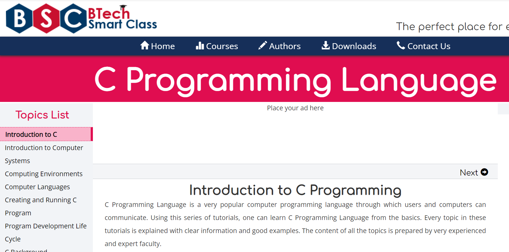
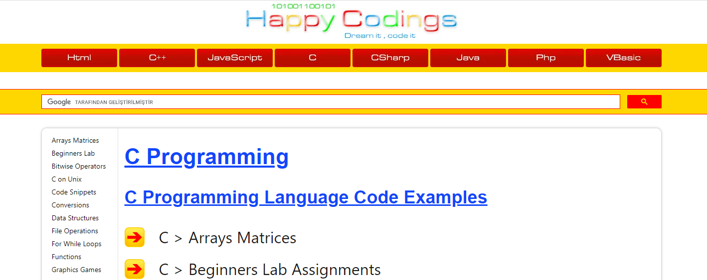
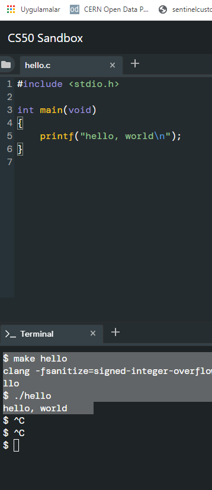
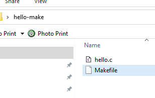
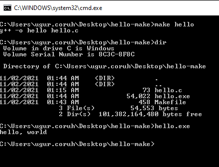
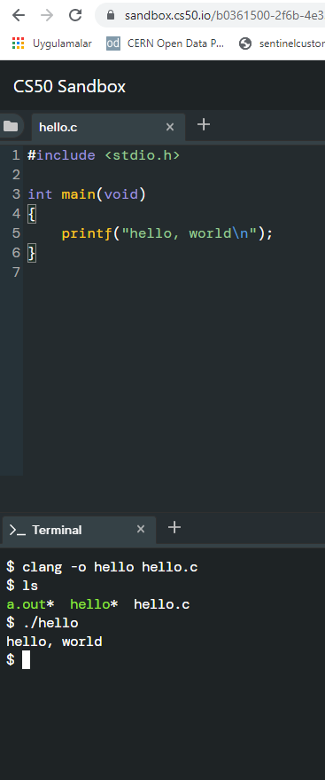
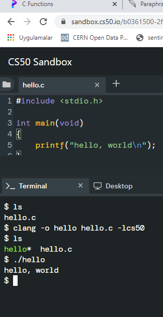

<!-- _backgroundColor: aquq -->

<!-- _color: orange -->

<!-- paginate: false -->

## CE103 Algorithms and Programming I

## Week-5

#### Fall Semester, 2021-2022

Download [DOC](ce103-week-5-c.md_doc.pdf), [SLIDE](ce103-week-5-c.md_slide.pdf), [PPTX](ce103-week-5-c.md_slide.pptx)

<iframe width=700, height=500 frameBorder=0 src="../ce103-week-5-c.md_slide.html"></iframe>

---

<!-- paginate: true -->

# C Functional Console Programming

---

## Books and Resources

[free-programming-books/free-programming-books-langs.md at master · EbookFoundation/free-programming-books · GitHub](https://github.com/EbookFoundation/free-programming-books/blob/master/books/free-programming-books-langs.md#c)

---

# C Functional Console Programming

We will use the following course notes and examples.

 [Learn C Programming](https://www.programiz.com/c-programming)


[C Tutorials - Introduction to C Programming Language](http://www.btechsmartclass.com/c_programming/introduction-to-c-programming.html)



[The C and C++ programming tutorials, hands-on approach with program examples, code samples and tons of output images using Visual C++, C++ Builder, Linux gcc and g++ compilers and IDE](https://www.tenouk.com/cncplusplustutorials.html)


[CS50x 2021](https://cs50.harvard.edu/x/2021/)


[C Programming For Dummies](https://c-for-dummies.com/cprog/)


[C reference - cppreference.com](https://en.cppreference.com/w/c)


https://c.happycodings.com/



# C Programming

C is a versatile programming language. It is useful for creating software such as operating systems, databases, and compilers. For novices, C programming is a great language to learn to code in.

Our C tutorials will take you step by step through the process of learning C programming.

Before starting you should check your development enviroment. 

**You will open visual studio community edition and create a C++ console application then rename *.cpp file to *.c  for triggering c complier.**


Before starting you should understand the executable generation flows 

```c
#include <stdio.h>

int main(void)
{
    printf("hello, world");
}
```

and how we convert source code to binary code

```bash
01111111 01000101 01001100 01000110 00000010 00000001 00000001 00000000
00000000 00000000 00000000 00000000 00000000 00000000 00000000 00000000
00000010 00000000 00111110 00000000 00000001 00000000 00000000 00000000
10110000 00000101 01000000 00000000 00000000 00000000 00000000 00000000
01000000 00000000 00000000 00000000 00000000 00000000 00000000 00000000
11010000 00010011 00000000 00000000 00000000 00000000 00000000 00000000
00000000 00000000 00000000 00000000 01000000 00000000 00111000 00000000
00001001 00000000 01000000 00000000 00100100 00000000 00100001 00000000
00000110 00000000 00000000 00000000 00000101 00000000 00000000 00000000
01000000 00000000 00000000 00000000 00000000 00000000 00000000 00000000
01000000 00000000 01000000 00000000 00000000 00000000 00000000 00000000
01000000 00000000 01000000 00000000 00000000 00000000 00000000 00000000
11111000 00000001 00000000 00000000 00000000 00000000 00000000 00000000
11111000 00000001 00000000 00000000 00000000 00000000 00000000 00000000
00001000 00000000 00000000 00000000 00000000 00000000 00000000 00000000
00000011 00000000 00000000 00000000 00000100 00000000 00000000 00000000
00111000 00000010 00000000 00000000 00000000 00000000 00000000 00000000
...
```

There is a sandbox in CS50 harvard course [Week 0 - CS50x](https://cs50.harvard.edu/x/2020/weeks/0/)

https://sandbox.cs50.io/ you can use it for online compiler




```bash
$ make hello
clang -fsanitize=signed-integer-overflow -fsanitize=undefined -ggdb3 -O0 -std=c11 -Wall -Werror -Wextra -Wno-sign-compare -Wno-unused-parameter -Wno-unused-variable -Wshadow    hello.c  -lcrypt -lcs50 -lm -o hello
$ ./hello
hello, world
```

<u>if you want to make samething in windows environment you should create the following makefile near the hello.c</u>



**Makefile**

```makefile
# This is the default target, which will be built when 
# you invoke make
.PHONY: all
all: hello

# This rule tells make how to build hello from hello.cpp
hello: hello.c
    g++ -o hello hello.c

# This rule tells make to copy hello to the binaries subdirectory,
# creating it if necessary
.PHONY: install
install:
    mkdir -p binaries
    cp -p hello binaries

# This rule tells make to delete hello and hello.o
.PHONY: clean 
clean:
    rm -f hello
```



```bash
C:\Users\ugur.coruh\Desktop\hello-make>make hello
g++ -o hello hello.c

C:\Users\ugur.coruh\Desktop\hello-make>dir
 Volume in drive C is Windows
 Volume Serial Number is 8C3C-8F8C

 Directory of C:\Users\ugur.coruh\Desktop\hello-make

11/02/2021  01:44 AM    <DIR>          .
11/02/2021  01:44 AM    <DIR>          ..
11/02/2021  01:15 AM                73 hello.c
11/02/2021  01:44 AM            54,022 hello.exe
11/02/2021  01:43 AM               458 Makefile
               3 File(s)         54,553 bytes
               2 Dir(s)  101,382,164,480 bytes free

C:\Users\ugur.coruh\Desktop\hello-make>hello.exe
hello, world

C:\Users\ugur.coruh\Desktop\hello-make>
```


```bash
$ clang hello.c
$ ls
a.out*  hello*  hello.c
$ ./a.out 
hello, world
```



```bash
$ clang -o hello hello.c
$ ls
a.out*  hello*  hello.c
$ ./hello 
hello, world
```



```c
$ ls
hello.c
$ clang -o hello hello.c -lcs50
$ ls
hello*  hello.c
$ ./hello 
hello, world
$ 
```

Also you can use visual studio community edition. 

# preprocessing

get included file declarations

```c
#include <cs50.h>
#include <stdio.h>

int main(void)
{
    string name = get_string("What's your name? ");
    printf("hello, %s\n", name);
}
```

to this

```c
string get_string(string prompt);
int printf(string format, ...);

int main(void)
{
    string name = get_string("What's your name? ");
    printf("hello, %s\n", name);
}
```

# compiling

convert source code to assembler code

```asm6502
...
main:                                   # @main
    .cfi_startproc
# BB#0:
    pushq    %rbp
.Ltmp0:
    .cfi_def_cfa_offset 16
.Ltmp1:
    .cfi_offset %rbp, -16
    movq    %rsp, %rbp
.Ltmp2:
    .cfi_def_cfa_register %rbp
    subq    $16, %rsp
    xorl    %eax, %eax
    movl    %eax, %edi
    movabsq    $.L.str, %rsi
    movb    $0, %al
    callq    get_string
    movabsq    $.L.str.1, %rdi
    movq    %rax, -8(%rbp)
    movq    -8(%rbp), %rsi
    movb    $0, %al
    callq    printf
    ...
```

# assembling

convert assembler to opcodes

```asm6502
...
main:                                   # @main
    .cfi_startproc
# BB#0:
    pushq    %rbp
.Ltmp0:
    .cfi_def_cfa_offset 16
.Ltmp1:
    .cfi_offset %rbp, -16
    movq    %rsp, %rbp
.Ltmp2:
    .cfi_def_cfa_register %rbp
    subq    $16, %rsp
    xorl    %eax, %eax
    movl    %eax, %edi
    movabsq    $.L.str, %rsi
    movb    $0, %al
    callq    get_string
    movabsq    $.L.str.1, %rdi
    movq    %rax, -8(%rbp)
    movq    -8(%rbp), %rsi
    movb    $0, %al
    callq    printf
    ...
```

to this

```bash
01111111010001010100110001000110
00000010000000010000000100000000
00000000000000000000000000000000
00000000000000000000000000000000
00000001000000000011111000000000
00000001000000000000000000000000
00000000000000000000000000000000
00000000000000000000000000000000
00000000000000000000000000000000
00000000000000000000000000000000
10100000000000100000000000000000
00000000000000000000000000000000
00000000000000000000000000000000
01000000000000000000000000000000
00000000000000000100000000000000
00001010000000000000000100000000
01010101010010001000100111100101
01001000100000111110110000010000
00110001110000001000100111000111
01001000101111100000000000000000
00000000000000000000000000000000
00000000000000001011000000000000
11101000000000000000000000000000
00000000010010001011111100000000
00000000000000000000000000000000
00000000000000000000000001001000
...
```

# linking

| hello.c                               | cs50.c                           | stdio.c |
| ------------------------------------- | -------------------------------- | ------- |
| 01111111010001010100110001000110      |                                  |         |
| <br/>00000010000000010000000100000000 |                                  |         |
| <br/>00000000000000000000000000000000 |                                  |         |
| <br/>00000000000000000000000000000000 |                                  |         |
| <br/>00000001000000000011111000000000 |                                  |         |
| <br/>00000001000000000000000000000000 |                                  |         |
| <br/>00000000000000000000000000000000 |                                  |         |
| <br/>00000000000000000000000000000000 |                                  |         |
| <br/>00000000000000000000000000000000 |                                  |         |
| <br/>00000000000000000000000000000000 |                                  |         |
| <br/>10100000000000100000000000000000 |                                  |         |
| <br/>00000000000000000000000000000000 |                                  |         |
| <br/>00000000000000000000000000000000 |                                  |         |
| <br/>01000000000000000000000000000000 |                                  |         |
| <br/>00000000000000000100000000000000 |                                  |         |
| <br/>00001010000000000000000100000000 |                                  |         |
| <br/>01010101010010001000100111100101 |                                  |         |
| <br/>01001000100000111110110000010000 |                                  |         |
| <br/>00110001110000001000100111000111 |                                  |         |
| <br/>01001000101111100000000000000000 |                                  |         |
| <br/>00000000000000000000000000000000 |                                  |         |
| <br/>00000000000000001011000000000000 |                                  |         |
| <br/>11101000000000000000000000000000 |                                  |         |
| <br/>00000000010010001011111100000000 |                                  |         |
| <br/>00000000000000000000000000000000 |                                  |         |
| <br/>00000000000000000000000001001000 |                                  |         |
| <br/>...                              | 01111111010001010100110001000110 |         |
| <br/>00000010000000010000000100000000 |                                  |         |
| <br/>00000000000000000000000000000000 |                                  |         |
| <br/>00000000000000000000000000000000 |                                  |         |
| <br/>00000011000000000011111000000000 |                                  |         |
| <br/>00000001000000000000000000000000 |                                  |         |
| <br/>11000000000011110000000000000000 |                                  |         |
| <br/>00000000000000000000000000000000 |                                  |         |
| <br/>01000000000000000000000000000000 |                                  |         |
| <br/>00000000000000000000000000000000 |                                  |         |
| <br/>00101000001100100000000000000000 |                                  |         |
| <br/>00000000000000000000000000000000 |                                  |         |
| <br/>00000000000000000000000000000000 |                                  |         |
| <br/>01000000000000000011100000000000 |                                  |         |
| <br/>00000111000000000100000000000000 |                                  |         |
| <br/>00011100000000000001100100000000 |                                  |         |
| <br/>00000001000000000000000000000000 |                                  |         |
| <br/>00000101000000000000000000000000 |                                  |         |
| <br/>00000000000000000000000000000000 |                                  |         |
| <br/>00000000000000000000000000000000 |                                  |         |
| <br/>00000000000000000000000000000000 |                                  |         |
| <br/>00000000000000000000000000000000 |                                  |         |
| <br/>00000000000000000000000000000000 |                                  |         |
| <br/>00000000000000000000000000000000 |                                  |         |
| <br/>01011100001001010000000000000000 |                                  |         |
| <br/>00000000000000000000000000000000 |                                  |         |
| <br/>...                              | 00101111011011000110100101100010 |         |
| <br/>01100011001011100111001101101111 |                                  |         |
| <br/>00101110001101100010000000101111 |                                  |         |
| <br/>01110101011100110111001000101111 |                                  |         |
| <br/>01101100011010010110001000101111 |                                  |         |
| <br/>01111000001110000011011001011111 |                                  |         |
| <br/>00110110001101000010110101101100 |                                  |         |
| <br/>01101001011011100111010101111000 |                                  |         |
| <br/>00101101011001110110111001110101 |                                  |         |
| <br/>00101111011011000110100101100010 |                                  |         |
| <br/>01100011010111110110111001101111 |                                  |         |
| <br/>01101110011100110110100001100001 |                                  |         |
| <br/>01110010011001010110010000101110 |                                  |         |
| <br/>01100001001000000010000001000001 |                                  |         |
| <br/>01010011010111110100111001000101 |                                  |         |
| <br/>01000101010001000100010101000100 |                                  |         |
| <br/>00100000001010000010000000101111 |                                  |         |
| <br/>01101100011010010110001000101111 |                                  |         |
| <br/>01111000001110000011011001011111 |                                  |         |
| <br/>00110110001101000010110101101100 |                                  |         |
| <br/>01101001011011100111010101111000 |                                  |         |
| <br/>00101101011001110110111001110101 |                                  |         |
| <br/>00101111011011000110010000101101 |                                  |         |
| <br/>01101100011010010110111001110101 |                                  |         |
| <br/>01111000001011010111100000111000 |                                  |         |
| <br/>00110110001011010011011000110100 |                                  |         |
| <br/>...                              |                                  |         |

combine binary codes to generate exe

```bash
011111110100010101001100010001100000001000000001000000010000000000000000000000000000000000000000000000
000000000000000000000000000000000100000000001111100000000000000001000000000000000000000000000000000000
000000000000000000000000000000000000000000000000000000000000000000000000000000000000000000000000000000
000000000000001010000000000010000000000000000000000000000000000000000000000000000000000000000000000000
000000000100000000000000000000000000000000000000000000000100000000000000000010100000000000000001000000
000101010101001000100010011110010101001000100000111110110000010000001100011100000010001001110001110100
100010111110000000000000000000000000000000000000000000000000000000000000000010110000000000001110100000
000000000000000000000000000000010010001011111100000000000000000000000000000000000000000000000000000000
0000000001001000...01111111010001010100110001000110000000100000000100000001000000000000000000000000000
000000000000000000000000000000000000000000000000000110000000000111110000000000000000100000000000000000
000000011000000000011110000000000000000000000000000000000000000000000000100000000000000000000000000000
000000000000000000000000000000000001010000011001000000000000000000000000000000000000000000000000000000
000000000000000000000000000010000000000000000111000000000000000011100000000010000000000000000011100000
000000001100100000000000000010000000000000000000000000000010100000000000000000000000000000000000000000
000000000000000000000000000000000000000000000000000000000000000000000000000000000000000000000000000000
000000000000000000000000000000000000000000000000000000000000000000000000001011100001001010000000000000
00000000000000000000000000000000000...0010111101101100011010010110001001100011001011100111001101101111
001011100011011000100000001011110111010101110011011100100010111101101100011010010110001000101111011110
000011100000110110010111110011011000110100001011010110110001101001011011100111010101111000001011010110
011101101110011101010010111101101100011010010110001001100011010111110110111001101111011011100111001101
101000011000010111001001100101011001000010111001100001001000000010000001000001010100110101111101001110
010001010100010101000100010001010100010000100000001010000010000000101111011011000110100101100010001011
110111100000111000001101100101111100110110001101000010110101101100011010010110111001110101011110000010
110101100111011011100111010100101111011011000110010000101101011011000110100101101110011101010111100000
101101011110000011100000110110001011010011011000110100...
```

## C Introduction

### Keywords and Identifiers

This tutorial will teach you about keywords, which are reserved words in C programming that are part of the syntax. You will also be taught about identifiers and how to name them.

## Character set

A character set is a collection of alphabets, letters, and special characters that are supported by the C programming language. As variables and functions, C accepts both lowercase and uppercase alphabets.

### Alphabets

```c
Uppercase: A B C ................................... X Y Z
Lowercase: a b c ...................................... x y z
```

### Digits

```c
0 1 2 3 4 5 6 7 8 9
```

### Special Characters

Special Characters in C Programming

| ,   | <   | >   | .   | -   |
| --- | --- | --- | --- | --- |
| (   | )   | ;   | $   | :   |
| %   | [   | ]   | #   | ?   |
| '   | &   | {   | }   | "   |
| ^   | !   | *   | /   |     |
| -   | \   | ~   | +   |     |

**White space Characters**

A newline, a horizontal tab, a carriage return, and a form feed are all examples of punctuation.

## C Keywords

Keywords are reserved words in programming that have special meanings to the compiler. Keywords are syntax elements that cannot be used as identifiers. As an example:

```c
int money;
```

In this case, `int` is a keyword indicating that `money`is a variable of type `int`(integer).

Because C is a case-sensitive language, all keywords must be written in lowercase. The following is a list of all the keywords permitted in ANSI C.

C Keywords

| auto     | double | int      | struct   |
| -------- | ------ | -------- | -------- |
| break    | else   | long     | switch   |
| case     | enum   | register | typedef  |
| char     | extern | return   | union    |
| continue | for    | signed   | void     |
| do       | if     | static   | while    |
| default  | goto   | sizeof   | volatile |
| const    | float  | short    | unsigned |

All of these keywords, as well as their syntax and application, will be covered in their respective topics.

[The Complete List of all 32 C Programming Keywords (With Examples) - Programiz](https://www.programiz.com/c-programming/list-all-keywords-c-language)

## C Identifiers

The term "identifier" refers to the name given to entities such as variables, functions, structures, and so on. Identifiers must be distinct. They are created to give a unique name to an entity in order to identify it during program execution. As an example:

```c
int money;
double accountBalance;
```

`money `and `accountBalance`are identifiers in this context. Also, keep in mind that identifier names must be distinct from keyword names. Because `int`is a keyword, it cannot be used as an identifier.

### Rules for naming identifiers

1. Letters (including capital and lowercase letters), numbers, and underscores can all be used in a valid identification.

2. An identifier's initial letter should be either a letter or an underscore.

3. Keywords such as int, while, and so on cannot be used as identifiers.

4. There are no restrictions on the length of an identification. However, if the identifier is larger than 31 characters, you may have issues with some compilers.
   
   If you follow the above criterion, you can use any name as an identifier; nevertheless, provide meaningful names to identifiers that make sense.

# C Variables, Constants and Literals

This article will teach you about variables and the rules for naming variables. You will also learn about different literals and how to build constants in C programming.

---

## Variables

A variable in programming is a container (storage space) for data.
Each variable should be given a unique name to denote the storage region (identifier). Variable names are simply a graphical representation of a memory location. As an example:

```c
int playerScore = 95;
```

In this case, `playerScore` is an `int` variable. The variable is given the integer value `95`in this case.

A variable's value may be altered, thus the term variable.

```c
char ch = 'a';
// some code
ch = 'l';
```

---

### Rules for naming a variable

1. A variable name can only contain characters (uppercase and lowercase), numbers, and underscores.

2. A variable's initial letter should be either a letter or an underscore.

3. There are no restrictions on the length of a variable name (identifier). However, if the variable name is larger than `31`characters, you may have issues with some compilers.

Please keep in mind that you should always aim to give variables meaningful names. For example, `firstName` is a more appropriate variable name than `fn`.

C is a highly typed programming language. This means that once a variable is declared, it cannot be modified. As an example:

```c
int number = 5;      // integer variable
number = 5.5;        // error
double number;       // error
```

In this case, the type of number variable is int. This variable cannot be assigned the floating-point (decimal) value 5.5. Furthermore, you cannot change the variable's data type to double. By the way, in order to hold decimal values in C, you must designate their type as double or float.

## Literals

Literals are data that are used to represent fixed values. They can be directly utilized in the code. For example: 1, 2.5, 'c,' and so on. Literals are 1, 2.5, and 'c' in this case. Why? These words cannot have various values assigned to them.

### 1. Integers

An integer is a numeric literal (related with numbers) that does not have any fractional or exponential components. In C programming, there are three types of integer literals:

- digits (base 10)

- the number octal (base 8)

- hexadecimal (base 16)

For example:

```c
Decimal: 0, -9, 22 etc
Octal: 021, 077, 033 etc
Hexadecimal: 0x7f, 0x2a, 0x521 etc
```

In C, octal begins with a 0 while hexadecimal begins with a 0x.

### 2. Floating-point Literals

A floating-point literal is a numeric literal with a fractional or exponent form. As an example:

```c
-2.0
0.0000234
-0.22E-5
```

Please note that

$$
E-5 = 10^{-5}
$$

### 3. Characters

Enclosing a single character inside single quote marks yields a character literal. For example, 'a','m', 'F', '2', ", and so on.

### 4. Escape Sequences

In C programming, it is sometimes important to employ characters that cannot be typed or have specific meaning. For instance, newline (enter), tab, question mark, and so on.

Escape sequences are utilized to utilise these characters.

| Escape Sequences | Character             |
| ---------------- | --------------------- |
| \b               | Backspace             |
| \f               | Form feed             |
| \n               | Newline               |
| \r               | Return                |
| \t               | Horizontal Tab        |
| \v               | Vertical Tab          |
| \\\              | Backslash             |
| \'               | Single quotation mark |
| \"               | Double quotation mark |
| \?               | Question mark         |
| \0               | Null character        |

### 5. String Literals

A string literal is a string of characters surrounded by double quotation marks. As an example:

```c
"good"                  //string constant
""                     //null string constant
"      "               //string constant of six white space
"x"                    //string constant having a single character.
"Earth is round\n"         //prints string with a newline
```

## Constants

The const keyword can be used to declare a variable whose value cannot be modified. This will result in a constant. As an example,

```c
const double PI = 3.14;
```

We've introduced the keyword const. PI is a symbolic constant in this context; its value cannot be modified.

```c
const double PI = 3.14;
PI = 2.9; //Error
```

You may also use the `#define` preprocessor directive to declare a constant.

# C Data Types

In this course, you will learn about basic data types in C programming, such as int, float, and char.

Data types are variable declarations in C programming. The kind and quantity of data linked with variables are determined by this. As an example,

```c
int myVar;
```

In this case, `myVar` is an `int` (integer) variable. `int` has a size of 4 bytes.

## Basic types

Here's a table containing commonly used types in C programming for quick access.

| Type                   | Size(bytes)                   | Format Specifiers |
| ---------------------- | ----------------------------- | ----------------- |
| int                    | at least 2, usually 4         | %d %i             |
| char                   | 1                             | %c                |
| float                  | 4                             | %f                |
| double                 | 8                             | %lf               |
| short int              | 2 usually                     | %hd               |
| unsigned int           | at least 2, usually 4         | %u                |
| long int               | at least 4, usually 8         | %ld %li           |
| long long int          | at least 8                    | %lld %lli         |
| unsigned long int      | at least 4                    | %lu               |
| unsigned long long int | at least 8                    | %llu              |
| signed char            | 1                             | %c                |
| usigned char           | 1                             | %c                |
| long double            | at least 10, usually 12 or 16 | %Lf               |

### int

Integers are entire integers with zero, positive, and negative values but no decimal values. For instance, $0$, $-5$, and $10$

In order to declare an integer variable, we can use `int`.

```c
int id;
```

In this case, id is an integer variable.

In C programming, you can define many variables at the same time. As an example,

```c
int id, age;
```

Integers are typically $\text{4 bytes}$ in size ($\text{32 bits}$). It may also take   $2^{32} $ different states from $-2147483648$ to $2147483647$.

### float and double

Real values are stored in float and double variables.

```c
float salary;
double price;
```

Floating-point numbers in C can also be expressed in exponential form. As an example,

```c
float normalizationFactor = 22.442e2;
```

What is the distinction between float and double?

Float (single precision float data type) has a size of 4 bytes. And double (double precision float data type) is 8 bytes in size.

### char

The keyword char is used to declare variables of the character type. As an example, 

```c
char test = 'h';
```

The character variable is 1 byte in size.

### void

void is an unfinished type. It signifies "nothing" or "nothing of the sort." You might conceive of emptiness as the absence of something.

If a function does not return anything, its return type should be void.

<mark>It is important to note that void variables cannot be created.</mark>

### short and long

If you need to utilize a huge number, a type specifier `long` can be used. Here's how it works:

```c
long a;
long long b;
long double c;
```

Variables a and b can store integer values in this case. In addition, c may hold a floating-point number.

You can use `short` if you are certain that just a tiny integer range between

$-32767, +32767$  will be utilized.

```c
short d;
```

The `sizeof()` operator may always be used to determine the size of a variable.

```c
#include <stdio.h>    

int main() {
  short a;
  long b;
  long long c;
  long double d;

  printf("size of short = %d bytes\n", sizeof(a));
  printf("size of long = %d bytes\n", sizeof(b));
  printf("size of long long = %d bytes\n", sizeof(c));
  printf("size of long double= %d bytes\n", sizeof(d));
  return 0;
}
```

### signed and unsigned

Signed and unsigned are type modifiers in C. You may use them to change the data storage of a data type. As an example,

```c
unsigned int x;
int y;
```

Because we applied the unsigned modifier, the variable `x` can only retain zero and positive numbers.

Given that `int` has a capacity of `4 bytes`, variable `y` can have values ranging from

  -$2^{31}$ to  $2^{31}-1$, 

But variable `x`can hold values ranging from

 $0$ to  $2^{32}-1$.

## Other data types defined in C programming are:

- bool Type
- Enumerated type
- Complex types

## Derived Data Types

Derived types are data types that are derived from basic data types. Arrays, pointers, function types, structures, and so on are examples.

# C Input Output (I/O)

In this lesson, you will learn how to utilize the `scanf()` function to accept user input and the `printf()` method to display output to the user.

## C Output

`printf()` is a common output function in C programming. The function outputs formatted data to the screen. As an example,

### Example 1: C Output

```c
#include <stdio.h>    
int main()
{ 
    // Displays the string inside quotations
    printf("C Programming");
    return 0;
}
```

**Output**

```bash
C Programming
```

How does this software function?

The `main()` function is required in all legal C programs. 

The execution of the code begins at the commencement of the main() function.

The `printf()` function is a library function that is used to provide formatted output to the screen. 

The string is printed within quote marks by the function.

In order to utilize printf() in our program, we must include the `stdio.h` header file using the `#include <stdio.h>` declaration.

The "Exit status" of the program is the return 0; statement within the main() method. It's entirely voluntary.

### Example 2: Integer Output

```c
#include <stdio.h>
int main()
{
    int testInteger = 5;
    printf("Number = %d", testInteger);
    return 0;
}
```

**Output**

```bash
Number = 5
```

To print `int `types, we utilize the `%d` format specifier. The value of `testInteger` will be used in instead of the `%d` inside the quotes.

### Example 3: float and double Output

```c
#include <stdio.h>
int main()
{
    float number1 = 13.5;
    double number2 = 12.4;

    printf("number1 = %f\n", number1);
    printf("number2 = %lf", number2);
    return 0;
}
```

**Output**

```bash
number1 = 13.500000
number2 = 12.400000
```

We utilize the `%f` format specifier to print `floats`. Similarly, to display `double` numbers, we use `%lf`.

### Example 4: Print Characters

```c
#include <stdio.h>
int main()
{
    char chr = 'a';    
    printf("character = %c", chr);  
    return 0;
} 
```

**Output**

```bash
character = a
```

We utilize the `%c` format specifier to print char.

## C Input

`scanf()` is a widely used function in C programming to accept user input. The `scanf()` function reads formatted input from typical input devices like keyboards.

### Example 5: Integer Input/Output

```c
#include <stdio.h>
int main()
{
    int testInteger;
    printf("Enter an integer: ");
    scanf("%d", &testInteger);  
    printf("Number = %d",testInteger);
    return 0;
}
```

**Output**

```bash
Enter an integer: 4
Number = 4
```

To accept `int` input from the user, we utilized the `%d` format specifier inside the `scanf()` method. When a user enters an integer, it is saved in the variable `testInteger`.

You'll see that we used `&testInteger` within `scanf ()`. This is due to the fact that `&testInteger` obtains the address of `testInteger`, and the value given by the user is saved in that address.

### Example 6: Float and Double Input/Output

```c
#include <stdio.h>
int main()
{
    float num1;
    double num2;

    printf("Enter a number: ");
    scanf("%f", &num1);
    printf("Enter another number: ");
    scanf("%lf", &num2);

    printf("num1 = %f\n", num1);
    printf("num2 = %lf", num2);

    return 0;
}
```

**Output**

```bash
Enter a number: 12.523
Enter another number: 10.2
num1 = 12.523000
num2 = 10.200000
```

For `float`and `double`, we use the format specifiers `%f` and `%lf`, respectively.

### Example 7: C Character I/O

```c
#include <stdio.h>
int main()
{
    char chr;
    printf("Enter a character: ");
    scanf("%c",&chr);     
    printf("You entered %c.", chr);  
    return 0;
}   
```

**Output**

```bash
Enter a character: g
You entered g
```

When a user enters a character into the aforementioned software, the character itself is not saved. An integer value (ASCII value) is instead stored.

When we use the `%c` text format to represent that value, the input character is displayed. The ASCII value of the character is printed when we utilize `%d` to show it.

### Example 8: ASCII Value

```c
#include <stdio.h>

int main()
{
    char chr;
    printf("Enter a character: ");
    scanf("%c", &chr);     

    // When %c is used, a character is displayed
    printf("You entered %c.\n",chr);  

    // When %d is used, ASCII value is displayed
    printf("ASCII value is %d.", chr);  
    return 0;
}
```

**Output**

```bash
Enter a character: g
You entered g.
ASCII value is 103.
```

## I/O Multiple Values

Here's how to take numerous user inputs and show them.

```c
#include <stdio.h>

int main()
{
    int a;
    float b;

    printf("Enter integer and then a float: ");

    // Taking multiple inputs
    scanf("%d%f", &a, &b);

    printf("You entered %d and %f", a, b);  
    return 0;
}
```

**Output**

```bash
Enter integer and then a float: -3
3.4
You entered -3 and 3.400000
```

## Format Specifiers for I/O

As you can see from the samples above, we apply

- `%d` for `int`
- `%f` for `float`
- `%lf` for `double`
- `%c` for `char`

The following is a collection of widely used C data types and associated format specifiers.

| Type                   | Size(bytes)                   | Format Specifiers |
| ---------------------- | ----------------------------- | ----------------- |
| int                    | at least 2, usually 4         | %d %i             |
| char                   | 1                             | %c                |
| float                  | 4                             | %f                |
| double                 | 8                             | %lf               |
| short int              | 2 usually                     | %hd               |
| unsigned int           | at least 2, usually 4         | %u                |
| long int               | at least 4, usually 8         | %ld %li           |
| long long int          | at least 8                    | %lld %lli         |
| unsigned long int      | at least 4                    | %lu               |
| unsigned long long int | at least 8                    | %llu              |
| signed char            | 1                             | %c                |
| usigned char           | 1                             | %c                |
| long double            | at least 10, usually 12 or 16 | %Lf               |

# C Programming Operators

With the assistance of examples, you will learn about several operators in C programming in this course.

An operator is a symbol that performs an operation on a value or variable. For example, the operator + is used to compute addition.

C has a diverse set of operators to execute a variety of tasks.

## C Arithmetic Operators

An arithmetic operator performs mathematical operations such as addition, subtraction, multiplication, division etc on numerical values (constants and variables).

| Operator | Meaning of Operator                        |
| -------- | ------------------------------------------ |
| +        | Addition or unary plus                     |
| -        | Substraction or unary minus                |
| *        | Multiplication                             |
| /        | Division                                   |
| %        | Remainder after division (modulo division) |

### Example 1: Arithmetic Operators

```c
// Working of arithmetic operators
#include <stdio.h>
int main()
{
    int a = 9,b = 4, c;

    c = a+b;
    printf("a+b = %d \n",c);
    c = a-b;
    printf("a-b = %d \n",c);
    c = a*b;
    printf("a*b = %d \n",c);
    c = a/b;
    printf("a/b = %d \n",c);
    c = a%b;
    printf("Remainder when a divided by b = %d \n",c);

    return 0;
}
```

**Output**

```bash
a+b = 13
a-b = 5
a*b = 36
a/b = 2
Remainder when a divided by b=1
```

As you might guess, the operators +, -, and * calculate addition, subtraction, and multiplication, respectively.

`9/4`Equals `2.25` in standard math. In the program, however, the result is `2`.

This is due to the fact that both variables a and b are integers. As a result, the output is also an integer. The compiler ignores the word following the decimal point and displays response `2` rather than `2.25`.

The residual is computed using the modulo operator percent. The remaining is `1` when `a=9` is divided by `b=4`. Only integers can be used with the percent operator.

Assume that `a = 5.0, b = 2.0, c = 5`, and `d = 2`. After that, in C programming.

```bash
// Either one of the operands is a floating-point number
a/b = 2.5  
a/d = 2.5  
c/b = 2.5  

// Both operands are integers
c/d = 2
```

## C Increment and Decrement Operators

To alter the value of an operand (constant or variable) by one, C programming offers two operators: increment `++` and decrease `--`.

Increment `++` raises the value by one, and decrement `--` lowers the value by one. These two operators are unary, which means they only work on a single operand.

### Example 2: Increment and Decrement Operators

```c
// Working of increment and decrement operators
#include <stdio.h>
int main()
{
    int a = 10, b = 100;
    float c = 10.5, d = 100.5;

    printf("++a = %d \n", ++a);
    printf("--b = %d \n", --b);
    printf("++c = %f \n", ++c);
    printf("--d = %f \n", --d);

    return 0;
}
```

**Output**

```bash
++a = 11
--b = 99
++c = 11.500000
--d = 99.500000
```

The operators `++` and `--` are used as prefixes here. These two operators, like `a++` and `a--` can also be used as postfixes.

# Increment ++ and Decrement -- Operator as Prefix and Postfix

The increment operator ++ in programming (Java, C, C++, JavaScript, and so on) increments the value of a variable by one. Similarly, the decrement operator -- reduces a variable's value by one.

```bash
a = 5
++a;          // a becomes 6
a++;          // a becomes 7
--a;          // a becomes 6
a--;          // a becomes 5
```

So far, so straightforward. When these two operators are employed as a prefix and a postfix, there is a significant difference.

## ++ and -- operator as prefix and postfix

When you use the ++ operator as a prefix, such as: ++var, the value of var is increased by one and then returned.

If you use the ++ operator as a postfix, such as var++, the original value of var is returned first, followed by a one-digit increase of var.

The -- operator functions similarly to the ++ operator, except that it reduces the value by one.

## Example 1: C Programming

```c
#include <stdio.h>
int main() {
   int var1 = 5, var2 = 5;

   // 5 is displayed
   // Then, var1 is increased to 6.
   printf("%d\n", var1++);

   // var2 is increased to 6 
   // Then, it is displayed.
   printf("%d\n", ++var2);

   return 0;
}
```

**Output**

```bash
5
6
```

## C Assignment Operators

An assignment operator is a type of operator that is used to assign a value to a variable. = is the most commonly used assignment operator.

| Operator | Example | Same as |
| -------- | ------- | ------- |
| =        | a=b     | a=b     |
| +=       | a+=b    | a=a+b   |
| -=       | a-=b    | a=a-b   |
| *=       | a*=b    | a=a*b   |
| /=       | a/=b    | a=a/b   |
| %=       | a%=b    | a=a%b   |

### Example 3: Assignment Operators

```c
// Working of assignment operators
#include <stdio.h>
int main()
{
    int a = 5, c;

    c = a;      // c is 5
    printf("c = %d\n", c);
    c += a;     // c is 10 
    printf("c = %d\n", c);
    c -= a;     // c is 5
    printf("c = %d\n", c);
    c *= a;     // c is 25
    printf("c = %d\n", c);
    c /= a;     // c is 5
    printf("c = %d\n", c);
    c %= a;     // c = 0
    printf("c = %d\n", c);

    return 0;
}
```

**Output**

```bash
c = 5 
c = 10 
c = 5 
c = 25 
c = 5 
c = 0
```

### C Relational Operators

A relational operator verifies the relationship of two operands. If the relationship is true, it returns 1; if the relationship is false, it returns 0.

| Operator | Meaning of Operator      | Example                  |
| -------- | ------------------------ | ------------------------ |
| ==       | Equal to                 | 5 == 3 is evaluated to 0 |
| >        | Greater than             | 5 > 3 is evaluated to 1  |
| <        | Less than                | 5 < 3 is evaluated to 0  |
| !=       | Not equal to             | 5 != 3 is evaluated to 1 |
| >=       | Greater than or equal to | 5 >= 3 is evaluated to 1 |
| <=       | Less than or equal to    | 5 <= 3 is evaluated to 0 |

### Example 4: Relational Operators

```c
// Working of relational operators
#include <stdio.h>
int main()
{
    int a = 5, b = 5, c = 10;

    printf("%d == %d is %d \n", a, b, a == b);
    printf("%d == %d is %d \n", a, c, a == c);
    printf("%d > %d is %d \n", a, b, a > b);
    printf("%d > %d is %d \n", a, c, a > c);
    printf("%d < %d is %d \n", a, b, a < b);
    printf("%d < %d is %d \n", a, c, a < c);
    printf("%d != %d is %d \n", a, b, a != b);
    printf("%d != %d is %d \n", a, c, a != c);
    printf("%d >= %d is %d \n", a, b, a >= b);
    printf("%d >= %d is %d \n", a, c, a >= c);
    printf("%d <= %d is %d \n", a, b, a <= b);
    printf("%d <= %d is %d \n", a, c, a <= c);

    return 0;
}
```

**Output**

```bash
5 == 5 is 1
5 == 10 is 0
5 > 5 is 0
5 > 10 is 0
5 < 5 is 0
5 < 10 is 1
5 != 5 is 0
5 != 10 is 1
5 >= 5 is 1
5 >= 10 is 0
5 <= 5 is 1
5 <= 10 is 1 
```

### C Logical Operators

A logical operator expression returns either 0 or 1, depending on whether the expression is true or false.

| Operator | Meaning                                         | Example                                                            |
| -------- | ----------------------------------------------- | ------------------------------------------------------------------ |
| &&       | Logical AND. True only if all operands are true | If c = 5 and d = 2 then, expression ((c==5) && (d>5)) equals to 0. |
|          | \|                                              | Logical OR. True only if either one operand is true                |
| !        | Logical NOT. True only if the operand is 0      | If c = 5 then, expression !(c==5) equals to 0.                     |

### Example 5: Logical Operators

```c
// Working of logical operators

#include <stdio.h>
int main()
{
    int a = 5, b = 5, c = 10, result;

    result = (a == b) && (c > b);
    printf("(a == b) && (c > b) is %d \n", result);

    result = (a == b) && (c < b);
    printf("(a == b) && (c < b) is %d \n", result);

    result = (a == b) || (c < b);
    printf("(a == b) || (c < b) is %d \n", result);

    result = (a != b) || (c < b);
    printf("(a != b) || (c < b) is %d \n", result);

    result = !(a != b);
    printf("!(a != b) is %d \n", result);

    result = !(a == b);
    printf("!(a == b) is %d \n", result);

    return 0;
}
```

**Output**

```bash
(a == b) && (c > b) is 1 
(a == b) && (c < b) is 0 
(a == b) || (c < b) is 1 
(a != b) || (c < b) is 0 
!(a != b) is 1 
!(a == b) is 0 
```

**Explanation of logical operator program**

- `(a == b) && (c > 5)` evaluates to 1 because both operands `(a == b)` and `(c > b)` is 1 (true).
- `(a == b) && (c < b)` evaluates to 0 because operand `(c < b)` is 0 (false).
- `(a == b) || (c < b)` evaluates to 1 because `(a = b)` is 1 (true).
- `(a != b) || (c < b)` evaluates to 0 because both operand `(a != b)` and `(c < b)` are 0 (false).
- `!(a != b)` evaluates to 1 because operand `(a != b)` is 0 (false). Hence, !(a != b) is 1 (true).
- `!(a == b)` evaluates to 0 because `(a == b)` is 1 (true). Hence, `!(a == b)` is 0 (false).

### C Bitwise Operators

Mathematical operations like as addition, subtraction, multiplication, division, and so on are transformed to bit-level during computation, which speeds up processing and saves power.

In C programming, bitwise operators are used to execute bit-level operations.

| Operators | Meaning of Operators |
| --------- | -------------------- |
| &         | Bitwise AND          |
|           |                      |
| ^         | Bitwise exclusive OR |
| ~         | Bitwise complement   |
| <<        | Shift left           |
| >>        | Shift right          |

## Other Operators

### Comma Operator

Comma operators are used to connect similar expressions. As an example:

```c
int a, c = 5, d;
```

### The sizeof operator

`sizeof` is a unary operator that returns the data size (constants, variables, array, structure, etc).

### Example 6: sizeof Operator

```c
#include <stdio.h>

int main()
{
    int a;
    float b;
    double c;
    char d;
    printf("Size of int=%lu bytes\n",sizeof(a));
    printf("Size of float=%lu bytes\n",sizeof(b));
    printf("Size of double=%lu bytes\n",sizeof(c));
    printf("Size of char=%lu byte\n",sizeof(d));

    return 0;
}
```

**Output**

```bash
Size of int = 4 bytes
Size of float = 4 bytes
Size of double = 8 bytes
Size of char = 1 byte
```

<u>Other operators, </u>

such as the<mark> ternary operator</mark> `?:`, 

the <mark>reference operato</mark>r `&`, 

the <mark>dereference operator</mark> `*`, and 

the <mark>member selection operator</mark> `->`, will be covered in more detail later.

# C Flow Control

# C if...else Statement

With the assistance of examples, you will learn about the if statement (including if...else and nested if...else) in C programming.

## C if Statement

In C programming, the if statement has the following syntax:

```c
if (test expression) 
{
   // code
}
```

### How if statement works?

The test expression inside the parentheses is evaluated by the if statement ().

If the test expression is true, the statements within the if body are performed.
If the test expression is interpreted as false, the statements within the if body are not performed.


Check relational and logical operators to understand more about when a test expression is evaluated to true (non-zero value) and false (0).

### Example 1: if statement

```c
// Program to display a number if it is negative

#include <stdio.h>
int main() {
    int number;

    printf("Enter an integer: ");
    scanf("%d", &number);

    // true if number is less than 0
    if (number < 0) {
        printf("You entered %d.\n", number);
    }

    printf("The if statement is easy.");

    return 0;
}
```

**Output 1**

```bash
Enter an integer: -2
You entered -2.
The if statement is easy.
```

When the user types -2, the test expression number 0 is evaluated as true. As a result, the value -2 that you typed is displayed on the screen.

**Output 2**

```bash
Enter an integer: 5
The if statement is easy.
```

When the user enters 5, the test expression number 0 is assessed as false, and the statement within the body of the if is not performed.

## C if...else Statement

An else block is optional in the if statement. The if...else sentence has the following syntax:

```c
if (test expression) {
    // run code if test expression is true
}
else {
    // run code if test expression is false
}
```

### How if...else statement works?

If the test expression is found to be true,

Statements within the if body are performed.
Statements within the body of else are not executed.
If the test expression is found to be false,

Phrases inside the body of else are performed; statements within the body of if are skipped.


### Example 2: if...else statement

```c
// Check whether an integer is odd or even

#include <stdio.h>
int main() {
    int number;
    printf("Enter an integer: ");
    scanf("%d", &number);

    // True if the remainder is 0
    if  (number%2 == 0) {
        printf("%d is an even integer.",number);
    }
    else {
        printf("%d is an odd integer.",number);
    }

    return 0;
}
```

**Output**

```bash
Enter an integer: 7
7 is an odd integer.
```

When the user enters 7, the test expression `number% 2==0` returns false. As a result, the statement within the body of else is performed.

## C if...else Ladder

Depending on whether the test phrase is true or false, the if...else statement runs two separate programs. Sometimes a decision must be made between more than two options. You may use the `if...else` ladder to compare numerous test expressions and execute various statements.

### Syntax of if...else Ladder

```c
if (test expression1) {
   // statement(s)
}
else if(test expression2) {
   // statement(s)
}
else if (test expression3) {
   // statement(s)
}
.
.
else {
   // statement(s)
}
```

### Example 3: C if...else Ladder

```c
// Program to relate two integers using =, > or < symbol

#include <stdio.h>
int main() {
    int number1, number2;
    printf("Enter two integers: ");
    scanf("%d %d", &number1, &number2);

    //checks if the two integers are equal.
    if(number1 == number2) {
        printf("Result: %d = %d",number1,number2);
    }

    //checks if number1 is greater than number2.
    else if (number1 > number2) {
        printf("Result: %d > %d", number1, number2);
    }

    //checks if both test expressions are false
    else {
        printf("Result: %d < %d",number1, number2);
    }

    return 0;
}
```

**Output**

```bash
Enter two integers: 12
23
Result: 12 < 23
```

## Nested if...else

An `if...else` statement can be included within the body of another `if...else`statement.

### Example 4: Nested if...else

This program, similar to the if...else ladder's example, compares two numbers using, >, and =. To fix this problem, we will utilize a layered if...else expression.

```c
#include <stdio.h>
int main() {
    int number1, number2;
    printf("Enter two integers: ");
    scanf("%d %d", &number1, &number2);

    if (number1 >= number2) {
      if (number1 == number2) {
        printf("Result: %d = %d",number1,number2);
      }
      else {
        printf("Result: %d > %d", number1, number2);
      }
    }
    else {
        printf("Result: %d < %d",number1, number2);
    }

    return 0;
}
```

You do not need to use brackets if the body of an if...else statement contains only one sentence.

```c
if (a > b) {
    printf("Hello");
}
printf("Hi");
```

is equivalent to

```c
if (a > b)
    printf("Hello");
printf("Hi");
```

# C for Loop

With the assistance of examples, you will learn how to design a for loop in C programming in this article.

A loop is a programming construct that is used to repeat a block of code until the stated condition is fulfilled.

Loops in C programming are classified into three types:

- while loop 

- for loop

- do..while loop

This lesson will teach us about the for loop. The while and do...while loops will be covered in the next tutorial.

## for Loop

The for loop has the following syntax:

```c
for (initializationStatement; testExpression; updateStatement)
{
    // statements inside the body of loop
}
```

### How for loop works?

The initialization statement is only used once.
The test expression is then evaluated. The for loop is ended if the test statement is interpreted as false.
If the test expression is true, the statements inside the for loop's body are performed, and the update expression is updated.
The test expression is examined once more.
This procedure is repeated until the test expression is false. The loop is terminated when the test expression is false.


### Example 1: for loop

```c
// Print numbers from 1 to 10
#include <stdio.h>

int main() {
  int i;

  for (i = 1; i < 11; ++i)
  {
    printf("%d ", i);
  }
  return 0;
}
```

**Output**

```bash
1 2 3 4 5 6 7 8 9 10
```

1. i is initialized to 1.
2. The test expression `i < 11` is evaluated. Since 1 less than 11 is true, the body of `for` loop is executed. This will print the **1** (value of i) on the screen.
3. The update statement `++i` is executed. Now, the value of i will be 2. Again, the test expression is evaluated to true, and the body of `for` loop is executed. This will print **2** (value of i) on the screen.
4. Again, the update statement `++i` is executed and the test expression `i < 11` is evaluated. This process goes on until i becomes 11.
5. When i becomes 11, i < 11 will be false, and the `for` loop terminates.

### Example 2: for loop

```c
// Program to calculate the sum of first n natural numbers
// Positive integers 1,2,3...n are known as natural numbers

#include <stdio.h>
int main()
{
    int num, count, sum = 0;

    printf("Enter a positive integer: ");
    scanf("%d", &num);

    // for loop terminates when num is less than count
    for(count = 1; count <= num; ++count)
    {
        sum += count;
    }

    printf("Sum = %d", sum);

    return 0;
}
```

**Output**

```bash
Enter a positive integer: 10
Sum = 55
```

The value entered by the user is stored in the variable num. Suppose, the user entered 10.

The count is initialized to 1 and the test expression is evaluated. Since the test expression `count<=num` (1 less than or equal to 10) is true, the body of `for` loop is executed and the value of sum will equal to 1.

Then, the update statement `++count` is executed and count will equal to 2. Again, the test expression is evaluated. Since 2 is also less than 10, the test expression is evaluated to true and the body of the `for` loop is executed. Now, sum will equal 3.

This process goes on and the sum is calculated until the count reaches 11.

When the count is 11, the test expression is evaluated to 0 (false), and the loop terminates.

Then, the value of `sum` is printed on the screen.

# C while and do...while Loop

In this tutorial, you will learn to create while and do...while loop in C programming with the help of examples.

In programming, loops are used to repeat a block of code until a specified condition is met.

C programming has three types of loops.

1. for loop
2. while loop
3. do...while loop

In the previous tutorial, we learned about `for` loop. In this tutorial, we will learn about `while` and `do..while` loop.

## while loop

The syntax of the `while` loop is:

```c
while (testExpression) {
  // the body of the loop 
}
```

### How while loop works?

- The `while` loop evaluates the `testExpression` inside the parentheses `()`.
- If `testExpression` is **true**, statements inside the body of `while` loop are executed. Then, `testExpression` is evaluated again.
- The process goes on until `testExpression` is evaluated to **false**.
- If `testExpression` is **false**, the loop terminates (ends).


### Example 1: while loop

```c
// Print numbers from 1 to 5

#include <stdio.h>
int main() {
  int i = 1;

  while (i <= 5) {
    printf("%d\n", i);
    ++i;
  }

  return 0;
}
```

**Output**

```bash
1
2
3
4
5
```

Here, we have initialized i to 1.

1. When `i = 1`, the test expression `i <= 5` is **true**. Hence, the body of the `while` loop is executed. This prints `1` on the screen and the value of i is increased to `2`.
2. Now, `i = 2`, the test expression `i <= 5` is again **true**. The body of the `while` loop is executed again. This prints `2` on the screen and the value of i is increased to `3`.
3. This process goes on until i becomes 6. Then, the test expression `i <= 5` will be **false** and the loop terminates.

## do...while loop

The `do..while` loop is similar to the `while` loop with one important difference. The body of `do...while` loop is executed at least once. Only then, the test expression is evaluated.

The syntax of the `do...while` loop is:

```c
do {
  // the body of the loop
}
while (testExpression);
```

### How do...while loop works?

- The body of `do...while` loop is executed once. Only then, the `testExpression` is evaluated.
- If `testExpression` is **true**, the body of the loop is executed again and `testExpression` is evaluated once more.
- This process goes on until `testExpression` becomes **false**.
- If `testExpression` is **false**, the loop ends.

### Flowchart of do...while Loop


### Example 2: do...while loop

```c
// Program to add numbers until the user enters zero

#include <stdio.h>
int main() {
  double number, sum = 0;

  // the body of the loop is executed at least once
  do {
    printf("Enter a number: ");
    scanf("%lf", &number);
    sum += number;
  }
  while(number != 0.0);

  printf("Sum = %.2lf",sum);

  return 0;
}
```

**Output**

```bash
Enter a number: 1.5
Enter a number: 2.4
Enter a number: -3.4
Enter a number: 4.2
Enter a number: 0
Sum = 4.70
```

Here, we have used a `do...while` loop to prompt the user to enter a number. The loop works as long as the input number is not `0`.

The `do...while` loop executes at least once i.e. the first iteration runs without checking the condition. The condition is checked only after the first iteration has been executed.

```c
do {
  printf("Enter a number: ");
  scanf("%lf", &number);
  sum += number;
}
while(number != 0.0);
```

So, if the first input is a non-zero number, that number is added to the sum variable and the loop continues to the next iteration. This process is repeated until the user enters `0`.

But if the first input is 0, there will be no second iteration of the loop and sum becomes `0.0`.

Outside the loop, we print the value of sum.

# C break and continue

We learned about loops in previous tutorials. In this tutorial, we will learn to use break and continue statements with the help of examples.

## C break

The break statement ends the loop immediately when it is encountered. Its syntax is:

```c
break;
```

The break statement is almost always used with `if...else` statement inside the loop.


### Example 1: break statement

```c
// Program to calculate the sum of numbers (10 numbers max)
// If the user enters a negative number, the loop terminates

#include <stdio.h>

int main() {
   int i;
   double number, sum = 0.0;

   for (i = 1; i <= 10; ++i) {
      printf("Enter n%d: ", i);
      scanf("%lf", &number);

      // if the user enters a negative number, break the loop
      if (number < 0.0) {
         break;
      }

      sum += number; // sum = sum + number;
   }

   printf("Sum = %.2lf", sum);

   return 0;
}
```

**Output**

```bash
Enter n1: 2.4
Enter n2: 4.5
Enter n3: 3.4
Enter n4: -3
Sum = 10.30
```

This program calculates the sum of a maximum of 10 numbers. Why a maximum of 10 numbers? It's because if the user enters a negative number, the `break` statement is executed. This will end the `for` loop, and the sum is displayed.

In C, `break` is also used with the `switch` statement. This will be discussed in the next tutorial.

## C continue

The `continue` statement skips the current iteration of the loop and continues with the next iteration. Its syntax is:

```c
continue;
```

The `continue` statement is almost always used with the `if...else` statement.

### How continue statement works?


### Example 2: continue statement

```c
// Program to calculate the sum of numbers (10 numbers max)
// If the user enters a negative number, it's not added to the result

#include <stdio.h>
int main() {
   int i;
   double number, sum = 0.0;

   for (i = 1; i <= 10; ++i) {
      printf("Enter a n%d: ", i);
      scanf("%lf", &number);

      if (number < 0.0) {
         continue;
      }

      sum += number; // sum = sum + number;
   }

   printf("Sum = %.2lf", sum);

   return 0;
}
```

**Output**

```bash
Enter n1: 1.1
Enter n2: 2.2
Enter n3: 5.5
Enter n4: 4.4
Enter n5: -3.4
Enter n6: -45.5
Enter n7: 34.5
Enter n8: -4.2
Enter n9: -1000
Enter n10: 12
Sum = 59.70
```

In this program, when the user enters a positive number, the sum is calculated using `sum += number;` statement.

When the user enters a negative number, the `continue` statement is executed and it skips the negative number from the calculation.

# C switch Statement

In this tutorial, you will learn to create the switch statement in C programming with the help of an example.

The switch statement allows us to execute one code block among many alternatives.

You can do the same thing with the `if...else..if` ladder. However, the syntax of the `switch` statement is much easier to read and write.

## Syntax of switch...case

```c
switch (expression)
​{
    case constant1:
      // statements
      break;

    case constant2:
      // statements
      break;
    .
    .
    .
    default:
      // default statements
}
```

**How does the switch statement work?**

The expression is evaluated once and compared with the values of each case label.

- If there is a match, the corresponding statements after the matching label are executed. For example, if the value of the expression is equal to constant2, statements after `case constant2:` are executed until `break` is encountered.
- If there is no match, the default statements are executed.

If we do not use `break`, all statements after the matching label are executed.

By the way, the `default` clause inside the `switch` statement is optional.


### Example: Simple Calculator

```c
// Program to create a simple calculator
#include <stdio.h>

int main() {
    char operator;
    double n1, n2;

    printf("Enter an operator (+, -, *, /): ");
    scanf("%c", &operator);
    printf("Enter two operands: ");
    scanf("%lf %lf",&n1, &n2);

    switch(operator)
    {
        case '+':
            printf("%.1lf + %.1lf = %.1lf",n1, n2, n1+n2);
            break;

        case '-':
            printf("%.1lf - %.1lf = %.1lf",n1, n2, n1-n2);
            break;

        case '*':
            printf("%.1lf * %.1lf = %.1lf",n1, n2, n1*n2);
            break;

        case '/':
            printf("%.1lf / %.1lf = %.1lf",n1, n2, n1/n2);
            break;

        // operator doesn't match any case constant +, -, *, /
        default:
            printf("Error! operator is not correct");
    }

    return 0;
}
```

**Output**

```bash
Enter an operator (+, -, *,): -
Enter two operands: 32.5
12.4
32.5 - 12.4 = 20.1
```

The - operator entered by the user is stored in the operator variable. And, two operands 32.5 and 12.4 are stored in variables n1 and n2 respectively.

Since the operator is `-`, the control of the program jumps to

```c
printf("%.1lf - %.1lf = %.1lf", n1, n2, n1-n2);
```

Finally, the break statement terminates the switch statement.

# C goto Statement

In this tutorial, you will learn to create the goto statement in C programming. Also, you will learn when to use a goto statement and when not to use it.

The `goto` statement allows us to transfer control of the program to the specified label.

### Syntax of goto Statement

```c
goto label;
... .. ...
... .. ...
label: 
statement;
```

The label is an identifier. When the `goto` statement is encountered, the control of the program jumps to `label:` and starts executing the code.


### Example: goto Statement

```c
// Program to calculate the sum and average of positive numbers
// If the user enters a negative number, the sum and average are displayed.

#include <stdio.h>

int main() {

   const int maxInput = 100;
   int i;
   double number, average, sum = 0.0;

   for (i = 1; i <= maxInput; ++i) {
      printf("%d. Enter a number: ", i);
      scanf("%lf", &number);

      // go to jump if the user enters a negative number
      if (number < 0.0) {
         goto jump;
      }
      sum += number;
   }

jump:
   average = sum / (i - 1);
   printf("Sum = %.2f\n", sum);
   printf("Average = %.2f", average);

   return 0;
}
```

**Output**

```bash
1. Enter a number: 3
2. Enter a number: 4.3
3. Enter a number: 9.3
4. Enter a number: -2.9
Sum = 16.60
Average = 5.53
```

### Reasons to avoid goto

The use of `goto` statement may lead to code that is buggy and hard to follow. For example,

```c
one:
for (i = 0; i < number; ++i)
{
    test += i;
    goto two;
}
two: 
if (test > 5) {
  goto three;
}
... .. ...
```

Also, the `goto` statement allows you to do bad stuff such as jump out of the scope.

That being said, `goto` can be useful sometimes. For example: to break from nested loops.

### Should you use goto?

If you think the use of `goto` statement simplifies your program, you can use it. That being said, `goto` is rarely useful and you can create any C program without using `goto` altogether.

Here's a quote from Bjarne Stroustrup, creator of C++, **"The fact that 'goto' can do anything is exactly why we don't use it."**

[C Functions](https://www.programiz.com/c-programming/c-functions)

[C User-defined functions](https://www.programiz.com/c-programming/c-user-defined-functions)

[Types of User-defined Functions in C Programming](https://www.programiz.com/c-programming/types-user-defined-functions)

[C Recursion (Recursive function)](https://www.programiz.com/c-programming/c-recursion)

[C Storage Class](https://www.programiz.com/c-programming/c-storage-class)

[C Function Examples](https://www.programiz.com/c-programming/c-functions-examples)

[C Arrays (With Examples)](https://www.programiz.com/c-programming/c-arrays)

[C Multidimensional Arrays (2d and 3d Array)](https://www.programiz.com/c-programming/c-multi-dimensional-arrays)

[Pass arrays to a function in C](https://www.programiz.com/c-programming/c-arrays-functions)

for Pointers check CS50 visuals in PDF

[C Pointers (With Examples)](https://www.programiz.com/c-programming/c-pointers)

[Relationship Between Arrays and Pointers in C Programming (With Examples)](https://www.programiz.com/c-programming/c-pointers-arrays)

[C Pass Addresses and Pointers to Functions](https://www.programiz.com/c-programming/c-pointer-functions)

[C Dynamic Memory Allocation Using malloc(), calloc(), free() & realloc()](https://www.programiz.com/c-programming/c-dynamic-memory-allocation)

[C Array and Pointer Examples](https://www.programiz.com/c-programming/c-pointer-examples)

[Strings in C (With Examples)](https://www.programiz.com/c-programming/c-strings)

[String Manipulations In C Programming Using Library Functions](https://www.programiz.com/c-programming/string-handling-functions)

[String Examples in C Programming](https://www.programiz.com/c-programming/c-string-examples)

c. C Functions

 i. C Programming Functions

 ii. C User-defined Functions

 iii. C Function Types

 iv. C Recursion

 v. C Storage Class

 vi. C Function Examples

d. C Programming Arrays

 i. C Programming Arrays

 ii. C Multi-dimensional Arrays

 iii. C Arrays & Functions

e. C Programming Pointers

 i. C Programming Pointers

 ii. C Pointers & Arrays

 iii. C Pointers and Functions

 iv. C Memory Allocation

 v. Array & Pointer Examples

f. C Programming Strings

 i. C Programming Strings

 ii. C String Functions

 iii. C String Examples

g. C Structure and Union

 i. C Structure

 ii. C Struct & Pointers

 iii. C Struct & Functions

 iv. C Unions

 v. C Struct Examples

h. C Programming Files

 i. C Files Input/Output

 ii. C Files Examples

i. Additional Topics

 i. C Enumeration

 ii. C Preprocessors

 iii. C Standard Library

C Programming Examples

https://cdnvideo.eba.gov.tr/fatihkalem/fatihkalem_portable.zip

https://cdnvideo.eba.gov.tr/fatihkalem/fatihkalem_setup.exe

# Extras
